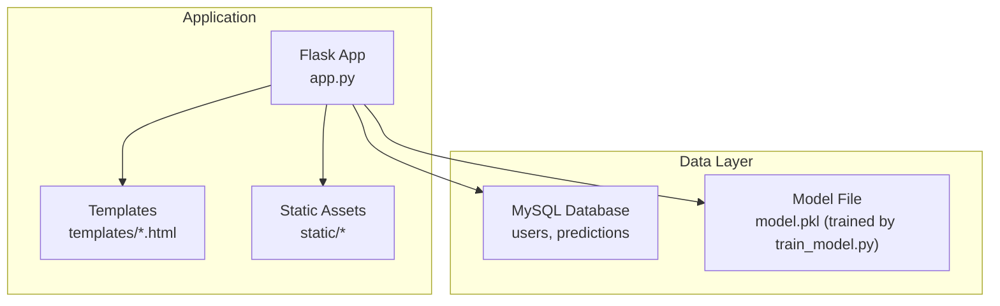
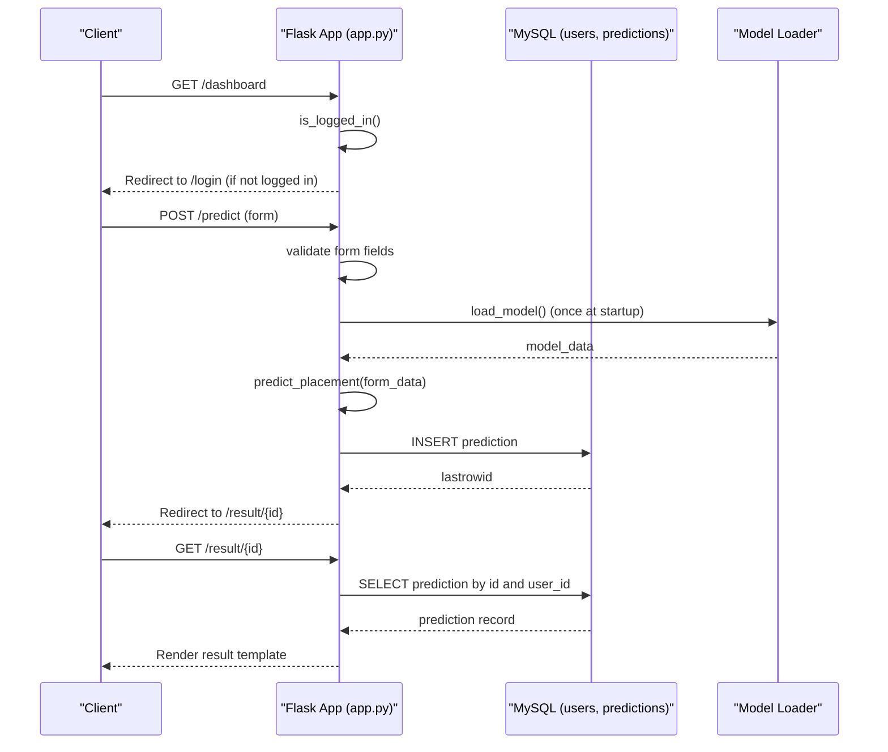
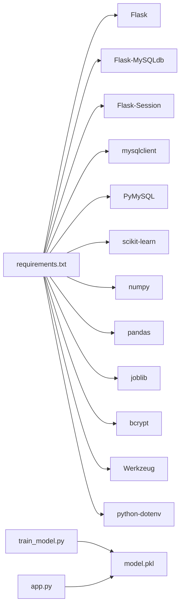

# API Reference

<cite>
**Referenced Files in This Document**
- [app.py](file://app.py)
- [requirements.txt](file://requirements.txt)
- [templates/base.html](file://templates/base.html)
- [templates/form.html](file://templates/form.html)
- [templates/result.html](file://templates/result.html)
- [templates/history.html](file://templates/history.html)
- [templates/profile.html](file://templates/profile.html)
- [templates/dashboard.html](file://templates/dashboard.html)
- [database/database.sql](file://database/database.sql)
- [train_model.py](file://train_model.py)
</cite>

## Table of Contents
1. [Introduction](#introduction)
2. [Project Structure](#project-structure)
3. [Core Components](#core-components)
4. [Architecture Overview](#architecture-overview)
5. [Detailed Component Analysis](#detailed-component-analysis)
6. [Dependency Analysis](#dependency-analysis)
7. [Performance Considerations](#performance-considerations)
8. [Troubleshooting Guide](#troubleshooting-guide)
9. [Conclusion](#conclusion)
10. [Appendices](#appendices)

## Introduction
This document provides a comprehensive API reference for the Flask application. It covers all HTTP routes, request/response formats, authentication and session-based access control, the prediction endpoint with form data requirements and response structure, user management endpoints for registration and login, dashboard statistics, profile details, and history pagination. It also documents error handling, HTTP status codes, context processor variables available to all templates, example curl commands, client implementation guidelines, rate limiting considerations, security headers, debugging tips, and common error scenarios with solutions.

## Project Structure
The application is a Flask web service backed by MySQL and a scikit-learn trained model. Templates define the UI and form submissions. The database schema defines users and predictions tables. The model is serialized and loaded at startup.

**Diagram sources**
- [app.py:125-394](file://app.py#L125-L394)
- [templates/base.html:1-128](file://templates/base.html#L1-L128)
- [database/database.sql:9-35](file://database/database.sql#L9-L35)
- [train_model.py:175-190](file://train_model.py#L175-L190)

**Section sources**
- [app.py:125-394](file://app.py#L125-L394)
- [database/database.sql:1-40](file://database/database.sql#L1-L40)
- [requirements.txt:1-27](file://requirements.txt#L1-L27)

## Core Components
- Flask application with MySQL integration and session-based authentication
- Machine learning model loader and predictor
- Template-driven rendering for forms and pages
- Context processor injecting global variables into templates

Key runtime behaviors:
- Session-based authentication via user_id and user_name stored in the session
- Protected routes enforce login checks
- Prediction endpoint accepts form data, runs ML inference, persists results, and redirects to a result page
- Dashboard, history, and profile endpoints render statistics and paginated lists

**Section sources**
- [app.py:46-58](file://app.py#L46-L58)
- [app.py:126-131](file://app.py#L126-L131)
- [app.py:133-167](file://app.py#L133-L167)
- [app.py:169-192](file://app.py#L169-L192)
- [app.py:194-236](file://app.py#L194-L236)
- [app.py:238-292](file://app.py#L238-L292)
- [app.py:294-317](file://app.py#L294-L317)
- [app.py:319-335](file://app.py#L319-L335)
- [app.py:337-354](file://app.py#L337-L354)
- [app.py:356-361](file://app.py#L356-L361)
- [app.py:374-382](file://app.py#L374-L382)

## Architecture Overview
High-level flow:
- Clients access routes via HTTP GET/POST
- Authentication middleware checks session presence
- Protected routes render templates or redirect to login
- Prediction route validates form data, invokes ML model, stores prediction, and renders result
- Error handlers render a base template with an error message and appropriate status code

**Diagram sources**
- [app.py:126-131](file://app.py#L126-L131)
- [app.py:133-167](file://app.py#L133-L167)
- [app.py:169-192](file://app.py#L169-L192)
- [app.py:194-236](file://app.py#L194-L236)
- [app.py:238-292](file://app.py#L238-L292)
- [app.py:294-317](file://app.py#L294-L317)
- [app.py:319-335](file://app.py#L319-L335)
- [app.py:337-354](file://app.py#L337-L354)
- [app.py:356-361](file://app.py#L356-L361)
- [app.py:374-382](file://app.py#L374-L382)

## Detailed Component Analysis

### Authentication and Session Control
- Session keys: user_id, user_name
- Access control: is_logged_in() checks session presence; protected routes redirect unauthenticated users to login
- Login/logout routes manage session state

Protected routes:
- /dashboard
- /predict
- /result/<int:prediction_id>
- /profile
- /history
- /logout

Unprotected routes:
- /
- /login
- /register

HTTP methods:
- GET: render login/register pages
- POST: submit credentials or prediction form

Response behavior:
- Successful login sets session and flashes a welcome message
- Logout clears session and flashes a message

**Section sources**
- [app.py:46-58](file://app.py#L46-L58)
- [app.py:126-131](file://app.py#L126-L131)
- [app.py:133-167](file://app.py#L133-L167)
- [app.py:169-192](file://app.py#L169-L192)
- [app.py:194-236](file://app.py#L194-L236)
- [app.py:238-292](file://app.py#L238-L292)
- [app.py:294-317](file://app.py#L294-L317)
- [app.py:319-335](file://app.py#L319-L335)
- [app.py:337-354](file://app.py#L337-L354)
- [app.py:356-361](file://app.py#L356-L361)

### Prediction Endpoint
- Route: /predict (GET/POST)
- Purpose: Accepts placement prediction form data, runs ML model, persists prediction, and redirects to result page
- Authentication: Required (redirects to login if not authenticated)

Form fields (POST):
- gender: "M" or "F"
- ssc_p: numeric percentage (0–100)
- hsc_p: numeric percentage (0–100)
- degree_p: numeric percentage (0–100)
- mba_p: numeric percentage (0–100)
- specialisation: "Mkt&HR" or "Mkt&Fin"
- workex: "Yes" or "No"
- skills: comma-separated list of skills

Processing:
- Validates numeric ranges and required fields
- Loads model (once at startup)
- Encodes categorical features and counts skills
- Scales features and predicts placement and probability
- Stores prediction in database with user_id
- Redirects to /result/<prediction_id>

Response:
- On success: Redirect to /result/<id>
- On error: Flash message and redirect back to /predict

Result page:
- Route: /result/<int:prediction_id>
- Authentication: Required
- Retrieves prediction by id and user_id
- Renders result template with prediction and suggested companies

**Section sources**
- [app.py:238-292](file://app.py#L238-L292)
- [app.py:294-317](file://app.py#L294-L317)
- [templates/form.html:12-135](file://templates/form.html#L12-L135)
- [templates/result.html:1-140](file://templates/result.html#L1-L140)
- [database/database.sql:19-35](file://database/database.sql#L19-L35)

### User Management Endpoints
- Route: /login (GET/POST)
  - GET: renders login page
  - POST: validates credentials against users table, hashes passwords, sets session, flashes success message, redirects to dashboard
- Route: /register (GET/POST)
  - GET: renders registration page
  - POST: validates password confirmation and length, checks uniqueness by email, hashes password, inserts user, commits transaction, flashes success message, redirects to login

Validation rules:
- Password confirmation must match
- Password must be at least 6 characters
- Email must be unique

**Section sources**
- [app.py:169-192](file://app.py#L169-L192)
- [app.py:194-236](file://app.py#L194-L236)
- [database/database.sql:9-17](file://database/database.sql#L9-L17)

### Dashboard Endpoint
- Route: /dashboard (GET)
- Authentication: Required
- Fetches user statistics:
  - Total predictions
  - Placed predictions
  - Average probability
  - Placement rate
- Renders dashboard template with computed stats and quick actions

**Section sources**
- [app.py:133-167](file://app.py#L133-L167)
- [templates/dashboard.html:1-154](file://templates/dashboard.html#L1-L154)

### Profile Endpoint
- Route: /profile (GET)
- Authentication: Required
- Retrieves current user and counts total predictions for the user
- Renders profile template with user details and prediction count

**Section sources**
- [app.py:319-335](file://app.py#L319-L335)
- [templates/profile.html:1-274](file://templates/profile.html#L1-L274)

### History Endpoint
- Route: /history (GET)
- Authentication: Required
- Fetches all predictions for the current user ordered by creation date descending
- Renders history template with statistics and a table of predictions
- Pagination: Implemented client-side via Jinja iteration; no server-side pagination

Filtering: None server-side; filtering would require additional query parameters and backend logic.

**Section sources**
- [app.py:337-354](file://app.py#L337-L354)
- [templates/history.html:1-306](file://templates/history.html#L1-L306)

### Logout Endpoint
- Route: /logout (GET)
- Clears session and flashes a message
- Redirects to login

**Section sources**
- [app.py:356-361](file://app.py#L356-L361)

### Error Handlers
- 404 Not Found: Renders base template with error message
- 500 Internal Server Error: Renders base template with error message

**Section sources**
- [app.py:364-372](file://app.py#L364-L372)

### Context Processor Variables
Available to all templates:
- app_name
- college_name
- current_year

These are injected globally via a context processor.

**Section sources**
- [app.py:374-382](file://app.py#L374-L382)
- [templates/base.html:26-27](file://templates/base.html#L26-L27)

## Dependency Analysis
External libraries and integrations:
- Flask, Flask-MySQLdb, Flask-Session for web framework and database/session
- mysqlclient, PyMySQL for MySQL connectivity
- scikit-learn, numpy, pandas for ML preprocessing and modeling
- joblib for model serialization
- bcrypt, Werkzeug for hashing and security utilities
- python-dotenv for environment configuration

Model training and persistence:
- train_model.py generates a synthetic dataset, preprocesses features, trains a Logistic Regression model, and saves it as model.pkl
- app.py loads model.pkl at startup and uses it for predictions

**Diagram sources**
- [requirements.txt:4-27](file://requirements.txt#L4-L27)
- [train_model.py:175-190](file://train_model.py#L175-L190)
- [app.py:28-39](file://app.py#L28-L39)

**Section sources**
- [requirements.txt:1-27](file://requirements.txt#L1-L27)
- [train_model.py:109-190](file://train_model.py#L109-L190)
- [app.py:28-39](file://app.py#L28-L39)

## Performance Considerations
- Model loading: The model is loaded once at application startup and reused for all requests. This avoids repeated disk I/O and improves latency.
- Database queries: Queries are lightweight and use indexed user_id. Consider adding indexes on created_at for history sorting if the dataset grows large.
- Template rendering: Uses server-side pagination via Jinja iteration; consider implementing server-side pagination for large histories.
- Static assets: CSS and JS are served statically; ensure caching headers are configured in production.

[No sources needed since this section provides general guidance]

## Troubleshooting Guide
Common issues and resolutions:
- Model not loaded: If model.pkl is missing, the application logs a warning and prediction returns an error string. Ensure model.pkl exists and is readable.
- Database connectivity: Verify MySQL host, user, password, and database configuration. Confirm the database and tables exist.
- Session issues: Ensure sessions are enabled and SECRET_KEY is configured. Clear browser cookies if stuck on login.
- Form validation errors: Ensure numeric fields are within 0–100 and all required fields are present.
- Redirect loops: If redirected to login repeatedly, check session keys and cookie settings.

Error response formats:
- 404: Renders base template with "Page not found"
- 500: Renders base template with "Internal server error"

**Section sources**
- [app.py:364-372](file://app.py#L364-L372)
- [app.py:384-390](file://app.py#L384-L390)
- [database/database.sql:4-35](file://database/database.sql#L4-L35)

## Conclusion
This API reference documents the Flask application’s routes, authentication, prediction pipeline, and data access patterns. It provides guidance for clients integrating with the application, outlines error handling, and highlights areas for improvement such as server-side pagination and rate limiting.

[No sources needed since this section summarizes without analyzing specific files]

## Appendices

### HTTP Routes and Endpoints
- GET /
  - Behavior: Redirects to /dashboard if logged in, otherwise to /login
  - Authentication: Not required
- GET /dashboard
  - Behavior: Renders dashboard with user statistics
  - Authentication: Required
- GET /login
  - Behavior: Renders login page
  - Authentication: Not required
- POST /login
  - Behavior: Validates credentials, sets session, redirects to dashboard
  - Authentication: Not required
- GET /register
  - Behavior: Renders registration page
  - Authentication: Not required
- POST /register
  - Behavior: Validates inputs, hashes password, inserts user, redirects to login
  - Authentication: Not required
- GET /predict
  - Behavior: Renders prediction form
  - Authentication: Required
- POST /predict
  - Behavior: Validates form, runs prediction, stores result, redirects to /result/<id>
  - Authentication: Required
- GET /result/<int:prediction_id>
  - Behavior: Renders prediction result and suggested companies
  - Authentication: Required
- GET /profile
  - Behavior: Renders user profile and prediction count
  - Authentication: Required
- GET /history
  - Behavior: Renders prediction history with statistics
  - Authentication: Required
- GET /logout
  - Behavior: Clears session, redirects to login
  - Authentication: Required

**Section sources**
- [app.py:126-131](file://app.py#L126-L131)
- [app.py:133-167](file://app.py#L133-L167)
- [app.py:169-192](file://app.py#L169-L192)
- [app.py:194-236](file://app.py#L194-L236)
- [app.py:238-292](file://app.py#L238-L292)
- [app.py:294-317](file://app.py#L294-L317)
- [app.py:319-335](file://app.py#L319-L335)
- [app.py:337-354](file://app.py#L337-L354)
- [app.py:356-361](file://app.py#L356-L361)

### Request and Response Formats
- Form submission (POST /predict):
  - Content-Type: application/x-www-form-urlencoded
  - Fields:
    - gender: "M" or "F"
    - ssc_p: numeric percentage (0–100)
    - hsc_p: numeric percentage (0–100)
    - degree_p: numeric percentage (0–100)
    - mba_p: numeric percentage (0–100)
    - specialisation: "Mkt&HR" or "Mkt&Fin"
    - workex: "Yes" or "No"
    - skills: comma-separated list of skills
  - Success: Redirect to /result/<id>
  - Failure: Flash message and redirect to /predict

- Registration (POST /register):
  - Content-Type: application/x-www-form-urlencoded
  - Fields:
    - name: string
    - email: string
    - password: string (min 6 chars)
    - confirm_password: string (must match password)
  - Success: Redirect to /login
  - Failure: Flash message and re-render registration

- Login (POST /login):
  - Content-Type: application/x-www-form-urlencoded
  - Fields:
    - email: string
    - password: string
  - Success: Redirect to /dashboard
  - Failure: Flash message and re-render login

- Result page (/result/<id>):
  - Response: HTML rendered from result template with prediction and suggested companies

**Section sources**
- [templates/form.html:12-135](file://templates/form.html#L12-L135)
- [app.py:194-236](file://app.py#L194-L236)
- [app.py:169-192](file://app.py#L169-L192)
- [app.py:294-317](file://app.py#L294-L317)

### Authentication and Session-Based Access Control
- Session keys:
  - user_id: integer
  - user_name: string
- Middleware:
  - is_logged_in(): checks presence of user_id
  - get_current_user(): fetches user by session user_id
- Protected routes enforce session presence and redirect unauthenticated users to /login

**Section sources**
- [app.py:46-58](file://app.py#L46-L58)
- [app.py:126-131](file://app.py#L126-L131)

### Prediction Endpoint Details
- Input features:
  - gender: binary encoded
  - ssc_p, hsc_p, degree_p, mba_p: scaled numeric
  - specialisation: binary encoded
  - workex: binary encoded
  - skills: count of comma-separated items
- Output:
  - result: "Placed" or "Not Placed"
  - probability: percentage chance of placement
- Storage:
  - predictions table includes user_id, feature fields, result, and probability

**Section sources**
- [app.py:60-109](file://app.py#L60-L109)
- [database/database.sql:19-35](file://database/database.sql#L19-L35)

### Dashboard Statistics
- Computed metrics:
  - total_predictions
  - placed_count
  - placement_rate
  - average_probability

**Section sources**
- [app.py:144-160](file://app.py#L144-L160)
- [templates/dashboard.html:14-59](file://templates/dashboard.html#L14-L59)

### Profile Data
- User details:
  - name, email, created_at, updated_at
- Prediction count:
  - Total predictions for the user

**Section sources**
- [app.py:328-333](file://app.py#L328-L333)
- [templates/profile.html:14-31](file://templates/profile.html#L14-L31)

### History Pagination and Filtering
- Pagination:
  - Implemented via Jinja iteration over fetched predictions
  - No server-side pagination or limit/offset parameters
- Filtering:
  - No server-side filters; future enhancements could add query parameters for date ranges or results

**Section sources**
- [app.py:344-351](file://app.py#L344-L351)
- [templates/history.html:62-105](file://templates/history.html#L62-L105)

### Error Responses and HTTP Status Codes
- 404 Not Found: Renders base template with error message
- 500 Internal Server Error: Renders base template with error message

**Section sources**
- [app.py:364-372](file://app.py#L364-L372)

### Context Processor Variables
- app_name: application name
- college_name: institution name
- current_year: current year

**Section sources**
- [app.py:374-382](file://app.py#L374-L382)
- [templates/base.html:26-27](file://templates/base.html#L26-L27)

### Example curl Commands
- Register a new user:
  - curl -X POST http://localhost:5000/register -F "name=John Doe" -F "email=john@example.com" -F "password=password123" -F "confirm_password=password123" -c cookies.txt
- Login:
  - curl -X POST http://localhost:5000/login -F "email=john@example.com" -F "password=password123" -b cookies.txt -c cookies.txt
- Submit prediction (authenticated):
  - curl -X POST http://localhost:5000/predict -F "gender=M" -F "ssc_p=85.5" -F "hsc_p=78.25" -F "degree_p=72.0" -F "mba_p=68.5" -F "specialisation=Mkt&HR" -F "workex=No" -F "skills=Python,SQL,Communication" -b cookies.txt
- View dashboard (authenticated):
  - curl http://localhost:5000/dashboard -b cookies.txt
- View history (authenticated):
  - curl http://localhost:5000/history -b cookies.txt
- View profile (authenticated):
  - curl http://localhost:5000/profile -b cookies.txt
- Logout:
  - curl http://localhost:5000/logout -b cookies.txt

Notes:
- Replace localhost:5000 with your deployment address
- Use -c cookies.txt to persist cookies and -b cookies.txt to reuse them
- Ensure model.pkl exists for prediction to succeed

**Section sources**
- [app.py:169-192](file://app.py#L169-L192)
- [app.py:194-236](file://app.py#L194-L236)
- [app.py:238-292](file://app.py#L238-L292)
- [app.py:133-167](file://app.py#L133-L167)
- [app.py:319-335](file://app.py#L319-L335)
- [app.py:337-354](file://app.py#L337-L354)
- [app.py:356-361](file://app.py#L356-L361)

### Client Implementation Guidelines
- Use persistent cookies to maintain session across requests
- Validate numeric inputs for percentages and ensure required fields are present
- Handle redirects appropriately (e.g., after login or prediction submission)
- For history, implement client-side pagination or request smaller batches if needed
- Respect CSRF protections if enabling CSRF extensions in production

[No sources needed since this section provides general guidance]

### Rate Limiting Considerations
- Current implementation does not include explicit rate limiting
- Recommended approaches:
  - Use Flask-Limiter or similar extension
  - Apply limits per IP or per user_id
  - Differentiate endpoints (e.g., lower limits for login/register, higher for prediction)

[No sources needed since this section provides general guidance]

### Security Headers
- Current implementation does not set security headers
- Recommended headers (in production):
  - Strict-Transport-Security
  - Content-Security-Policy
  - X-Frame-Options
  - X-Content-Type-Options
  - Referrer-Policy
- Ensure HTTPS termination at reverse proxy or WSGI server

[No sources needed since this section provides general guidance]

### Debugging Tips
- Enable Flask debug mode during development
- Check server logs for model loading warnings and prediction errors
- Verify database connectivity and table existence
- Inspect session cookies and ensure SECRET_KEY is configured
- Use curl with verbose output (-v) to inspect redirects and headers

**Section sources**
- [app.py:384-390](file://app.py#L384-L390)
- [database/database.sql:4-35](file://database/database.sql#L4-L35)