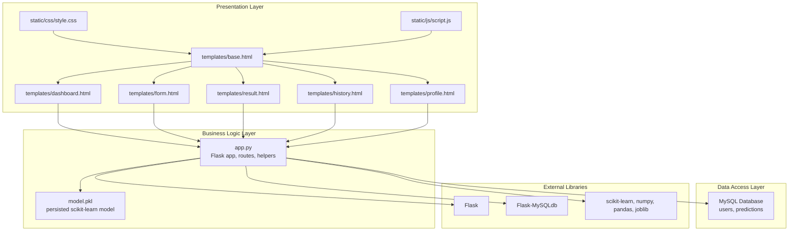
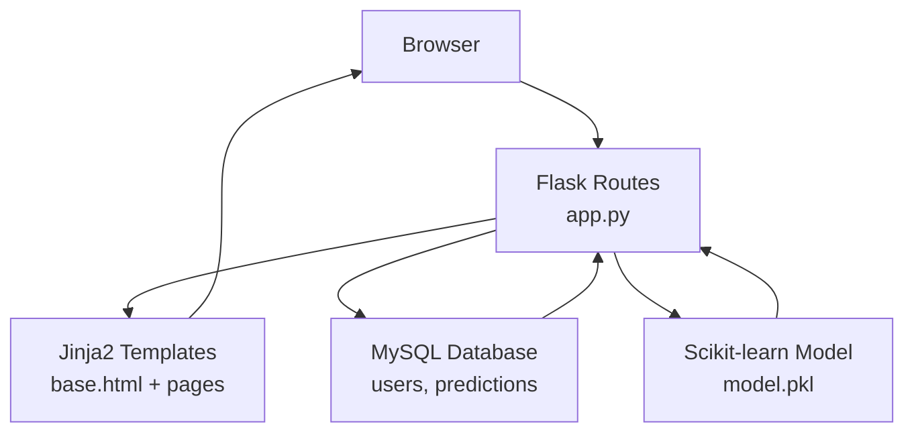
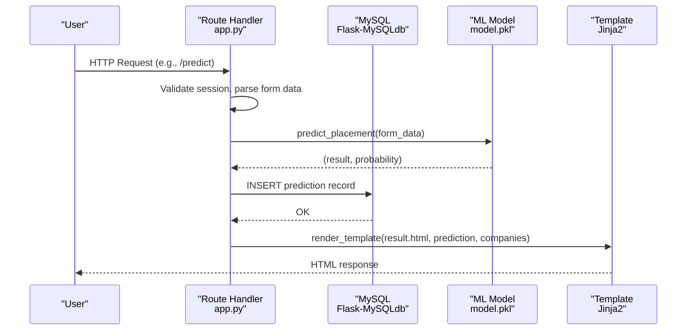
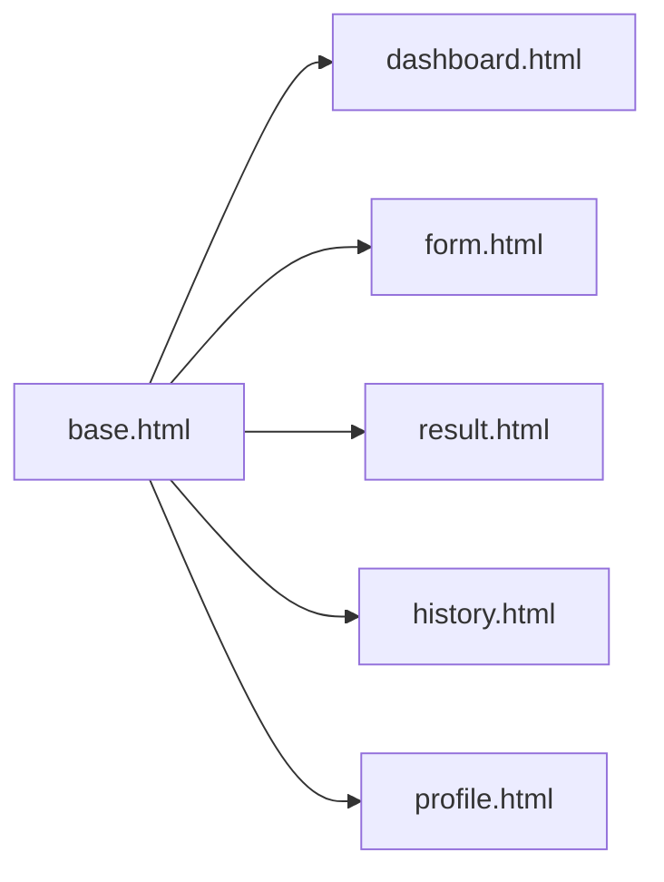
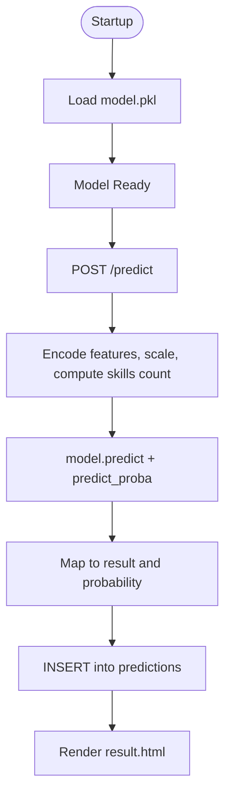
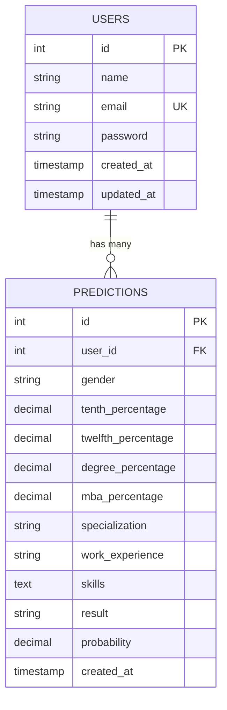
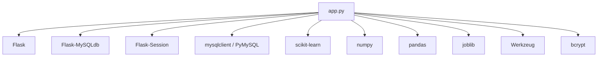

# Application Architecture

<cite>
**Referenced Files in This Document**
- [app.py](file://app.py)
- [train_model.py](file://train_model.py)
- [requirements.txt](file://requirements.txt)
- [database.sql](file://database/database.sql)
- [base.html](file://templates/base.html)
- [dashboard.html](file://templates/dashboard.html)
- [form.html](file://templates/form.html)
- [result.html](file://templates/result.html)
- [history.html](file://templates/history.html)
- [profile.html](file://templates/profile.html)
- [style.css](file://static/css/style.css)
- [script.js](file://static/js/script.js)
</cite>

## Table of Contents
1. [Introduction](#introduction)
2. [Project Structure](#project-structure)
3. [Core Components](#core-components)
4. [Architecture Overview](#architecture-overview)
5. [Detailed Component Analysis](#detailed-component-analysis)
6. [Dependency Analysis](#dependency-analysis)
7. [Performance Considerations](#performance-considerations)
8. [Troubleshooting Guide](#troubleshooting-guide)
9. [Conclusion](#conclusion)
10. [Appendices](#appendices)

## Introduction
This document describes the architecture of the Student Placement Prediction Portal, a Flask-based web application that integrates a machine learning model with a MySQL-backed web interface. The system follows a high-level Model-View-Controller (MVC) pattern:
- Controller: Flask routes and request handlers
- Views: Jinja2 templates with a base template and page-specific templates
- Model: MySQL database and a persisted scikit-learn model

The portal enables users to register, log in, submit placement prediction inputs, receive probabilistic outcomes, and review historical predictions. It demonstrates template inheritance, session-based authentication, and structured separation of concerns across presentation, business logic, and data access layers.

## Project Structure
The project is organized into clear layers:
- Application entry and routing: [app.py](file://app.py)
- Machine learning training pipeline: [train_model.py](file://train_model.py)
- Database schema: [database.sql](file://database/database.sql)
- Template inheritance and pages: [base.html](file://templates/base.html) and page templates
- Static assets: [style.css](file://static/css/style.css), [script.js](file://static/js/script.js)
- Dependencies: [requirements.txt](file://requirements.txt)

**Diagram sources**
- [app.py](file://app.py)
- [base.html](file://templates/base.html)
- [dashboard.html](file://templates/dashboard.html)
- [form.html](file://templates/form.html)
- [result.html](file://templates/result.html)
- [history.html](file://templates/history.html)
- [profile.html](file://templates/profile.html)
- [style.css](file://static/css/style.css)
- [script.js](file://static/js/script.js)
- [requirements.txt](file://requirements.txt)

**Section sources**
- [app.py](file://app.py)
- [requirements.txt](file://requirements.txt)

## Core Components
- Flask application and configuration
  - Secret key, MySQL connection settings, and cursor class are configured in [app.py](file://app.py).
  - MySQL extension initialization and route decorators define the controller layer.
- Session management
  - Session keys store user identity and name; helper functions check login state and fetch current user.
- Machine learning integration
  - A persisted model is loaded at startup; prediction logic transforms inputs, scales features, predicts, and computes probabilities.
- Database schema and access
  - Two tables: users and predictions; helper functions encapsulate connection creation and cursor usage.
- Template inheritance and rendering
  - Base template defines layout, navigation, and shared UI; page templates extend base and inject content blocks.
- Static assets
  - CSS and JS provide responsive UI, animations, and client-side interactions.

**Section sources**
- [app.py](file://app.py)
- [base.html](file://templates/base.html)
- [requirements.txt](file://requirements.txt)

## Architecture Overview
The system enforces a layered architecture:
- Presentation layer: Jinja2 templates and static assets
- Business logic layer: Flask routes, helpers, and ML inference
- Data access layer: MySQL via Flask-MySQLdb
- External libraries: Flask, scikit-learn, numpy, pandas, joblib

**Diagram sources**
- [app.py](file://app.py)
- [base.html](file://templates/base.html)
- [dashboard.html](file://templates/dashboard.html)
- [form.html](file://templates/form.html)
- [result.html](file://templates/result.html)
- [history.html](file://templates/history.html)
- [profile.html](file://templates/profile.html)
- [database.sql](file://database/database.sql)

## Detailed Component Analysis

### Flask Application and Routing
The Flask application initializes configuration, MySQL, and loads the ML model at startup. It defines routes for home, login, registration, prediction, results, profile, history, and logout. Each route encapsulates business logic (validation, hashing, prediction, persistence) and delegates rendering to templates.

Key responsibilities:
- Route handlers: manage request lifecycle, session checks, and redirects
- Helpers: database connections, user retrieval, prediction computation, company suggestions
- Error handlers: centralized 404 and 500 handling
- Context processor: injects global variables into all templates

**Diagram sources**
- [app.py](file://app.py)
- [result.html](file://templates/result.html)
- [form.html](file://templates/form.html)

**Section sources**
- [app.py](file://app.py)

### Template Inheritance System
The base template establishes the master layout with:
- Shared header, navigation, flash messages, and footer
- Sidebar navigation for authenticated users
- Bootstrap integration and custom CSS/JS

Page templates extend base.html and override the content block. This ensures consistent branding, navigation, and UX while enabling page-specific markup and styling.

**Diagram sources**
- [base.html](file://templates/base.html)
- [dashboard.html](file://templates/dashboard.html)
- [form.html](file://templates/form.html)
- [result.html](file://templates/result.html)
- [history.html](file://templates/history.html)
- [profile.html](file://templates/profile.html)

**Section sources**
- [base.html](file://templates/base.html)
- [dashboard.html](file://templates/dashboard.html)
- [form.html](file://templates/form.html)
- [result.html](file://templates/result.html)
- [history.html](file://templates/history.html)
- [profile.html](file://templates/profile.html)

### Machine Learning Model Integration
The ML model is a persisted scikit-learn Logistic Regression pipeline saved as model.pkl. The training script builds and evaluates the model, then serializes it for runtime use.

Runtime integration:
- On startup, the model is loaded once and reused across requests
- Prediction endpoint transforms form inputs, encodes categorical features, counts skills, scales features, and runs inference
- Probabilities are mapped to placement likelihood and used to suggest companies

**Diagram sources**
- [app.py](file://app.py)
- [train_model.py](file://train_model.py)

**Section sources**
- [app.py](file://app.py)
- [train_model.py](file://train_model.py)

### Database Schema and Access
The schema defines two tables:
- users: stores user credentials and timestamps
- predictions: stores user inputs, results, and probabilities

Access patterns:
- Helper functions centralize cursor creation and connection usage
- Routes perform CRUD operations with prepared statements to prevent injection
- Foreign key constraints maintain referential integrity

**Diagram sources**
- [database.sql](file://database/database.sql)

**Section sources**
- [database.sql](file://database/database.sql)
- [app.py](file://app.py)

### Frontend Assets and Interactions
Static assets enhance the user experience:
- CSS provides responsive layout, gradients, cards, and animations
- JS handles tooltips, flash message dismissal, mobile sidebar toggle, form validation, and smooth scrolling

These scripts integrate with templates to deliver interactive UI behaviors without requiring server round trips for basic interactions.

**Section sources**
- [style.css](file://static/css/style.css)
- [script.js](file://static/js/script.js)
- [base.html](file://templates/base.html)

## Dependency Analysis
External dependencies are declared in requirements.txt and enable:
- Flask framework and extensions for routing, sessions, and MySQL connectivity
- Scikit-learn for ML modeling and joblib for serialization
- NumPy and Pandas for data manipulation
- Werkzeug for password hashing

**Diagram sources**
- [requirements.txt](file://requirements.txt)
- [app.py](file://app.py)

**Section sources**
- [requirements.txt](file://requirements.txt)

## Performance Considerations
- Model loading: The model is loaded once at startup and reused globally to avoid repeated deserialization overhead.
- Database connections: Cursor creation is lightweight; ensure connection pooling is considered for high concurrency.
- Rendering: Templates are rendered server-side; minimize heavy computations in templates.
- Static assets: Serve CSS/JS via CDN and enable caching for improved responsiveness.
- Scalability: For production, consider horizontal scaling with a reverse proxy, load balancer, and a managed MySQL service.

[No sources needed since this section provides general guidance]

## Troubleshooting Guide
Common issues and resolutions:
- Model not found
  - Symptom: Warning during startup indicating model.pkl not found.
  - Resolution: Run the training script to generate model.pkl before starting the app.
- Database connectivity
  - Symptom: Operational errors when connecting to MySQL.
  - Resolution: Verify host, user, password, and database configuration in app.py; ensure MySQL is running and accessible.
- Session issues
  - Symptom: Users unable to access protected routes.
  - Resolution: Confirm SECRET_KEY is set and sessions are enabled; check browser cookies and secure flags if deployed behind HTTPS.
- Template rendering errors
  - Symptom: 500 errors due to missing variables or invalid context.
  - Resolution: Ensure context processors and route handlers pass required variables to templates.

**Section sources**
- [app.py](file://app.py)
- [requirements.txt](file://requirements.txt)

## Conclusion
The Student Placement Prediction Portal demonstrates a clean MVC architecture implemented with Flask, Jinja2, and MySQL. The system’s strengths include:
- Clear separation of concerns across presentation, business logic, and data access
- Robust template inheritance and responsive UI
- Integrated ML model with persisted artifacts
- Practical session-based authentication and error handling

With minor enhancements—such as connection pooling, environment-based configuration, and CI/CD deployment—this system can be scaled effectively for production use.

[No sources needed since this section summarizes without analyzing specific files]

## Appendices

### System Boundaries
- Presentation boundary: Templates and static assets
- Business logic boundary: Flask routes, helpers, and ML inference
- Data boundary: MySQL tables and connection utilities

[No sources needed since this section provides general guidance]

### Infrastructure Requirements
- Runtime: Python 3.x with installed dependencies from requirements.txt
- Database: MySQL server with placement_portal database and tables created from database.sql
- ML model: model.pkl generated by train_model.py
- Deployment: WSGI-compatible server (e.g., Gunicorn) behind a reverse proxy

[No sources needed since this section provides general guidance]

### Deployment Topology
- Single-instance deployment: Flask app + MySQL on the same host
- Multi-instance deployment: Horizontal scaling with multiple app instances, shared MySQL, and persistent storage for model.pkl

[No sources needed since this section provides general guidance]