# Component Interactions

<cite>
**Referenced Files in This Document**
- [app.py](file://app.py)
- [requirements.txt](file://requirements.txt)
- [templates/base.html](file://templates/base.html)
- [templates/dashboard.html](file://templates/dashboard.html)
- [templates/form.html](file://templates/form.html)
- [templates/result.html](file://templates/result.html)
- [templates/history.html](file://templates/history.html)
- [templates/profile.html](file://templates/profile.html)
- [templates/login.html](file://templates/login.html)
- [templates/register.html](file://templates/register.html)
- [static/js/script.js](file://static/js/script.js)
- [database/database.sql](file://database/database.sql)
- [train_model.py](file://train_model.py)
</cite>

## Table of Contents
1. [Introduction](#introduction)
2. [Project Structure](#project-structure)
3. [Core Components](#core-components)
4. [Architecture Overview](#architecture-overview)
5. [Detailed Component Analysis](#detailed-component-analysis)
6. [Dependency Analysis](#dependency-analysis)
7. [Performance Considerations](#performance-considerations)
8. [Troubleshooting Guide](#troubleshooting-guide)
9. [Conclusion](#conclusion)

## Introduction

The Student Placement Prediction Portal is a Flask-based web application that combines machine learning capabilities with modern web technologies to provide students with personalized placement prediction services. The application features a comprehensive user management system, interactive prediction forms, real-time machine learning model processing, and detailed analytics dashboards.

This documentation focuses on the component interactions within the application architecture, tracing request-response flows from frontend templates through Flask routes to database operations and ML model processing. It explains how the base template system coordinates with individual page templates, how static assets integrate with dynamic content, and how session management coordinates user state across components.

## Project Structure

The application follows a traditional Flask project structure with clear separation between backend logic, frontend templates, and static assets:

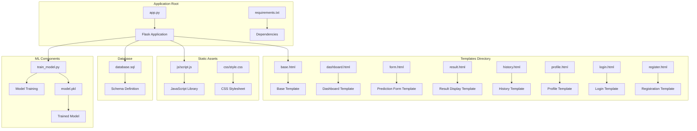

**Diagram sources**
- [app.py:1-50](file://app.py#L1-L50)
- [templates/base.html:1-20](file://templates/base.html#L1-L20)
- [static/js/script.js:1-20](file://static/js/script.js#L1-L20)

**Section sources**
- [app.py:1-394](file://app.py#L1-L394)
- [requirements.txt:1-27](file://requirements.txt#L1-L27)

## Core Components

The application consists of several interconnected components that work together to deliver the complete user experience:

### Flask Application Core
The central Flask application (`app.py`) serves as the orchestrator for all components, managing routing, session handling, database connections, and template rendering.

### Template System Architecture
A hierarchical template system where `base.html` provides the foundation and individual page templates extend it for specific functionality.

### Machine Learning Integration
The application integrates a trained Logistic Regression model for placement predictions, with preprocessing capabilities for real-time inference.

### Database Layer
MySQL database integration through Flask-MySQLdb for persistent user data and prediction history storage.

### Frontend Asset Pipeline
Bootstrap-based responsive design with custom JavaScript for enhanced user interactions and form validations.

**Section sources**
- [app.py:15-394](file://app.py#L15-L394)
- [templates/base.html:1-128](file://templates/base.html#L1-L128)
- [train_model.py:1-196](file://train_model.py#L1-L196)

## Architecture Overview

The application follows a layered architecture pattern with clear separation of concerns:

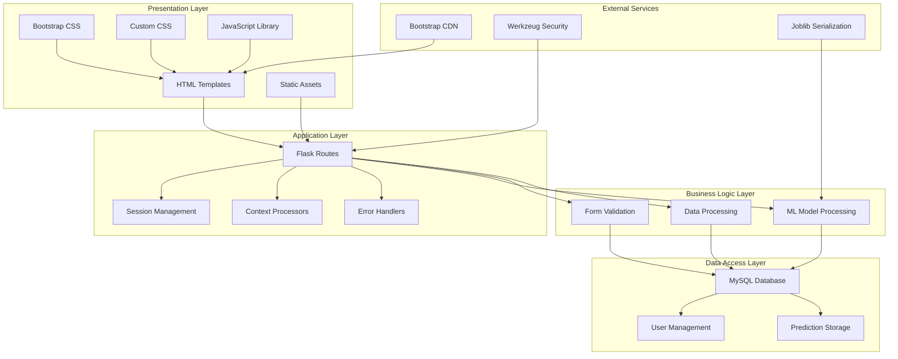

**Diagram sources**
- [app.py:6-394](file://app.py#L6-L394)
- [templates/base.html:8-128](file://templates/base.html#L8-L128)
- [static/js/script.js:1-281](file://static/js/script.js#L1-L281)

The architecture demonstrates clear separation between presentation, business logic, and data persistence layers, enabling maintainability and scalability.

## Detailed Component Analysis

### Base Template System

The base template system provides a cohesive foundation for all page templates through inheritance and context injection:

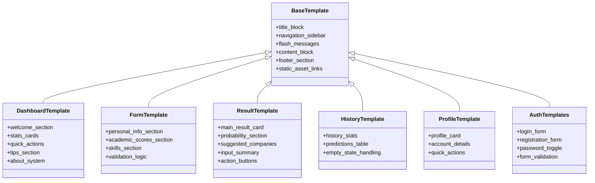

**Diagram sources**
- [templates/base.html:1-128](file://templates/base.html#L1-L128)
- [templates/dashboard.html:1-154](file://templates/dashboard.html#L1-L154)
- [templates/form.html:1-227](file://templates/form.html#L1-L227)
- [templates/result.html:1-312](file://templates/result.html#L1-L312)
- [templates/history.html:1-306](file://templates/history.html#L1-L306)
- [templates/profile.html:1-274](file://templates/profile.html#L1-L274)
- [templates/login.html:1-183](file://templates/login.html#L1-L183)
- [templates/register.html:1-231](file://templates/register.html#L1-L231)

The base template coordinates navigation, session-aware UI elements, and consistent styling across all pages. It injects global variables through context processors and manages responsive layout through Bootstrap integration.

**Section sources**
- [templates/base.html:20-128](file://templates/base.html#L20-L128)
- [app.py:374-382](file://app.py#L374-L382)

### Session Management and User State Coordination

Session management serves as the backbone for user state coordination across all components:

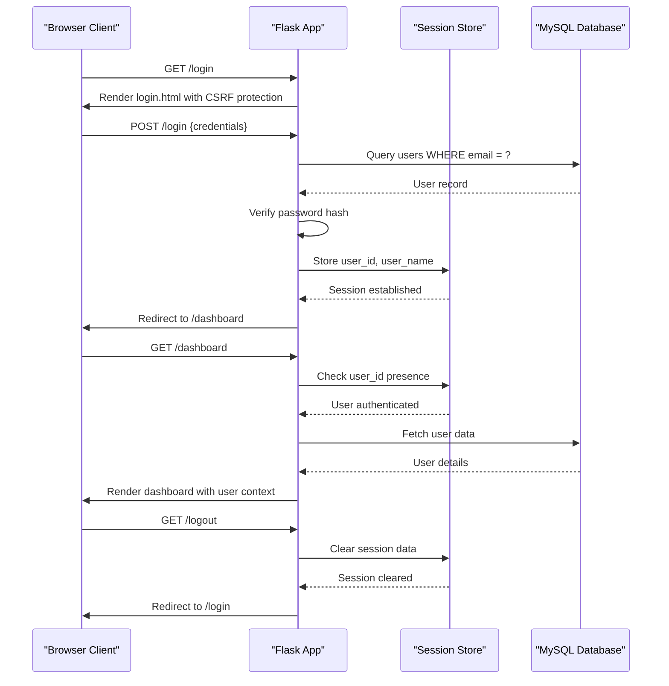

**Diagram sources**
- [app.py:169-192](file://app.py#L169-L192)
- [app.py:356-361](file://app.py#L356-L361)
- [app.py:46-58](file://app.py#L46-L58)

Session management coordinates user state through Flask's session interface, storing user identifiers and names for authentication checks across route handlers. The system ensures secure credential handling through Werkzeug's password hashing utilities.

**Section sources**
- [app.py:169-192](file://app.py#L169-L192)
- [app.py:46-58](file://app.py#L46-L58)
- [app.py:356-361](file://app.py#L356-L361)

### Request-Response Flow Analysis

The application handles various user workflows through structured request-response patterns:

#### Login Process Workflow

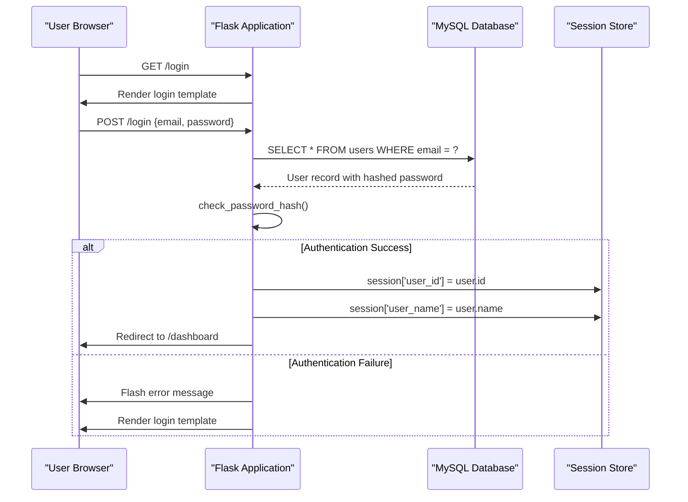

**Diagram sources**
- [app.py:169-192](file://app.py#L169-L192)

#### Prediction Workflow

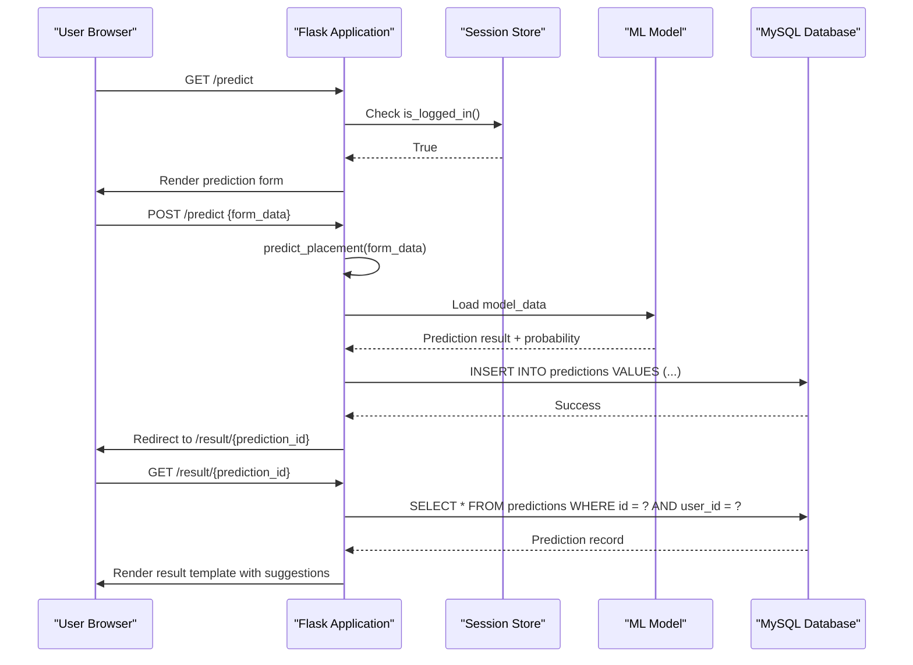

**Diagram sources**
- [app.py:238-292](file://app.py#L238-L292)
- [app.py:60-109](file://app.py#L60-L109)

#### Dashboard Access Workflow

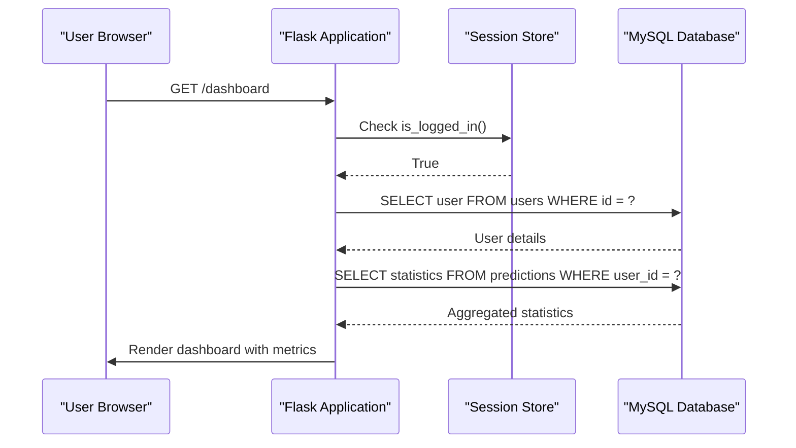

**Diagram sources**
- [app.py:133-167](file://app.py#L133-L167)

**Section sources**
- [app.py:126-167](file://app.py#L126-L167)
- [app.py:238-292](file://app.py#L238-L292)

### Database Integration Points

The application maintains robust database integration through Flask-MySQLdb:

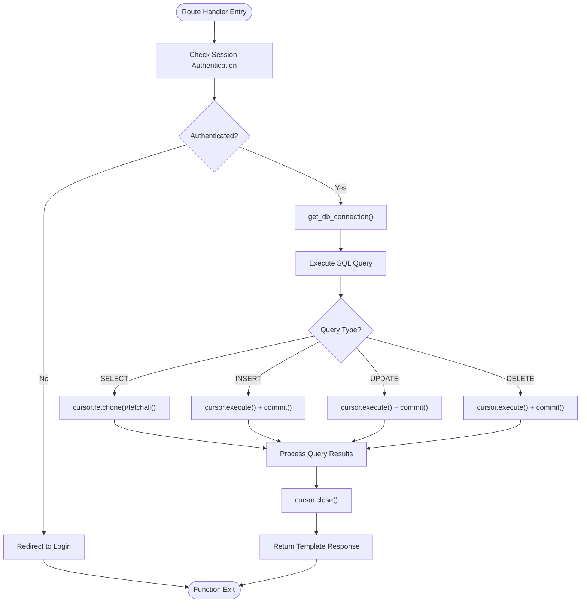

**Diagram sources**
- [app.py:42-44](file://app.py#L42-L44)
- [app.py:140-154](file://app.py#L140-L154)
- [app.py:266-287](file://app.py#L266-L287)

The database layer handles user authentication, prediction storage, and analytics aggregation. Connection management follows Flask-MySQLdb best practices with proper cursor lifecycle management.

**Section sources**
- [app.py:42-44](file://app.py#L42-L44)
- [app.py:140-154](file://app.py#L140-L154)
- [app.py:266-287](file://app.py#L266-L287)

### Template Rendering and Context Processing

Template rendering coordinates through Flask's Jinja2 engine with global context injection:

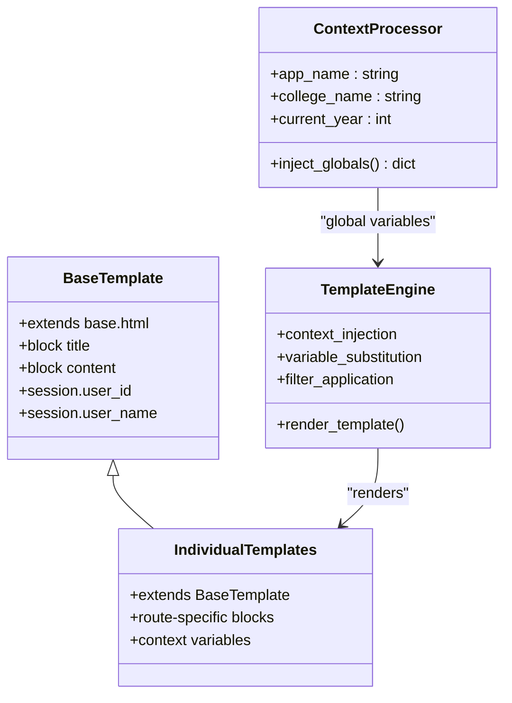

**Diagram sources**
- [app.py:374-382](file://app.py#L374-L382)
- [templates/base.html:6-17](file://templates/base.html#L6-L17)

Context processors inject global variables like application metadata and current year, making them available across all templates without explicit passing from route handlers.

**Section sources**
- [app.py:374-382](file://app.py#L374-L382)
- [templates/base.html:6-17](file://templates/base.html#L6-L17)

### Static Asset Integration

Static asset integration combines external CDN resources with local assets:

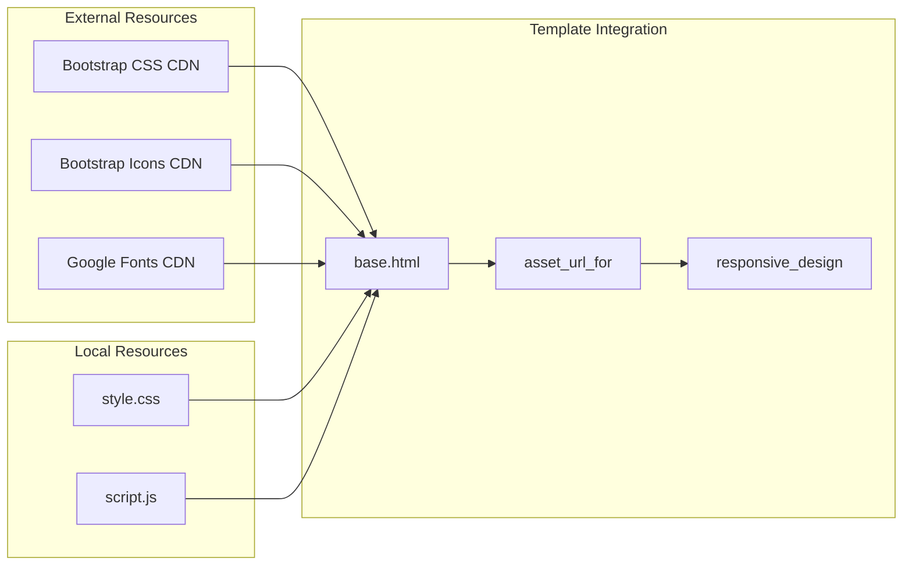

**Diagram sources**
- [templates/base.html:8-15](file://templates/base.html#L8-L15)
- [templates/base.html:120-125](file://templates/base.html#L120-L125)

Static assets enhance user experience through responsive design, interactive components, and consistent styling across all page templates.

**Section sources**
- [templates/base.html:8-15](file://templates/base.html#L8-L15)
- [templates/base.html:120-125](file://templates/base.html#L120-L125)

### Machine Learning Model Integration

The ML model integration provides real-time prediction capabilities:

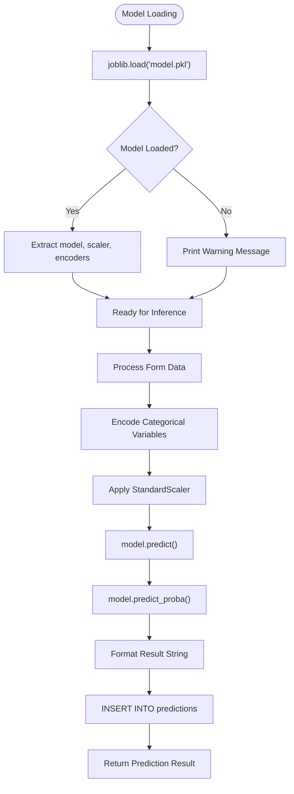

**Diagram sources**
- [app.py:28-39](file://app.py#L28-L39)
- [app.py:60-109](file://app.py#L60-L109)
- [train_model.py:175-190](file://train_model.py#L175-L190)

The ML integration handles model loading, preprocessing, inference, and result formatting while maintaining error resilience through exception handling.

**Section sources**
- [app.py:28-39](file://app.py#L28-L39)
- [app.py:60-109](file://app.py#L60-L109)
- [train_model.py:175-190](file://train_model.py#L175-L190)

## Dependency Analysis

The application maintains clear dependency relationships between components:

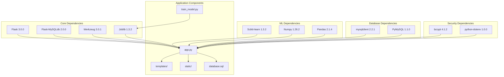

**Diagram sources**
- [requirements.txt:4-27](file://requirements.txt#L4-L27)
- [app.py:6-12](file://app.py#L6-L12)

The dependency analysis reveals a focused stack optimized for web application development, machine learning integration, and database connectivity.

**Section sources**
- [requirements.txt:4-27](file://requirements.txt#L4-L27)
- [app.py:6-12](file://app.py#L6-L12)

## Performance Considerations

The application incorporates several performance optimization strategies:

### Database Connection Management
- Single connection per request lifecycle
- Proper cursor closure to prevent resource leaks
- Efficient query patterns with parameterized statements

### Template Rendering Optimization
- Context processors minimize repeated database queries
- Static asset caching through CDN delivery
- Minimal JavaScript execution for better responsiveness

### ML Model Efficiency
- Single model load at application startup
- Joblib serialization for efficient model persistence
- Optimized preprocessing pipeline

### Session Management
- Lightweight session storage
- Efficient authentication checks
- Graceful degradation when model unavailable

## Troubleshooting Guide

Common issues and their resolution strategies:

### Model Loading Issues
**Problem**: Model not found during startup
**Solution**: Ensure `model.pkl` exists in application root directory
**Prevention**: Run training script before deployment

### Database Connection Problems
**Problem**: Cannot connect to MySQL database
**Solution**: Verify database credentials in configuration
**Prevention**: Test database connectivity before application startup

### Session Management Issues
**Problem**: Users unable to maintain login state
**Solution**: Check SECRET_KEY configuration and session storage
**Prevention**: Use production-grade session store for distributed deployments

### Template Rendering Errors
**Problem**: Missing context variables in templates
**Solution**: Verify context processor registration and variable names
**Prevention**: Use consistent naming conventions across templates

**Section sources**
- [app.py:364-372](file://app.py#L364-L372)
- [app.py:384-390](file://app.py#L384-L390)

## Conclusion

The Student Placement Prediction Portal demonstrates a well-architected Flask application that successfully integrates multiple technologies including machine learning, database management, and modern web development practices. The component interaction patterns established in this codebase provide a solid foundation for scalable web applications.

Key architectural strengths include:
- Clear separation of concerns through layered architecture
- Robust session management for user state coordination
- Efficient template inheritance system for consistent UI
- Comprehensive error handling and user feedback mechanisms
- Integration of ML capabilities with web application infrastructure

The documented workflows and component interactions serve as both a reference for developers and a guide for extending the application with additional features while maintaining architectural coherence.