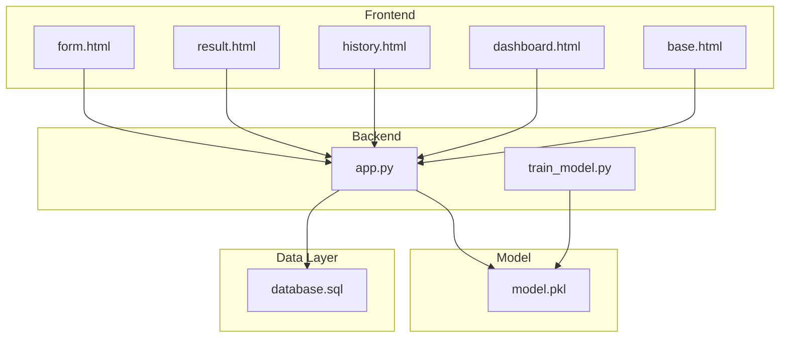
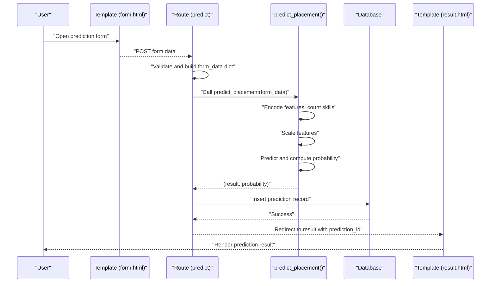
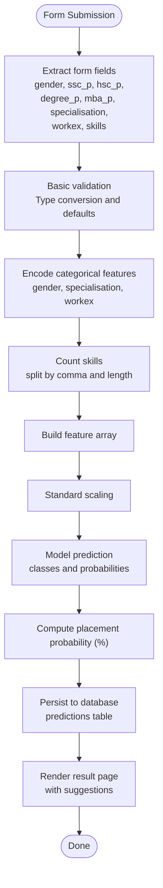
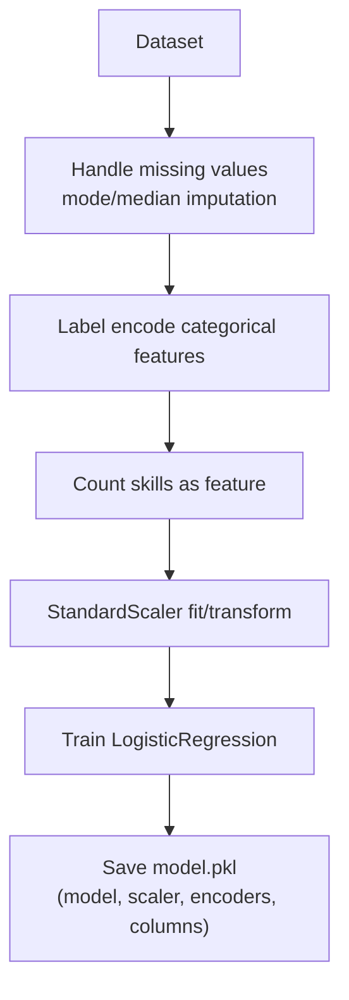
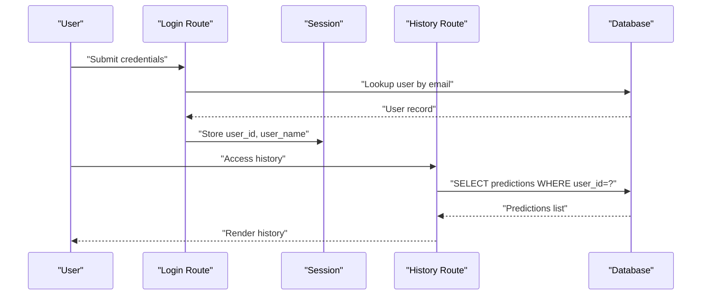
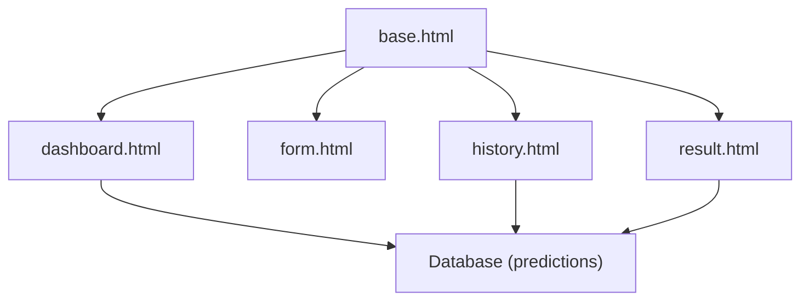
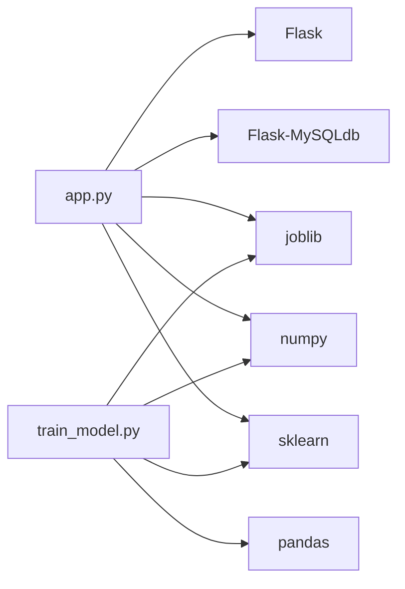
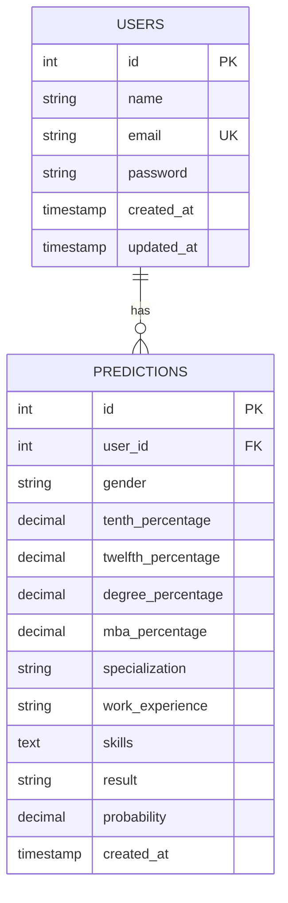

# Data Flow Architecture

<cite>
**Referenced Files in This Document**
- [app.py](file://app.py)
- [train_model.py](file://train_model.py)
- [database.sql](file://database/database.sql)
- [form.html](file://templates/form.html)
- [result.html](file://templates/result.html)
- [history.html](file://templates/history.html)
- [dashboard.html](file://templates/dashboard.html)
- [base.html](file://templates/base.html)
- [requirements.txt](file://requirements.txt)
</cite>

## Table of Contents
1. [Introduction](#introduction)
2. [Project Structure](#project-structure)
3. [Core Components](#core-components)
4. [Architecture Overview](#architecture-overview)
5. [Detailed Component Analysis](#detailed-component-analysis)
6. [Dependency Analysis](#dependency-analysis)
7. [Performance Considerations](#performance-considerations)
8. [Troubleshooting Guide](#troubleshooting-guide)
9. [Conclusion](#conclusion)
10. [Appendices](#appendices)

## Introduction
This document explains the complete data flow architecture of the Student Placement Prediction Portal. It traces how user input flows from HTML forms through Flask request objects, validation, machine learning prediction, database persistence, and final result rendering. It also documents the data transformation pipeline (encoding, scaling, prediction), validation stages, error propagation, and how user sessions connect stored data with real-time processing.

## Project Structure
The application is organized around a Flask backend, Jinja2 templates, a MySQL database, and a pre-trained scikit-learn model serialized to disk. Key components:
- Backend: Flask application with routes, session management, and database access
- Templates: HTML pages rendered with Jinja2, including form, result, history, dashboard, and base layout
- Database: MySQL schema with users and predictions tables
- ML Model: Logistic regression model with preprocessing artifacts (scaler, encoders)

**Diagram sources**
- [app.py:126-394](file://app.py#L126-L394)
- [train_model.py:109-196](file://train_model.py#L109-L196)
- [database.sql:1-40](file://database/database.sql#L1-L40)
- [form.html:1-227](file://templates/form.html#L1-L227)
- [result.html:1-312](file://templates/result.html#L1-L312)
- [history.html:1-306](file://templates/history.html#L1-L306)
- [dashboard.html:1-154](file://templates/dashboard.html#L1-L154)
- [base.html:1-128](file://templates/base.html#L1-L128)

**Section sources**
- [app.py:126-394](file://app.py#L126-L394)
- [requirements.txt:1-27](file://requirements.txt#L1-L27)

## Core Components
- Flask application with configuration for MySQL, sessions, and model loading
- Prediction pipeline: form extraction → feature encoding/skills counting → scaling → prediction → persistence → result rendering
- Template-driven UI with navigation, flash messages, and session-aware rendering
- Database schema for users and predictions with foreign key relationships
- Training script that builds a Logistic Regression model and serializes preprocessing artifacts

Key responsibilities:
- Route orchestration and session checks
- Data validation and sanitization
- ML model integration and error handling
- Database CRUD operations with transactions
- Template rendering with computed analytics

**Section sources**
- [app.py:17-394](file://app.py#L17-L394)
- [train_model.py:109-196](file://train_model.py#L109-L196)
- [database.sql:9-35](file://database/database.sql#L9-L35)

## Architecture Overview
The system follows a request-response lifecycle:
- User submits a form on the prediction page
- Flask route extracts form data from the request object
- Data is validated and transformed into numeric features
- The model performs prediction and returns a result and probability
- The prediction is persisted to the database
- The user is redirected to a result page that renders the outcome and suggestions

**Diagram sources**
- [app.py:238-292](file://app.py#L238-L292)
- [app.py:60-108](file://app.py#L60-L108)
- [form.html:12-135](file://templates/form.html#L12-L135)
- [result.html:294-317](file://templates/result.html#L294-L317)

## Detailed Component Analysis

### Data Flow Through Prediction Pipeline
This section maps the end-to-end transformation of raw form data into a final result.

**Diagram sources**
- [app.py:245-290](file://app.py#L245-L290)
- [app.py:60-108](file://app.py#L60-L108)
- [app.py:110-123](file://app.py#L110-L123)
- [database.sql:19-35](file://database/database.sql#L19-L35)

**Section sources**
- [app.py:245-290](file://app.py#L245-L290)
- [app.py:60-108](file://app.py#L60-L108)
- [app.py:110-123](file://app.py#L110-L123)

### Feature Encoding and Scaling Pipeline
The training script defines the preprocessing steps used at runtime:
- Label encoding for gender, specialization, work experience
- Skills encoded as a count feature
- Standard scaling for numeric features
- Logistic regression training and evaluation

**Diagram sources**
- [train_model.py:57-107](file://train_model.py#L57-L107)
- [train_model.py:139-151](file://train_model.py#L139-L151)
- [train_model.py:180-187](file://train_model.py#L180-L187)

**Section sources**
- [train_model.py:57-107](file://train_model.py#L57-L107)
- [train_model.py:139-151](file://train_model.py#L139-L151)
- [train_model.py:180-187](file://train_model.py#L180-L187)

### Session-Based Data Integrity and Real-Time Processing
- Session keys ensure only authenticated users can access protected routes
- All database reads/writes are scoped to the current user’s ID
- Real-time processing occurs on each prediction request; historical analytics are computed from stored data

**Diagram sources**
- [app.py:169-192](file://app.py#L169-L192)
- [app.py:337-354](file://app.py#L337-L354)
- [database.sql:9-17](file://database/database.sql#L9-L17)

**Section sources**
- [app.py:46-58](file://app.py#L46-L58)
- [app.py:169-192](file://app.py#L169-L192)
- [app.py:337-354](file://app.py#L337-L354)

### Template Rendering and Navigation
- Base template injects global variables and manages navigation and flash messages
- Dashboard computes analytics from stored predictions
- History lists previous predictions with derived metrics
- Result page displays prediction outcome, probability, and suggested companies

**Diagram sources**
- [base.html:19-127](file://templates/base.html#L19-L127)
- [dashboard.html:1-154](file://templates/dashboard.html#L1-L154)
- [history.html:1-306](file://templates/history.html#L1-L306)
- [result.html:1-312](file://templates/result.html#L1-L312)
- [form.html:1-227](file://templates/form.html#L1-L227)

**Section sources**
- [base.html:19-127](file://templates/base.html#L19-L127)
- [dashboard.html:14-59](file://templates/dashboard.html#L14-L59)
- [history.html:12-121](file://templates/history.html#L12-L121)
- [result.html:12-80](file://templates/result.html#L12-L80)

## Dependency Analysis
External libraries and their roles:
- Flask: web framework and routing
- Flask-MySQLdb: MySQL connectivity
- scikit-learn: model training and inference
- numpy/pandas: numerical and data manipulation
- joblib: model serialization
- Werkzeug: password hashing and utilities

**Diagram sources**
- [requirements.txt:4-27](file://requirements.txt#L4-L27)
- [app.py:6-12](file://app.py#L6-L12)
- [train_model.py:7-16](file://train_model.py#L7-L16)

**Section sources**
- [requirements.txt:1-27](file://requirements.txt#L1-L27)

## Performance Considerations
- Model loading: The model is loaded once at application startup and reused across requests, minimizing I/O overhead.
- Feature scaling: StandardScaler is applied per-request; ensure numeric inputs are validated to avoid expensive conversions.
- Database queries: Use prepared statements and limit result sets for history and analytics.
- Template rendering: Keep computations minimal in templates; precompute analytics in views when possible.

[No sources needed since this section provides general guidance]

## Troubleshooting Guide
Common issues and resolutions:
- Model not loaded: If the model file is missing, the application logs a warning and returns an error result from prediction. Ensure the model file is present and accessible.
- Database connectivity: Verify MySQL configuration and credentials; ensure the database and tables exist.
- Session errors: If session keys are missing, routes redirect to login; ensure cookies are enabled and session middleware is configured.
- Validation failures: Frontend validation prevents invalid percentages; backend validation ensures numeric conversion and non-empty skills.

**Section sources**
- [app.py:28-39](file://app.py#L28-L39)
- [app.py:106-108](file://app.py#L106-L108)
- [app.py:169-192](file://app.py#L169-L192)
- [form.html:212-224](file://templates/form.html#L212-L224)

## Conclusion
The application implements a clean, layered data flow from user input to ML-powered prediction and persistent storage. Validation occurs at multiple stages, error handling is centralized, and session-scoped data integrity is enforced. The architecture balances simplicity with scalability, leveraging Flask for routing, scikit-learn for modeling, and MySQL for persistence.

[No sources needed since this section summarizes without analyzing specific files]

## Appendices

### Data Model Diagram

**Diagram sources**
- [database.sql:9-17](file://database/database.sql#L9-L17)
- [database.sql:19-35](file://database/database.sql#L19-L35)

### Data Validation and Transformation Reference
- Form fields extracted and validated in the prediction route
- Numeric fields sanitized and converted to floats
- Categorical fields encoded to integers
- Skills counted and added as a feature
- Features scaled using the loaded StandardScaler
- Prediction result mapped to “Placed” or “Not Placed”
- Probability converted to percentage for display

**Section sources**
- [app.py:245-290](file://app.py#L245-L290)
- [app.py:60-108](file://app.py#L60-L108)