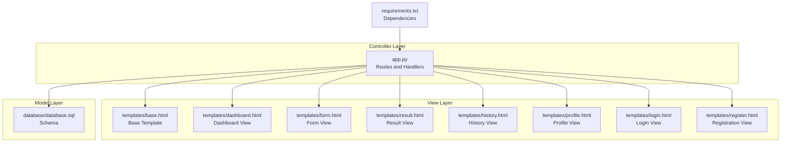
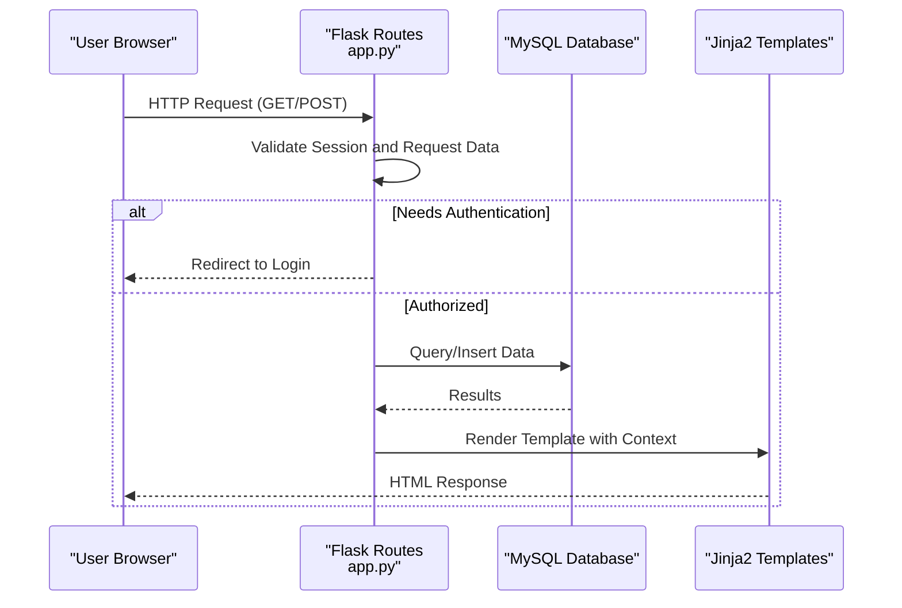
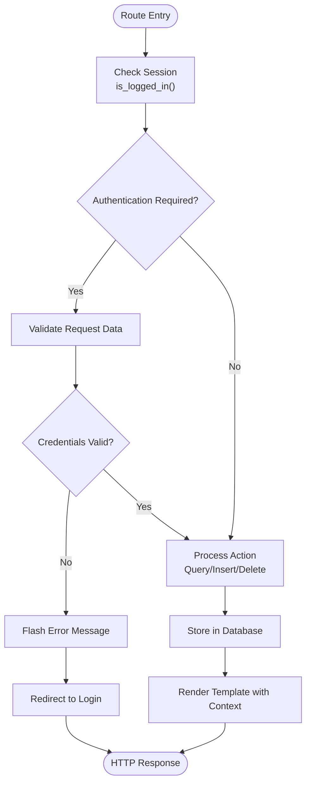
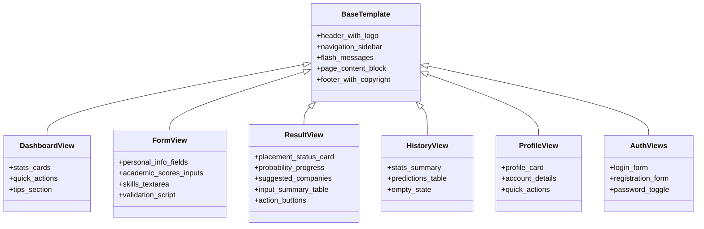
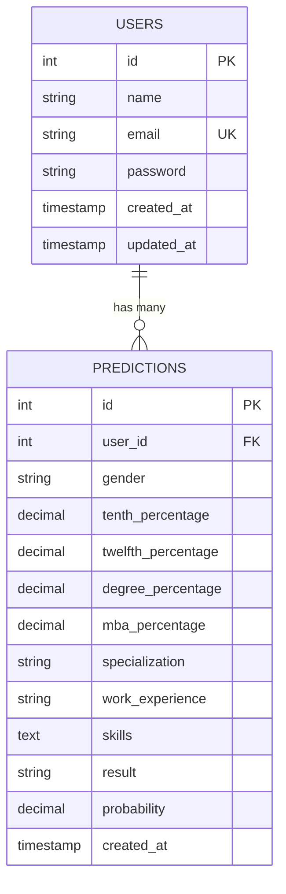
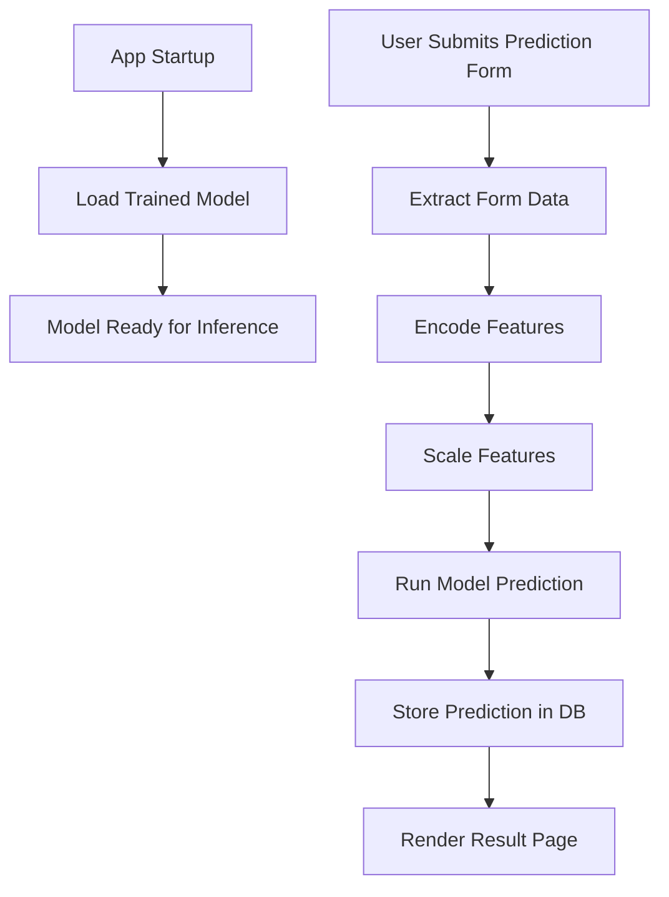
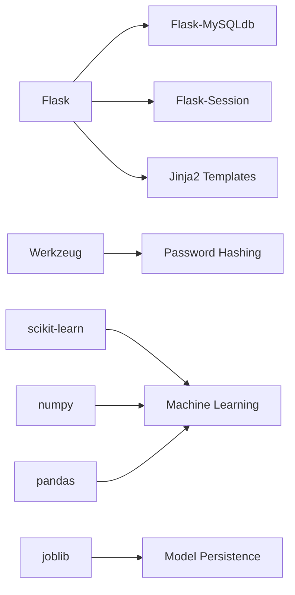

# MVC Pattern Implementation

<cite>
**Referenced Files in This Document**
- [app.py](file://app.py)
- [base.html](file://templates/base.html)
- [dashboard.html](file://templates/dashboard.html)
- [form.html](file://templates/form.html)
- [result.html](file://templates/result.html)
- [history.html](file://templates/history.html)
- [profile.html](file://templates/profile.html)
- [login.html](file://templates/login.html)
- [register.html](file://templates/register.html)
- [database.sql](file://database/database.sql)
- [requirements.txt](file://requirements.txt)
- [train_model.py](file://train_model.py)
</cite>

## Table of Contents
1. [Introduction](#introduction)
2. [Project Structure](#project-structure)
3. [Core Components](#core-components)
4. [Architecture Overview](#architecture-overview)
5. [Detailed Component Analysis](#detailed-component-analysis)
6. [Dependency Analysis](#dependency-analysis)
7. [Performance Considerations](#performance-considerations)
8. [Troubleshooting Guide](#troubleshooting-guide)
9. [Conclusion](#conclusion)

## Introduction
This document explains how the Student Placement Prediction Portal implements the Model-View-Controller (MVC) architectural pattern using Flask, Jinja2 templates, and MySQL. It demonstrates how user requests flow through routes (Controller) to interact with models (data access) and render views (templates). The separation of concerns ensures maintainability, testability, and clear component responsibilities.

## Project Structure
The application follows a conventional Flask layout with clear separation of concerns:
- Controller: Flask application with route handlers and business logic
- View: Jinja2 templates inheriting from a base template
- Model: MySQL database schema and connection utilities

**Diagram sources**
- [app.py:125-394](file://app.py#L125-L394)
- [base.html:1-128](file://templates/base.html#L1-L128)
- [dashboard.html:1-154](file://templates/dashboard.html#L1-L154)
- [form.html:1-227](file://templates/form.html#L1-L227)
- [result.html:1-312](file://templates/result.html#L1-L312)
- [history.html:1-306](file://templates/history.html#L1-L306)
- [profile.html:1-274](file://templates/profile.html#L1-L274)
- [login.html:1-183](file://templates/login.html#L1-L183)
- [register.html:1-231](file://templates/register.html#L1-L231)
- [database.sql:1-40](file://database/database.sql#L1-L40)
- [requirements.txt:1-27](file://requirements.txt#L1-L27)

**Section sources**
- [app.py:125-394](file://app.py#L125-L394)
- [base.html:1-128](file://templates/base.html#L1-L128)
- [database.sql:1-40](file://database/database.sql#L1-L40)
- [requirements.txt:1-27](file://requirements.txt#L1-L27)

## Core Components
- Controller (Flask app): Handles HTTP requests, manages sessions, orchestrates model access, and renders templates.
- View (Jinja2 templates): Reusable base template with page-specific content blocks and navigation.
- Model (MySQL): Stores user accounts and prediction history with foreign key relationships.

Key responsibilities:
- Controller: Route definitions, request validation, session management, ML inference, and database operations.
- View: Template inheritance, responsive UI, and user feedback via flash messages.
- Model: Structured persistence of user and prediction data.

**Section sources**
- [app.py:125-394](file://app.py#L125-L394)
- [base.html:1-128](file://templates/base.html#L1-L128)
- [database.sql:9-35](file://database/database.sql#L9-L35)

## Architecture Overview
The MVC flow for user interactions:

**Diagram sources**
- [app.py:125-394](file://app.py#L125-L394)
- [base.html:1-128](file://templates/base.html#L1-L128)
- [database.sql:9-35](file://database/database.sql#L9-L35)

## Detailed Component Analysis

### Controller Implementation (Flask Routes)
The Flask application acts as the Controller, managing:
- Configuration and MySQL initialization
- Session-based authentication helpers
- ML model loading and prediction logic
- Route handlers for all user-facing pages

Representative controller logic examples:
- Home redirection based on authentication state
- Dashboard statistics aggregation from predictions
- Login and registration with validation and hashing
- Prediction form processing, ML inference, and result storage
- History and profile pages with user-scoped queries
- Logout and error handlers

**Diagram sources**
- [app.py:125-394](file://app.py#L125-L394)

**Section sources**
- [app.py:125-394](file://app.py#L125-L394)

### View Implementation (Jinja2 Templates)
The View layer uses Jinja2 templates with inheritance:
- Base template defines header, navigation, flash messages, and footer
- Page-specific templates extend the base and define content blocks
- Navigation highlights active page using request endpoint
- Flash messages display success/warning/error notifications
- Responsive design with Bootstrap and custom styles

Template inheritance pattern:
- All pages extend base.html
- Content blocks provide page-specific markup
- Global variables injected via context processor

**Diagram sources**
- [base.html:1-128](file://templates/base.html#L1-L128)
- [dashboard.html:1-154](file://templates/dashboard.html#L1-L154)
- [form.html:1-227](file://templates/form.html#L1-L227)
- [result.html:1-312](file://templates/result.html#L1-L312)
- [history.html:1-306](file://templates/history.html#L1-L306)
- [profile.html:1-274](file://templates/profile.html#L1-L274)
- [login.html:1-183](file://templates/login.html#L1-L183)
- [register.html:1-231](file://templates/register.html#L1-L231)

**Section sources**
- [base.html:1-128](file://templates/base.html#L1-L128)
- [dashboard.html:1-154](file://templates/dashboard.html#L1-L154)
- [form.html:1-227](file://templates/form.html#L1-L227)
- [result.html:1-312](file://templates/result.html#L1-L312)
- [history.html:1-306](file://templates/history.html#L1-L306)
- [profile.html:1-274](file://templates/profile.html#L1-L274)
- [login.html:1-183](file://templates/login.html#L1-L183)
- [register.html:1-231](file://templates/register.html#L1-L231)

### Model Implementation (MySQL Database)
The Model layer persists:
- Users table: stores user credentials and timestamps
- Predictions table: stores prediction history with foreign key to users

**Diagram sources**
- [database.sql:9-35](file://database/database.sql#L9-L35)

**Section sources**
- [database.sql:9-35](file://database/database.sql#L9-L35)

### ML Model Integration
The application loads a pre-trained model for predictions:
- Model training script generates a pickled model artifact
- Controller loads the model at startup and performs inference
- Prediction results are stored in the database for history tracking

**Diagram sources**
- [app.py:28-39](file://app.py#L28-L39)
- [app.py:60-108](file://app.py#L60-L108)
- [train_model.py:109-192](file://train_model.py#L109-L192)

**Section sources**
- [app.py:28-39](file://app.py#L28-L39)
- [app.py:60-108](file://app.py#L60-L108)
- [train_model.py:109-192](file://train_model.py#L109-L192)

## Dependency Analysis
External dependencies and their roles:
- Flask: Web framework and routing
- Flask-MySQLdb: MySQL connectivity
- Werkzeug: Password hashing and utilities
- scikit-learn/numpy/pandas: ML preprocessing and modeling
- joblib: Model serialization
- Bootstrap 5: Frontend styling and components

**Diagram sources**
- [requirements.txt:4-27](file://requirements.txt#L4-L27)

**Section sources**
- [requirements.txt:4-27](file://requirements.txt#L4-L27)

## Performance Considerations
- Database connections: Use connection pooling and close cursors promptly to prevent leaks.
- Template rendering: Minimize heavy computations in templates; precompute data in controllers.
- ML inference: Cache model artifacts and avoid reloading on each request.
- Static assets: Leverage CDN and compression for CSS/JS files.
- Pagination: For large histories, implement pagination to reduce memory usage.

## Troubleshooting Guide
Common issues and resolutions:
- Model not loaded: Ensure the model artifact exists and is readable; verify training script ran successfully.
- Database connection errors: Check MySQL credentials and service availability; confirm schema creation.
- Session issues: Verify SECRET_KEY configuration and session backend setup.
- Template rendering errors: Validate variable names and context injection; ensure template inheritance is correct.
- Authentication failures: Confirm password hashing and session management logic.

**Section sources**
- [app.py:364-390](file://app.py#L364-L390)
- [database.sql:1-40](file://database/database.sql#L1-L40)

## Conclusion
The Student Placement Prediction Portal exemplifies clean MVC separation:
- Controller (Flask routes) handles HTTP requests, session management, and ML integration.
- View (Jinja2 templates) provides reusable UI with inheritance and responsive design.
- Model (MySQL) ensures reliable data persistence with clear relationships.

This architecture promotes maintainability by isolating concerns, enhances testability by separating logic from presentation, and clarifies responsibilities across components, enabling scalable enhancements and robust operation.