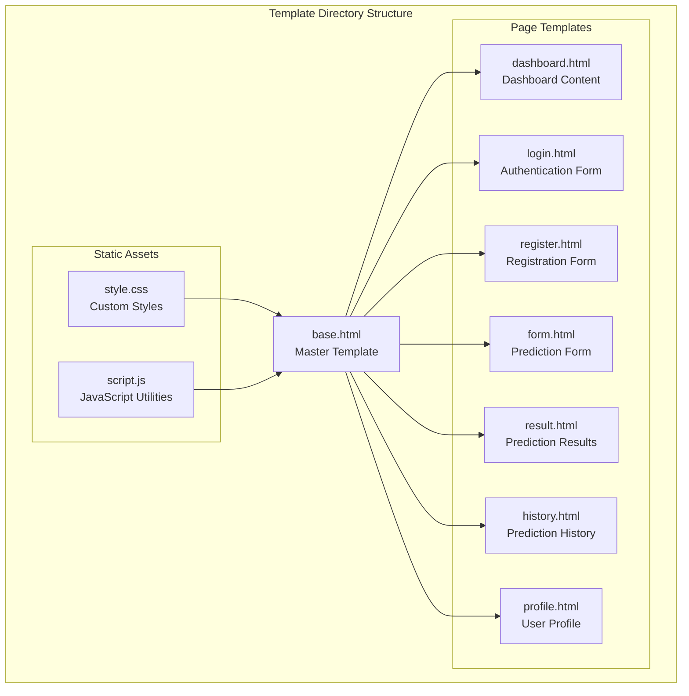
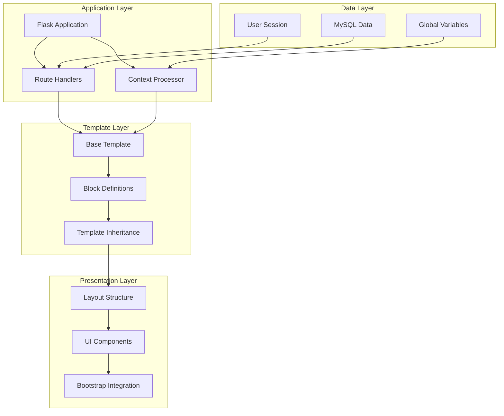
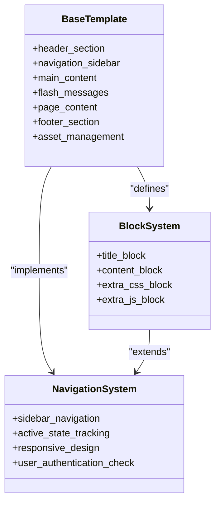
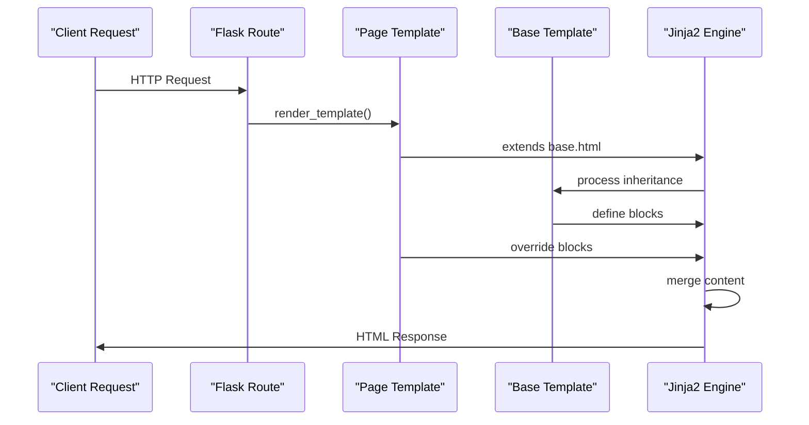
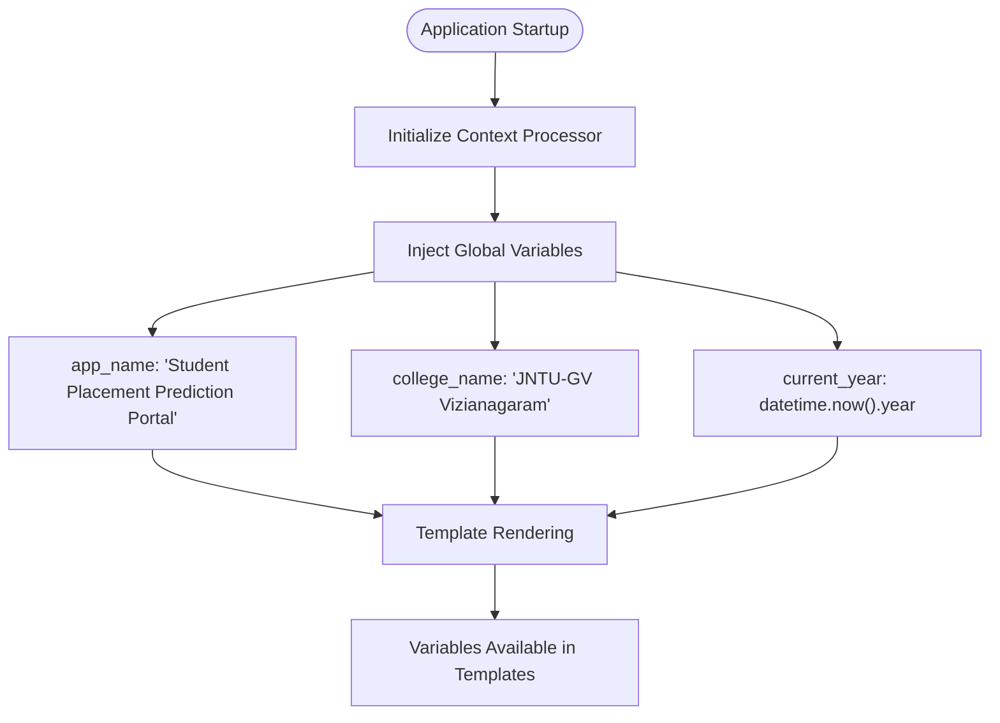
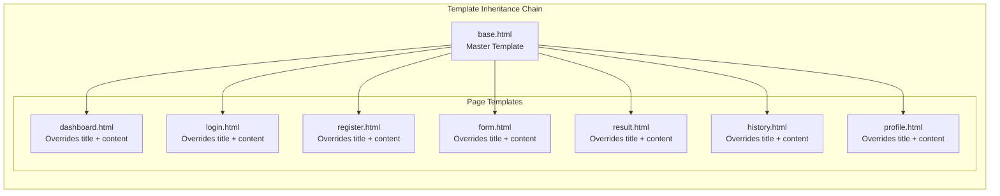
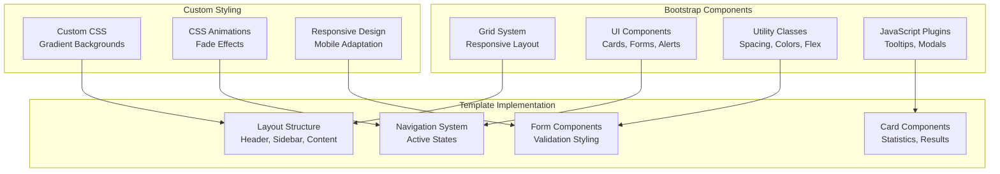
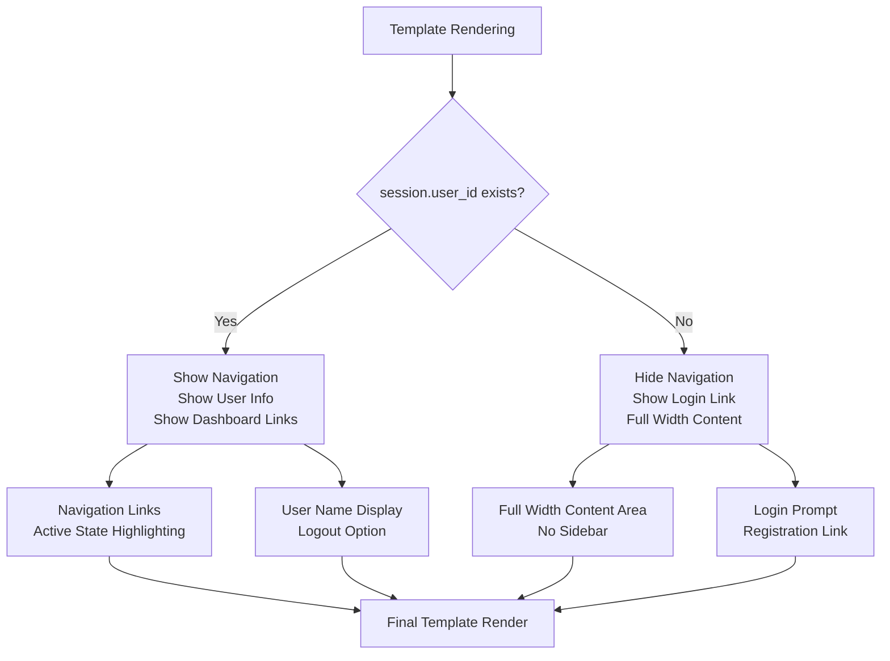
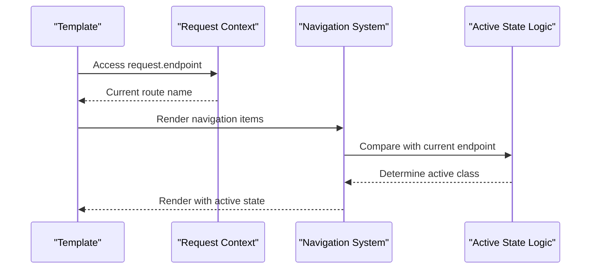

# Template System Architecture

<cite>
**Referenced Files in This Document**
- [app.py](file://app.py)
- [base.html](file://templates/base.html)
- [dashboard.html](file://templates/dashboard.html)
- [login.html](file://templates/login.html)
- [register.html](file://templates/register.html)
- [form.html](file://templates/form.html)
- [result.html](file://templates/result.html)
- [history.html](file://templates/history.html)
- [profile.html](file://templates/profile.html)
- [style.css](file://static/css/style.css)
- [script.js](file://static/js/script.js)
</cite>

## Table of Contents
1. [Introduction](#introduction)
2. [Project Structure](#project-structure)
3. [Core Components](#core-components)
4. [Architecture Overview](#architecture-overview)
5. [Detailed Component Analysis](#detailed-component-analysis)
6. [Template Inheritance Pattern](#template-inheritance-pattern)
7. [Context Processor Implementation](#context-processor-implementation)
8. [Bootstrap Integration](#bootstrap-integration)
9. [Template Rendering Workflow](#template-rendering-workflow)
10. [Conditional Rendering](#conditional-rendering)
11. [Performance Considerations](#performance-considerations)
12. [Troubleshooting Guide](#troubleshooting-guide)
13. [Conclusion](#conclusion)

## Introduction

The Jinja2 template system architecture in this Flask application follows a master-template pattern centered around `base.html`. This system demonstrates robust template inheritance, context injection, and responsive design integration using Bootstrap 5. The architecture supports dynamic content rendering, user authentication states, and consistent UI patterns across all pages while maintaining clean separation of concerns.

## Project Structure

The template system is organized with a hierarchical structure that promotes reusability and maintainability:



**Diagram sources**
- [base.html:1-128](file://templates/base.html#L1-L128)
- [dashboard.html:1-154](file://templates/dashboard.html#L1-L154)
- [login.html:1-183](file://templates/login.html#L1-L183)
- [register.html:1-231](file://templates/register.html#L1-L231)
- [form.html:1-227](file://templates/form.html#L1-L227)
- [result.html:1-312](file://templates/result.html#L1-L312)
- [history.html:1-306](file://templates/history.html#L1-L306)
- [profile.html:1-274](file://templates/profile.html#L1-L274)

**Section sources**
- [app.py:1-394](file://app.py#L1-L394)
- [base.html:1-128](file://templates/base.html#L1-L128)

## Core Components

### Master Template Engine (`base.html`)

The `base.html` serves as the foundation for all page templates, implementing a comprehensive layout system with:

- **Header Section**: College branding and user identification
- **Navigation System**: Responsive sidebar with active state highlighting
- **Content Area**: Main content container with flash message support
- **Footer**: Institutional information and copyright notice
- **Asset Management**: Bootstrap integration and custom styling

### Template Inheritance Framework

Each page template extends the base template using Jinja2's inheritance mechanism, overriding specific blocks to customize content while preserving the overall structure.

### Context Processing System

The Flask application implements a context processor that injects global variables accessible to all templates, ensuring consistent branding and user state information.

**Section sources**
- [base.html:1-128](file://templates/base.html#L1-L128)
- [app.py:374-382](file://app.py#L374-L382)

## Architecture Overview

The template system follows a layered architecture that separates concerns between layout, content, and presentation:



**Diagram sources**
- [app.py:125-394](file://app.py#L125-L394)
- [base.html:1-128](file://templates/base.html#L1-L128)

## Detailed Component Analysis

### Base Template Structure

The base template implements a comprehensive layout system with strategic block definitions:



**Diagram sources**
- [base.html:6-104](file://templates/base.html#L6-L104)

### Template Inheritance Implementation

Each page template follows a consistent inheritance pattern:



**Diagram sources**
- [dashboard.html:1](file://templates/dashboard.html#L1)
- [base.html:1](file://templates/base.html#L1)
- [app.py:162-167](file://app.py#L162-L167)

**Section sources**
- [dashboard.html:1-154](file://templates/dashboard.html#L1-L154)
- [login.html:1-183](file://templates/login.html#L1-L183)
- [register.html:1-231](file://templates/register.html#L1-L231)

### Context Processor Implementation

The context processor provides global variables accessible to all templates:



**Diagram sources**
- [app.py:374-382](file://app.py#L374-L382)

**Section sources**
- [app.py:374-382](file://app.py#L374-L382)
- [base.html:26-27](file://templates/base.html#L26-L27)

## Template Inheritance Pattern

### Base Template Blocks

The base template defines several key blocks that serve as extension points:

| Block Name | Purpose | Content Type |
|------------|---------|--------------|
| `title` | Page title customization | Dynamic text |
| `content` | Main page content area | HTML content |
| `extra_css` | Additional CSS imports | CSS code |
| `extra_js` | Additional JavaScript | JS code |

### Page Template Extensions

Each page template extends the base and overrides specific blocks:



**Diagram sources**
- [dashboard.html:1](file://templates/dashboard.html#L1)
- [login.html:1](file://templates/login.html#L1)
- [register.html:1](file://templates/register.html#L1)
- [form.html:1](file://templates/form.html#L1)
- [result.html:1](file://templates/result.html#L1)
- [history.html:1](file://templates/history.html#L1)
- [profile.html:1](file://templates/profile.html#L1)

**Section sources**
- [base.html:6-17](file://templates/base.html#L6-L17)
- [dashboard.html:3](file://templates/dashboard.html#L3)
- [login.html:3](file://templates/login.html#L3)

## Context Processor Implementation

### Global Variable Injection

The context processor ensures consistent branding and user state across all templates:

```mermaid
classDiagram
class ContextProcessor {
+inject_globals() dict
+app_name : string
+college_name : string
+current_year : int
}
class TemplateAccess {
+{{ app_name }}
+{{ college_name }}
+{{ current_year }}
+{{ session.user_id }}
+{{ session.user_name }}
}
ContextProcessor --> TemplateAccess : "provides"
```

**Diagram sources**
- [app.py:374-382](file://app.py#L374-L382)
- [base.html:26-27](file://templates/base.html#L26-L27)
- [base.html:31-35](file://templates/base.html#L31-L35)

### Template Variable Usage

Global variables are utilized throughout the base template:

- **Branding**: `{{ app_name }}` and `{{ college_name }}` for consistent naming
- **User State**: Conditional rendering based on `{{ session.user_id }}`
- **Dynamic Content**: `{{ current_year }}` for copyright information

**Section sources**
- [app.py:374-382](file://app.py#L374-L382)
- [base.html:26-35](file://templates/base.html#L26-L35)

## Bootstrap Integration

### Framework Integration

The template system seamlessly integrates Bootstrap 5 for responsive design:



**Diagram sources**
- [base.html:8-17](file://templates/base.html#L8-L17)
- [style.css:1-492](file://static/css/style.css#L1-L492)

### Responsive Design Features

The integration includes comprehensive responsive design capabilities:

- **Mobile Navigation**: Sidebar transforms to mobile menu on smaller screens
- **Flexible Grid**: Bootstrap grid system adapts to different screen sizes
- **Adaptive Components**: Cards and forms resize appropriately
- **Touch-Friendly**: Interactive elements sized for mobile devices

**Section sources**
- [base.html:8-17](file://templates/base.html#L8-L17)
- [style.css:412-456](file://static/css/style.css#L412-L456)

## Template Rendering Workflow

### Route-Based Template Selection

The Flask application routes determine which template renders based on user authentication and request context:

```mermaid
flowchart TD
Request[HTTP Request] --> Route{Route Handler}
Route --> Home[Home Route]
Route --> Dashboard[Dashboard Route]
Route --> Login[Login Route]
Route --> Register[Register Route]
Route --> Predict[Predict Route]
Route --> Result[Result Route]
Route --> Profile[Profile Route]
Route --> History[History Route]
Route --> Logout[Logout Route]
Home --> AuthCheck{Authenticated?}
AuthCheck --> |Yes| DashboardTemplate[render_template('dashboard.html')]
AuthCheck --> |No| LoginTemplate[render_template('login.html')]
Dashboard --> DashboardTemplate
Login --> LoginTemplate
Register --> RegisterTemplate
Predict --> FormTemplate[render_template('form.html')]
Result --> ResultTemplate
Profile --> ProfileTemplate
History --> HistoryTemplate
Logout --> LoginRedirect[redirect('login')]
```

**Diagram sources**
- [app.py:125-361](file://app.py#L125-L361)

### Variable Passing from Controllers

Controllers pass data to templates through the `render_template()` function:

| Route | Variables Passed | Purpose |
|-------|------------------|---------|
| Dashboard | `user`, `total_predictions`, `placed_count`, `placement_rate`, `avg_probability` | Statistics display |
| Login | None | Authentication form |
| Register | None | Registration form |
| Predict | None | Prediction input form |
| Result | `prediction`, `companies` | Result display |
| Profile | `user`, `prediction_count` | User information |
| History | `predictions` | Prediction history |

**Section sources**
- [app.py:134-167](file://app.py#L134-L167)
- [app.py:169-192](file://app.py#L169-L192)
- [app.py:194-236](file://app.py#L194-L236)
- [app.py:238-292](file://app.py#L238-L292)
- [app.py:294-317](file://app.py#L294-L317)
- [app.py:319-335](file://app.py#L319-L335)
- [app.py:337-354](file://app.py#L337-L354)

## Conditional Rendering

### Authentication-Based Visibility

Templates implement conditional rendering based on user authentication status:



**Diagram sources**
- [base.html:43-82](file://templates/base.html#L43-L82)
- [base.html:31-35](file://templates/base.html#L31-L35)

### Active Navigation State

Navigation items dynamically highlight based on current route:



**Diagram sources**
- [base.html:51-79](file://templates/base.html#L51-L79)

**Section sources**
- [base.html:31-82](file://templates/base.html#L31-L82)

## Performance Considerations

### Template Caching Strategy

The Jinja2 engine automatically caches compiled templates, reducing rendering overhead for frequently accessed pages. The system benefits from:

- **Single Template Compilation**: Base template compiled once, inherited by all page templates
- **Context Variable Caching**: Global variables cached during application initialization
- **Static Asset Optimization**: CSS and JavaScript served statically for improved load times

### Memory Management

Efficient memory usage through:

- **Lazy Loading**: Non-critical JavaScript loaded after initial page render
- **Minimal DOM Manipulation**: JavaScript operations optimized for performance
- **Responsive Design**: CSS media queries reduce layout recalculations

## Troubleshooting Guide

### Common Template Issues

**Missing Block Definitions**: Ensure all page templates extend the base and override required blocks:

```jinja2

Page Title

```

**Context Variable Errors**: Verify context processor is properly configured:

```python
@app.context_processor
def inject_globals():
    return {
        'app_name': 'Your App Name',
        'college_name': 'Your College Name',
        'current_year': datetime.now().year
    }
```

**Bootstrap Integration Problems**: Ensure proper CDN links and asset loading order:

```html
<!-- Bootstrap CSS -->
<link href="https://cdn.jsdelivr.net/npm/bootstrap@5.3.2/dist/css/bootstrap.min.css" rel="stylesheet">
<!-- Custom CSS -->
<link rel="stylesheet" href="{{ url_for('static', filename='css/style.css') }}">
```

**Section sources**
- [base.html:1-128](file://templates/base.html#L1-L128)
- [app.py:374-382](file://app.py#L374-L382)

## Conclusion

The Jinja2 template system architecture demonstrates a mature approach to web application templating with clear separation of concerns, robust inheritance patterns, and seamless Bootstrap integration. The system effectively balances flexibility with consistency, enabling rapid development while maintaining high-quality user experiences across all device types.

Key architectural strengths include:

- **Modular Design**: Clear separation between master templates and page-specific content
- **Context Management**: Centralized global variable injection through Flask's context processor
- **Responsive Framework**: Comprehensive Bootstrap integration with custom styling
- **Authentication Awareness**: Conditional rendering based on user state
- **Performance Optimization**: Efficient template compilation and asset management

This architecture provides an excellent foundation for scalable web applications requiring consistent branding, responsive design, and dynamic content presentation.