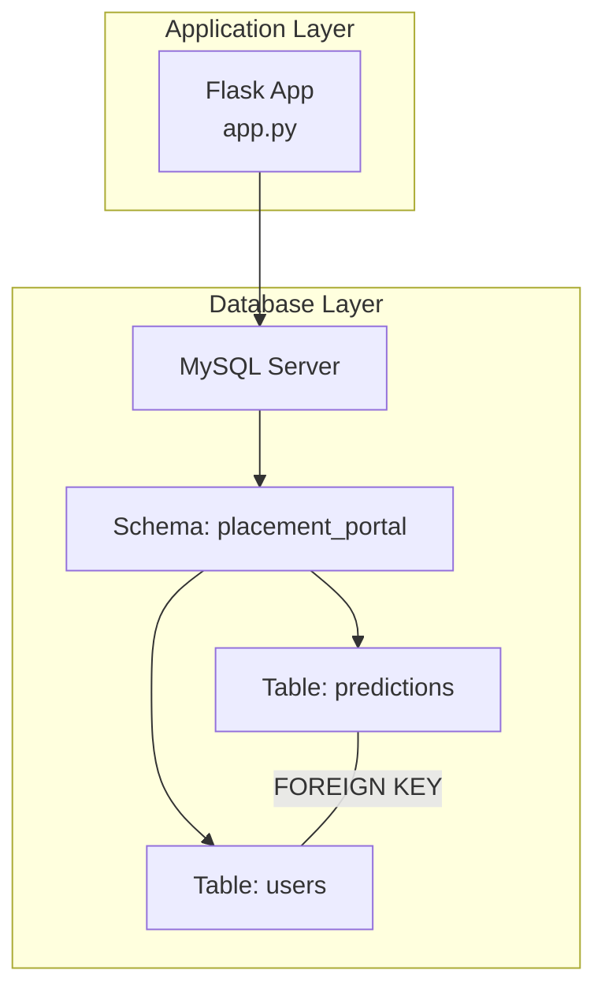
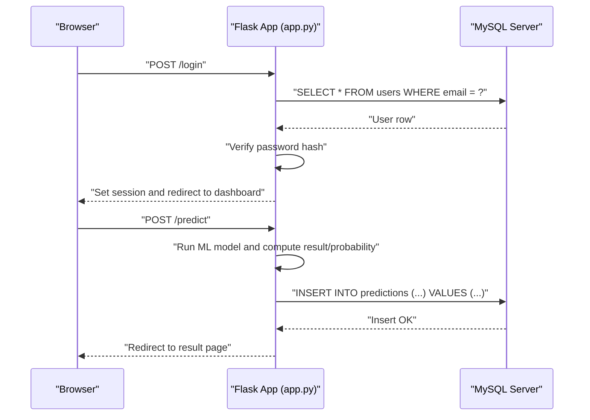
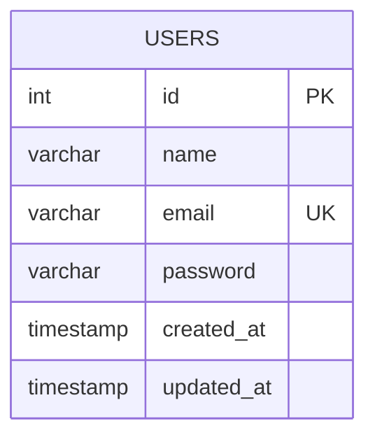
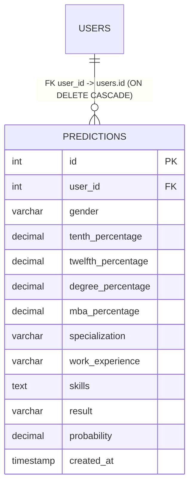
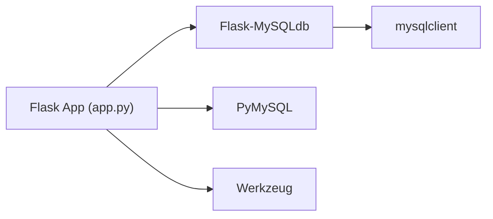

# Database Design

<cite>
**Referenced Files in This Document**
- [database.sql](file://database/database.sql)
- [app.py](file://app.py)
- [requirements.txt](file://requirements.txt)
- [train_model.py](file://train_model.py)
</cite>

## Table of Contents
1. [Introduction](#introduction)
2. [Project Structure](#project-structure)
3. [Core Components](#core-components)
4. [Architecture Overview](#architecture-overview)
5. [Detailed Component Analysis](#detailed-component-analysis)
6. [Dependency Analysis](#dependency-analysis)
7. [Performance Considerations](#performance-considerations)
8. [Troubleshooting Guide](#troubleshooting-guide)
9. [Conclusion](#conclusion)
10. [Appendices](#appendices)

## Introduction
This document provides comprehensive database design documentation for the Student Placement Prediction Portal. It details the relational schema, constraints, indexes, and data access patterns used by the application. It also covers initialization, migration considerations, integrity guarantees, and operational guidance for backups, maintenance, and performance tuning.

## Project Structure
The database schema is defined in a dedicated SQL script and consumed by the Flask application. The application uses a MySQL-compatible driver to connect to the database and executes SQL statements for CRUD operations and analytics.

**Diagram sources**
- [database.sql:5-35](file://database/database.sql#L5-L35)
- [app.py:17-26](file://app.py#L17-L26)

**Section sources**
- [database.sql:1-40](file://database/database.sql#L1-L40)
- [app.py:17-26](file://app.py#L17-L26)

## Core Components
This section documents the two primary tables and their relationships.

### Users Table
- Purpose: Stores registered users with credentials and metadata.
- Primary key: id (auto-increment integer).
- Unique constraints: email (unique).
- Not-null constraints: name, email, password.
- Timestamps: created_at (default current timestamp), updated_at (default current timestamp with on update).
- Data types:
  - id: INT (auto-increment primary key)
  - name: VARCHAR(100)
  - email: VARCHAR(100)
  - password: VARCHAR(255)
  - created_at: TIMESTAMP
  - updated_at: TIMESTAMP

Constraints and indexes:
- Primary key on id.
- Unique index on email.
- No explicit indexes beyond primary and unique; consider adding indexes on frequently filtered columns if query volume grows.

Common operations:
- Create: INSERT into users with name, email, password.
- Read: SELECT by id or email.
- Update: UPDATE name/password or other attributes.
- Delete: DELETE by id (referential integrity enforced via foreign keys on predictions).

**Section sources**
- [database.sql:10-17](file://database/database.sql#L10-L17)
- [app.py:215-231](file://app.py#L215-L231)
- [app.py:180](file://app.py#L180)

### Predictions Table
- Purpose: Stores historical predictions made by users, including academic and personal attributes, skills, and outcomes.
- Primary key: id (auto-increment integer).
- Foreign key: user_id references users.id with ON DELETE CASCADE.
- Not-null constraints: result, probability.
- Timestamps: created_at (default current timestamp).
- Data types:
  - id: INT (primary key)
  - user_id: INT (foreign key)
  - gender: VARCHAR(10)
  - tenth_percentage: DECIMAL(5,2)
  - twelfth_percentage: DECIMAL(5,2)
  - degree_percentage: DECIMAL(5,2)
  - mba_percentage: DECIMAL(5,2)
  - specialization: VARCHAR(50)
  - work_experience: VARCHAR(10)
  - skills: TEXT
  - result: VARCHAR(20)
  - probability: DECIMAL(5,2)
  - created_at: TIMESTAMP

Constraints and indexes:
- Primary key on id.
- Foreign key constraint on user_id referencing users.id with cascade delete.
- No explicit indexes; consider adding indexes on user_id, created_at, and frequently queried columns (e.g., result) to optimize analytics and history queries.

Common operations:
- Create: INSERT into predictions with user_id and all relevant fields.
- Read: SELECT by id and user_id for result pages; SELECT by user_id ordered by created_at for history.
- Update: UPDATE result/probability if needed (not currently used).
- Delete: Automatic cascade deletion when a user is deleted.

**Section sources**
- [database.sql:19-35](file://database/database.sql#L19-L35)
- [app.py:266-287](file://app.py#L266-L287)
- [app.py:302-308](file://app.py#L302-L308)
- [app.py:344-352](file://app.py#L344-L352)

## Architecture Overview
The application follows a straightforward relational architecture:
- Flask routes handle user sessions and orchestrate database operations.
- MySQL client library is configured with Flask-MySQLdb.
- The schema enforces referential integrity via foreign keys.

**Diagram sources**
- [app.py:169-192](file://app.py#L169-L192)
- [app.py:238-292](file://app.py#L238-L292)

## Detailed Component Analysis

### Users Table Schema

Key characteristics:
- Auto-increment primary key ensures uniqueness and efficient indexing.
- Unique index on email prevents duplicates and enables fast lookups by email.
- Timestamps support audit trails and last-modified tracking.

Operational notes:
- Passwords are stored as hashes; plaintext passwords are never persisted.
- Email-based authentication is performed via SELECT by email.

**Section sources**
- [database.sql:10-17](file://database/database.sql#L10-L17)
- [app.py:180](file://app.py#L180)

### Predictions Table Schema

Cardinality:
- One user can have many predictions (1 to N).
- Each prediction belongs to exactly one user (N to 1).

Operational notes:
- Cascade delete ensures clean-up of prediction history when a user account is removed.
- Timestamps enable chronological ordering and analytics.

**Section sources**
- [database.sql:19-35](file://database/database.sql#L19-L35)

### Data Access Patterns
The application performs the following typical CRUD and analytics operations:

- Authentication
  - Lookup user by email: SELECT by email.
  - Verify credentials using hashed password comparison.
  - Set session upon successful login.

- Registration
  - Validate uniqueness of email.
  - Hash password and insert new user record.

- Prediction Workflow
  - Insert prediction record with user_id and computed result/probability.
  - Retrieve specific prediction by id and user_id for result page.
  - List all predictions for a user ordered by created_at descending.

- Analytics
  - Aggregate counts and averages per user for dashboard statistics.

Representative SQL patterns (paths only):
- Login lookup: [app.py:180](file://app.py#L180)
- Registration insert: [app.py:226-231](file://app.py#L226-L231)
- Prediction insert: [app.py:266-287](file://app.py#L266-L287)
- Result retrieval: [app.py:302-308](file://app.py#L302-L308)
- History retrieval: [app.py:344-352](file://app.py#L344-L352)
- Dashboard aggregation: [app.py:144-151](file://app.py#L144-L151)

**Section sources**
- [app.py:169-192](file://app.py#L169-L192)
- [app.py:194-236](file://app.py#L194-L236)
- [app.py:238-292](file://app.py#L238-L292)
- [app.py:294-317](file://app.py#L294-L317)
- [app.py:337-354](file://app.py#L337-L354)
- [app.py:133-167](file://app.py#L133-L167)

### Database Initialization and Migration Procedures
Initialization:
- The schema script creates the database and tables, defines constraints, and establishes the foreign key relationship.
- To initialize, execute the SQL script against a MySQL-compatible server.

Migration considerations:
- The current schema does not include explicit indexes beyond primary and unique keys. As usage grows, consider adding indexes on:
  - predictions.user_id
  - predictions.created_at
  - predictions.result
- Versioning migrations can be introduced by adding a schema_version table or using a migration tool compatible with the target database engine.

Operational steps:
- Apply schema script to provision the database.
- Seed initial data if needed (sample inserts are commented in the schema).
- Ensure application configuration points to the correct database and credentials.

**Section sources**
- [database.sql:5-35](file://database/database.sql#L5-L35)

### Data Integrity and Referential Integrity
- Entity integrity:
  - Primary keys are guaranteed by AUTO_INCREMENT.
  - NOT NULL constraints on essential fields prevent null violations.
- Referential integrity:
  - Foreign key from predictions.user_id to users.id ensures that every prediction is associated with a valid user.
  - ON DELETE CASCADE maintains consistency by removing prediction history when a user is deleted.
- Logical integrity:
  - Passwords are hashed before storage.
  - Session-based access control restricts prediction retrieval to the owning user.

**Section sources**
- [database.sql:34](file://database/database.sql#L34)
- [app.py:302-308](file://app.py#L302-L308)

### Common Queries and Examples
Below are example query patterns used by the application. Replace placeholders with actual values as needed.

- Authenticate user by email
  - SELECT * FROM users WHERE email = ?;

- Register a new user
  - INSERT INTO users (name, email, password) VALUES (?, ?, ?);

- Insert a prediction
  - INSERT INTO predictions (user_id, gender, tenth_percentage, twelfth_percentage, degree_percentage, mba_percentage, specialization, work_experience, skills, result, probability) VALUES (?, ?, ?, ?, ?, ?, ?, ?, ?, ?, ?);

- Retrieve a specific prediction by id and user_id
  - SELECT * FROM predictions WHERE id = ? AND user_id = ?;

- List prediction history for a user (most recent first)
  - SELECT * FROM predictions WHERE user_id = ? ORDER BY created_at DESC;

- Dashboard analytics for a user
  - SELECT COUNT(*) as total_predictions, SUM(CASE WHEN result = 'Placed' THEN 1 ELSE 0 END) as placed_count, AVG(probability) as avg_probability FROM predictions WHERE user_id = ?;

- Count total predictions for a user
  - SELECT COUNT(*) as total FROM predictions WHERE user_id = ?;

Paths to implementation:
- [app.py:180](file://app.py#L180)
- [app.py:226-231](file://app.py#L226-L231)
- [app.py:266-287](file://app.py#L266-L287)
- [app.py:302-308](file://app.py#L302-L308)
- [app.py:344-352](file://app.py#L344-L352)
- [app.py:144-151](file://app.py#L144-L151)
- [app.py:328-333](file://app.py#L328-L333)

**Section sources**
- [app.py:169-192](file://app.py#L169-L192)
- [app.py:194-236](file://app.py#L194-L236)
- [app.py:238-292](file://app.py#L238-L292)
- [app.py:294-317](file://app.py#L294-L317)
- [app.py:337-354](file://app.py#L337-L354)
- [app.py:133-167](file://app.py#L133-L167)

## Dependency Analysis
External dependencies relevant to database connectivity and operations:
- Flask-MySQLdb: Provides MySQL connectivity for Python.
- mysqlclient: Low-level MySQL client used by Flask-MySQLdb.
- PyMySQL: Alternative MySQL client; included for compatibility.
- Werkzeug: Used for secure password hashing.

**Diagram sources**
- [requirements.txt:5-11](file://requirements.txt#L5-L11)
- [requirements.txt:21-23](file://requirements.txt#L21-L23)

**Section sources**
- [requirements.txt:1-27](file://requirements.txt#L1-L27)
- [app.py:17-26](file://app.py#L17-L26)

## Performance Considerations
Indexing recommendations:
- Add an index on predictions.user_id to accelerate history and analytics queries.
- Add an index on predictions.created_at to speed up time-series queries.
- Add an index on predictions.result to optimize filtering by outcome.

Storage engine and character set:
- Tables use InnoDB with utf8mb4 character set, which is suitable for modern applications requiring full Unicode support.

Connection management:
- The application uses a DictCursor configuration; ensure connection pooling is considered for high concurrency.

Monitoring and maintenance:
- Regularly analyze slow queries and adjust indexes accordingly.
- Back up the database regularly and test restore procedures.

[No sources needed since this section provides general guidance]

## Troubleshooting Guide
Common issues and resolutions:
- Cannot connect to database
  - Verify host, user, password, and database name in configuration.
  - Ensure the database service is running and accessible.
  - Confirm that the schema script has been executed to create tables.

- Duplicate email during registration
  - The unique constraint on users.email prevents duplicates; handle the duplicate key error gracefully in the application.

- Prediction not found
  - The result endpoint filters by user_id; ensure the session is active and the prediction belongs to the logged-in user.

- Model not loaded
  - The application attempts to load model.pkl on startup; ensure the model file exists and is readable.

**Section sources**
- [app.py:17-26](file://app.py#L17-L26)
- [app.py:217-222](file://app.py#L217-L222)
- [app.py:294-317](file://app.py#L294-L317)
- [app.py:384-390](file://app.py#L384-L390)

## Conclusion
The database design for the Student Placement Prediction Portal is simple, robust, and aligned with the application’s functional needs. It enforces entity and referential integrity, supports efficient authentication and prediction workflows, and provides a foundation for future enhancements such as targeted indexing and migration tooling.

[No sources needed since this section summarizes without analyzing specific files]

## Appendices

### Appendix A: Schema Creation Script Reference
- Database creation and selection
- Users table definition with primary key, unique email, and timestamps
- Predictions table definition with foreign key to users and cascade delete
- Optional sample data insertion comments

**Section sources**
- [database.sql:5-39](file://database/database.sql#L5-L39)

### Appendix B: Application Configuration Reference
- Flask configuration for MySQL host, user, password, database, and cursor class
- Secret key for session management

**Section sources**
- [app.py:17-26](file://app.py#L17-L26)

### Appendix C: ML Model Integration Reference
- Model loading and preprocessing pipeline used by the application
- Feature engineering and prediction computation

**Section sources**
- [train_model.py:18-107](file://train_model.py#L18-L107)
- [app.py:29-39](file://app.py#L29-L39)