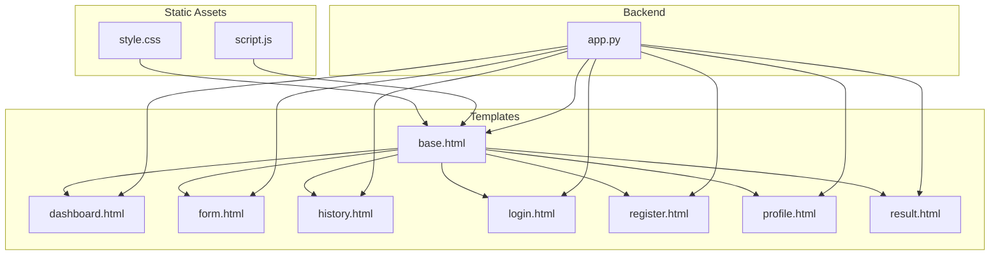
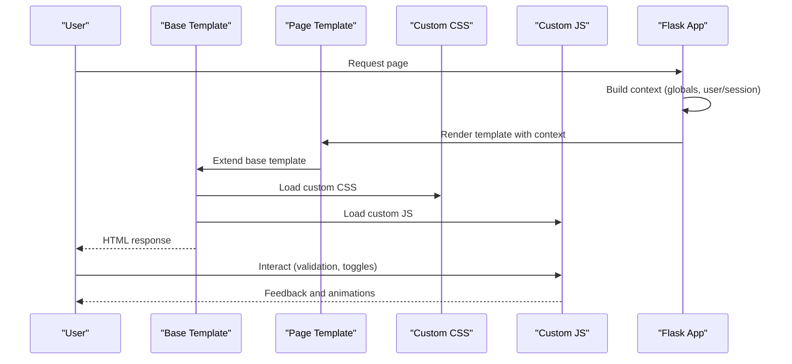
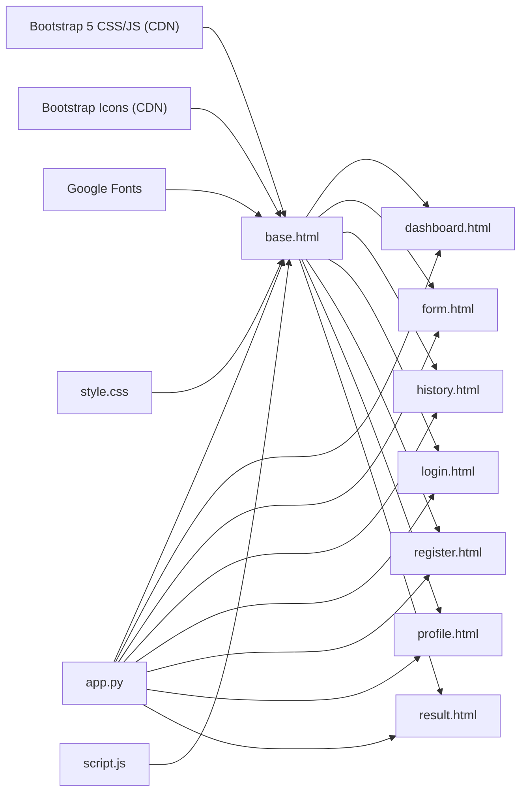

# Frontend Interface

<cite>
**Referenced Files in This Document**
- [base.html](file://templates/base.html)
- [dashboard.html](file://templates/dashboard.html)
- [form.html](file://templates/form.html)
- [history.html](file://templates/history.html)
- [login.html](file://templates/login.html)
- [register.html](file://templates/register.html)
- [profile.html](file://templates/profile.html)
- [result.html](file://templates/result.html)
- [style.css](file://static/css/style.css)
- [script.js](file://static/js/script.js)
- [app.py](file://app.py)
- [requirements.txt](file://requirements.txt)
</cite>

## Table of Contents
1. [Introduction](#introduction)
2. [Project Structure](#project-structure)
3. [Core Components](#core-components)
4. [Architecture Overview](#architecture-overview)
5. [Detailed Component Analysis](#detailed-component-analysis)
6. [Dependency Analysis](#dependency-analysis)
7. [Performance Considerations](#performance-considerations)
8. [Troubleshooting Guide](#troubleshooting-guide)
9. [Conclusion](#conclusion)
10. [Appendices](#appendices)

## Introduction
This document explains the frontend interface of the Student Placement Prediction Portal. It covers the responsive Bootstrap-based design system, custom CSS styling, template inheritance using a master base template, navigation driven by authentication state, interactive elements (validation, modals, responsive layout), dashboard statistics and visualizations, history page with data tables and filtering, form interface with validation and feedback, JavaScript functionality for client-side interactions, accessibility and cross-browser compatibility, and the integration between Flask backend data and frontend templates.

## Project Structure
The frontend is organized around Jinja2 templates and static assets:
- Master template: base.html
- Page templates: dashboard.html, form.html, history.html, login.html, register.html, profile.html, result.html
- Static assets: Bootstrap 5 CSS/JS, custom CSS (style.css), custom JS (script.js)
- Backend integration: Flask app.py renders templates and passes data

**Diagram sources**
- [base.html](file://templates/base.html)
- [dashboard.html](file://templates/dashboard.html)
- [form.html](file://templates/form.html)
- [history.html](file://templates/history.html)
- [login.html](file://templates/login.html)
- [register.html](file://templates/register.html)
- [profile.html](file://templates/profile.html)
- [result.html](file://templates/result.html)
- [style.css](file://static/css/style.css)
- [script.js](file://static/js/script.js)
- [app.py](file://app.py)

**Section sources**
- [base.html](file://templates/base.html)
- [style.css](file://static/css/style.css)
- [script.js](file://static/js/script.js)
- [app.py](file://app.py)

## Core Components
- Base template with Bootstrap 5 and custom CSS/JS inclusion
- Conditional navigation and sidebar based on session state
- Flash messages for user feedback
- Responsive grid and card-based layout
- Interactive JavaScript for validation, toggles, and animations
- Template blocks for title and content injection

Key implementation references:
- Base template blocks and navigation: [base.html](file://templates/base.html)
- Custom CSS variables, layout, and responsive styles: [style.css](file://static/css/style.css)
- JavaScript initialization and utilities: [script.js](file://static/js/script.js)
- Flask context processors and route rendering: [app.py](file://app.py)

**Section sources**
- [base.html](file://templates/base.html)
- [style.css](file://static/css/style.css)
- [script.js](file://static/js/script.js)
- [app.py](file://app.py)

## Architecture Overview
The frontend follows a layered pattern:
- Master template defines structure and reusable UI
- Page templates extend the base and inject content
- Static assets provide responsive design and interactivity
- Flask routes render templates with backend-provided data

**Diagram sources**
- [base.html](file://templates/base.html)
- [style.css](file://static/css/style.css)
- [script.js](file://static/js/script.js)
- [app.py](file://app.py)

## Detailed Component Analysis

### Template Inheritance and Navigation
- Master template defines:
  - Meta tags and viewport for responsiveness
  - Bootstrap 5 CSS and icons
  - Google Fonts
  - Custom CSS and extra blocks for page-specific additions
  - Header with institution branding and user info
  - Sidebar with navigation items conditionally shown when user is logged in
  - Main content area with flash messages
  - Footer with copyright and powered-by notice
  - Bootstrap 5 JS and custom JS
- Navigation items change based on request endpoint and active page highlighting
- Sidebar is hidden on non-authenticated pages; full-width layout applies

Template inheritance pattern:
- Each page template extends base.html and overrides title and content blocks
- Navigation links use url_for for Flask endpoints
- Active state determined by request.endpoint comparison

Conditional menu items:
- Logged-in state controls visibility of sidebar and logout link
- User name shown in header when session present

**Section sources**
- [base.html](file://templates/base.html)

### Dashboard Interface
- Statistics cards for total predictions, placed count, placement rate, average probability
- Quick actions: new prediction and history
- Tips section with actionable advice
- About section explaining the ML model’s features

CSS classes and layout:
- Grid-based cards with hover effects and icons
- Gradient borders and shadows for depth
- Responsive breakpoints for smaller screens

JavaScript integration:
- Smooth scrolling for anchors
- Number animation utilities (animateNumber) available globally

**Section sources**
- [dashboard.html](file://templates/dashboard.html)
- [style.css](file://static/css/style.css)
- [script.js](file://static/js/script.js)

### Form Interface and Validation
- Prediction form collects personal info, academic scores, and skills
- Real-time validation for numeric inputs (0–100)
- Bootstrap form controls with custom styling
- Submit button triggers server-side prediction and persistence

Template-level validation:
- Percentage range checks on submit
- User feedback via alerts

JavaScript validation:
- Percentage input validation with is-valid/is-invalid classes
- Form submission prevents invalid submissions

Accessibility:
- Proper labels and placeholders
- Focus states and keyboard navigation support via Bootstrap

**Section sources**
- [form.html](file://templates/form.html)
- [script.js](file://static/js/script.js)

### History Page with Data Tables
- Displays prediction history with date/time, scores, work experience, result, probability, and action
- Stats boxes for totals, placed/not placed counts, and average probability
- Progress bars reflect probability thresholds
- Empty state with call-to-action when no history exists

Filtering and sorting:
- Server-side ordering by creation time desc
- Client-side filtering via Jinja filters (selectattr, map, sum)

Responsive table:
- Horizontal scroll container for small screens
- Badge-based result indicators

**Section sources**
- [history.html](file://templates/history.html)
- [app.py](file://app.py)

### Authentication Pages
- Login page with email/password, remember me, and password toggle
- Registration page with name, email, password confirmation, and terms agreement
- Shared styling with gradient cards and icons
- Password visibility toggles implemented in both global and page-specific scripts

**Section sources**
- [login.html](file://templates/login.html)
- [register.html](file://templates/register.html)
- [script.js](file://static/js/script.js)

### Result Page
- Presents prediction outcome with status icon and message
- Probability progress bar with threshold-based coloring
- Suggested companies based on probability bands
- Input summary table for transparency
- Action buttons to repeat prediction or view history

**Section sources**
- [result.html](file://templates/result.html)
- [app.py](file://app.py)

### Custom CSS Styling
- CSS variables for consistent theming (colors, spacing, typography)
- Layout with fixed header, sticky sidebar, and footer
- Responsive design with media queries for mobile sidebar and reduced paddings
- Animations and transitions for interactive elements
- Scrollbar customization for modern browsers

**Section sources**
- [style.css](file://static/css/style.css)

### JavaScript Functionality
- Initializes tooltips, flash messages, sidebar toggle, form validation, and smooth scrolling
- Utility functions:
  - togglePassword for visibility toggles
  - confirmAction for confirmation prompts
  - showLoading/hideLoading for async actions
  - formatDate for readable timestamps
  - animateNumber for engaging counters
  - toggleSidebar for mobile navigation
- Exposes functions globally via window object for inline scripts

**Section sources**
- [script.js](file://static/js/script.js)

### Integration Between Templates and Flask Backend
- Context processor injects global variables (app_name, college_name, current_year)
- Routes pass data to templates (user, stats, predictions, result)
- Session-based conditional rendering (navigation, flash messages)
- url_for generates URLs for navigation and form actions

**Section sources**
- [app.py](file://app.py)
- [base.html](file://templates/base.html)

## Dependency Analysis
External libraries and frameworks:
- Bootstrap 5 (CDN): UI framework and components
- Bootstrap Icons (CDN): Icons for navigation and UI elements
- Google Fonts: Typography consistency
- Custom CSS/JS: Theming and interactivity

Internal dependencies:
- base.html depends on static assets and page templates
- Page templates depend on base.html and Flask context
- script.js depends on Bootstrap JS and DOM availability

**Diagram sources**
- [base.html](file://templates/base.html)
- [style.css](file://static/css/style.css)
- [script.js](file://static/js/script.js)
- [app.py](file://app.py)

**Section sources**
- [requirements.txt](file://requirements.txt)
- [base.html](file://templates/base.html)

## Performance Considerations
- Minimize DOM queries by caching selectors in script.js
- Debounce resize handler if needed for sidebar behavior
- Lazy-load images if content grows
- Use CSS transforms for animations (already used) for GPU acceleration
- Keep static assets cached via CDN

[No sources needed since this section provides general guidance]

## Troubleshooting Guide
Common issues and resolutions:
- Navigation not appearing when logged in:
  - Verify session keys and request.endpoint comparisons in base.html
- Forms not validating:
  - Ensure Bootstrap validation classes and form.checkValidity() are applied
- Sidebar not closing on mobile:
  - Check click-outside logic and window resize handling
- Flash messages not dismissing:
  - Confirm timeout and button click trigger in script.js
- Styling conflicts:
  - Review custom CSS specificity and media queries

**Section sources**
- [base.html](file://templates/base.html)
- [script.js](file://static/js/script.js)
- [style.css](file://static/css/style.css)

## Conclusion
The frontend combines a robust Bootstrap 5 foundation with custom CSS and JavaScript to deliver a responsive, accessible, and interactive user experience. Template inheritance centralizes layout and navigation, while Flask routes supply dynamic data. The design emphasizes usability with real-time validation, clear feedback, and intuitive navigation—particularly valuable for educational and prediction interfaces.

[No sources needed since this section summarizes without analyzing specific files]

## Appendices

### Template Blocks Reference
- base.html blocks:
  - title: sets page title
  - extra_css: page-specific CSS
  - content: page body content
  - extra_js: page-specific JavaScript
- Page templates override title and content blocks

**Section sources**
- [base.html](file://templates/base.html)

### CSS Classes Overview
- Layout: wrapper, main-content, full-width
- Header/Footer: main-header, main-footer
- Sidebar: sidebar, nav-link, active, logout-link
- Cards: stat-card, quick-actions-card, tips-card, about-card
- Alerts: flash-messages, alert
- Tables: history-table-card, table-hover
- Buttons: predict-btn, auth-btn, view-btn

**Section sources**
- [style.css](file://static/css/style.css)
- [dashboard.html](file://templates/dashboard.html)
- [history.html](file://templates/history.html)
- [login.html](file://templates/login.html)
- [register.html](file://templates/register.html)
- [result.html](file://templates/result.html)

### JavaScript Functions Reference
- Initialization: initializeApp(), initTooltips(), initFlashMessages(), initSidebarToggle(), initFormValidations(), initSmoothScroll()
- Utilities: togglePassword(), confirmAction(), showLoading(), hideLoading(), formatDate(), animateNumber(), toggleSidebar()
- Event handling: DOMContentLoaded, submit prevention, resize cleanup

**Section sources**
- [script.js](file://static/js/script.js)

### Accessibility and Cross-Browser Compatibility
- Bootstrap provides baseline accessibility; enhance with ARIA attributes where needed
- Semantic HTML and proper labels improve screen reader support
- Test across modern browsers; ensure CSS variables and Flexbox fallbacks are considered

[No sources needed since this section provides general guidance]