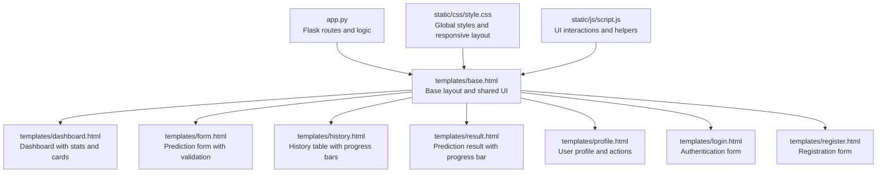
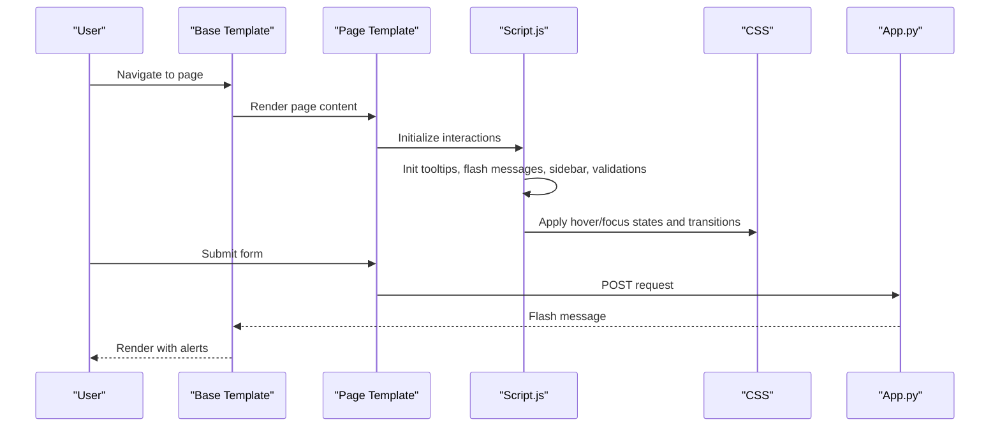
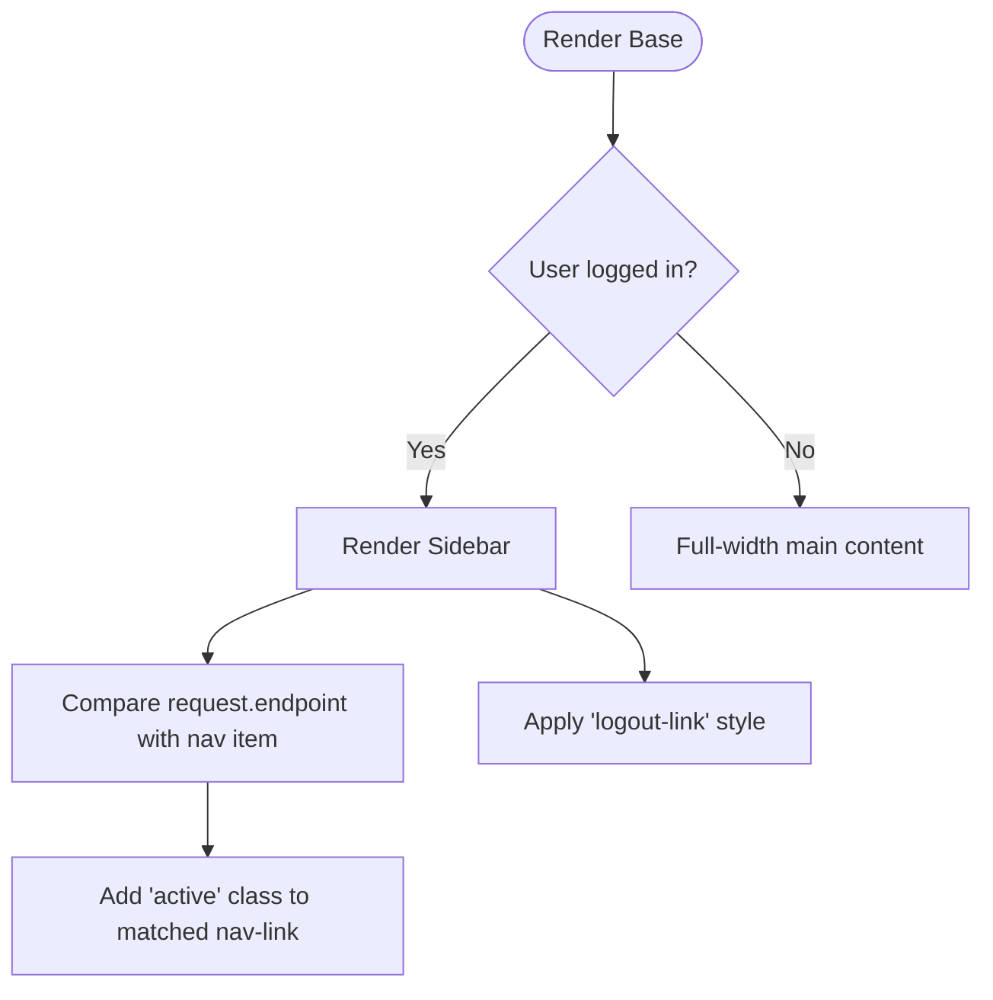
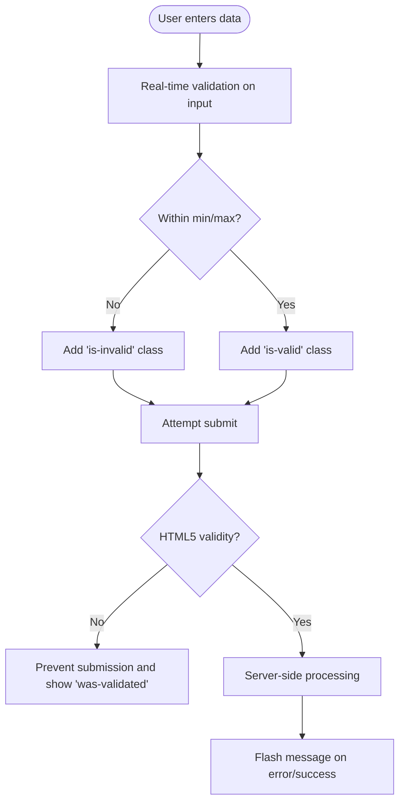
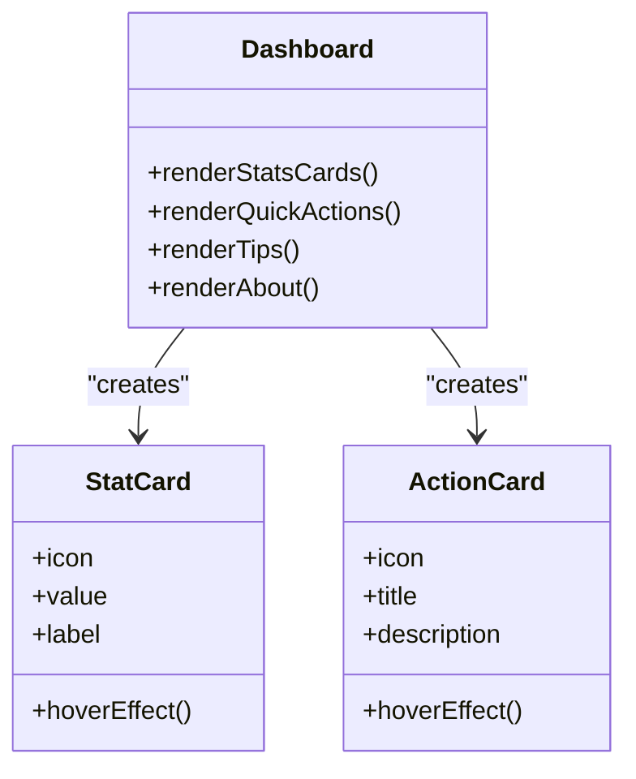
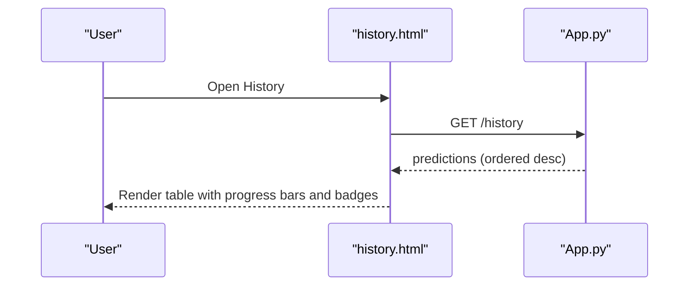
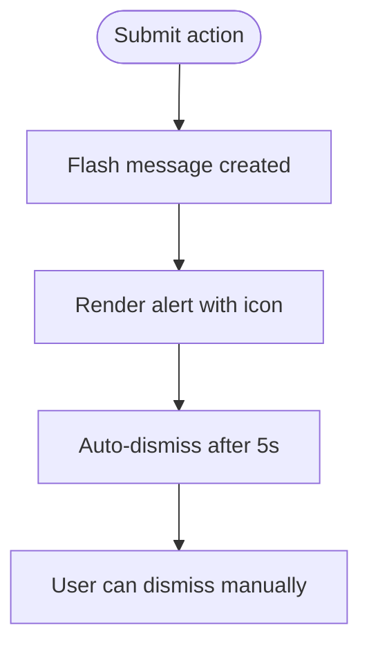
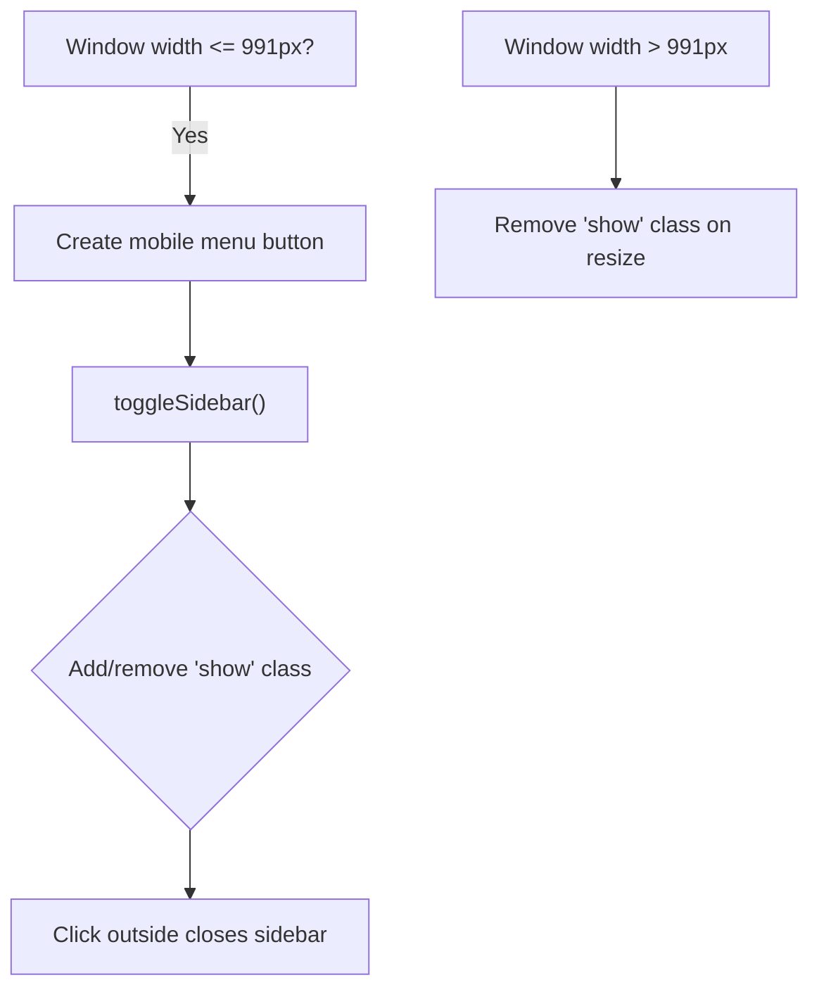
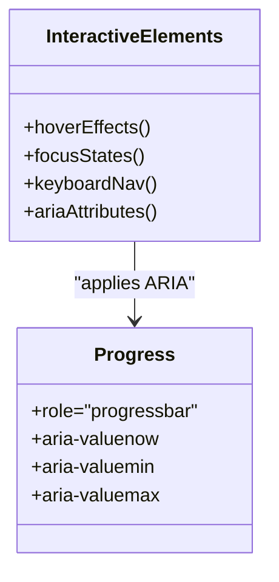
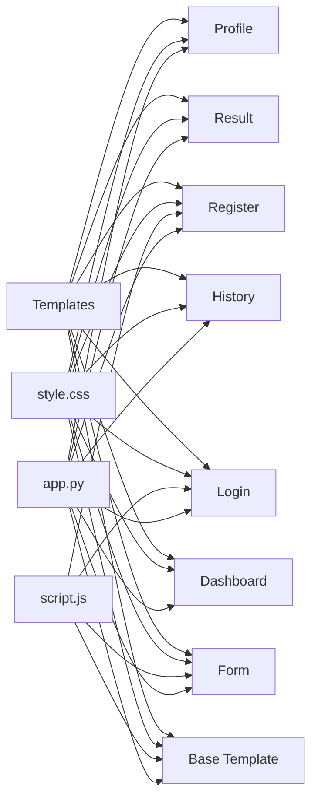

# Interactive Elements & Components

<cite>
**Referenced Files in This Document**
- [base.html](file://templates/base.html)
- [dashboard.html](file://templates/dashboard.html)
- [form.html](file://templates/form.html)
- [history.html](file://templates/history.html)
- [login.html](file://templates/login.html)
- [register.html](file://templates/register.html)
- [profile.html](file://templates/profile.html)
- [result.html](file://templates/result.html)
- [style.css](file://static/css/style.css)
- [script.js](file://static/js/script.js)
- [app.py](file://app.py)
</cite>

## Table of Contents
1. [Introduction](#introduction)
2. [Project Structure](#project-structure)
3. [Core Components](#core-components)
4. [Architecture Overview](#architecture-overview)
5. [Detailed Component Analysis](#detailed-component-analysis)
6. [Dependency Analysis](#dependency-analysis)
7. [Performance Considerations](#performance-considerations)
8. [Troubleshooting Guide](#troubleshooting-guide)
9. [Conclusion](#conclusion)
10. [Appendices](#appendices)

## Introduction
This document explains the interactive frontend elements and user interface components of the Student Placement Prediction Portal. It covers the navigation system with active state highlighting and conditional menu items, form components with validation and feedback, dashboard statistics and visualizations, the history table with sorting and pagination, modal dialogs and alert systems, responsive sidebar navigation and mobile menu behavior, interactive elements such as hover effects and focus states, and accessibility features including ARIA attributes. It also demonstrates Bootstrap integration, custom styling, and user interaction patterns.

## Project Structure
The project follows a Flask backend with Jinja2 templates and a Bootstrap-based frontend. The layout is centralized in a base template that all pages extend. Styles are defined in a single stylesheet, and interactive behaviors are handled by a single JavaScript module.

**Diagram sources**
- [app.py:125-394](file://app.py#L125-L394)
- [base.html:1-128](file://templates/base.html#L1-L128)
- [dashboard.html:1-154](file://templates/dashboard.html#L1-L154)
- [form.html:1-227](file://templates/form.html#L1-L227)
- [history.html:1-306](file://templates/history.html#L1-L306)
- [result.html:1-312](file://templates/result.html#L1-L312)
- [profile.html:1-274](file://templates/profile.html#L1-L274)
- [login.html:1-183](file://templates/login.html#L1-L183)
- [register.html:1-231](file://templates/register.html#L1-L231)
- [style.css:1-492](file://static/css/style.css#L1-L492)
- [script.js:1-281](file://static/js/script.js#L1-L281)

**Section sources**
- [base.html:1-128](file://templates/base.html#L1-L128)
- [style.css:1-492](file://static/css/style.css#L1-L492)
- [script.js:1-281](file://static/js/script.js#L1-L281)
- [app.py:125-394](file://app.py#L125-L394)

## Core Components
- Navigation system with active state highlighting and conditional menu items
- Form components with input validation, placeholder text, and user feedback
- Dashboard components with statistics cards and visualizations
- History table with sorting, filtering, and pagination features
- Modal dialogs and alert systems for user notifications
- Responsive sidebar navigation and mobile menu behavior
- Interactive elements including hover effects, focus states, and keyboard navigation support
- Accessibility features and ARIA attributes implementation

**Section sources**
- [base.html:42-82](file://templates/base.html#L42-L82)
- [form.html:12-136](file://templates/form.html#L12-L136)
- [dashboard.html:14-151](file://templates/dashboard.html#L14-L151)
- [history.html:47-122](file://templates/history.html#L47-L122)
- [style.css:88-176](file://static/css/style.css#L88-L176)
- [script.js:61-100](file://static/js/script.js#L61-L100)

## Architecture Overview
The frontend architecture centers around a base template that injects shared UI elements (header, sidebar, footer, flash messages). Pages extend the base and provide page-specific content. JavaScript initializes tooltips, flash message auto-dismiss, mobile sidebar toggle, form validation, and smooth scrolling. CSS defines responsive layout, hover/focus states, and animations.

**Diagram sources**
- [base.html:86-104](file://templates/base.html#L86-L104)
- [script.js:14-29](file://static/js/script.js#L14-L29)
- [style.css:178-194](file://static/css/style.css#L178-L194)
- [app.py:169-192](file://app.py#L169-L192)

## Detailed Component Analysis

### Navigation System
- Active state highlighting: The sidebar nav links dynamically apply an “active” class based on the current route endpoint.
- Conditional menu items: The sidebar renders only when a user session exists.
- Logout link styling: A dedicated logout link with danger color styling.

**Diagram sources**
- [base.html:42-82](file://templates/base.html#L42-L82)

**Section sources**
- [base.html:49-80](file://templates/base.html#L49-L80)
- [style.css:138-163](file://static/css/style.css#L138-L163)

### Forms and Input Validation
- Placeholder text: Inputs include descriptive placeholders for user guidance.
- Input validation:
  - HTML5 constraints (min/max/step) for numeric fields.
  - Real-time validation feedback via Bootstrap’s “is-valid/is-invalid” classes.
  - Additional percentage range validation in JavaScript.
  - Form submission prevents invalid submissions and applies “was-validated” state.
- User feedback:
  - Flash messages for form errors/warnings/success.
  - Tooltips for contextual help.
  - Password visibility toggle in authentication forms.

**Diagram sources**
- [form.html:54-103](file://templates/form.html#L54-L103)
- [script.js:105-144](file://static/js/script.js#L105-L144)
- [base.html:86-99](file://templates/base.html#L86-L99)

**Section sources**
- [form.html:12-136](file://templates/form.html#L12-L136)
- [login.html:16-54](file://templates/login.html#L16-L54)
- [register.html:16-86](file://templates/register.html#L16-L86)
- [script.js:105-144](file://static/js/script.js#L105-L144)
- [base.html:86-99](file://templates/base.html#L86-L99)

### Dashboard Components
- Statistics cards: Four cards displaying total predictions, placed predictions, placement rate, and average probability.
- Quick actions: Two action cards linking to prediction and history.
- Tips and about sections: Informative cards with icons and feature highlights.

**Diagram sources**
- [dashboard.html:14-151](file://templates/dashboard.html#L14-L151)
- [style.css:229-364](file://static/css/style.css#L229-L364)

**Section sources**
- [dashboard.html:14-151](file://templates/dashboard.html#L14-L151)
- [style.css:229-364](file://static/css/style.css#L229-L364)

### History Table
- Sorting: Results are ordered by creation date descending server-side.
- Filtering: No client-side filtering; server returns filtered dataset.
- Pagination: Not implemented; full history is shown.
- Visual elements:
  - Progress bars indicating probability thresholds.
  - Color-coded badges for results and work experience.
  - Hover and focus states for interactivity.

**Diagram sources**
- [history.html:337-354](file://app.py#L337-L354)
- [history.html:47-122](file://templates/history.html#L47-L122)

**Section sources**
- [history.html:47-122](file://templates/history.html#L47-L122)
- [app.py:337-354](file://app.py#L337-L354)

### Alerts and Notifications
- Flash messages: Bootstrap alerts rendered conditionally with icons and dismiss buttons.
- Auto-dismiss: JavaScript automatically closes alerts after 5 seconds.
- Categories: Success, warning, error, info mapped to alert types.

**Diagram sources**
- [base.html:86-99](file://templates/base.html#L86-L99)
- [script.js:46-56](file://static/js/script.js#L46-L56)

**Section sources**
- [base.html:86-99](file://templates/base.html#L86-L99)
- [script.js:46-56](file://static/js/script.js#L46-L56)

### Responsive Sidebar and Mobile Menu
- Fixed sidebar with gradient header and navigation items.
- Mobile behavior:
  - Hidden off-canvas on small screens.
  - Mobile menu button toggles sidebar visibility.
  - Click outside sidebar closes it on mobile.
  - Sidebar resets on desktop resize.

**Diagram sources**
- [style.css:413-430](file://static/css/style.css#L413-L430)
- [script.js:61-90](file://static/js/script.js#L61-L90)
- [script.js:262-271](file://static/js/script.js#L262-L271)

**Section sources**
- [style.css:413-430](file://static/css/style.css#L413-L430)
- [script.js:61-90](file://static/js/script.js#L61-L90)
- [script.js:262-271](file://static/js/script.js#L262-L271)

### Interactive Elements and Accessibility
- Hover effects: Cards, buttons, and navigation items have hover transforms and gradients.
- Focus states: Inputs receive focus rings and shadow transitions.
- Keyboard navigation: Smooth scrolling anchors and Bootstrap tooltips support keyboard activation.
- Accessibility:
  - Progress bars include ARIA attributes for screen readers.
  - Alert components use roles and icons for clarity.

**Diagram sources**
- [result.html:38-47](file://templates/result.html#L38-L47)
- [style.css:138-163](file://static/css/style.css#L138-L163)
- [script.js:149-165](file://static/js/script.js#L149-L165)

**Section sources**
- [result.html:38-47](file://templates/result.html#L38-L47)
- [style.css:138-163](file://static/css/style.css#L138-L163)
- [script.js:149-165](file://static/js/script.js#L149-L165)

### Bootstrap Integration and Custom Styling
- Bootstrap 5 CSS and JS included via CDN.
- Bootstrap Icons integrated for consistent iconography.
- Custom CSS variables for theme consistency.
- Extensive use of Bootstrap utility classes for layout and spacing.

**Section sources**
- [base.html:8-15](file://templates/base.html#L8-L15)
- [style.css:6-21](file://static/css/style.css#L6-L21)

## Dependency Analysis
The frontend depends on:
- Base template for shared UI and conditional rendering.
- CSS for layout, responsive behavior, and interactive states.
- JavaScript for initialization, validation, and mobile interactions.
- Flask routes for dynamic content and flash messaging.

**Diagram sources**
- [base.html:1-128](file://templates/base.html#L1-L128)
- [style.css:1-492](file://static/css/style.css#L1-L492)
- [script.js:1-281](file://static/js/script.js#L1-L281)
- [app.py:125-394](file://app.py#L125-L394)

**Section sources**
- [base.html:1-128](file://templates/base.html#L1-L128)
- [style.css:1-492](file://static/css/style.css#L1-L492)
- [script.js:1-281](file://static/js/script.js#L1-L281)
- [app.py:125-394](file://app.py#L125-L394)

## Performance Considerations
- Minimize DOM manipulations: Use CSS transitions and transforms for hover/focus effects.
- Lazy initialization: Initialize only when elements exist (as done for tooltips and mobile menu).
- Efficient selectors: Cache frequently accessed elements (e.g., sidebar, alerts).
- Avoid heavy computations in event handlers: Percentage validation runs lightweight checks.
- Use Bootstrap utilities: Leverage built-in responsive classes to reduce custom CSS.

[No sources needed since this section provides general guidance]

## Troubleshooting Guide
- Flash messages not appearing:
  - Ensure flash messages are present in the request context and rendered in the base template.
- Sidebar not closing on mobile:
  - Verify click-outside handler targets the sidebar and menu button correctly.
- Form validation not working:
  - Confirm HTML5 constraints and JavaScript validation are both enabled.
  - Check that “was-validated” class is applied on submit.
- Password toggle not working:
  - Ensure the toggle function is bound to the correct input and icon IDs.

**Section sources**
- [base.html:86-99](file://templates/base.html#L86-L99)
- [script.js:46-56](file://static/js/script.js#L46-L56)
- [script.js:61-90](file://static/js/script.js#L61-L90)
- [script.js:105-144](file://static/js/script.js#L105-L144)
- [login.html:166-181](file://templates/login.html#L166-L181)
- [register.html:203-229](file://templates/register.html#L203-L229)

## Conclusion
The Student Placement Prediction Portal delivers a cohesive, accessible, and interactive frontend experience. The base template centralizes navigation and notifications, while individual pages implement specialized components such as forms, dashboards, and history tables. Bootstrap integration ensures consistent styling and responsive behavior, complemented by custom CSS and JavaScript for enhanced interactivity and accessibility.

[No sources needed since this section summarizes without analyzing specific files]

## Appendices

### A. Accessibility Checklist
- ARIA roles and labels:
  - Progress bars include role and ARIA attributes.
- Focus management:
  - Inputs receive focus styles; ensure tab order is logical.
- Color contrast:
  - Verify sufficient contrast for text and interactive elements.
- Screen reader support:
  - Use descriptive labels and icons with meaningful text alternatives.

**Section sources**
- [result.html:38-47](file://templates/result.html#L38-L47)
- [style.css:138-163](file://static/css/style.css#L138-L163)