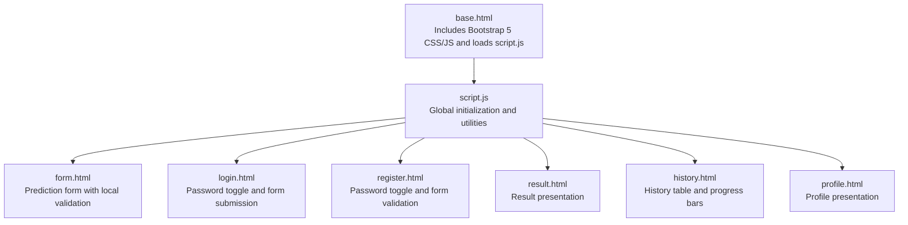
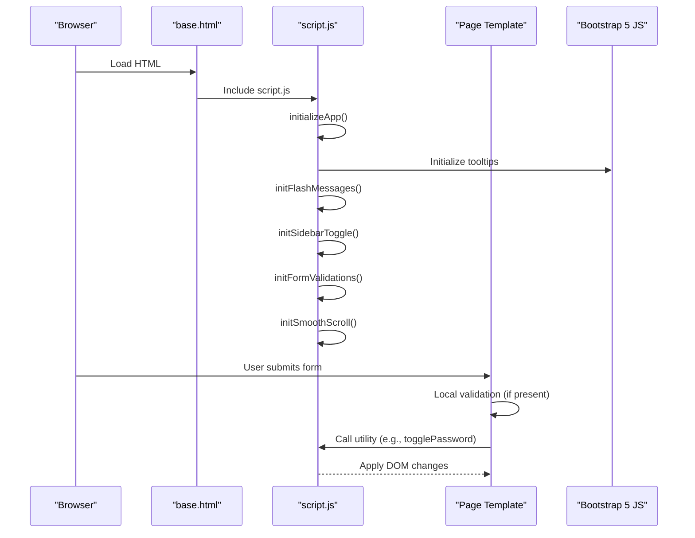
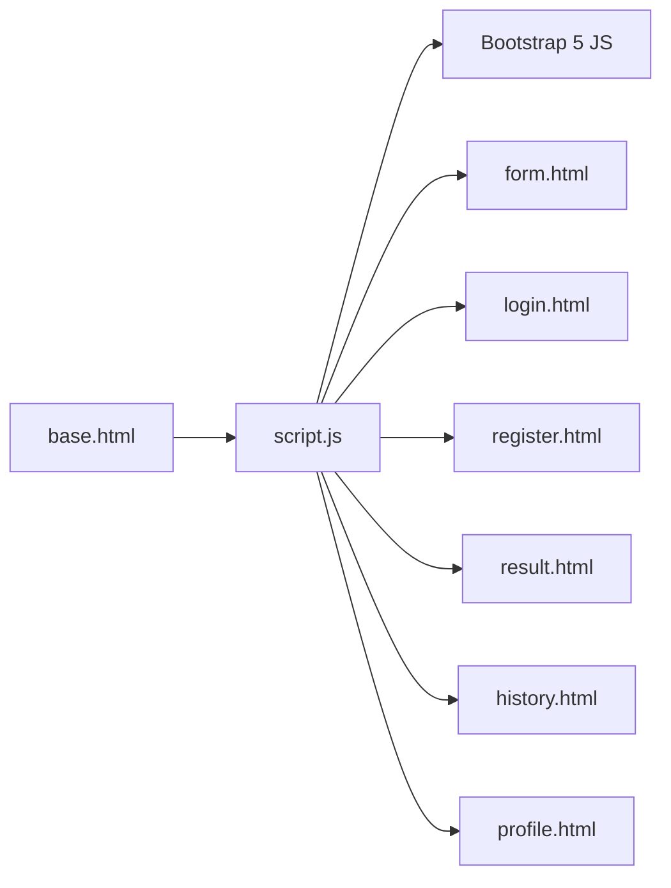

# JavaScript Functionality

<cite>
**Referenced Files in This Document**
- [script.js](file://static/js/script.js)
- [base.html](file://templates/base.html)
- [form.html](file://templates/form.html)
- [login.html](file://templates/login.html)
- [register.html](file://templates/register.html)
- [result.html](file://templates/result.html)
- [history.html](file://templates/history.html)
- [profile.html](file://templates/profile.html)
- [style.css](file://static/css/style.css)
- [app.py](file://app.py)
</cite>

## Table of Contents
1. [Introduction](#introduction)
2. [Project Structure](#project-structure)
3. [Core Components](#core-components)
4. [Architecture Overview](#architecture-overview)
5. [Detailed Component Analysis](#detailed-component-analysis)
6. [Dependency Analysis](#dependency-analysis)
7. [Performance Considerations](#performance-considerations)
8. [Troubleshooting Guide](#troubleshooting-guide)
9. [Conclusion](#conclusion)

## Introduction
This document explains the client-side JavaScript functionality and interactivity for the Student Placement Prediction Portal. It covers the custom JavaScript module loaded from script.js, Bootstrap integration, DOM manipulation patterns, event handling, responsive behavior, and how the frontend interacts with Flask routes for form submissions and data rendering.

## Project Structure
The client-side JavaScript is centralized in a single module that initializes UI behaviors and utilities. Templates embed page-specific scripts for local validations and interactions. Bootstrap 5 is included globally via CDN and used for tooltips, modal-like behaviors, and responsive layout.

**Diagram sources**
- [base.html:120-125](file://templates/base.html#L120-L125)
- [script.js:1-281](file://static/js/script.js#L1-L281)
- [form.html:211-225](file://templates/form.html#L211-L225)
- [login.html:166-181](file://templates/login.html#L166-L181)
- [register.html:203-229](file://templates/register.html#L203-L229)

**Section sources**
- [base.html:120-125](file://templates/base.html#L120-L125)
- [script.js:1-281](file://static/js/script.js#L1-L281)

## Core Components
- Global initialization: Initializes tooltips, flash messages, sidebar toggle, form validation, and smooth scrolling.
- Utility functions: Password toggle, confirmation dialogs, loading spinners, date formatting, animated counters, and sidebar control.
- Local validations: Percentage range checks and password match validation on registration.
- Bootstrap integration: Tooltips via Bootstrap’s Tooltip constructor and responsive sidebar behavior.

Key exported functions for global access:
- togglePassword, confirmAction, showLoading, hideLoading, formatDate, animateNumber, toggleSidebar

**Section sources**
- [script.js:14-29](file://static/js/script.js#L14-L29)
- [script.js:273-281](file://static/js/script.js#L273-L281)

## Architecture Overview
The client-side architecture follows a modular pattern:
- A central script.js module initializes global behaviors and exposes utility functions.
- Each page template may include page-specific scripts for immediate validation and interactions.
- Bootstrap 5 JS handles tooltips and integrates with the global module for cohesive UX.

**Diagram sources**
- [base.html:120-125](file://templates/base.html#L120-L125)
- [script.js:7-29](file://static/js/script.js#L7-L29)
- [script.js:34-41](file://static/js/script.js#L34-L41)
- [script.js:46-56](file://static/js/script.js#L46-L56)
- [script.js:61-90](file://static/js/script.js#L61-L90)
- [script.js:105-125](file://static/js/script.js#L105-L125)
- [script.js:149-165](file://static/js/script.js#L149-L165)

## Detailed Component Analysis

### Global Initialization and Utilities
- DOMContentLoaded listener triggers initialization.
- initTooltips: Creates Bootstrap tooltips for elements with data-bs-toggle="tooltip".
- initFlashMessages: Auto-dismisses alert-dismissible elements after 5 seconds.
- initSidebarToggle: Adds a mobile menu button on small screens and toggles sidebar visibility; closes sidebar on outside click.
- initFormValidations: Adds Bootstrap validation feedback on form submit and real-time percentage validation.
- initSmoothScroll: Smooth scroll for anchor links.
- Utility functions:
  - togglePassword: Toggles password field visibility and icon.
  - confirmAction: Confirmation dialog wrapper.
  - showLoading/hideLoading: Replace button text with spinner and disable.
  - formatDate: Localized date/time formatting.
  - animateNumber: Animated counter for numeric stats.
  - toggleSidebar: Publicly exposed function to toggle sidebar.

Responsive behavior:
- Window resize handler removes sidebar show class on desktop widths.
- CSS media queries handle sidebar transform and layout adjustments.

**Section sources**
- [script.js:7-29](file://static/js/script.js#L7-L29)
- [script.js:34-41](file://static/js/script.js#L34-L41)
- [script.js:46-56](file://static/js/script.js#L46-L56)
- [script.js:61-90](file://static/js/script.js#L61-L90)
- [script.js:105-125](file://static/js/script.js#L105-L125)
- [script.js:149-165](file://static/js/script.js#L149-L165)
- [script.js:172-187](file://static/js/script.js#L172-L187)
- [script.js:194-196](file://static/js/script.js#L194-L196)
- [script.js:202-219](file://static/js/script.js#L202-L219)
- [script.js:226-236](file://static/js/script.js#L226-L236)
- [script.js:244-257](file://static/js/script.js#L244-L257)
- [script.js:262-271](file://static/js/script.js#L262-L271)
- [style.css:412-430](file://static/css/style.css#L412-L430)

### Bootstrap Integration
- Tooltips: Triggered via data-bs-toggle="tooltip" attributes; initialized by initTooltips.
- Modal-like sidebar: Uses Bootstrap bundle for modal behavior; script.js toggles show class and handles outside clicks.
- Progress bars: Used in result and history pages for probability visualization.

**Section sources**
- [script.js:34-41](file://static/js/script.js#L34-L41)
- [style.css:412-430](file://static/css/style.css#L412-L430)
- [result.html:38-48](file://templates/result.html#L38-L48)
- [history.html:92-98](file://templates/history.html#L92-L98)

### Form Validation and Submission
- Global validation:
  - Forms receive was-validated class on submit; invalid inputs show Bootstrap validation feedback.
  - Real-time percentage validation ensures numeric inputs stay within 0–100 bounds.
- Page-specific validations:
  - Prediction form: Prevents submission if any percentage is out of range and shows an alert.
  - Registration form: Prevents submission if passwords do not match and shows an alert.
  - Login form: Provides password visibility toggle via inline script.

AJAX requests:
- No explicit AJAX is implemented in the provided code. All forms use standard HTML POST submissions handled by Flask routes.

**Section sources**
- [script.js:105-125](file://static/js/script.js#L105-L125)
- [script.js:130-144](file://static/js/script.js#L130-L144)
- [form.html:211-225](file://templates/form.html#L211-L225)
- [register.html:220-228](file://templates/register.html#L220-L228)
- [login.html:166-181](file://templates/login.html#L166-L181)

### DOM Manipulation Patterns
- Dynamic content updates:
  - Flash messages auto-dismiss after delay.
  - Sidebar show class toggled for mobile responsiveness.
  - Progress bars and badges updated with computed values.
- Event-driven changes:
  - Click handlers for buttons, anchors, and outside clicks.
  - Input listeners for real-time validation.
- Attribute and class manipulation:
  - Adding/removing Bootstrap validation classes (is-valid/is-invalid).
  - Swapping icon classes for password visibility toggles.

**Section sources**
- [script.js:46-56](file://static/js/script.js#L46-L56)
- [script.js:61-90](file://static/js/script.js#L61-L90)
- [script.js:105-125](file://static/js/script.js#L105-L125)
- [script.js:172-187](file://static/js/script.js#L172-L187)
- [result.html:38-48](file://templates/result.html#L38-L48)
- [history.html:92-98](file://templates/history.html#L92-L98)

### Navigation Interactions
- Smooth scrolling for anchor links.
- Sidebar toggle for mobile navigation.
- Logout link triggers server-side session clearing.

**Section sources**
- [script.js:149-165](file://static/js/script.js#L149-L165)
- [script.js:95-100](file://static/js/script.js#L95-L100)
- [base.html:74-79](file://templates/base.html#L74-L79)

### Responsive Behavior and Viewport Handling
- Mobile-first design with sidebar slide-in/out on small screens.
- CSS media queries adjust layout and spacing for tablets and phones.
- Window resize listener ensures sidebar resets on desktop widths.

**Section sources**
- [style.css:412-456](file://static/css/style.css#L412-L456)
- [script.js:262-271](file://static/js/script.js#L262-L271)

### Examples of Modules, Event Listeners, and DOM Patterns
- Module pattern: Single script.js file exports functions to window for global access.
- Event listeners:
  - DOMContentLoaded for initialization.
  - Click events for sidebar toggle and outside clicks.
  - Submit events for form validation.
  - Input events for real-time percentage validation.
- DOM patterns:
  - QuerySelectorAll loops to initialize multiple components.
  - Conditional class toggling for validation states.
  - Dynamic innerHTML replacement for loading indicators.

**Section sources**
- [script.js:7-29](file://static/js/script.js#L7-L29)
- [script.js:61-90](file://static/js/script.js#L61-L90)
- [script.js:105-125](file://static/js/script.js#L105-L125)
- [script.js:130-144](file://static/js/script.js#L130-L144)
- [script.js:202-219](file://static/js/script.js#L202-L219)

## Dependency Analysis
- script.js depends on:
  - Bootstrap 5 JS for tooltips and modal behavior.
  - DOM APIs for query selectors, event listeners, and class manipulation.
- Templates depend on:
  - script.js for global utilities and initialization.
  - Bootstrap 5 CSS/JS for UI components.
  - Flask routes for server-side rendering and data.

**Diagram sources**
- [base.html:120-125](file://templates/base.html#L120-L125)
- [script.js:1-281](file://static/js/script.js#L1-L281)

**Section sources**
- [base.html:120-125](file://templates/base.html#L120-L125)
- [script.js:1-281](file://static/js/script.js#L1-L281)

## Performance Considerations
- Efficient DOM queries: Using querySelectorAll and forEach reduces repeated lookups.
- Minimal reflows: Batched class toggles and single innerHTML replacements.
- Event delegation: Outside-click handler prevents excessive listeners.
- Lazy initialization: Tooltips and flash messages initialized only when elements exist.
- Avoid heavy animations: Smooth scroll and progress bars are lightweight.

[No sources needed since this section provides general guidance]

## Troubleshooting Guide
Common issues and resolutions:
- Tooltips not appearing:
  - Ensure elements have data-bs-toggle="tooltip" and Bootstrap 5 JS is loaded.
- Sidebar not closing on outside click:
  - Verify the click handler targets the sidebar and menu button elements.
- Percentage validation not working:
  - Confirm numeric inputs have min/max attributes and the validation function is attached to input events.
- Password toggle not working:
  - Ensure the toggle function is called with correct IDs and icons are swapped.
- Flash messages not auto-dismissing:
  - Confirm alert-dismissible elements exist and setTimeout executes.

**Section sources**
- [script.js:34-41](file://static/js/script.js#L34-L41)
- [script.js:61-90](file://static/js/script.js#L61-L90)
- [script.js:105-125](file://static/js/script.js#L105-L125)
- [script.js:172-187](file://static/js/script.js#L172-L187)
- [script.js:46-56](file://static/js/script.js#L46-L56)

## Conclusion
The client-side JavaScript module provides a cohesive foundation for UI interactions, responsive behavior, and Bootstrap integration. While the current implementation relies on standard HTML forms, the modular structure and utility functions enable easy extension for future AJAX enhancements. The combination of global initialization, local validations, and Bootstrap components delivers a polished, accessible user experience across devices.