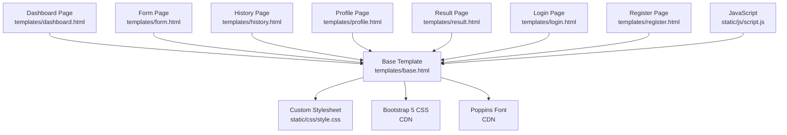
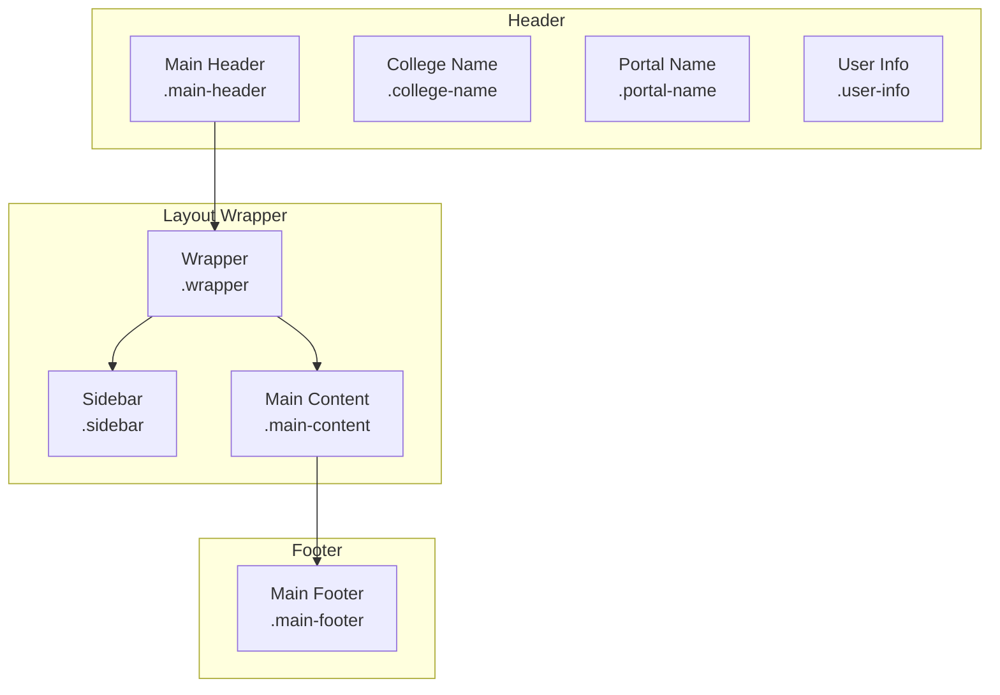
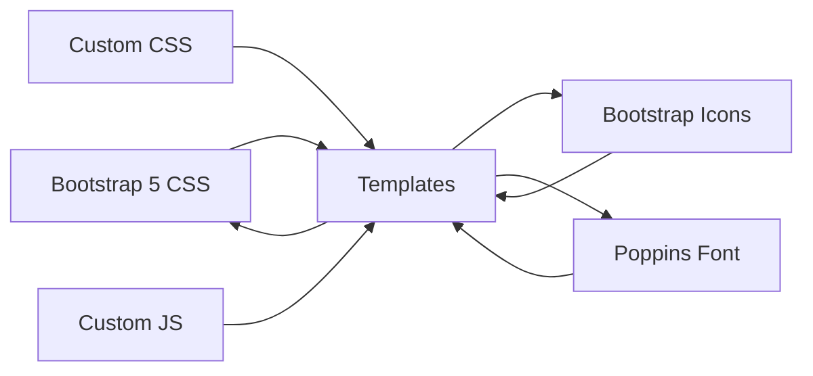

# Responsive Design & Styling

<cite>
**Referenced Files in This Document**
- [style.css](file://static/css/style.css)
- [base.html](file://templates/base.html)
- [dashboard.html](file://templates/dashboard.html)
- [form.html](file://templates/form.html)
- [history.html](file://templates/history.html)
- [profile.html](file://templates/profile.html)
- [result.html](file://templates/result.html)
- [login.html](file://templates/login.html)
- [register.html](file://templates/register.html)
- [script.js](file://static/js/script.js)
- [requirements.txt](file://requirements.txt)
</cite>

## Table of Contents
1. [Introduction](#introduction)
2. [Project Structure](#project-structure)
3. [Core Components](#core-components)
4. [Architecture Overview](#architecture-overview)
5. [Detailed Component Analysis](#detailed-component-analysis)
6. [Dependency Analysis](#dependency-analysis)
7. [Performance Considerations](#performance-considerations)
8. [Troubleshooting Guide](#troubleshooting-guide)
9. [Conclusion](#conclusion)
10. [Appendices](#appendices)

## Introduction
This document explains the responsive design system and custom CSS styling used in the Student Placement Prediction Portal. It covers Bootstrap 5 integration (grid system, utility classes, and component styling), custom CSS patterns, responsive breakpoints, mobile-first approach, color scheme, typography using Poppins, spacing conventions, header and sidebar design, main content layout, card-based dashboard statistics, form styling, footer design, and cross-browser and accessibility considerations.

## Project Structure
The styling architecture centers around a shared base template that loads Bootstrap 5 and Poppins fonts, and a custom stylesheet that defines variables, layout, components, and responsive behavior. Individual page templates extend the base and apply Bootstrap utility classes alongside custom styles.

**Diagram sources**
- [base.html:1-128](file://templates/base.html#L1-L128)
- [style.css:1-492](file://static/css/style.css#L1-L492)
- [script.js:1-281](file://static/js/script.js#L1-L281)

**Section sources**
- [base.html:1-128](file://templates/base.html#L1-L128)
- [style.css:1-492](file://static/css/style.css#L1-L492)

## Core Components
- Bootstrap 5 integration: CDN-loaded CSS and icons; extensive use of Bootstrap utility classes (grid, spacing, colors, badges, progress, cards).
- Custom CSS: CSS variables for theme colors and layout dimensions; layout wrapper with fixed header and sticky sidebar; card-based dashboard and form components; responsive media queries.
- JavaScript enhancements: tooltips, auto-dismiss flash messages, mobile sidebar toggle, form validation, smooth scrolling, and utility helpers.

Key Bootstrap components and utilities used:
- Grid system: container-fluid, row, col-md-n, col-sm-n, mx-auto, text-end, text-center.
- Components: cards, nav, badges, progress bars, alerts, buttons.
- Utilities: text-muted, bg-*, border-radius, shadow-*.

**Section sources**
- [base.html:8-17](file://templates/base.html#L8-L17)
- [style.css:6-21](file://static/css/style.css#L6-L21)
- [script.js:6-29](file://static/js/script.js#L6-L29)

## Architecture Overview
The responsive architecture follows a mobile-first approach with:
- Fixed header with brand identity and user info.
- Sticky sidebar with navigation; collapses to a slide-out overlay on small screens.
- Main content area with page-specific layouts.
- Footer with college branding and powered-by note.
- Custom CSS variables for consistent theming and spacing.
- Bootstrap grid and utilities for responsive layouts.

**Diagram sources**
- [base.html:20-118](file://templates/base.html#L20-L118)
- [style.css:37-207](file://static/css/style.css#L37-L207)

## Detailed Component Analysis

### Bootstrap 5 Integration and Utility Classes
- CDN imports: Bootstrap 5 CSS, Bootstrap Icons, and Poppins font.
- Base template uses container-fluid and Bootstrap grid classes to structure header, sidebar, content, and footer.
- Pages extensively use Bootstrap utilities for spacing, alignment, and component styling.

Examples of Bootstrap usage:
- Grid: col-md-8, col-md-4, col-md-6, col-sm-6, col-12, mx-auto.
- Components: card, card-header, card-body, table, table-hover, badge, progress, progress-bar.
- Utilities: text-muted, text-end, text-center, bg-success, bg-warning, bg-danger, bg-secondary.

**Section sources**
- [base.html:8-17](file://templates/base.html#L8-L17)
- [dashboard.html:14-151](file://templates/dashboard.html#L14-L151)
- [history.html:48-109](file://templates/history.html#L48-L109)
- [profile.html:14-96](file://templates/profile.html#L14-L96)
- [result.html:13-139](file://templates/result.html#L13-L139)
- [form.html:13-136](file://templates/form.html#L13-L136)

### Custom CSS Variables and Theming
- CSS variables define primary, secondary, accent, and semantic colors; layout dimensions (sidebar width, header/footer heights).
- Poppins font is globally applied to body.
- Gradient backgrounds unify branding across header, buttons, and highlights.

Color scheme highlights:
- Primary gradients for header, buttons, and highlights.
- Semantic colors for badges and progress bars (success, warning, danger).

Spacing conventions:
- Consistent padding/margin using rem units and Bootstrap spacing utilities.
- Card paddings and shadows for depth.

**Section sources**
- [style.css:6-21](file://static/css/style.css#L6-L21)
- [style.css:30-35](file://static/css/style.css#L30-L35)
- [style.css:101-155](file://static/css/style.css#L101-L155)

### Header Styling with College Branding
- Fixed header with gradient background and white text.
- Two-line branding: college name and portal name.
- User info aligned to the right with icon and name.

Responsive adjustments:
- Reduced padding and font sizes on smaller screens.

**Section sources**
- [style.css:37-80](file://static/css/style.css#L37-L80)
- [base.html:20-39](file://templates/base.html#L20-L39)

### Sidebar Navigation Design
- Fixed left sidebar with scrollable content and gradient header.
- Navigation items with icons, hover effects, and active state highlighting.
- Logout link styled with danger color.

Mobile behavior:
- Sidebar translates off-screen by default and slides in with a class on small screens.
- Mobile menu button injected dynamically and toggles sidebar visibility.

**Section sources**
- [style.css:88-164](file://static/css/style.css#L88-L164)
- [base.html:43-82](file://templates/base.html#L43-L82)
- [script.js:61-100](file://static/js/script.js#L61-L100)

### Main Content Layout
- Flex layout with left margin equal to sidebar width.
- Full-width mode for pages when user is not logged in.
- Consistent padding and min-height to avoid overlap with header/footer.

**Section sources**
- [style.css:165-176](file://static/css/style.css#L165-L176)
- [base.html:84-104](file://templates/base.html#L84-L104)

### Dashboard Statistics and Cards
- Dashboard container constrained to a max width.
- Four stat cards arranged in a responsive grid (col-md-3, col-sm-6).
- Each card includes an icon area, numeric stat, and label.
- Hover animations and gradient icons by color variant.

Quick actions and tips:
- Quick actions card with two action buttons.
- Tips list with check icons and subtle borders.

About section:
- Feature items with icons and labels.

**Section sources**
- [dashboard.html:6-151](file://templates/dashboard.html#L6-L151)
- [style.css:209-365](file://static/css/style.css#L209-L365)

### Form Styling
- Prediction form split into personal info, academic scores, and skills sections.
- Uses Bootstrap form controls with custom focus styling and rounded corners.
- Submit button styled with gradient and hover elevation.
- Inline validation feedback and percentage range enforcement.

Additional auth pages:
- Login and Register pages use card-based layouts with gradient headers and custom form controls.
- Password toggle functionality implemented with JavaScript.

**Section sources**
- [form.html:5-136](file://templates/form.html#L5-L136)
- [login.html:6-164](file://templates/login.html#L6-L164)
- [register.html:6-92](file://templates/register.html#L6-L92)
- [script.js:105-144](file://static/js/script.js#L105-L144)

### History Table and Results
- History page displays statistics boxes and a responsive table with Bootstrap utilities.
- Progress bars reflect probability thresholds.
- Result page shows a prominent result card with gradient accents and suggested companies grid.

**Section sources**
- [history.html:6-122](file://templates/history.html#L6-L122)
- [result.html:6-140](file://templates/result.html#L6-L140)

### Footer Design and Copyright
- Simple footer with light background, border, and centered/pulled-right text.
- Contains college name and “Powered by Machine Learning” text.

**Section sources**
- [style.css:195-208](file://static/css/style.css#L195-L208)
- [base.html:106-118](file://templates/base.html#L106-L118)

### Responsive Breakpoints and Mobile-First Approach
- Breakpoints:
  - Small screens: max-width 767px (reduced header padding, font sizes, content padding, card spacing).
  - Medium screens: max-width 991px (sidebar translates off-screen; sidebar.show toggles visibility).
- Mobile menu button appears only on small screens and toggles sidebar visibility.
- Grid classes adapt column widths across breakpoints.

**Section sources**
- [style.css:412-457](file://static/css/style.css#L412-L457)
- [script.js:61-90](file://static/js/script.js#L61-L90)

### Typography System Using Poppins
- Poppins font applied globally to body.
- Headings and labels use varying weights and sizes for hierarchy.
- Icons from Bootstrap Icons enhance affordances.

**Section sources**
- [style.css:30-35](file://static/css/style.css#L30-L35)
- [base.html:12-13](file://templates/base.html#L12-L13)

### Cross-Browser Compatibility and Accessibility Considerations
- Bootstrap 5 ensures broad browser support for grid, components, and utilities.
- Focus states and transitions are defined for interactive elements.
- Semantic HTML and ARIA roles (e.g., role="alert") are used in alerts.
- Color contrast maintained for text and buttons; semantic colors for statuses.
- JavaScript fallbacks for dynamic features (e.g., mobile menu injection).

**Section sources**
- [base.html:8-17](file://templates/base.html#L8-L17)
- [script.js:34-41](file://static/js/script.js#L34-L41)
- [form.html:130-136](file://templates/form.html#L130-L136)

## Dependency Analysis
- Frontend dependencies:
  - Bootstrap 5 CSS and JS CDNs.
  - Bootstrap Icons CDN.
  - Poppins font CDN.
- Internal dependencies:
  - Base template imports custom CSS and JS.
  - All pages extend base and use Bootstrap classes.

**Diagram sources**
- [base.html:8-17](file://templates/base.html#L8-L17)
- [script.js:120-123](file://static/js/script.js#L120-L123)

**Section sources**
- [requirements.txt:5-11](file://requirements.txt#L5-L11)
- [base.html:8-17](file://templates/base.html#L8-L17)

## Performance Considerations
- CDN-hosted Bootstrap and icons reduce local asset overhead.
- Minimal custom CSS avoids heavy selectors; variables centralize theme maintenance.
- JavaScript initializes only when DOM is ready and uses efficient event delegation.
- Animations and transitions are lightweight; consider disabling on low-power devices if needed.

## Troubleshooting Guide
Common issues and resolutions:
- Sidebar not visible on mobile:
  - Ensure mobile menu button is present and click handler is attached.
  - Verify sidebar.show class toggling on button click.
- Forms not validating:
  - Confirm Bootstrap validation classes and event listeners are active.
  - Check percentage input validation logic.
- Flash messages not dismissing:
  - Confirm auto-dismiss timeout is triggered and close button exists.
- Responsive layout glitches:
  - Verify media queries and grid classes at breakpoints.
  - Ensure container-fluid and proper column classes are used.

**Section sources**
- [script.js:61-100](file://static/js/script.js#L61-L100)
- [script.js:105-144](file://static/js/script.js#L105-L144)
- [script.js:46-56](file://static/js/script.js#L46-L56)
- [style.css:412-457](file://static/css/style.css#L412-L457)

## Conclusion
The portal employs a clean, modern responsive design built on Bootstrap 5 and enhanced with custom CSS. The mobile-first approach, consistent color palette, and card-based components deliver a cohesive user experience across devices. Custom JavaScript improves interactivity while maintaining accessibility and cross-browser compatibility.

## Appendices

### Responsive Utilities and Patterns
- Grid: container-fluid, row, col-md-n, col-sm-n, col-12, mx-auto, text-end, text-center.
- Components: card, card-header, card-body, table, table-hover, badge, progress, progress-bar, alert.
- Utilities: text-muted, bg-*, border-radius, shadow-*.

**Section sources**
- [dashboard.html:14-151](file://templates/dashboard.html#L14-L151)
- [history.html:48-109](file://templates/history.html#L48-L109)
- [profile.html:14-96](file://templates/profile.html#L14-L96)
- [result.html:13-139](file://templates/result.html#L13-L139)
- [form.html:13-136](file://templates/form.html#L13-L136)

### Bootstrap Component Customization Examples
- Buttons: gradient backgrounds, rounded corners, hover elevation.
- Alerts: custom spacing, icons, dismissible behavior.
- Cards: shadows, rounded corners, header styling.
- Progress: custom height and color variants.

**Section sources**
- [style.css:182-194](file://static/css/style.css#L182-L194)
- [style.css:292-321](file://static/css/style.css#L292-L321)
- [style.css:488-492](file://static/css/style.css#L488-L492)
- [history.html:92-97](file://templates/history.html#L92-L97)