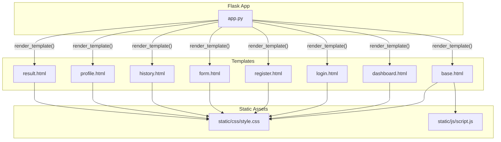
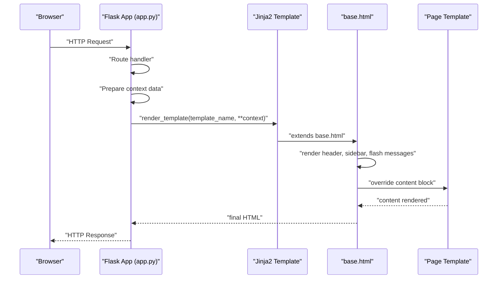
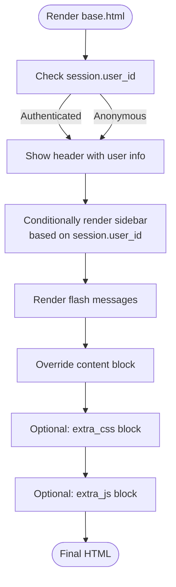
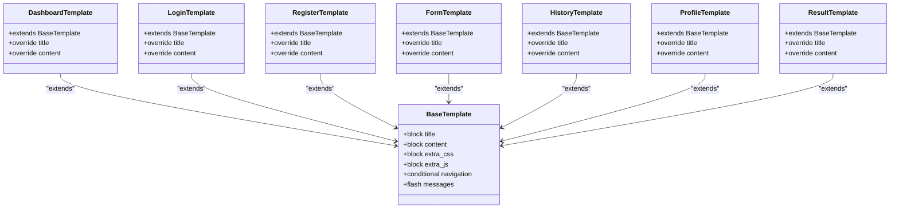
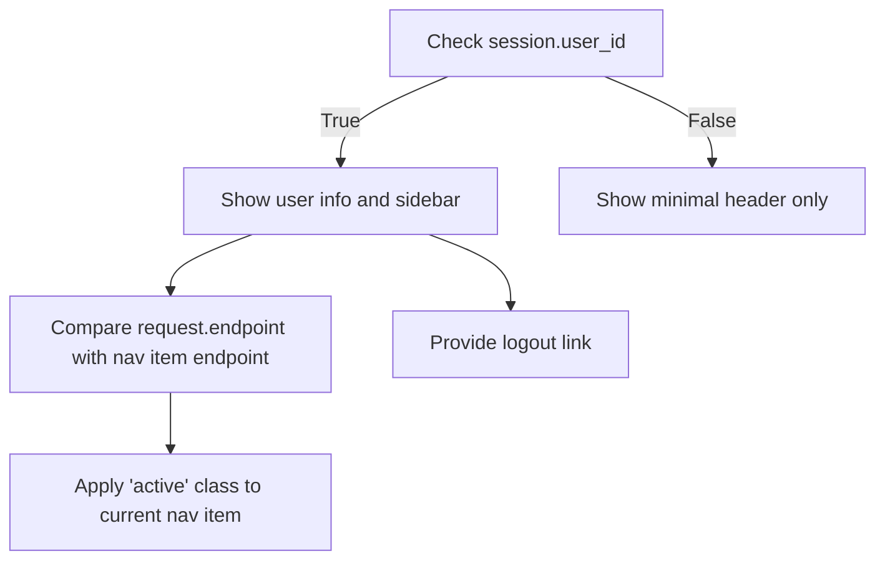
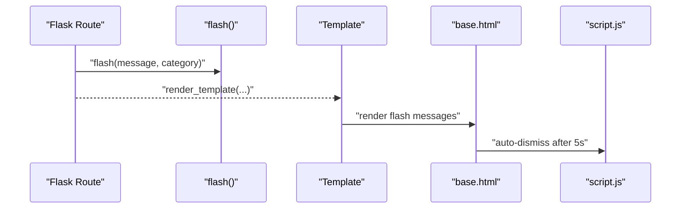
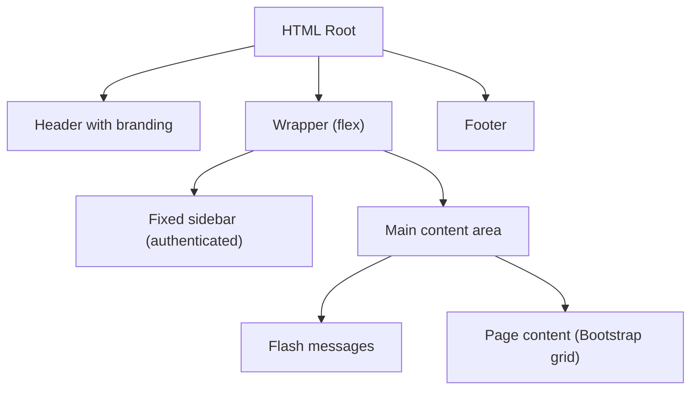
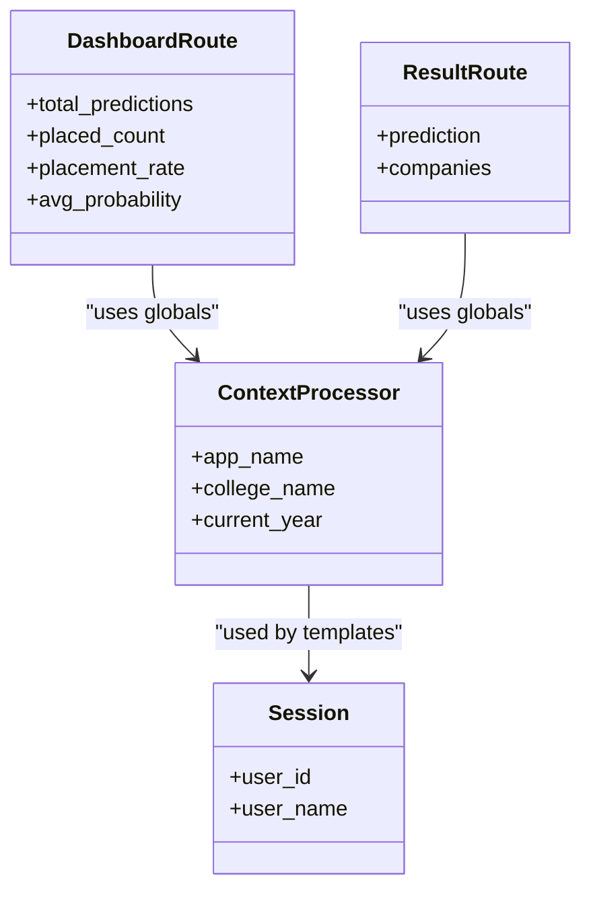
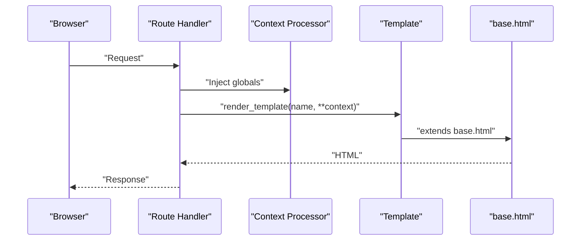
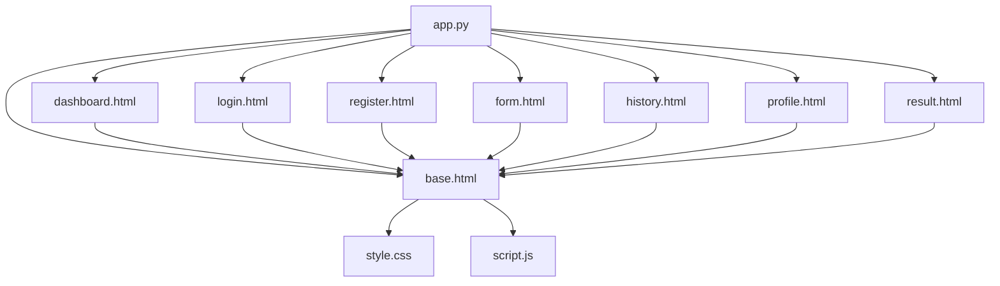

# Template System

<cite>
**Referenced Files in This Document**
- [base.html](file://templates/base.html)
- [dashboard.html](file://templates/dashboard.html)
- [login.html](file://templates/login.html)
- [register.html](file://templates/register.html)
- [form.html](file://templates/form.html)
- [history.html](file://templates/history.html)
- [profile.html](file://templates/profile.html)
- [result.html](file://templates/result.html)
- [app.py](file://app.py)
- [style.css](file://static/css/style.css)
- [script.js](file://static/js/script.js)
</cite>

## Table of Contents
1. [Introduction](#introduction)
2. [Project Structure](#project-structure)
3. [Core Components](#core-components)
4. [Architecture Overview](#architecture-overview)
5. [Detailed Component Analysis](#detailed-component-analysis)
6. [Dependency Analysis](#dependency-analysis)
7. [Performance Considerations](#performance-considerations)
8. [Troubleshooting Guide](#troubleshooting-guide)
9. [Conclusion](#conclusion)

## Introduction
This document explains the Jinja2 template system and template inheritance pattern used in the Flask application. It covers the base.html master template structure with block inheritance (title, content, and extra_css/js), how individual page templates extend the base and override specific blocks, the conditional navigation system using session variables, the flash message system for notifications, the responsive layout built with Bootstrap grid classes, and the template variable system including app_name, college_name, current_year, and session data. It also provides practical guidance for creating new templates and extending existing ones.

## Project Structure
The project organizes templates under the templates directory and static assets under static/css and static/js. The Flask application (app.py) defines routes and renders templates, while templates/base.html provides the shared layout and reusable components.

**Diagram sources**
- [base.html](file://templates/base.html)
- [dashboard.html](file://templates/dashboard.html)
- [login.html](file://templates/login.html)
- [register.html](file://templates/register.html)
- [form.html](file://templates/form.html)
- [history.html](file://templates/history.html)
- [profile.html](file://templates/profile.html)
- [result.html](file://templates/result.html)
- [app.py](file://app.py)
- [style.css](file://static/css/style.css)
- [script.js](file://static/js/script.js)

**Section sources**
- [app.py](file://app.py)
- [base.html](file://templates/base.html)

## Core Components
- Base template (base.html): Defines the HTML skeleton, meta tags, Bootstrap integration, custom CSS/JS injection points, header with branding and user info, sidebar navigation for authenticated users, main content area, flash messages, and footer.
- Page templates (dashboard.html, login.html, register.html, form.html, history.html, profile.html, result.html): Extend base.html and override the title and content blocks. They may also override extra_css or extra_js blocks when needed.
- Context processor (app.py): Injects global variables (app_name, college_name, current_year) into all templates.
- Session-based conditional rendering: Uses session variables to conditionally show user info, sidebar, and active nav items.
- Flash messages: Uses Flask’s get_flashed_messages with categories to render Bootstrap-styled alerts.
- Responsive layout: Uses Bootstrap grid classes (container-fluid, row, col-*) and custom CSS for responsiveness.

**Section sources**
- [base.html](file://templates/base.html)
- [dashboard.html](file://templates/dashboard.html)
- [login.html](file://templates/login.html)
- [register.html](file://templates/register.html)
- [form.html](file://templates/form.html)
- [history.html](file://templates/history.html)
- [profile.html](file://templates/profile.html)
- [result.html](file://templates/result.html)
- [app.py](file://app.py)
- [style.css](file://static/css/style.css)

## Architecture Overview
The Flask application orchestrates routing and template rendering. Each route prepares data and calls render_template with a template name. Templates extend base.html and define their own content. The base template handles shared UI and conditional logic.

**Diagram sources**
- [app.py](file://app.py)
- [base.html](file://templates/base.html)
- [dashboard.html](file://templates/dashboard.html)
- [login.html](file://templates/login.html)
- [register.html](file://templates/register.html)
- [form.html](file://templates/form.html)
- [history.html](file://templates/history.html)
- [profile.html](file://templates/profile.html)
- [result.html](file://templates/result.html)

## Detailed Component Analysis

### Base Template (base.html)
- Block inheritance:
  - title: Provides a default title using app_name; pages override with page-specific titles.
  - content: Placeholder for page-specific content.
  - extra_css and extra_js: Extension points for page-specific styles/scripts.
- Conditional navigation:
  - Sidebar and active nav items depend on session.user_id and request.endpoint.
  - User info displays session.user_name when authenticated.
- Flash messages:
  - Iterates over get_flashed_messages(with_categories=true) and renders Bootstrap alerts with icons and dismiss buttons.
- Responsive layout:
  - Uses container-fluid, row, and col-* classes for responsive grid.
  - Custom CSS adjusts layout for mobile and desktop.
- External resources:
  - Bootstrap 5 CSS/JS and icons.
  - Custom static CSS and JS via url_for.

**Diagram sources**
- [base.html](file://templates/base.html)

**Section sources**
- [base.html](file://templates/base.html)
- [style.css](file://static/css/style.css)

### Page Templates and Inheritance Patterns
- All page templates extend base.html and override:
  - title: Sets a page-specific title that includes app_name.
  - content: Defines the page body content using Bootstrap grid classes.
- Some templates include page-specific inline styles and scripts (e.g., login.html, register.html, form.html, history.html, profile.html, result.html).
- Example inheritance pattern:
  - Page template declares .
  - Overrides  ...  and  ... .
  - Optionally overrides  or .

**Diagram sources**
- [base.html](file://templates/base.html)
- [dashboard.html](file://templates/dashboard.html)
- [login.html](file://templates/login.html)
- [register.html](file://templates/register.html)
- [form.html](file://templates/form.html)
- [history.html](file://templates/history.html)
- [profile.html](file://templates/profile.html)
- [result.html](file://templates/result.html)

**Section sources**
- [dashboard.html](file://templates/dashboard.html)
- [login.html](file://templates/login.html)
- [register.html](file://templates/register.html)
- [form.html](file://templates/form.html)
- [history.html](file://templates/history.html)
- [profile.html](file://templates/profile.html)
- [result.html](file://templates/result.html)

### Conditional Navigation System (Session-Based)
- Authentication checks:
  -  controls visibility of user info and sidebar.
- Active navigation highlighting:
  - Nav items compare request.endpoint to current page endpoint to apply active class.
- Logout link:
  - Links to the logout route which clears the session and flashes an info message.

**Diagram sources**
- [base.html](file://templates/base.html)

**Section sources**
- [base.html](file://templates/base.html)

### Flash Message System
- Rendering:
  -  iterates over flashed messages.
  - For each message, a Bootstrap alert is rendered with category-specific styling and an icon.
- Categories:
  - Success, warning, error, info are mapped to alert-* classes and icons.
- Dismissible behavior:
  - Bootstrap dismiss button included; JavaScript auto-dismisses alerts after 5 seconds.

**Diagram sources**
- [base.html](file://templates/base.html)
- [script.js](file://static/js/script.js)

**Section sources**
- [base.html](file://templates/base.html)
- [script.js](file://static/js/script.js)

### Responsive Layout and Bootstrap Grid Integration
- Base layout:
  - Uses container-fluid, row, and col-md-* classes for responsive columns.
  - Custom CSS defines variables for sidebar width, header/footer heights, and responsive breakpoints.
- Page templates:
  - Employ grid classes (col-md-*, col-sm-*, col-*) to structure content.
  - Inline styles in page templates demonstrate additional customization while maintaining Bootstrap classes.
- Mobile behavior:
  - Sidebar transforms off-canvas on small screens; JavaScript toggles sidebar visibility.

**Diagram sources**
- [base.html](file://templates/base.html)
- [style.css](file://static/css/style.css)

**Section sources**
- [base.html](file://templates/base.html)
- [style.css](file://static/css/style.css)

### Template Variable System
- Global variables injected via context processor:
  - app_name: Portal name.
  - college_name: Institution name.
  - current_year: Current year for footer.
- Session data:
  - session.user_id and session.user_name are used for conditional rendering and user info.
- Route-provided variables:
  - Pages receive variables from routes (e.g., dashboard passes user stats; result passes prediction and companies).

**Diagram sources**
- [app.py](file://app.py)
- [base.html](file://templates/base.html)

**Section sources**
- [app.py](file://app.py)
- [base.html](file://templates/base.html)

### Integration Between Flask Routes and Template Rendering
- Routes prepare data and call render_template with template name and context variables.
- Error handlers render base.html with an error message.
- Context processor ensures global variables are available to all templates.

**Diagram sources**
- [app.py](file://app.py)
- [base.html](file://templates/base.html)

**Section sources**
- [app.py](file://app.py)

### Creating New Templates and Extending Existing Ones
- Steps to create a new page template:
  - Create a new .html file under templates/.
  - Add  at the top.
  - Override  and .
  - Optionally override  or  if needed.
  - Reference Bootstrap classes for layout and styling.
- Guidance:
  - Reuse base.html blocks to maintain consistency.
  - Use session variables for conditional rendering.
  - Use flash messages for feedback.
  - Leverage global variables (app_name, college_name, current_year) for branding.

**Section sources**
- [base.html](file://templates/base.html)
- [dashboard.html](file://templates/dashboard.html)
- [login.html](file://templates/login.html)
- [register.html](file://templates/register.html)
- [form.html](file://templates/form.html)
- [history.html](file://templates/history.html)
- [profile.html](file://templates/profile.html)
- [result.html](file://templates/result.html)

## Dependency Analysis
- Template dependencies:
  - All page templates depend on base.html for shared layout and blocks.
  - Page templates may depend on each other indirectly via shared patterns (e.g., grid usage).
- Runtime dependencies:
  - Flask app depends on render_template and context processor to supply variables.
  - Static assets (CSS/JS) are linked from base.html and page templates.

**Diagram sources**
- [app.py](file://app.py)
- [base.html](file://templates/base.html)
- [dashboard.html](file://templates/dashboard.html)
- [login.html](file://templates/login.html)
- [register.html](file://templates/register.html)
- [form.html](file://templates/form.html)
- [history.html](file://templates/history.html)
- [profile.html](file://templates/profile.html)
- [result.html](file://templates/result.html)
- [style.css](file://static/css/style.css)
- [script.js](file://static/js/script.js)

**Section sources**
- [app.py](file://app.py)
- [base.html](file://templates/base.html)

## Performance Considerations
- Minimize heavy computations in templates; pass precomputed data from routes.
- Use efficient loops and filters (e.g., selectattr, map, sum) judiciously.
- Keep extra_css/extra_js blocks minimal to reduce asset overhead.
- Leverage Bootstrap utility classes to avoid excessive custom CSS.

## Troubleshooting Guide
- Flash messages not appearing:
  - Ensure flash() is called in the route before render_template.
  - Verify base.html includes the flash rendering block.
- Navigation not highlighting:
  - Confirm request.endpoint matches the nav item endpoint.
  - Ensure session.user_id is present for authenticated views.
- Styles not loading:
  - Check url_for('static', filename='css/style.css') resolves correctly.
  - Verify custom CSS selectors match the intended elements.
- Responsive layout issues:
  - Confirm Bootstrap grid classes are used consistently.
  - Review media queries in style.css for breakpoint adjustments.

**Section sources**
- [base.html](file://templates/base.html)
- [app.py](file://app.py)
- [style.css](file://static/css/style.css)

## Conclusion
The Jinja2 template system in this project follows a clean inheritance pattern centered on base.html, enabling consistent layouts and easy customization per page. Session-based conditional rendering and the flash message system provide a cohesive user experience. Bootstrap grid classes and custom CSS deliver a responsive design. By leveraging the context processor and following the established inheritance patterns, developers can quickly create new templates and extend existing ones while maintaining design consistency and performance.