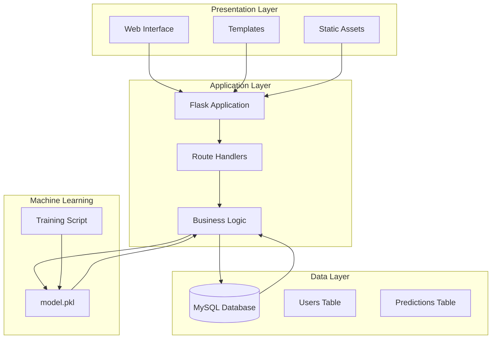

# Getting Started

<cite>
**Referenced Files in This Document**
- [app.py](file://app.py)
- [requirements.txt](file://requirements.txt)
- [train_model.py](file://train_model.py)
- [database.sql](file://database/database.sql)
- [base.html](file://templates/base.html)
- [style.css](file://static/css/style.css)
- [script.js](file://static/js/script.js)
</cite>

## Table of Contents
1. [Introduction](#introduction)
2. [Prerequisites](#prerequisites)
3. [Installation](#installation)
4. [Environment Setup](#environment-setup)
5. [Initial Model Setup](#initial-model-setup)
6. [Verification](#verification)
7. [Architecture Overview](#architecture-overview)
8. [Common Installation Issues and Solutions](#common-installation-issues-and-solutions)
9. [Conclusion](#conclusion)

## Introduction
The Student Placement Prediction Portal is a Flask-based web application that helps students predict their placement outcomes using machine learning. The application features user authentication, prediction forms, historical tracking, and company suggestions based on predicted probabilities. It integrates a trained machine learning model with a MySQL database backend and a responsive web interface.

## Prerequisites
Before installing the Student Placement Prediction Portal, ensure your system meets the following requirements:

### Python Environment
- Python 3.7 or higher (recommended: Python 3.8+)
- pip package manager (comes with Python installation)
- Virtual environment support (recommended for project isolation)

### Database Requirements
- MySQL Server 5.7 or higher
- MySQL client libraries for Python
- Administrative privileges to create databases and users

### System Dependencies
- Git (for cloning the repository)
- Basic development tools (compiler toolchain for building native extensions)

**Section sources**
- [requirements.txt:5-27](file://requirements.txt#L5-L27)
- [app.py:18-23](file://app.py#L18-L23)

## Installation

### Step 1: Clone the Repository
Clone the project repository to your local machine using Git:

```bash
git clone https://github.com/your-username/student-placement-prediction.git
cd student-placement-prediction
```

### Step 2: Create a Virtual Environment
It's recommended to create a virtual environment to isolate project dependencies:

```bash
# On Windows
python -m venv venv
venv\Scripts\activate

# On macOS/Linux
python3 -m venv venv
source venv/bin/activate
```

### Step 3: Install Python Dependencies
Install all required Python packages using pip:

```bash
pip install -r requirements.txt
```

This command installs:
- Flask web framework and extensions
- MySQL database connectors
- Machine learning libraries (scikit-learn, numpy, pandas)
- Data serialization (joblib)
- Security utilities (bcrypt, Werkzeug)
- Environment variable support (python-dotenv)

**Section sources**
- [requirements.txt:1-27](file://requirements.txt#L1-L27)

## Environment Setup

### Step 1: Configure Database Connection
Open the main application file and update the database configuration settings:

1. Locate the configuration section in `app.py`
2. Update the following settings:
   - `MYSQL_HOST`: Database server hostname (default: localhost)
   - `MYSQL_USER`: Database username (default: root)
   - `MYSQL_PASSWORD`: Database password (leave empty if no password)
   - `MYSQL_DB`: Database name (default: placement_portal)

Example configuration:
```python
app.config['MYSQL_HOST'] = 'localhost'
app.config['MYSQL_USER'] = 'your_mysql_username'
app.config['MYSQL_PASSWORD'] = 'your_mysql_password'
app.config['MYSQL_DB'] = 'placement_portal'
```

### Step 2: Set Up Database Schema
Run the database schema SQL file to create the required tables:

1. Connect to your MySQL server using a MySQL client
2. Execute the SQL commands from `database/database.sql`
3. Verify that two tables are created:
   - `users`: Stores user registration data
   - `predictions`: Stores prediction history and results

The schema includes:
- Primary keys and foreign key relationships
- Unique constraints on email addresses
- Timestamp fields for record creation/update
- Appropriate data types for all fields

### Step 3: Configure Application Settings
Set up additional application configurations:

1. **Secret Key**: Update the SECRET_KEY for session security
2. **Debug Mode**: Set debug mode for development (disable in production)
3. **Host Binding**: Configure host binding for network access

**Section sources**
- [app.py:18-23](file://app.py#L18-L23)
- [database.sql:4-35](file://database/database.sql#L4-L35)

## Initial Model Setup

### Step 1: Train the Machine Learning Model
The application requires a pre-trained model file (`model.pkl`) to make predictions. Run the training script:

```bash
python train_model.py
```

This script performs the following operations:
1. Creates a synthetic dataset similar to campus recruitment data
2. Preprocesses the data (encoding categorical variables, scaling features)
3. Trains a Logistic Regression model
4. Evaluates model performance
5. Saves the trained model and preprocessing objects to `model.pkl`

### Step 2: Verify Model Generation
After successful execution, verify that `model.pkl` exists in the project root directory. The model contains:
- Trained machine learning model
- Feature scaler for normalization
- Label encoders for categorical data
- Feature column names

### Step 3: Test Model Loading
The application automatically attempts to load the model when starting. Check the console output for:
- Success message indicating model loaded
- Warning message if model file is missing

**Section sources**
- [train_model.py:109-196](file://train_model.py#L109-L196)
- [app.py:28-39](file://app.py#L28-L39)

## Verification

### Step 1: Start the Application
Launch the Flask application:

```bash
python app.py
```

The application starts on `http://localhost:5000` by default.

### Step 2: Access the Web Interface
Open your web browser and navigate to:
- Home page: `http://localhost:5000`
- Dashboard: `http://localhost:5000/dashboard` (requires login)

### Step 3: Test Core Functionality
Verify the following features work correctly:

1. **User Registration**
   - Navigate to registration page
   - Submit valid user data
   - Verify successful registration message

2. **User Login**
   - Log in with registered credentials
   - Access protected dashboard pages

3. **Prediction System**
   - Fill out the prediction form
   - Submit form data
   - View prediction results with probability
   - Check prediction history

4. **Database Integration**
   - Verify user data stored in `users` table
   - Check prediction records in `predictions` table
   - Confirm foreign key relationships

### Step 4: Monitor Application Logs
Check the console output for:
- Successful database connections
- Model loading status
- Error messages during operation
- Request handling information

**Section sources**
- [app.py:126-394](file://app.py#L126-L394)

## Architecture Overview

The Student Placement Prediction Portal follows a layered architecture pattern:



**Diagram sources**
- [app.py:1-13](file://app.py#L1-L13)
- [database.sql:9-35](file://database/database.sql#L9-L35)
- [train_model.py:17-55](file://train_model.py#L17-L55)

### Component Responsibilities

**Web Interface Layer**
- Provides responsive user interface using Bootstrap
- Handles user interactions and form submissions
- Manages navigation and session state
- Displays prediction results and historical data

**Application Logic Layer**
- Implements Flask route handlers for different pages
- Manages user authentication and session handling
- Coordinates between database operations and ML model
- Processes form data and generates predictions

**Data Management Layer**
- Manages MySQL database connections
- Handles CRUD operations for users and predictions
- Maintains referential integrity between tables
- Provides data persistence for application state

**Machine Learning Integration**
- Loads pre-trained model for predictions
- Performs feature scaling and encoding
- Generates placement probability estimates
- Suggests suitable companies based on probability

**Section sources**
- [base.html:1-128](file://templates/base.html#L1-L128)
- [style.css:1-492](file://static/css/style.css#L1-L492)
- [script.js:1-281](file://static/js/script.js#L1-L281)

## Common Installation Issues and Solutions

### Issue 1: MySQL Connection Errors
**Problem**: Application fails to connect to MySQL database
**Symptoms**: Error messages about connection refused or access denied
**Solutions**:
1. Verify MySQL service is running
2. Check database credentials in configuration
3. Ensure database `placement_portal` exists
4. Verify user has proper permissions

### Issue 2: Missing Model File
**Problem**: Application cannot find `model.pkl` file
**Symptoms**: Warning message about model not found during startup
**Solutions**:
1. Run `python train_model.py` to generate the model
2. Verify `model.pkl` exists in project root
3. Check file permissions for read access

### Issue 3: Dependency Installation Failures
**Problem**: pip installation fails for specific packages
**Symptoms**: Compilation errors for packages requiring native extensions
**Solutions**:
1. Install Microsoft Visual C++ Build Tools (Windows)
2. Install gcc/g++ (macOS/Linux)
3. Upgrade pip, setuptools, and wheel
4. Use conda-forge channel for problematic packages

### Issue 4: Port Already in Use
**Problem**: Application cannot bind to port 5000
**Symptoms**: Address already in use error
**Solutions**:
1. Change port in application configuration
2. Stop process using port 5000
3. Use different port (e.g., 5001)

### Issue 5: Template Rendering Errors
**Problem**: HTML templates fail to render properly
**Symptoms**: TemplateNotFound errors or rendering issues
**Solutions**:
1. Verify template files exist in `templates/` directory
2. Check file permissions for template access
3. Ensure Flask can locate template directory

### Issue 6: Static Asset Loading Problems
**Problem**: CSS and JavaScript files not loading
**Symptoms**: Unstyled pages or JavaScript errors
**Solutions**:
1. Verify static files exist in `static/` directory
2. Check file permissions for static access
3. Clear browser cache and reload page

**Section sources**
- [app.py:384-394](file://app.py#L384-L394)
- [requirements.txt:1-27](file://requirements.txt#L1-L27)

## Conclusion
The Student Placement Prediction Portal provides a comprehensive solution for students to predict their placement outcomes using machine learning. By following the installation steps outlined above, you can successfully deploy the application with proper database configuration, model setup, and environment preparation.

Key success factors include:
- Proper Python environment setup with virtual environments
- Correct MySQL database configuration and schema deployment
- Complete installation of all required dependencies
- Successful training and validation of the machine learning model
- Thorough testing of all application features

For production deployment, remember to:
- Change the default SECRET_KEY to a secure random value
- Disable debug mode
- Configure proper logging and error handling
- Set up proper database backup and security measures
- Consider using a production WSGI server like Gunicorn

The application's modular architecture ensures maintainability and extensibility, making it suitable for educational institutions and placement cell management systems.