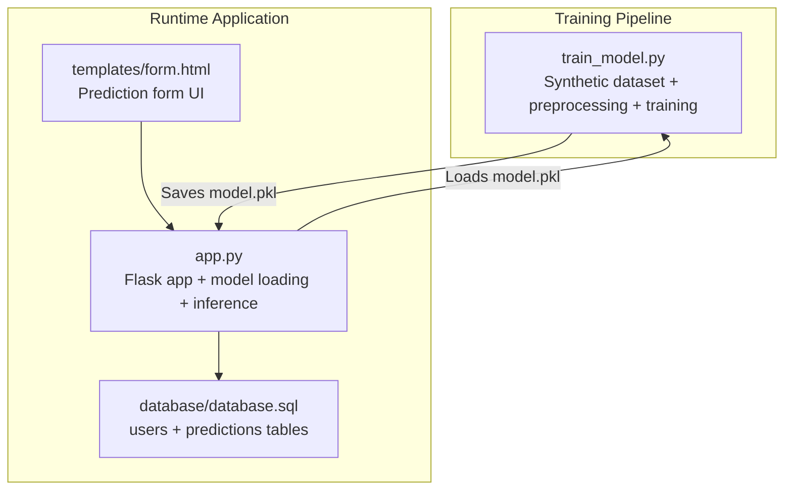
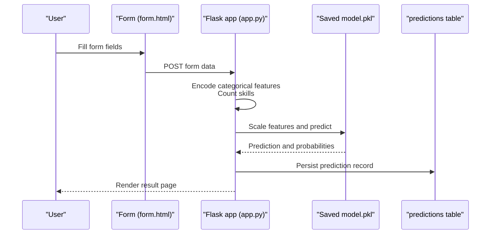
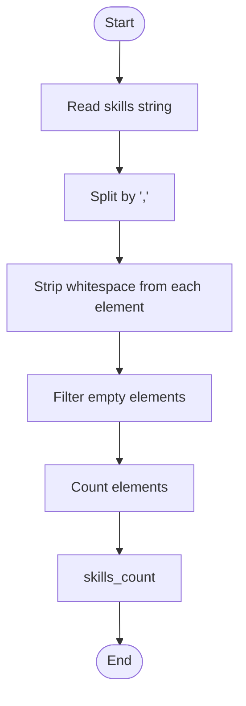
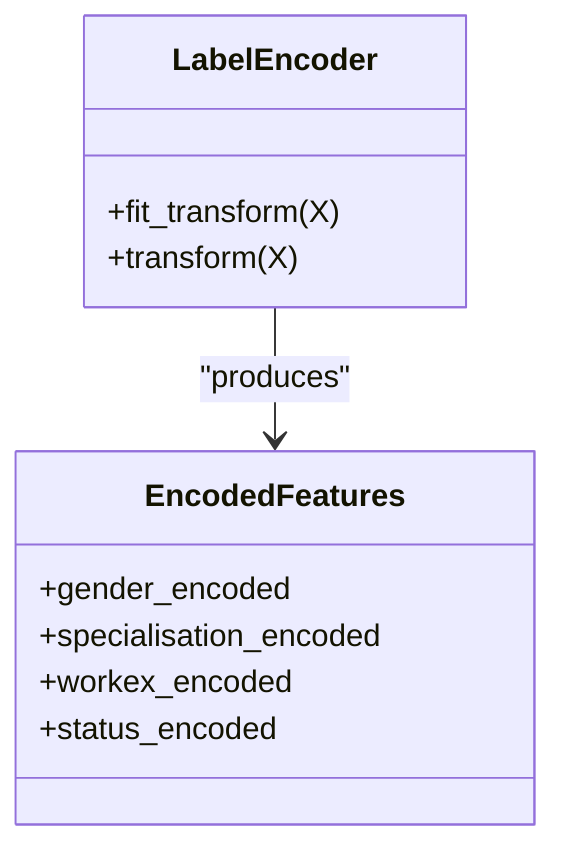
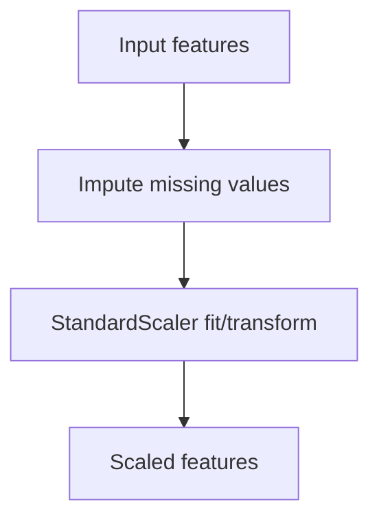
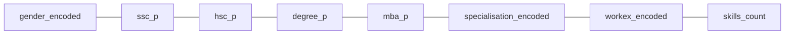
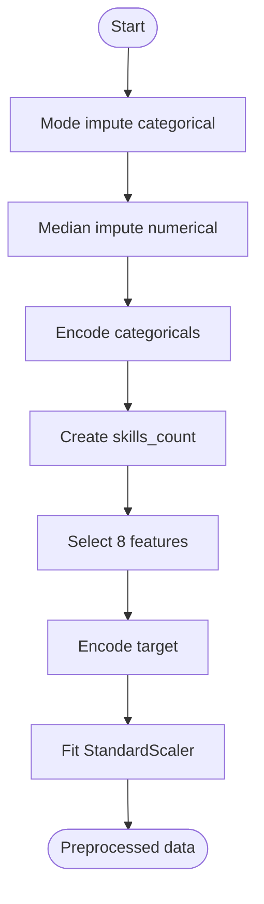
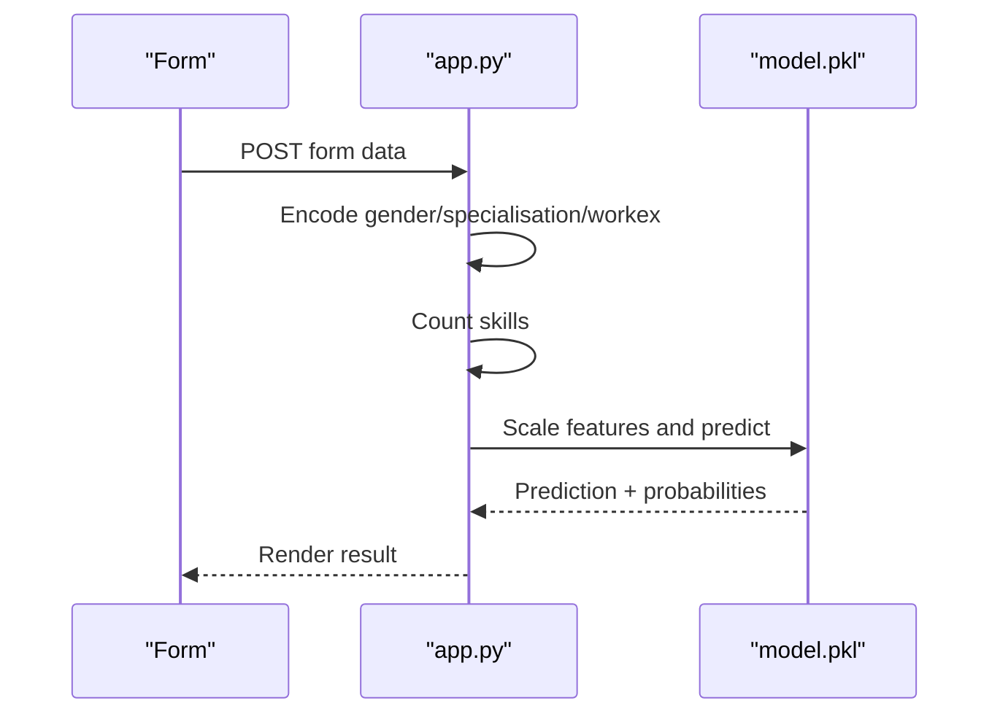
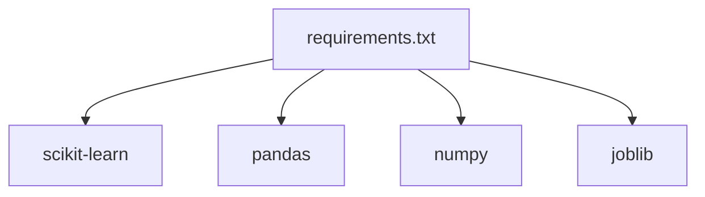

# Feature Engineering

<cite>
**Referenced Files in This Document**
- [train_model.py](file://train_model.py)
- [app.py](file://app.py)
- [requirements.txt](file://requirements.txt)
- [database/database.sql](file://database/database.sql)
- [templates/form.html](file://templates/form.html)
</cite>

## Table of Contents
1. [Introduction](#introduction)
2. [Project Structure](#project-structure)
3. [Core Components](#core-components)
4. [Architecture Overview](#architecture-overview)
5. [Detailed Component Analysis](#detailed-component-analysis)
6. [Dependency Analysis](#dependency-analysis)
7. [Performance Considerations](#performance-considerations)
8. [Troubleshooting Guide](#troubleshooting-guide)
9. [Conclusion](#conclusion)

## Introduction
This document explains the feature engineering pipeline used in the placement prediction system. It covers how raw inputs are transformed into a standardized feature matrix suitable for machine learning, including:
- Parsing and counting skills from a comma-separated string
- Encoding categorical variables
- Handling missing values
- Scaling numerical features
- Selecting the eight key features used for model training
- Interpreting feature importance from the trained model

## Project Structure
The placement prediction system consists of:
- A training script that builds a synthetic dataset, performs preprocessing, trains a logistic regression model, and persists it for runtime use
- A Flask application that loads the saved model and serves predictions
- A database schema to persist user and prediction history
- HTML templates for the prediction form

**Diagram sources**
- [train_model.py:109-192](file://train_model.py#L109-L192)
- [app.py:28-39](file://app.py#L28-L39)
- [database/database.sql:19-35](file://database/database.sql#L19-L35)
- [templates/form.html:12-227](file://templates/form.html#L12-L227)

**Section sources**
- [train_model.py:109-192](file://train_model.py#L109-L192)
- [app.py:28-39](file://app.py#L28-L39)
- [database/database.sql:19-35](file://database/database.sql#L19-L35)
- [templates/form.html:12-227](file://templates/form.html#L12-L227)

## Core Components
This section outlines the feature engineering steps implemented in the training pipeline and how they are mirrored at runtime.

- Synthetic dataset creation with features: gender, 10th percentage, 12th percentage, degree percentage, MBA percentage, specialization, work experience, and skills
- Missing value handling:
  - Mode imputation for categorical variables
  - Median imputation for numerical variables
- Categorical encoding:
  - LabelEncoder for gender, specialization, work experience, and target status
- Numerical feature processing:
  - Percentages normalized implicitly by StandardScaler (mean centering and unit variance)
- Composite feature creation:
  - Skills count derived from splitting the comma-separated skills string
- Feature selection:
  - Eight features used for training: gender_encoded, ssc_p, hsc_p, degree_p, mba_p, specialisation_encoded, workex_encoded, skills_count
- Model evaluation and saving:
  - Accuracy, classification report, confusion matrix, and coefficients for interpretability
  - Saved model artifacts: model, scaler, label encoders, and feature column names

**Section sources**
- [train_model.py:19-55](file://train_model.py#L19-L55)
- [train_model.py:57-107](file://train_model.py#L57-L107)
- [train_model.py:109-192](file://train_model.py#L109-L192)

## Architecture Overview
The feature engineering pipeline spans two stages: training-time preprocessing and runtime preprocessing.

**Diagram sources**
- [templates/form.html:12-227](file://templates/form.html#L12-L227)
- [app.py:60-109](file://app.py#L60-L109)
- [app.py:245-291](file://app.py#L245-L291)
- [database/database.sql:19-35](file://database/database.sql#L19-L35)

## Detailed Component Analysis

### Skills String Parsing and Counting
Skills are provided as a comma-separated string. The pipeline:
- Splits the string by commas
- Strips whitespace around each skill
- Counts the number of skills as a numeric feature

**Diagram sources**
- [train_model.py:94-95](file://train_model.py#L94-L95)
- [app.py:84-86](file://app.py#L84-L86)

**Section sources**
- [train_model.py:94-95](file://train_model.py#L94-L95)
- [app.py:84-86](file://app.py#L84-L86)

### Categorical Variable Encoding Strategy
Categorical variables are encoded using LabelEncoder:
- Gender: Male vs Female mapped to numeric codes
- Specialization: Marketing & HR vs Marketing & Finance mapped to numeric codes
- Work Experience: Yes vs No mapped to numeric codes
- Target Status: Placed vs Not Placed mapped to numeric codes

Encoding rationale:
- LabelEncoder preserves ordinal-like relationships among categories when present
- It produces integer labels suitable for logistic regression
- Encoders are persisted alongside the model for consistent runtime transformation

**Diagram sources**
- [train_model.py:82-92](file://train_model.py#L82-L92)
- [train_model.py:104-105](file://train_model.py#L104-L105)

**Section sources**
- [train_model.py:82-92](file://train_model.py#L82-L92)
- [train_model.py:104-105](file://train_model.py#L104-L105)

### Numerical Feature Processing and Scaling
Numerical features are:
- Academic percentages: ssc_p, hsc_p, degree_p, mba_p
- Skills count: skills_count (created from skills string)

Processing:
- Missing numerical values are imputed with the median
- Features are scaled using StandardScaler to mean zero and unit variance

Scaling formula:
- For each feature f, compute z = (f − mean(f)) / std(f)
- This ensures comparable influence across features regardless of units or scales

**Diagram sources**
- [train_model.py:67-77](file://train_model.py#L67-L77)
- [train_model.py:137-141](file://train_model.py#L137-L141)

**Section sources**
- [train_model.py:67-77](file://train_model.py#L67-L77)
- [train_model.py:137-141](file://train_model.py#L137-L141)

### Feature Selection and Composition
The eight-feature matrix used for training includes:
- gender_encoded
- ssc_p
- hsc_p
- degree_p
- mba_p
- specialisation_encoded
- workex_encoded
- skills_count

Rationale:
- Academic percentages reflect educational performance
- Gender and work experience capture demographic and professional background
- Specialization captures domain focus
- Skills count reflects breadth of technical competencies

**Diagram sources**
- [train_model.py:97-106](file://train_model.py#L97-L106)

**Section sources**
- [train_model.py:97-106](file://train_model.py#L97-L106)

### Preprocessing Pipeline Details
- Missing value handling:
  - Categorical columns: mode imputation
  - Numerical columns: median imputation
- Encoding:
  - LabelEncoder fitted on training data and applied consistently
- Scaling:
  - StandardScaler fitted on training features and applied to test features
- Feature matrix and target:
  - Selected features form X
  - Target status encoded to binary labels

**Diagram sources**
- [train_model.py:67-107](file://train_model.py#L67-L107)

**Section sources**
- [train_model.py:67-107](file://train_model.py#L67-L107)

### Feature Importance Analysis
After training, the model’s coefficients indicate feature importance:
- Coefficients are printed per feature
- Positive coefficients increase the log-odds of placement
- Negative coefficients decrease the log-odds of placement
- Magnitude indicates relative influence

Interpretation:
- Higher absolute coefficient magnitude implies stronger predictive power
- Sign indicates direction of effect (placement likelihood)

**Section sources**
- [train_model.py:170-174](file://train_model.py#L170-L174)

### Runtime Feature Engineering Consistency
At runtime, the Flask application mirrors the training-time transformations:
- Encodes categorical inputs using hard-coded mappings consistent with training
- Counts skills from the comma-separated string
- Applies the saved StandardScaler to the feature vector
- Uses the saved model to predict and compute probabilities

**Diagram sources**
- [app.py:60-109](file://app.py#L60-L109)
- [app.py:245-291](file://app.py#L245-L291)

**Section sources**
- [app.py:60-109](file://app.py#L60-L109)
- [app.py:245-291](file://app.py#L245-L291)

## Dependency Analysis
External libraries and their roles:
- scikit-learn: preprocessing (LabelEncoder, StandardScaler), modeling (LogisticRegression), metrics
- pandas/numpy: data manipulation and numerical operations
- joblib: serialization of model, scaler, and encoders
- Flask/mysql: web framework and database connectivity

**Diagram sources**
- [requirements.txt:13-19](file://requirements.txt#L13-L19)

**Section sources**
- [requirements.txt:13-19](file://requirements.txt#L13-L19)

## Performance Considerations
- StandardScaler improves convergence and stability for logistic regression
- Using median imputation reduces sensitivity to outliers compared to mean imputation
- LabelEncoder maintains simplicity and speed for small-cardinality categorical features
- Persisting preprocessing objects avoids recomputation and ensures consistency across runs

## Troubleshooting Guide
Common issues and resolutions:
- Model not found:
  - Ensure the training script has been executed to produce model.pkl
  - Verify the Flask app can locate model.pkl in the working directory
- Incorrect feature shapes:
  - Confirm the runtime feature vector matches the order and length of training features
  - Validate that skills_count is computed from the comma-separated string
- Encoding mismatches:
  - Ensure categorical mappings align with training encoders
  - Check that specialisation and workex values match training categories
- Database persistence:
  - Confirm the predictions table schema matches the insertion fields

**Section sources**
- [app.py:28-39](file://app.py#L28-L39)
- [database/database.sql:19-35](file://database/database.sql#L19-L35)

## Conclusion
The feature engineering pipeline transforms raw inputs into a standardized, scalable feature matrix. By encoding categoricals, imputing missing values, and creating composite features like skills_count, the system achieves robust predictions. The saved preprocessing artifacts enable consistent runtime transformations, while model coefficients provide interpretable insights into feature contributions to placement outcomes.