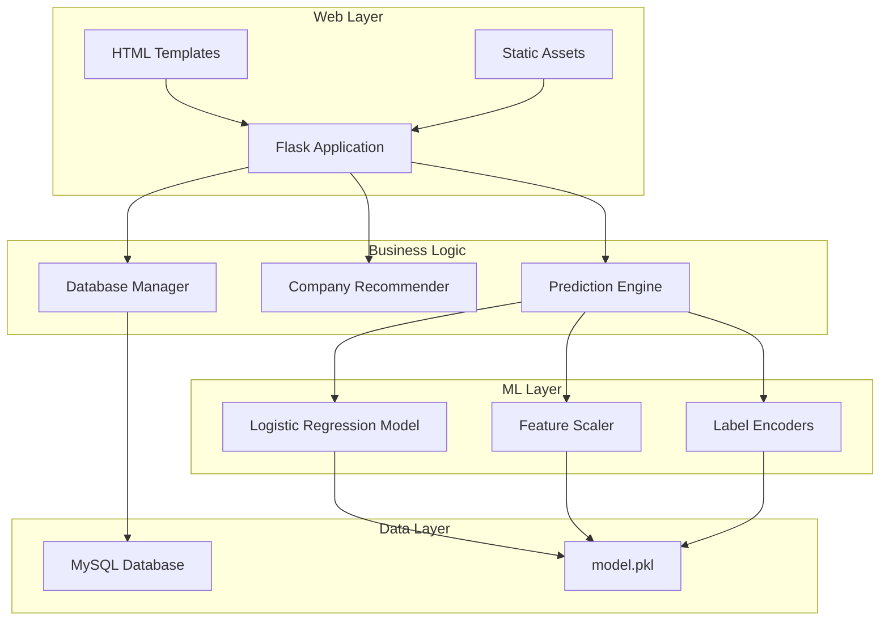
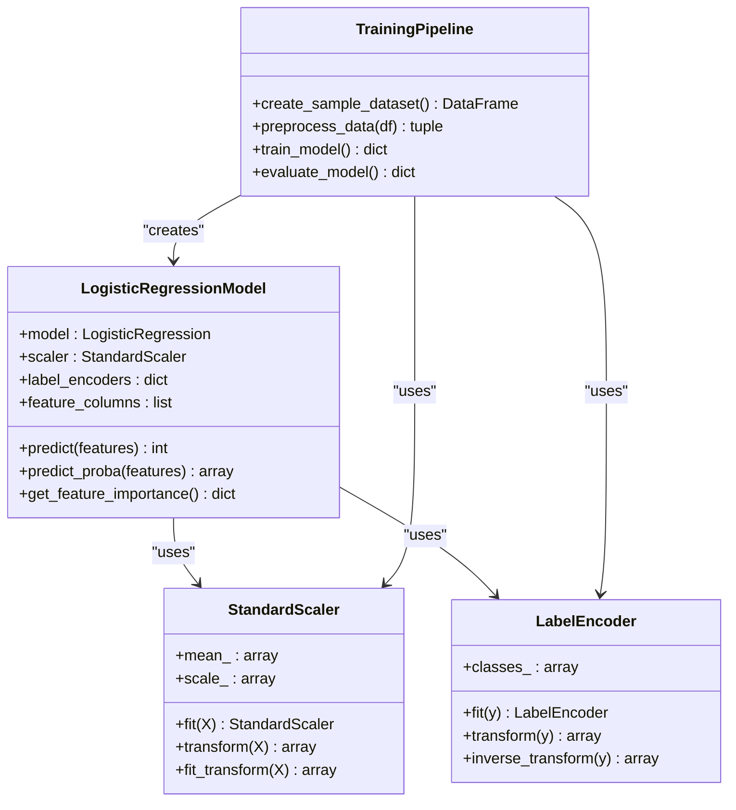
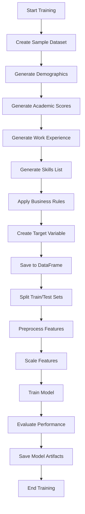
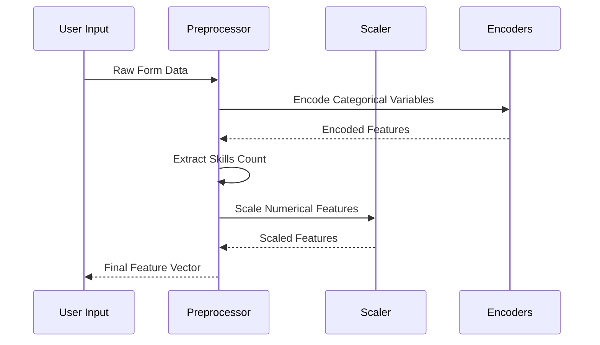
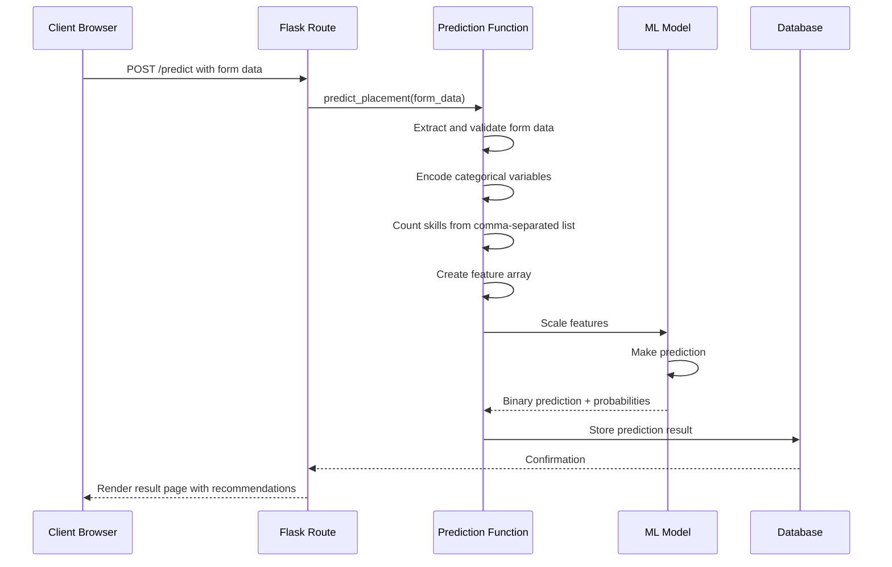
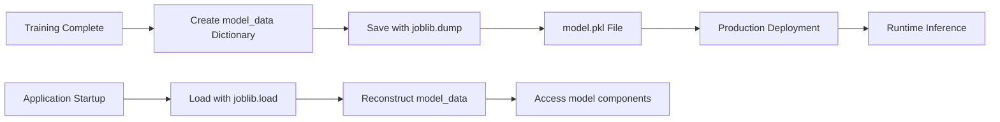
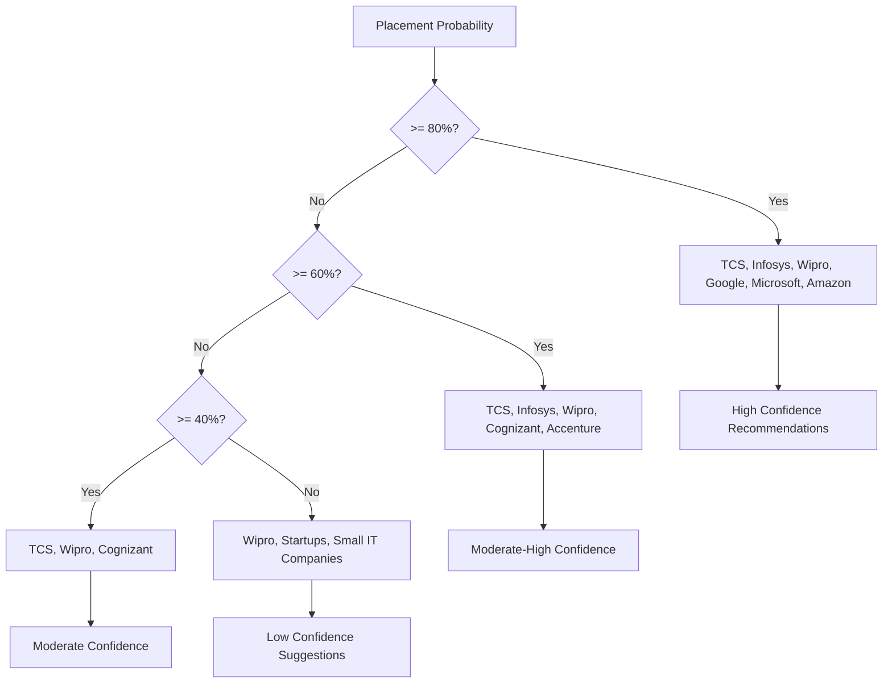
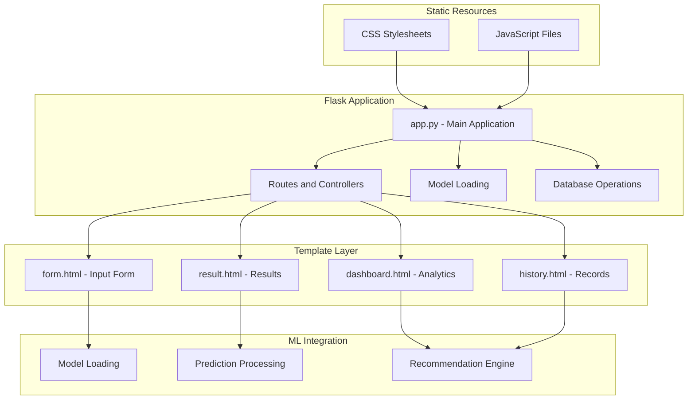
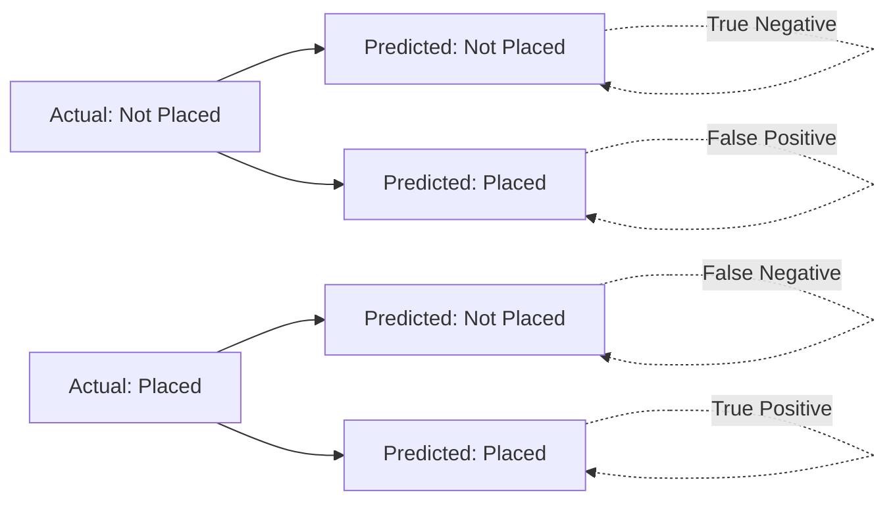

# Machine Learning System

<cite>
**Referenced Files in This Document**
- [app.py](file://app.py)
- [train_model.py](file://train_model.py)
- [requirements.txt](file://requirements.txt)
- [database.sql](file://database/database.sql)
- [form.html](file://templates/form.html)
- [result.html](file://templates/result.html)
- [dashboard.html](file://templates/dashboard.html)
- [history.html](file://templates/history.html)
- [profile.html](file://templates/profile.html)
- [base.html](file://templates/base.html)
</cite>

## Table of Contents
1. [Introduction](#introduction)
2. [System Architecture](#system-architecture)
3. [Model Architecture](#model-architecture)
4. [Training Pipeline](#training-pipeline)
5. [Feature Engineering](#feature-engineering)
6. [Preprocessing Pipeline](#preprocessing-pipeline)
7. [Prediction Processing Workflow](#prediction-processing-workflow)
8. [Model Persistence and Loading](#model-persistence-and-loading)
9. [Company Recommendation Algorithm](#company-recommendation-algorithm)
10. [Integration with Flask Application](#integration-with-flask-application)
11. [Performance Metrics and Evaluation](#performance-metrics-and-evaluation)
12. [Usage Examples](#usage-examples)
13. [Troubleshooting Guide](#troubleshooting-guide)
14. [Conclusion](#conclusion)

## Introduction

The Student Placement Prediction Portal is a comprehensive machine learning system designed to predict student placement outcomes based on academic performance, work experience, and skill profiles. The system integrates a Logistic Regression model with a Flask web application to provide real-time placement predictions and personalized company recommendations.

The platform serves as an educational tool for students to understand their placement prospects and receive actionable insights for career development. It combines sophisticated machine learning algorithms with an intuitive web interface built on modern web technologies.

## System Architecture

The system follows a modular architecture with clear separation between machine learning components and web application layers:



**Diagram sources**
- [app.py:28-394](file://app.py#L28-L394)
- [train_model.py:109-196](file://train_model.py#L109-L196)

The architecture consists of four main layers:
- **Web Layer**: Flask application handling HTTP requests and rendering templates
- **Business Logic**: Prediction engine and recommendation algorithms
- **ML Layer**: Trained model with preprocessing components
- **Data Layer**: Persistent storage for user data and model artifacts

**Section sources**
- [app.py:15-394](file://app.py#L15-L394)
- [train_model.py:109-196](file://train_model.py#L109-L196)

## Model Architecture

The machine learning model is built using Logistic Regression, a supervised learning algorithm well-suited for binary classification problems like placement prediction.

### Model Components



**Diagram sources**
- [train_model.py:109-196](file://train_model.py#L109-L196)
- [app.py:60-109](file://app.py#L60-L109)

### Model Specifications

The Logistic Regression model is configured with the following parameters:
- **Solver**: lbfgs (efficient for small to medium datasets)
- **Max Iterations**: 1000 (ensures convergence)
- **Random State**: 42 (reproducible results)
- **Regularization**: L2 (default, prevents overfitting)

The model produces two key outputs:
1. **Binary Prediction**: Placement status (Placed/Not Placed)
2. **Probability Scores**: Confidence levels for each class

**Section sources**
- [train_model.py:145-151](file://train_model.py#L145-L151)
- [app.py:96-104](file://app.py#L96-L104)

## Training Pipeline

The training pipeline follows a systematic approach to prepare data, train the model, and evaluate performance.

### Data Creation Process

The system generates synthetic campus recruitment data with realistic distributions:



**Diagram sources**
- [train_model.py:19-55](file://train_model.py#L19-L55)
- [train_model.py:117-196](file://train_model.py#L117-L196)

### Training Steps

1. **Dataset Creation**: Generates 250 synthetic records with realistic distributions
2. **Data Preprocessing**: Handles missing values and encodes categorical variables
3. **Feature Engineering**: Creates skill count features from comma-separated lists
4. **Model Training**: Uses 80% of data for training, 20% for testing
5. **Performance Evaluation**: Calculates accuracy, precision, recall, and F1-score
6. **Model Persistence**: Saves trained components for production use

**Section sources**
- [train_model.py:19-55](file://train_model.py#L19-L55)
- [train_model.py:117-196](file://train_model.py#L117-L196)

## Feature Engineering

The feature engineering process transforms raw input data into model-ready features while preserving meaningful information.

### Feature Categories

| Feature Type | Description | Processing Method |
|--------------|-------------|-------------------|
| **Categorical** | Gender, Work Experience, Specialization | Label Encoding (0/1) |
| **Numerical** | Academic percentages (10th, 12th, Degree, MBA) | Standard scaling |
| **Composite** | Skills list | Count extraction and normalization |

### Skills Feature Engineering

The skills feature undergoes specialized processing:

```mermaid
flowchart LR
A[Raw Skills Input] --> B[Parse Comma-Separated Values]
B --> C[Remove Whitespace]
C --> D[Count Individual Skills]
D --> E[Normalize Skill Count]
E --> F[Create Skills Count Feature]
G[Example: "Python, Java, SQL"] --> H[Split -> ["Python","Java","SQL"]]
H --> I[Count -> 3]
I --> F
```

**Diagram sources**
- [train_model.py:94-95](file://train_model.py#L94-L95)
- [app.py:84-86](file://app.py#L84-L86)

### Feature Selection

The final feature set includes:
1. Gender (encoded)
2. SSC Percentage (10th grade)
3. HSC Percentage (12th grade)
4. Degree Percentage
5. MBA Percentage
6. Specialization (encoded)
7. Work Experience (encoded)
8. Skills Count

**Section sources**
- [train_model.py:97-106](file://train_model.py#L97-L106)
- [app.py:88-90](file://app.py#L88-L90)

## Preprocessing Pipeline

The preprocessing pipeline ensures consistent data transformation between training and inference phases.

### Preprocessing Components



**Diagram sources**
- [train_model.py:57-107](file://train_model.py#L57-L107)
- [app.py:60-109](file://app.py#L60-L109)

### Processing Steps

1. **Categorical Encoding**: Converts text categories to numerical values
   - Gender: Male=1, Female=0
   - Work Experience: Yes=1, No=0
   - Specialization: Market&HR=0, Market&Finance=1

2. **Skills Count Extraction**: Transforms comma-separated skill lists into counts

3. **Feature Scaling**: Applies StandardScaler for numerical features

4. **Missing Value Handling**: Fills null values with appropriate statistics

**Section sources**
- [train_model.py:79-107](file://train_model.py#L79-L107)
- [app.py:74-93](file://app.py#L74-L93)

## Prediction Processing Workflow

The prediction workflow transforms user input through multiple processing stages to produce placement predictions.

### Complete Prediction Flow



**Diagram sources**
- [app.py:238-292](file://app.py#L238-L292)
- [app.py:60-109](file://app.py#L60-L109)

### Prediction Processing Steps

1. **Form Data Extraction**: Collects all user inputs from the prediction form
2. **Data Validation**: Ensures all required fields are present and valid
3. **Feature Encoding**: Converts categorical variables to model-compatible format
4. **Skills Processing**: Counts individual skills from comma-separated input
5. **Feature Array Creation**: Constructs numpy array for model input
6. **Model Inference**: Applies scaling and performs prediction
7. **Result Interpretation**: Converts model output to human-readable format

**Section sources**
- [app.py:245-292](file://app.py#L245-L292)
- [app.py:60-109](file://app.py#L60-L109)

## Model Persistence and Loading

The system uses joblib for efficient model serialization and deserialization.

### Model Storage Format

The trained model is stored as a single pickle file containing all necessary components:



**Diagram sources**
- [train_model.py:180-188](file://train_model.py#L180-L188)
- [app.py:28-39](file://app.py#L28-L39)

### Model Components Stored

The model.pkl file contains:
- **model**: Trained LogisticRegression instance
- **scaler**: StandardScaler for feature scaling
- **label_encoders**: Dictionary of fitted LabelEncoders
- **feature_columns**: List of feature names used during training

### Loading Mechanism

The Flask application implements robust error handling for model loading:

1. **Automatic Loading**: Model loads when application starts
2. **Error Handling**: Graceful degradation if model file is missing
3. **Global Access**: Model components are globally accessible
4. **Thread Safety**: Safe for concurrent request processing

**Section sources**
- [train_model.py:180-188](file://train_model.py#L180-L188)
- [app.py:28-39](file://app.py#L28-L39)

## Company Recommendation Algorithm

The company recommendation system provides personalized placement opportunities based on prediction confidence levels.

### Recommendation Thresholds



**Diagram sources**
- [app.py:110-123](file://app.py#L110-L123)

### Recommendation Logic

The algorithm uses probability-based thresholds to provide appropriate company suggestions:

- **80%+ Probability**: Elite tech companies and top-tier organizations
- **60%-79%**: Major IT companies and established firms
- **40%-59%**: Mid-tier companies and growing organizations
- **Below 40%**: Startups and smaller companies for experience building

### Recommendation Implementation

The recommendation system enhances user experience by providing actionable career guidance beyond simple placement prediction.

**Section sources**
- [app.py:110-123](file://app.py#L110-L123)

## Integration with Flask Application

The Flask application seamlessly integrates the machine learning model into a production web service.

### Application Architecture



**Diagram sources**
- [app.py:125-394](file://app.py#L125-L394)
- [form.html:12-136](file://templates/form.html#L12-L136)

### Key Integration Points

1. **Model Loading**: Centralized model initialization during application startup
2. **Route Handlers**: Dedicated endpoints for prediction and result display
3. **Template Integration**: Seamless data passing between backend and frontend
4. **Database Integration**: Persistent storage of prediction history
5. **Session Management**: User authentication and state management

### Error Handling and Validation

The application implements comprehensive error handling:
- **Model Loading**: Graceful fallback when model file is unavailable
- **Form Validation**: Client-side and server-side input validation
- **Database Operations**: Transaction-safe operations with proper error handling
- **Prediction Errors**: Robust error handling for model inference failures

**Section sources**
- [app.py:125-394](file://app.py#L125-L394)
- [form.html:211-225](file://templates/form.html#L211-L225)

## Performance Metrics and Evaluation

The system employs comprehensive evaluation techniques to assess model performance and reliability.

### Evaluation Metrics

The training pipeline calculates multiple performance metrics:

| Metric | Description | Formula |
|--------|-------------|---------|
| **Accuracy** | Overall correctness | (TP + TN) / (TP + TN + FP + FN) |
| **Precision** | True positives among predicted positives | TP / (TP + FP) |
| **Recall** | True positives among actual positives | TP / (TP + FN) |
| **F1-Score** | Harmonic mean of precision and recall | 2 × (Precision × Recall) / (Precision + Recall) |

### Confusion Matrix Analysis



**Diagram sources**
- [train_model.py:167-168](file://train_model.py#L167-L168)

### Feature Importance Analysis

The model provides insight into which features contribute most to placement predictions through coefficient analysis:

- **Academic Performance**: SSC, HSC, Degree, MBA percentages
- **Experience**: Work experience indicator
- **Demographics**: Gender
- **Skills**: Skills count feature

### Performance Monitoring

The system tracks user interaction metrics:
- **Average Prediction Probability**: Overall placement likelihood
- **Placement Rate**: Percentage of positive predictions
- **Prediction Volume**: Total number of predictions processed

**Section sources**
- [train_model.py:161-174](file://train_model.py#L161-L174)
- [app.py:134-167](file://app.py#L134-L167)

## Usage Examples

### Model Training Example

To train the model with synthetic data:

1. **Install Dependencies**: `pip install -r requirements.txt`
2. **Run Training**: `python train_model.py`
3. **Verify Output**: Check for model.pkl file and training metrics

### Prediction Execution Example

To make a placement prediction:

1. **Access Form**: Navigate to `/predict` route
2. **Fill Form**: Enter personal and academic information
3. **Submit Request**: Click "Predict Placement"
4. **View Results**: See placement probability and company recommendations

### Result Interpretation

The system provides multiple result formats:

- **Binary Result**: "Placed" or "Not Placed"
- **Probability Score**: Percentage confidence level (0-100%)
- **Company Recommendations**: Tailored suggestions based on probability
- **Input Summary**: Complete breakdown of entered information

## Troubleshooting Guide

### Common Issues and Solutions

#### Model Loading Failures
**Problem**: Application starts but model not loaded
**Solution**: Ensure `model.pkl` exists in project root directory

#### Database Connection Errors
**Problem**: Cannot connect to MySQL database
**Solution**: Verify database credentials and connection parameters

#### Prediction Errors
**Problem**: Error making prediction message appears
**Solution**: Check form data validation and ensure all required fields are filled

#### Performance Issues
**Problem**: Slow response times during predictions
**Solution**: Verify model file integrity and consider model optimization

### Debugging Steps

1. **Check Model File**: Verify `model.pkl` exists and is readable
2. **Validate Dependencies**: Ensure all required packages are installed
3. **Test Database**: Confirm database connectivity and schema
4. **Review Logs**: Check Flask application logs for error messages
5. **Validate Input**: Test form submission with valid data

**Section sources**
- [app.py:34-36](file://app.py#L34-L36)
- [app.py:106-108](file://app.py#L106-L108)

## Conclusion

The Student Placement Prediction Portal represents a comprehensive integration of machine learning and web development technologies. The system successfully combines:

- **Robust ML Architecture**: Logistic Regression model with proper preprocessing
- **Scalable Web Framework**: Flask application with clean separation of concerns
- **User-Centric Design**: Intuitive interface with actionable insights
- **Production-Ready Features**: Model persistence, error handling, and performance monitoring

The system provides valuable career guidance to students while demonstrating practical applications of machine learning in educational contexts. Its modular design facilitates future enhancements and maintenance, making it suitable for deployment in academic institutions and career development platforms.

Key strengths include the comprehensive feature engineering process, robust preprocessing pipeline, and thoughtful user experience design. The integration of company recommendation algorithms adds significant value by providing actionable career guidance beyond simple placement predictions.