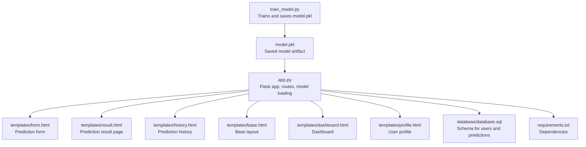
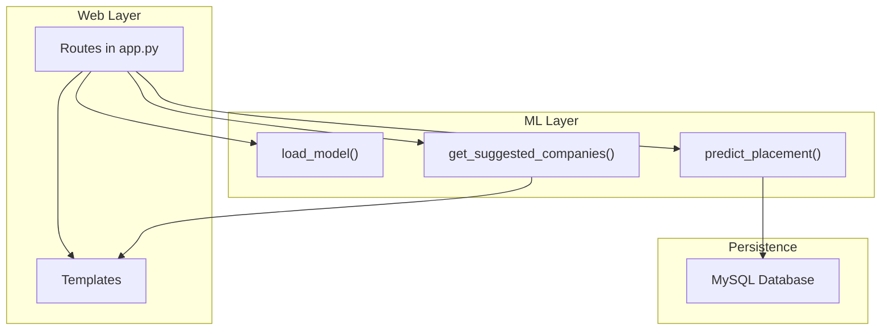
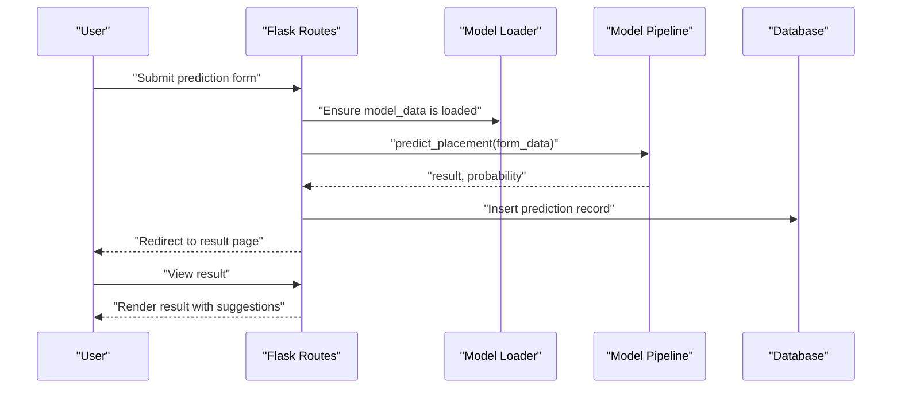
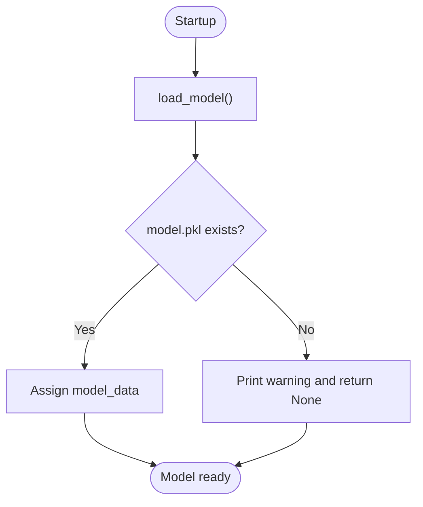
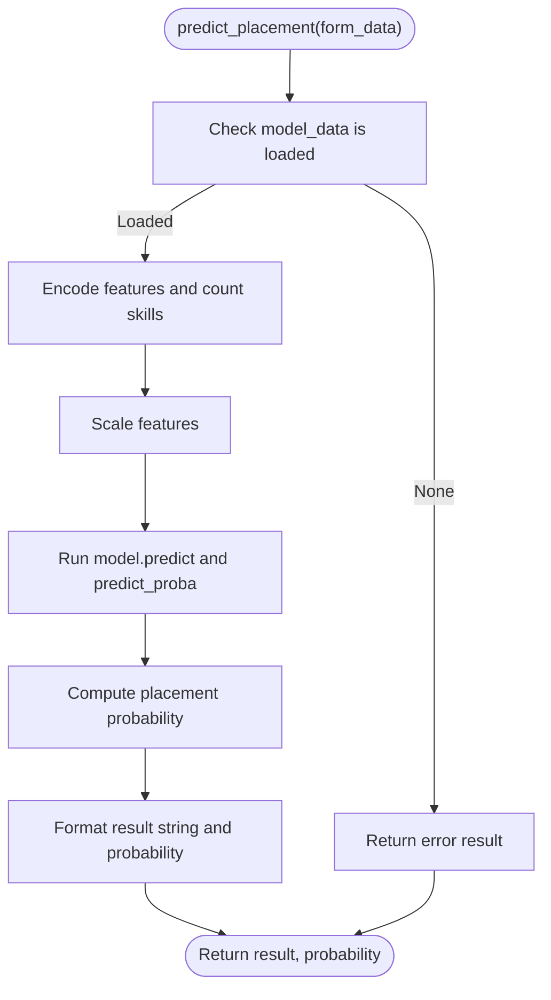
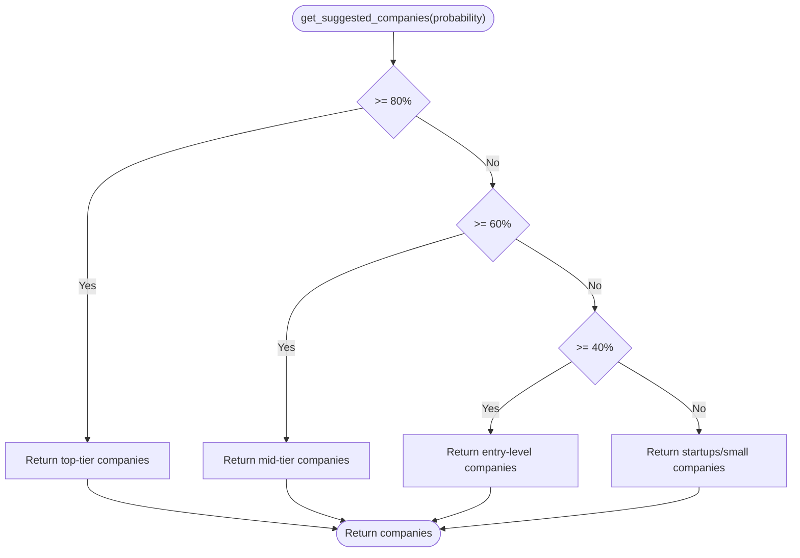
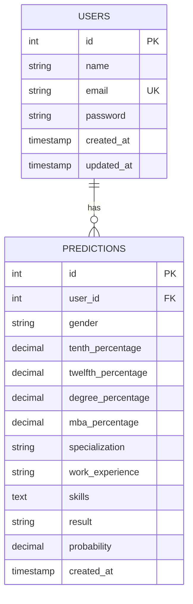
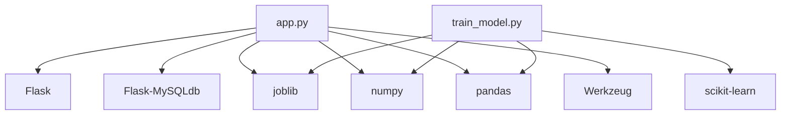

# Model Integration

<cite>
**Referenced Files in This Document**
- [app.py](file://app.py)
- [train_model.py](file://train_model.py)
- [database.sql](file://database/database.sql)
- [requirements.txt](file://requirements.txt)
- [form.html](file://templates/form.html)
- [result.html](file://templates/result.html)
- [history.html](file://templates/history.html)
- [base.html](file://templates/base.html)
- [dashboard.html](file://templates/dashboard.html)
- [profile.html](file://templates/profile.html)
</cite>

## Table of Contents
1. [Introduction](#introduction)
2. [Project Structure](#project-structure)
3. [Core Components](#core-components)
4. [Architecture Overview](#architecture-overview)
5. [Detailed Component Analysis](#detailed-component-analysis)
6. [Dependency Analysis](#dependency-analysis)
7. [Performance Considerations](#performance-considerations)
8. [Troubleshooting Guide](#troubleshooting-guide)
9. [Conclusion](#conclusion)
10. [Appendices](#appendices)

## Introduction
This document explains how the trained machine learning model is integrated into the Flask web application. It covers model loading and persistence, prediction logic invocation from Flask routes, parameter extraction from forms, result formatting for templates, error handling strategies, database integration for storing predictions, the company recommendation system, model versioning and update procedures, and performance considerations.

## Project Structure
The project is organized around a Flask application with templates, static assets, and a database schema. The model is serialized and stored separately and loaded at application startup.

**Diagram sources**
- [app.py:1-394](file://app.py#L1-L394)
- [train_model.py:1-196](file://train_model.py#L1-L196)
- [database/database.sql:1-40](file://database/database.sql#L1-L40)
- [requirements.txt:1-27](file://requirements.txt#L1-L27)
- [templates/form.html:1-227](file://templates/form.html#L1-L227)
- [templates/result.html:1-312](file://templates/result.html#L1-L312)
- [templates/history.html:1-306](file://templates/history.html#L1-L306)
- [templates/base.html:1-128](file://templates/base.html#L1-L128)
- [templates/dashboard.html:1-154](file://templates/dashboard.html#L1-L154)
- [templates/profile.html:1-274](file://templates/profile.html#L1-L274)

**Section sources**
- [app.py:1-394](file://app.py#L1-L394)
- [train_model.py:1-196](file://train_model.py#L1-L196)
- [database/database.sql:1-40](file://database/database.sql#L1-L40)
- [requirements.txt:1-27](file://requirements.txt#L1-L27)

## Core Components
- Flask application with configuration for MySQL and session management.
- Model loading and persistence using joblib.
- Prediction pipeline encapsulated in a helper function that transforms inputs, scales features, predicts, and computes probabilities.
- Company recommendation system based on probability thresholds.
- Database integration for user accounts and prediction history.
- Template-driven UI for form submission, result display, and history.

**Section sources**
- [app.py:6-26](file://app.py#L6-L26)
- [app.py:28-39](file://app.py#L28-L39)
- [app.py:60-108](file://app.py#L60-L108)
- [app.py:110-123](file://app.py#L110-L123)
- [database/database.sql:9-35](file://database/database.sql#L9-L35)

## Architecture Overview
The Flask application initializes the model at startup, exposes routes for authentication and prediction, and persists results in the database. Templates render the UI and present results and suggestions.

**Diagram sources**
- [app.py:28-39](file://app.py#L28-L39)
- [app.py:60-108](file://app.py#L60-L108)
- [app.py:110-123](file://app.py#L110-L123)
- [database/database.sql:9-35](file://database/database.sql#L9-L35)

## Detailed Component Analysis

### Model Loading and Session-Based Persistence
- Model loading function attempts to load the serialized model using joblib and handles missing model files gracefully.
- A global variable holds the loaded model data (model, scaler, label encoders, feature columns) for reuse across requests.
- The model is initialized during application context startup, ensuring it is available immediately upon request handling.

Key behaviors:
- On startup, the application loads model.pkl if present; otherwise, it logs a warning and proceeds without a model.
- The global model_data variable is checked before prediction to avoid runtime errors.

**Section sources**
- [app.py:28-39](file://app.py#L28-L39)
- [app.py:384-391](file://app.py#L384-L391)

### Prediction Pipeline and Route Integration
- The prediction route extracts form data, validates and converts numeric fields, encodes categorical variables, counts skills, constructs a feature vector, scales it, and runs inference.
- The route captures both the predicted class and the class probabilities, computes placement probability, and stores the result in the database.
- Results are passed to the result template for rendering and company suggestions.

Integration points:
- Route: prediction form submission.
- Parameter extraction: gender, ssc_p, hsc_p, degree_p, mba_p, specialisation, workex, skills.
- Result formatting: result string and rounded probability for display.

**Section sources**
- [app.py:238-292](file://app.py#L238-L292)
- [app.py:60-108](file://app.py#L60-L108)
- [app.py:265-290](file://app.py#L265-L290)

### Company Recommendation System
- The recommendation function maps placement probability thresholds to lists of suggested companies.
- The result page renders the recommendations alongside the prediction outcome.

Threshold logic:
- High probability (>80%), moderate (>=60%), low (>=40%), very low (<40%).

**Section sources**
- [app.py:110-123](file://app.py#L110-L123)
- [result.html:63-79](file://templates/result.html#L63-L79)

### Database Integration and Schema
- The schema defines two tables: users and predictions.
- Predictions include user_id, feature fields, result, and probability, with a foreign key constraint to users.
- The application inserts prediction records after successful predictions and retrieves them for history and dashboards.

Tables:
- users: id, name, email, password, timestamps.
- predictions: id, user_id, gender, academic scores, specialization, work_experience, skills, result, probability, timestamps.

**Section sources**
- [database/database.sql:9-35](file://database/database.sql#L9-L35)
- [app.py:265-290](file://app.py#L265-L290)
- [app.py:144-160](file://app.py#L144-L160)

### Frontend Integration and Template Rendering
- The prediction form collects required inputs and performs client-side validation for percentage ranges.
- The result page displays the prediction outcome, probability visualization, and suggested companies.
- The history page lists previous predictions with summary statistics and links to individual results.

**Section sources**
- [form.html:12-135](file://templates/form.html#L12-L135)
- [result.html:13-140](file://templates/result.html#L13-L140)
- [history.html:47-121](file://templates/history.html#L47-L121)

### Error Handling Strategies
- Model loading failure: The loader prints a warning and returns None; downstream prediction checks guard against None.
- Prediction errors: Try/catch around prediction logic returns an error result and logs details.
- Data validation: Form validation ensures numeric ranges and required fields; template-level validation prevents invalid submissions.

**Section sources**
- [app.py:28-39](file://app.py#L28-L39)
- [app.py:60-108](file://app.py#L60-L108)
- [form.html:211-225](file://templates/form.html#L211-L225)

### Model Versioning and Update Procedures
- The training script saves the model as model.pkl with preprocessing artifacts (scaler, label encoders, feature columns).
- To update the model in production:
  - Re-run the training script to regenerate model.pkl.
  - Replace the existing model.pkl in the application directory.
  - Restart the Flask application to reload the new model.

Versioning approach:
- Use the saved model.pkl as the single source of truth for the deployed model.
- Maintain separate environments for training and production to avoid accidental overwrites.

**Section sources**
- [train_model.py:175-189](file://train_model.py#L175-L189)
- [app.py:28-39](file://app.py#L28-L39)

## Architecture Overview

**Diagram sources**
- [app.py:238-292](file://app.py#L238-L292)
- [app.py:28-39](file://app.py#L28-L39)
- [app.py:60-108](file://app.py#L60-L108)
- [database/database.sql:19-35](file://database/database.sql#L19-L35)

## Detailed Component Analysis

### Model Loading Mechanism
The model loading function encapsulates joblib.load with error handling and returns a dictionary containing the model, scaler, label encoders, and feature columns. The application initializes this at startup and guards prediction logic against missing models.

**Diagram sources**
- [app.py:28-39](file://app.py#L28-L39)
- [app.py:384-391](file://app.py#L384-L391)

**Section sources**
- [app.py:28-39](file://app.py#L28-L39)
- [app.py:384-391](file://app.py#L384-L391)

### Prediction Logic and Parameter Extraction
The prediction function:
- Extracts and validates form fields.
- Encodes categorical variables and counts skills.
- Constructs a feature vector and scales it.
- Runs model.predict and model.predict_proba.
- Computes placement probability and returns formatted result.

**Diagram sources**
- [app.py:60-108](file://app.py#L60-L108)

**Section sources**
- [app.py:60-108](file://app.py#L60-L108)

### Company Recommendation Thresholds
The recommendation function maps probability ranges to predefined company lists.

**Diagram sources**
- [app.py:110-123](file://app.py#L110-L123)

**Section sources**
- [app.py:110-123](file://app.py#L110-L123)

### Database Schema and Insertion Logic
The schema defines users and predictions tables with appropriate constraints. The application inserts prediction records with all relevant fields and retrieves them for history and dashboard views.

**Diagram sources**
- [database/database.sql:9-35](file://database/database.sql#L9-L35)

**Section sources**
- [database/database.sql:9-35](file://database/database.sql#L9-L35)
- [app.py:265-290](file://app.py#L265-L290)

### Frontend Forms and Result Presentation
- The form template collects required inputs and enforces percentage bounds.
- The result template displays the prediction outcome, probability visualization, and company suggestions.
- The history template aggregates statistics and lists previous predictions.

**Section sources**
- [form.html:12-135](file://templates/form.html#L12-L135)
- [result.html:13-140](file://templates/result.html#L13-L140)
- [history.html:47-121](file://templates/history.html#L47-L121)

## Dependency Analysis
External libraries and their roles:
- Flask: Web framework and routing.
- Flask-MySQLdb: MySQL connectivity.
- joblib: Model serialization/deserialization.
- scikit-learn: Training and preprocessing.
- numpy/pandas: Numerical computing and data handling.
- Werkzeug: Password hashing and utilities.

**Diagram sources**
- [requirements.txt:4-27](file://requirements.txt#L4-L27)
- [app.py:6-12](file://app.py#L6-L12)
- [train_model.py:7-15](file://train_model.py#L7-L15)

**Section sources**
- [requirements.txt:4-27](file://requirements.txt#L4-L27)

## Performance Considerations
- Model caching: The model is loaded once at startup and reused across requests via a global variable, avoiding repeated disk I/O.
- Memory management: joblib serialization is efficient; ensure the model is not unnecessarily reloaded by keeping the global reference intact.
- Prediction latency optimization:
  - Keep preprocessing minimal and centralized in the prediction function.
  - Use vectorized operations with numpy for feature scaling and inference.
  - Avoid redundant computations inside the prediction loop.
- Database writes: Batch operations are not used here; each prediction is inserted individually. For high throughput, consider connection pooling and transaction batching.

[No sources needed since this section provides general guidance]

## Troubleshooting Guide
Common issues and resolutions:
- Model not found: Ensure model.pkl exists in the application directory and is readable. The loader prints a warning if missing.
- Prediction errors: Verify form inputs are numeric and within expected ranges. The prediction function catches exceptions and returns an error result.
- Database connectivity: Confirm MySQL configuration matches the environment and credentials are correct.
- Session issues: Ensure sessions are enabled and cookies are accepted by the browser.

**Section sources**
- [app.py:28-39](file://app.py#L28-L39)
- [app.py:60-108](file://app.py#L60-L108)
- [app.py:169-192](file://app.py#L169-L192)

## Conclusion
The Flask application integrates a trained machine learning model through a robust loading mechanism, persistent global model storage, and a streamlined prediction pipeline. It securely persists prediction outcomes in a relational database, provides actionable insights via templates, and offers a scalable foundation for model updates and performance enhancements.

[No sources needed since this section summarizes without analyzing specific files]

## Appendices

### Appendix A: Model Training and Saving
- The training script generates synthetic data, preprocesses features, trains a logistic regression model, evaluates performance, and saves the model and preprocessing objects to model.pkl.

**Section sources**
- [train_model.py:109-192](file://train_model.py#L109-L192)

### Appendix B: Template Context and Navigation
- Base template provides navigation, flash messages, and shared UI elements across pages.
- Dashboard, profile, and history templates consume data from database queries and render summaries and lists.

**Section sources**
- [base.html:42-82](file://templates/base.html#L42-L82)
- [dashboard.html:13-59](file://templates/dashboard.html#L13-L59)
- [profile.html:12-97](file://templates/profile.html#L12-L97)
- [history.html:12-121](file://templates/history.html#L12-L121)