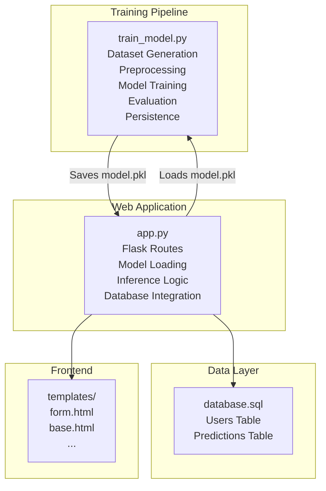
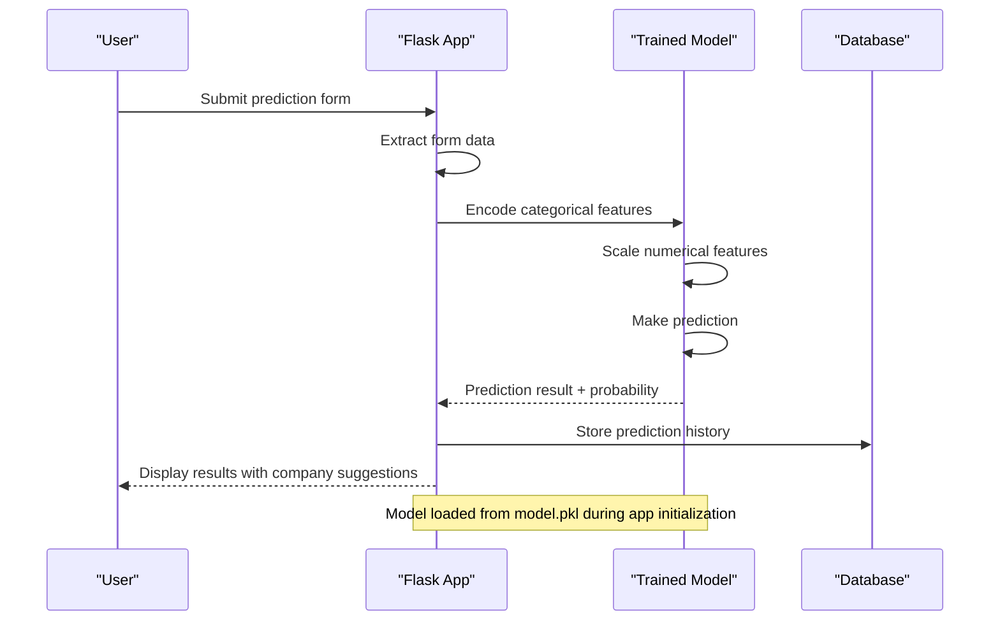
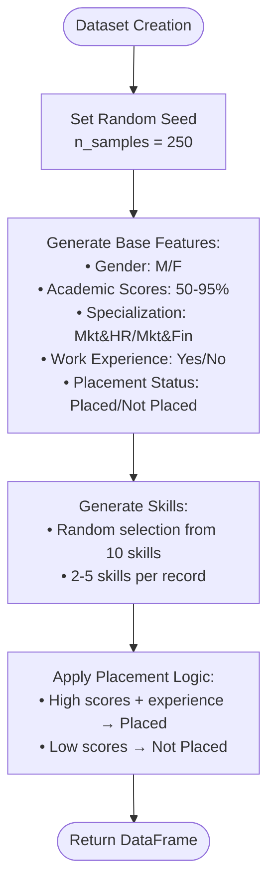
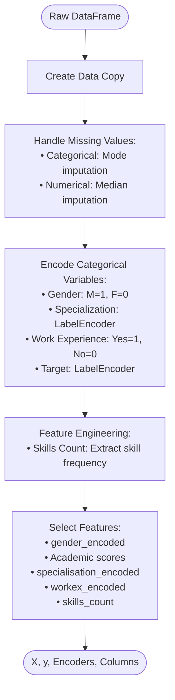
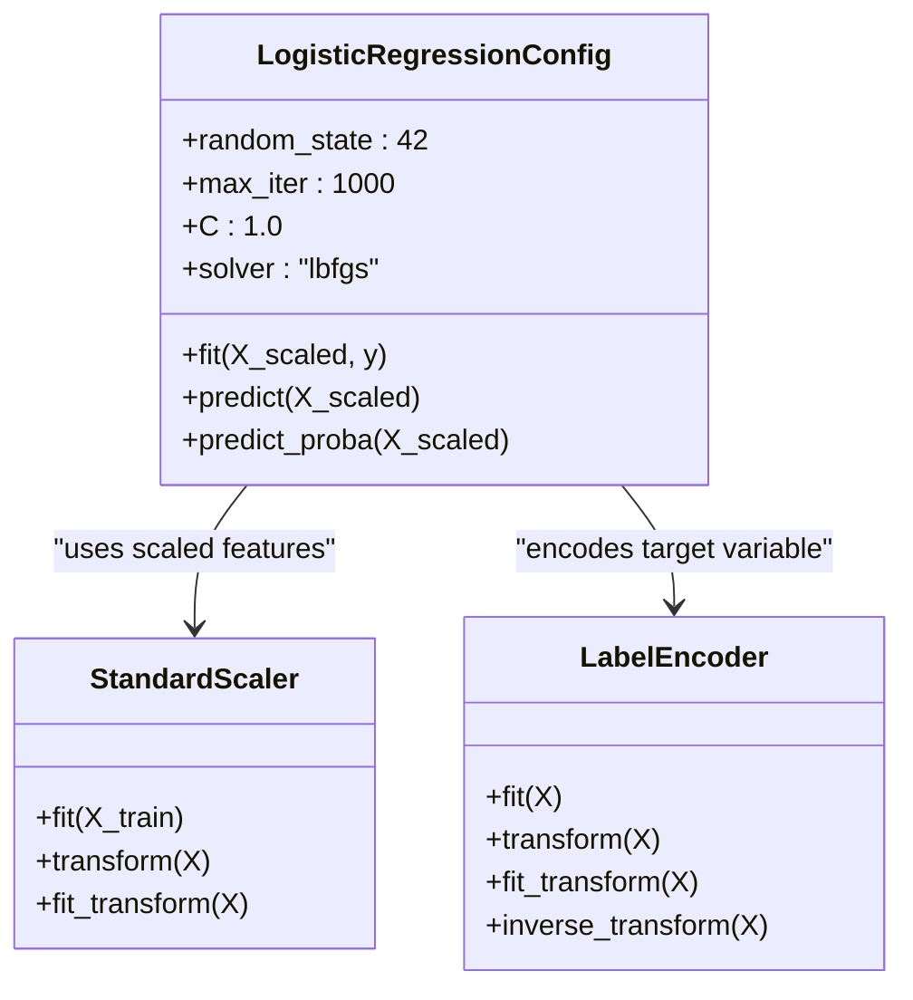
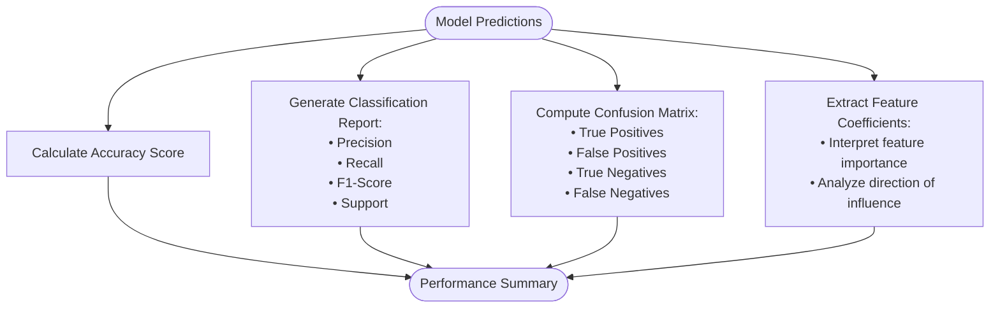
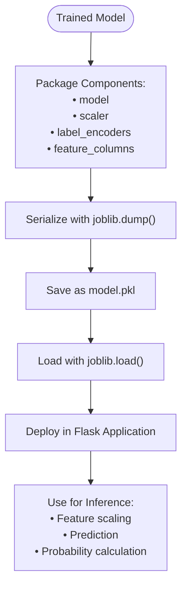
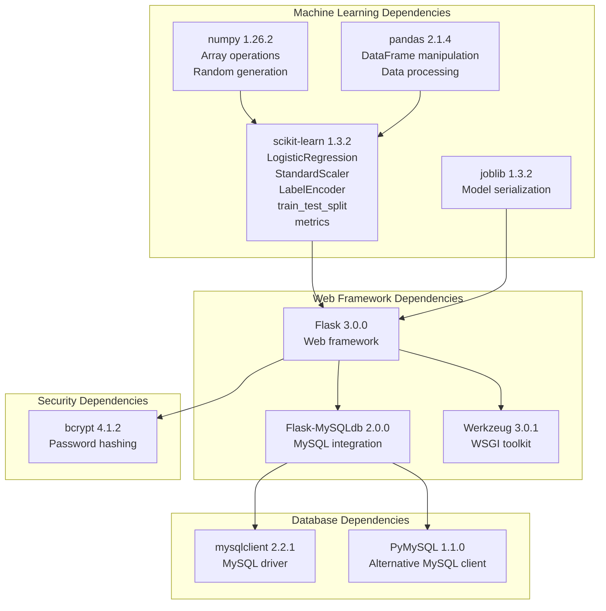

# Model Training Pipeline

<cite>
**Referenced Files in This Document**
- [train_model.py](file://train_model.py)
- [app.py](file://app.py)
- [requirements.txt](file://requirements.txt)
- [database.sql](file://database/database.sql)
- [form.html](file://templates/form.html)
- [base.html](file://templates/base.html)
</cite>

## Table of Contents
1. [Introduction](#introduction)
2. [Project Structure](#project-structure)
3. [Core Components](#core-components)
4. [Architecture Overview](#architecture-overview)
5. [Detailed Component Analysis](#detailed-component-analysis)
6. [Dependency Analysis](#dependency-analysis)
7. [Performance Considerations](#performance-considerations)
8. [Troubleshooting Guide](#troubleshooting-guide)
9. [Conclusion](#conclusion)

## Introduction
This document provides comprehensive documentation for the machine learning model training pipeline used in the Student Placement Prediction Portal. The pipeline covers the end-to-end workflow from synthetic dataset creation to model saving and deployment within a Flask web application. It explains the dataset generation process, preprocessing steps, model training configuration, evaluation metrics, and persistence mechanisms.

## Project Structure
The project follows a modular structure with clear separation between training, application logic, and data persistence:
- Training script: Generates synthetic campus recruitment-style data and trains a logistic regression model
- Flask application: Serves the web interface and loads the trained model for inference
- Database schema: Stores user accounts and prediction history
- Templates: Provide the frontend forms and pages for user interaction

**Diagram sources**
- [train_model.py:1-196](file://train_model.py#L1-L196)
- [app.py:1-394](file://app.py#L1-L394)
- [database.sql:1-40](file://database/database.sql#L1-L40)
- [form.html:1-227](file://templates/form.html#L1-L227)
- [base.html:1-128](file://templates/base.html#L1-L128)

**Section sources**
- [train_model.py:1-196](file://train_model.py#L1-L196)
- [app.py:1-394](file://app.py#L1-L394)
- [database.sql:1-40](file://database/database.sql#L1-L40)

## Core Components
The training pipeline consists of several interconnected components that handle data generation, preprocessing, model training, evaluation, and persistence:

### Synthetic Dataset Generator
The system creates a synthetic campus recruitment dataset with realistic academic and professional attributes. The generator produces:
- Demographic features: gender (binary)
- Academic performance: SSC (10th), HSC (12th), degree, and MBA percentages
- Specialization categories: Marketing & HR, Marketing & Finance
- Professional experience: binary indicator
- Skills composition: comma-separated skill lists with variable counts
- Target variable: placement status with inherent bias toward higher scores

### Preprocessing Pipeline
The preprocessing stage handles data preparation for machine learning:
- Missing value imputation using mode for categorical and median for numerical features
- Categorical encoding using LabelEncoder for gender, specialization, work experience, and target variable
- Feature engineering including skills count extraction
- Feature matrix construction with standardized column names

### Model Training and Evaluation
The pipeline implements a complete machine learning workflow:
- Stratified train-test split maintaining class distribution
- StandardScaler for feature normalization
- LogisticRegression with configurable hyperparameters
- Comprehensive evaluation metrics including accuracy, classification report, and confusion matrix
- Feature importance analysis through coefficient interpretation

### Model Persistence
The trained model and preprocessing components are serialized using joblib for deployment:
- Complete model state including coefficients and intercept
- Scaler parameters for consistent feature scaling
- Label encoders for inverse transformations
- Feature column metadata for validation

**Section sources**
- [train_model.py:17-56](file://train_model.py#L17-L56)
- [train_model.py:57-107](file://train_model.py#L57-L107)
- [train_model.py:109-192](file://train_model.py#L109-L192)

## Architecture Overview
The system architecture integrates machine learning training with web application deployment through a structured data flow:

**Diagram sources**
- [app.py:28-39](file://app.py#L28-L39)
- [app.py:60-109](file://app.py#L60-L109)
- [app.py:238-292](file://app.py#L238-L292)

The architecture ensures consistent model behavior across training and inference phases through shared preprocessing components and standardized feature representation.

**Section sources**
- [app.py:28-39](file://app.py#L28-L39)
- [app.py:60-109](file://app.py#L60-L109)
- [app.py:238-292](file://app.py#L238-L292)

## Detailed Component Analysis

### Dataset Generation Process
The synthetic dataset creation function generates realistic campus recruitment data with carefully designed statistical relationships:

**Diagram sources**
- [train_model.py:19-55](file://train_model.py#L19-L55)

The dataset incorporates realistic placement dynamics where academic excellence and work experience positively correlate with placement outcomes, while maintaining natural variability through randomization.

**Section sources**
- [train_model.py:19-55](file://train_model.py#L19-L55)

### Preprocessing Implementation
The preprocessing pipeline handles data quality and feature engineering systematically:

**Diagram sources**
- [train_model.py:57-107](file://train_model.py#L57-L107)

The preprocessing maintains data integrity while transforming categorical variables into numerically interpretable formats suitable for machine learning algorithms.

**Section sources**
- [train_model.py:57-107](file://train_model.py#L57-L107)

### Model Training Configuration
The logistic regression model is configured with production-ready parameters:

**Diagram sources**
- [train_model.py:145-151](file://train_model.py#L145-L151)
- [train_model.py:139-141](file://train_model.py#L139-L141)
- [train_model.py:83-92](file://train_model.py#L83-L92)

The configuration prioritizes convergence stability with increased iteration limits and appropriate regularization strength.

**Section sources**
- [train_model.py:145-151](file://train_model.py#L145-L151)
- [train_model.py:139-141](file://train_model.py#L139-L141)

### Model Evaluation Metrics
The evaluation process provides comprehensive performance assessment:

**Diagram sources**
- [train_model.py:158-174](file://train_model.py#L158-L174)

The evaluation metrics enable both quantitative assessment and qualitative interpretation of feature contributions to placement decisions.

**Section sources**
- [train_model.py:158-174](file://train_model.py#L158-L174)

### Model Persistence Mechanism
The model persistence system ensures reliable deployment and reuse:

**Diagram sources**
- [train_model.py:180-187](file://train_model.py#L180-L187)
- [app.py:29-36](file://app.py#L29-L36)

The persisted model maintains complete state information for seamless deployment across different environments.

**Section sources**
- [train_model.py:180-187](file://train_model.py#L180-L187)
- [app.py:29-36](file://app.py#L29-L36)

## Dependency Analysis
The project relies on a well-defined set of dependencies that support both machine learning and web application functionality:

**Diagram sources**
- [requirements.txt:1-27](file://requirements.txt#L1-L27)

The dependency structure supports a clean separation between machine learning functionality and web application concerns, enabling independent development and deployment.

**Section sources**
- [requirements.txt:1-27](file://requirements.txt#L1-L27)

## Performance Considerations
Several factors contribute to optimal model performance and system reliability:

### Data Quality and Balance
- The synthetic dataset maintains realistic academic score distributions with natural variance
- Stratified sampling preserves class balance between placed and not placed candidates
- Feature engineering captures meaningful relationships between academic performance and placement outcomes

### Model Configuration Tuning
- Increased iteration limits ensure convergence for complex datasets
- Regularization parameter prevents overfitting while maintaining model flexibility
- Appropriate solver selection optimizes computational efficiency

### Scalability Factors
- Joblib serialization enables efficient model loading and reduced startup latency
- Standardized feature scaling ensures consistent performance across different input ranges
- Modular preprocessing pipeline supports easy updates and maintenance

## Troubleshooting Guide

### Common Issues and Solutions

#### Model Loading Failures
- **Problem**: `FileNotFoundError` when model.pkl is missing
- **Solution**: Run the training script first to generate the model file
- **Detection**: Check for warning messages during application startup

#### Data Type Conversion Errors
- **Problem**: Prediction failures due to invalid numeric inputs
- **Solution**: Validate form inputs and ensure percentage values are within 0-100 range
- **Detection**: Error handling in prediction function returns error status

#### Database Connection Issues
- **Problem**: MySQL connection failures during prediction storage
- **Solution**: Verify database credentials and connection parameters
- **Detection**: Error handlers catch and display connection errors

#### Feature Encoding Mismatches
- **Problem**: Inconsistent categorical encoding between training and inference
- **Solution**: Use persisted label encoders to maintain consistency
- **Detection**: Compare encoded values with training data expectations

**Section sources**
- [app.py:34-36](file://app.py#L34-L36)
- [app.py:106-108](file://app.py#L106-L108)
- [app.py:364-372](file://app.py#L364-L372)

## Conclusion
The Student Placement Prediction Portal demonstrates a comprehensive machine learning pipeline that successfully bridges data generation, preprocessing, model training, evaluation, and deployment. The modular architecture ensures maintainability while the standardized preprocessing and persistence mechanisms guarantee consistent model behavior across training and inference phases. The integration with the Flask web application provides a complete solution for real-time placement predictions with historical tracking and user management capabilities.

The pipeline's design considerations, including stratified sampling, robust preprocessing, and comprehensive evaluation metrics, establish a solid foundation for accurate placement predictions. The persistent model structure and standardized feature engineering enable reliable deployment and future enhancements to the predictive capabilities.