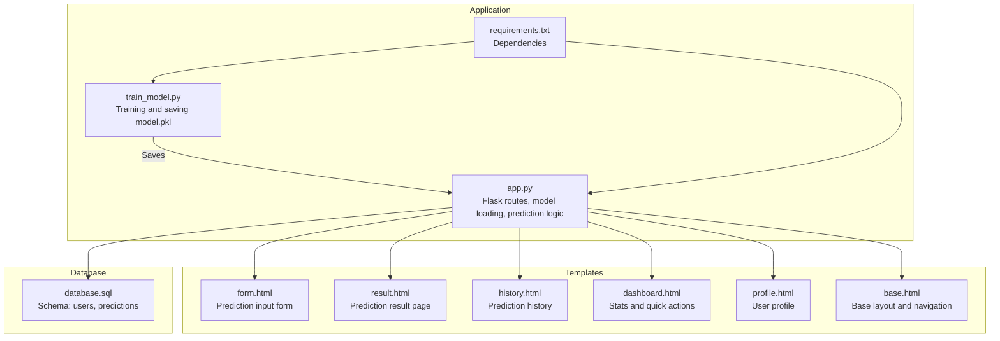
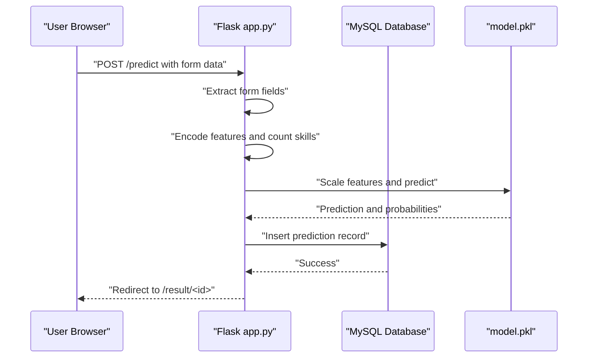
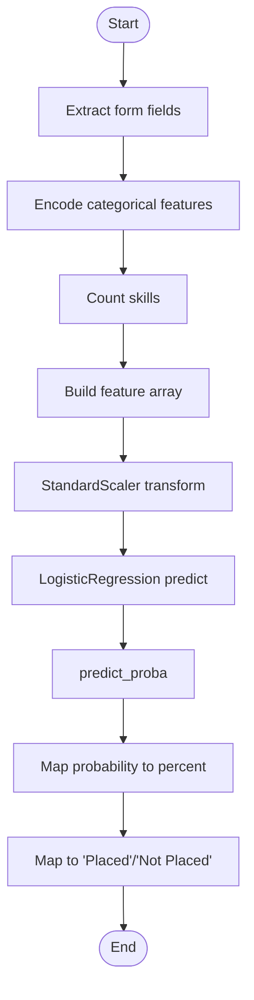
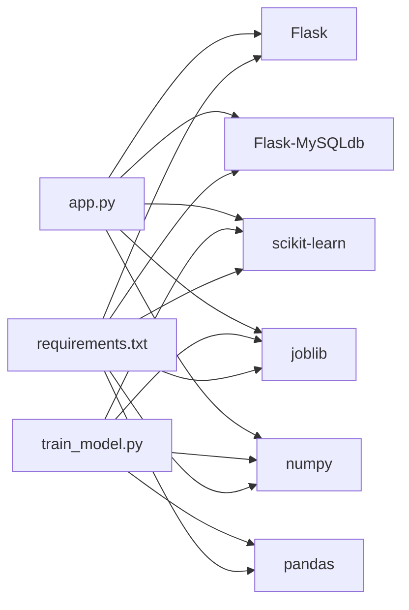
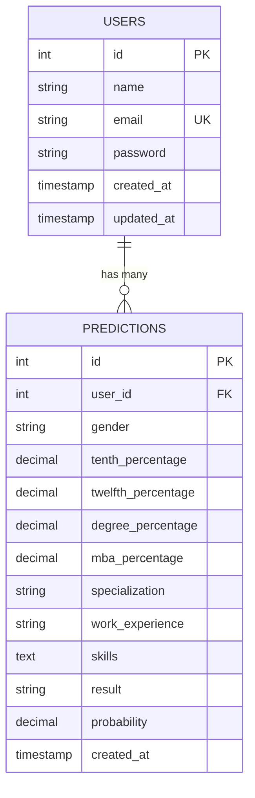

# Prediction Processing

<cite>
**Referenced Files in This Document**
- [app.py](file://app.py)
- [train_model.py](file://train_model.py)
- [database.sql](file://database/database.sql)
- [requirements.txt](file://requirements.txt)
- [form.html](file://templates/form.html)
- [result.html](file://templates/result.html)
- [history.html](file://templates/history.html)
- [base.html](file://templates/base.html)
- [dashboard.html](file://templates/dashboard.html)
- [profile.html](file://templates/profile.html)
</cite>

## Table of Contents
1. [Introduction](#introduction)
2. [Project Structure](#project-structure)
3. [Core Components](#core-components)
4. [Architecture Overview](#architecture-overview)
5. [Detailed Component Analysis](#detailed-component-analysis)
6. [Dependency Analysis](#dependency-analysis)
7. [Performance Considerations](#performance-considerations)
8. [Troubleshooting Guide](#troubleshooting-guide)
9. [Conclusion](#conclusion)
10. [Appendices](#appendices)

## Introduction
This document explains the prediction processing system that accepts user input via a Flask web interface, transforms it into model-ready features, runs a machine learning model to predict placement outcomes, and presents interpretable results with company recommendations. It covers:
- Data extraction from Flask form submissions
- Feature engineering pipeline (encoding and skills counting)
- Model loading and integration
- Prediction workflow from preprocessing to probability calculation
- Result interpretation and recommendation logic
- Error handling and session-based storage with database history tracking

## Project Structure
The system is organized around a Flask application, a training script that builds and persists a model, and a set of Jinja2 templates for the UI. The database schema defines tables for users and prediction history.

**Diagram sources**
- [app.py:1-394](file://app.py#L1-L394)
- [train_model.py:1-196](file://train_model.py#L1-L196)
- [database.sql:1-40](file://database/database.sql#L1-L40)
- [requirements.txt:1-27](file://requirements.txt#L1-L27)
- [form.html:1-227](file://templates/form.html#L1-L227)
- [result.html:1-312](file://templates/result.html#L1-L312)
- [history.html:1-306](file://templates/history.html#L1-L306)
- [dashboard.html:1-154](file://templates/dashboard.html#L1-L154)
- [profile.html:1-274](file://templates/profile.html#L1-L274)
- [base.html:1-128](file://templates/base.html#L1-L128)

**Section sources**
- [app.py:1-394](file://app.py#L1-L394)
- [train_model.py:1-196](file://train_model.py#L1-L196)
- [database.sql:1-40](file://database/database.sql#L1-L40)
- [requirements.txt:1-27](file://requirements.txt#L1-L27)

## Core Components
- Flask application with routes for login, registration, prediction, results, history, and profile
- Model loading via joblib.load() and global caching
- Prediction pipeline: feature extraction, encoding, skills count, scaling, prediction, and probability
- Company recommendation engine based on thresholds
- Database integration for user and prediction persistence
- Session-based authentication and history tracking

Key implementation references:
- Model loading and caching: [load_model():29-39](file://app.py#L29-L39), [app initialization:384-391](file://app.py#L384-L391)
- Prediction workflow: [predict_placement():60-109](file://app.py#L60-L109)
- Recommendation logic: [get_suggested_companies():110-123](file://app.py#L110-L123)
- Database schema: [users and predictions:9-35](file://database/database.sql#L9-L35)
- Frontend forms and result rendering: [form.html:1-227](file://templates/form.html#L1-L227), [result.html:1-312](file://templates/result.html#L1-L312)

**Section sources**
- [app.py:29-123](file://app.py#L29-L123)
- [database.sql:9-35](file://database/database.sql#L9-L35)
- [form.html:1-227](file://templates/form.html#L1-L227)
- [result.html:1-312](file://templates/result.html#L1-L312)

## Architecture Overview
The prediction system follows a request-response flow:
- User submits a form with personal, academic, and skill data
- Flask route extracts form fields and invokes the prediction function
- The prediction function encodes categorical inputs, counts skills, scales features, and runs the model
- Results are stored in the database and rendered to a result page with company suggestions

**Diagram sources**
- [app.py:238-292](file://app.py#L238-L292)
- [app.py:60-109](file://app.py#L60-L109)
- [database.sql:19-35](file://database/database.sql#L19-L35)

## Detailed Component Analysis

### Data Extraction from Flask Forms
- Route collects form data into a dictionary with keys for gender, SSC/HSC/Degree/MBA percentages, specialization, work experience, and skills
- Validation occurs client-side for percentage ranges and server-side via type conversion and exception handling
- Missing or invalid entries are handled gracefully during prediction

References:
- Form submission and extraction: [predict route:245-256](file://app.py#L245-L256)
- Client-side validation: [form.html script:211-225](file://templates/form.html#L211-L225)

**Section sources**
- [app.py:245-256](file://app.py#L245-L256)
- [form.html:211-225](file://templates/form.html#L211-L225)

### Feature Engineering Pipeline
- Categorical encoding:
  - Gender: Male encoded as 1, Female as 0
  - Specialization: Mkt&HR encoded as 0, Mkt&Fin as 1
  - Work Experience: Yes as 1, No as 0
- Numerical features: SSC, HSC, Degree, MBA percentages
- Skills count: Comma-separated skills parsed and counted
- Feature vector assembled for model inference

References:
- Encoding and feature construction: [predict_placement():74-90](file://app.py#L74-L90)

**Section sources**
- [app.py:74-90](file://app.py#L74-L90)

### Model Loading Mechanism
- On application startup, the model is loaded via joblib.load('model.pkl')
- The loaded object contains the trained model, scaler, label encoders, and feature columns
- Global caching avoids repeated disk reads during runtime

References:
- Model loading and caching: [load_model():29-39](file://app.py#L29-L39), [startup initialization:384-391](file://app.py#L384-L391)

**Section sources**
- [app.py:29-39](file://app.py#L29-L39)
- [app.py:384-391](file://app.py#L384-L391)

### Prediction Workflow
- Input features are transformed using the fitted StandardScaler
- LogisticRegression predicts class and computes class probabilities
- Placement probability is derived from the probability of the positive class (Placed)
- Result is mapped to “Placed” or “Not Placed”

References:
- Scaling and prediction: [predict_placement():92-104](file://app.py#L92-L104)

**Diagram sources**
- [app.py:60-109](file://app.py#L60-L109)

**Section sources**
- [app.py:60-109](file://app.py#L60-L109)

### Result Interpretation and Recommendations
- Threshold-based company suggestions:
  - ≥ 80%: Top-tier companies
  - ≥ 60%: Mid-tier companies
  - ≥ 40%: Entry-level companies
  - < 40%: Startups/small companies
- The result page displays the outcome, probability bar, and suggested companies

References:
- Recommendation thresholds: [get_suggested_companies():110-123](file://app.py#L110-L123)
- Rendering result page: [result.html:1-312](file://templates/result.html#L1-L312)

**Section sources**
- [app.py:110-123](file://app.py#L110-L123)
- [result.html:1-312](file://templates/result.html#L1-L312)

### Error Handling
- Model loading failure: Warning printed and model availability checked before prediction
- Runtime prediction errors: Try/catch captures exceptions and returns an error result
- Database errors: Flask-MySQLdb handles connection and transaction errors; application routes guard against unauthorized access and missing records

References:
- Model loading error handling: [load_model():34-36](file://app.py#L34-L36)
- Prediction error handling: [predict_placement():106-108](file://app.py#L106-L108)
- Unauthorized access guards: [routes:133-167](file://app.py#L133-L167), [history:337-354](file://app.py#L337-L354), [profile:319-335](file://app.py#L319-L335)

**Section sources**
- [app.py:34-36](file://app.py#L34-L36)
- [app.py:106-108](file://app.py#L106-L108)
- [app.py:133-167](file://app.py#L133-L167)
- [app.py:337-354](file://app.py#L337-L354)
- [app.py:319-335](file://app.py#L319-L335)

### Session-Based Storage and Database Integration
- Session holds user identity for protected routes and history filtering
- After prediction, the system inserts a record into the predictions table with user_id, input features, result, and probability
- History page aggregates statistics and lists previous predictions with timestamps and scores

References:
- Session checks and user retrieval: [is_logged_in():46-58](file://app.py#L46-L58), [get_current_user():50-58](file://app.py#L50-L58)
- Prediction insertion: [predict route:265-287](file://app.py#L265-L287)
- History aggregation and listing: [history route:337-354](file://app.py#L337-L354), [dashboard stats:144-160](file://app.py#L144-L160)
- Database schema: [users and predictions:9-35](file://database/database.sql#L9-L35)

**Section sources**
- [app.py:46-58](file://app.py#L46-L58)
- [app.py:265-287](file://app.py#L265-L287)
- [app.py:337-354](file://app.py#L337-L354)
- [app.py:144-160](file://app.py#L144-L160)
- [database.sql:9-35](file://database/database.sql#L9-L35)

## Dependency Analysis
External libraries and their roles:
- Flask: Web framework and routing
- Flask-MySQLdb: MySQL connectivity
- scikit-learn: LogisticRegression, StandardScaler, LabelEncoder
- joblib: Persisting and loading the trained model
- numpy/pandas: Numerical computing and data manipulation

References:
- Dependencies: [requirements.txt:1-27](file://requirements.txt#L1-L27)
- Training pipeline: [train_model.py:109-192](file://train_model.py#L109-L192)

**Diagram sources**
- [requirements.txt:1-27](file://requirements.txt#L1-L27)
- [train_model.py:109-192](file://train_model.py#L109-L192)
- [app.py:6-12](file://app.py#L6-L12)

**Section sources**
- [requirements.txt:1-27](file://requirements.txt#L1-L27)
- [train_model.py:109-192](file://train_model.py#L109-L192)
- [app.py:6-12](file://app.py#L6-L12)

## Performance Considerations
- Model loading cost: Loaded once at startup and reused globally to minimize I/O overhead
- Feature scaling: Single transform call per prediction reduces computational overhead
- Data types: Numeric conversions occur once per request; ensure robustness against malformed inputs
- Database writes: Single INSERT per prediction; consider batching for high throughput scenarios
- Frontend validation: Client-side percentage bounds reduce unnecessary server requests

[No sources needed since this section provides general guidance]

## Troubleshooting Guide
Common issues and resolutions:
- Model not found: Ensure model.pkl exists after running the training script; the application prints a warning and disables predictions until fixed
- Invalid form data: The prediction function catches exceptions and returns an error result; verify numeric fields and categorical selections
- Database connectivity: Confirm MySQL credentials and that the database schema is initialized
- Unauthorized access: Protected routes redirect to login; ensure session is established

References:
- Model loading warning: [load_model():34-36](file://app.py#L34-L36)
- Prediction error handling: [predict_placement():106-108](file://app.py#L106-L108)
- Route protection: [protected routes:133-167](file://app.py#L133-L167)

**Section sources**
- [app.py:34-36](file://app.py#L34-L36)
- [app.py:106-108](file://app.py#L106-L108)
- [app.py:133-167](file://app.py#L133-L167)

## Conclusion
The prediction processing system integrates a Flask web interface with a persisted machine learning model to deliver placement predictions. It performs robust feature engineering, applies preprocessing consistently, and provides actionable insights with company recommendations. Session-based authentication and database-backed history tracking enable personalized experiences and historical analysis.

[No sources needed since this section summarizes without analyzing specific files]

## Appendices

### Data Model Overview

**Diagram sources**
- [database.sql:9-35](file://database/database.sql#L9-L35)

### Training and Persistence
- The training script creates a synthetic dataset, preprocesses features, fits a scaler and encoders, trains a LogisticRegression model, and saves all artifacts to model.pkl
- The Flask application loads model.pkl at startup and uses the saved scaler and encoders for consistent preprocessing

References:
- Training and saving: [train_model.py:109-192](file://train_model.py#L109-L192)
- Loading model: [app.py:29-39](file://app.py#L29-L39)

**Section sources**
- [train_model.py:109-192](file://train_model.py#L109-L192)
- [app.py:29-39](file://app.py#L29-L39)