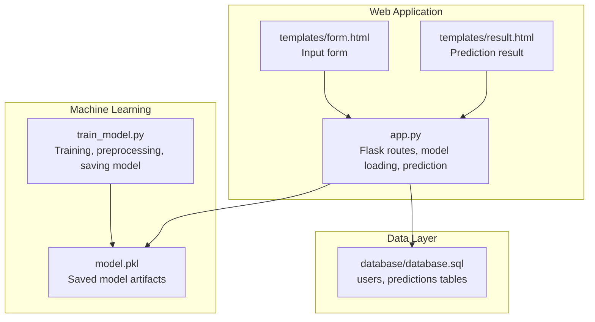
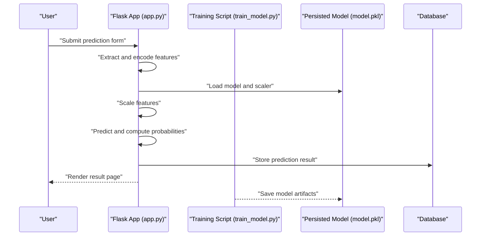
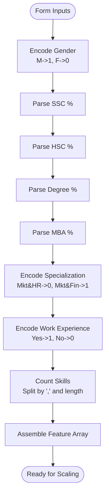
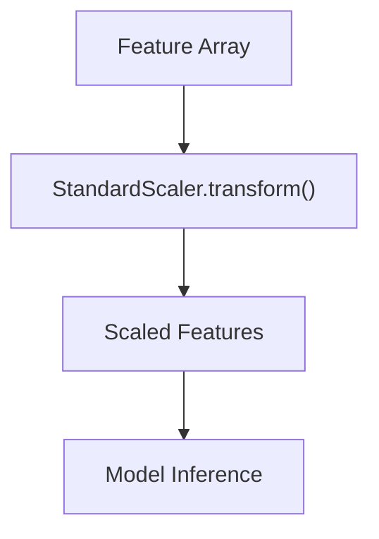
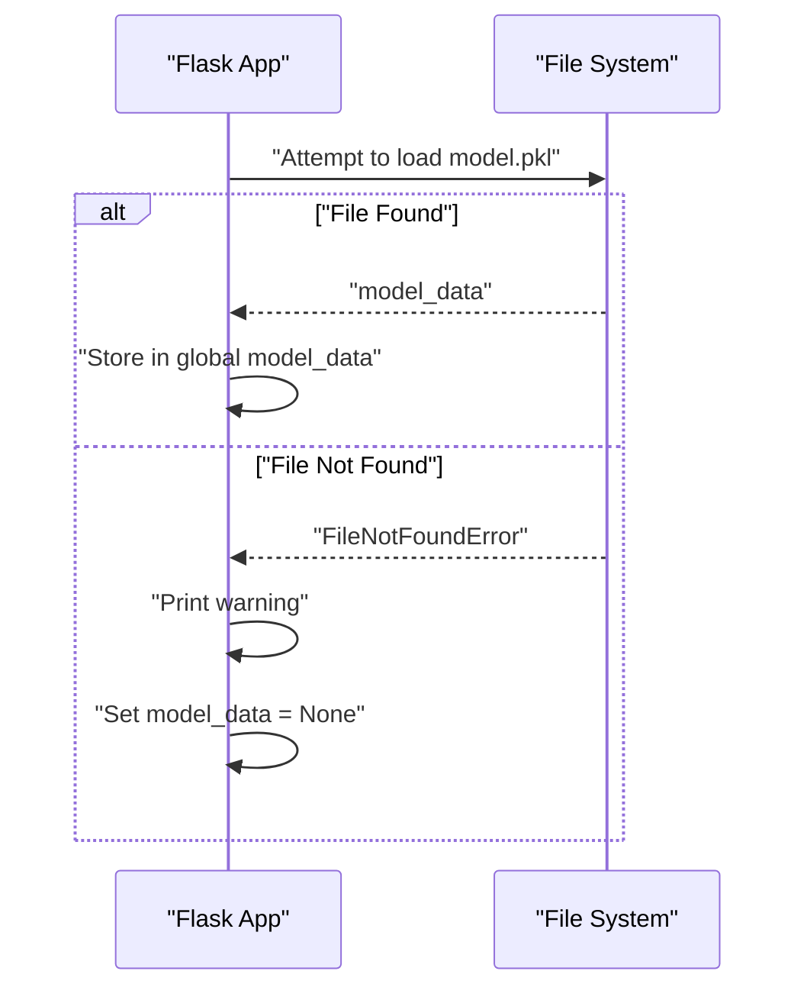
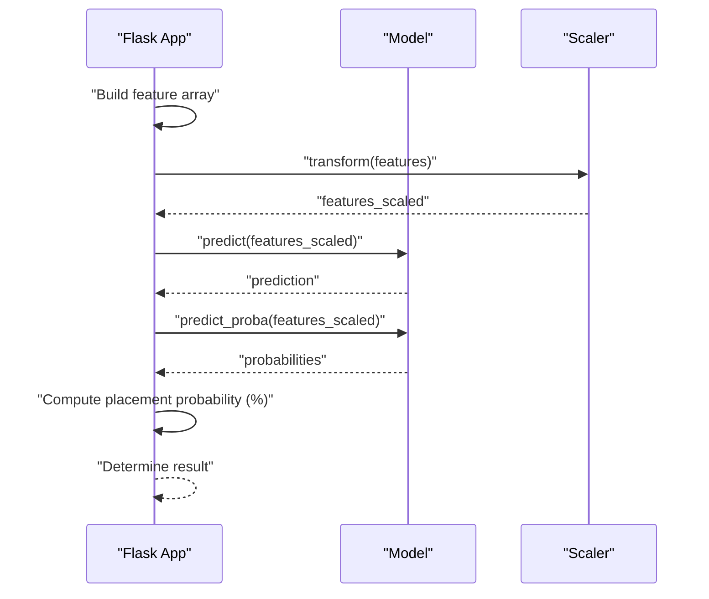
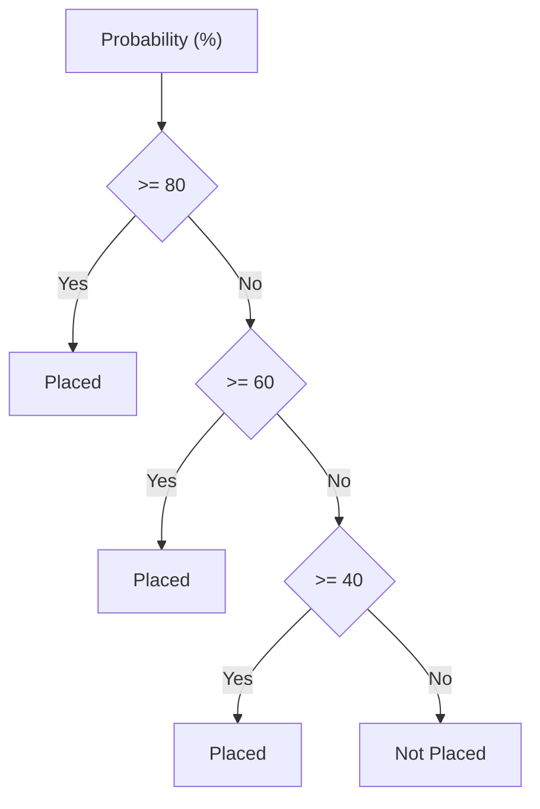
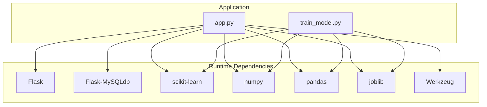
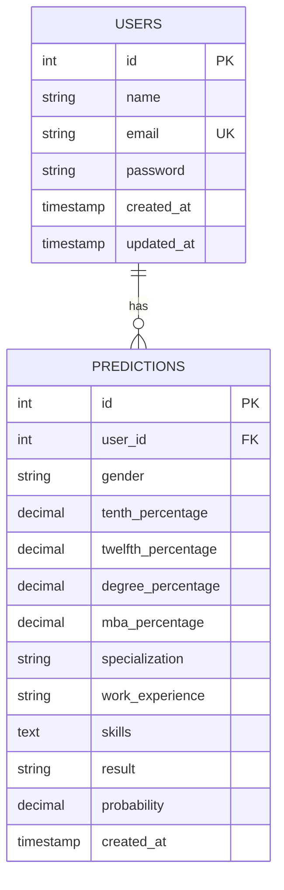

# Machine Learning Processing

<cite>
**Referenced Files in This Document**
- [app.py](file://app.py)
- [train_model.py](file://train_model.py)
- [requirements.txt](file://requirements.txt)
- [database/database.sql](file://database/database.sql)
- [templates/form.html](file://templates/form.html)
- [templates/result.html](file://templates/result.html)
</cite>

## Table of Contents
1. [Introduction](#introduction)
2. [Project Structure](#project-structure)
3. [Core Components](#core-components)
4. [Architecture Overview](#architecture-overview)
5. [Detailed Component Analysis](#detailed-component-analysis)
6. [Dependency Analysis](#dependency-analysis)
7. [Performance Considerations](#performance-considerations)
8. [Troubleshooting Guide](#troubleshooting-guide)
9. [Conclusion](#conclusion)
10. [Appendices](#appendices)

## Introduction
This document explains the machine learning processing pipeline powering the placement prediction portal. It covers how user inputs are transformed into features, how the model performs inference, and how results are presented. The pipeline includes:
- Feature extraction and encoding (gender, specialization, work experience)
- Percentage normalization via scaling
- Skills counting as a feature
- Model loading and error handling
- Prediction execution and probability calculation
- Threshold-based placement determination
- Global model loading strategy and memory considerations

## Project Structure
The application is organized around a Flask web interface, a training script for the ML model, and a database schema. The key files involved in the ML pipeline are:
- app.py: Flask application with model loading, prediction logic, and route handlers
- train_model.py: Training script that builds and persists the model and preprocessing objects
- requirements.txt: Dependencies including scikit-learn, numpy, pandas, joblib
- database/database.sql: Database schema for storing user and prediction data
- templates/form.html and templates/result.html: Frontend forms and result presentation

**Diagram sources**
- [app.py:28-108](file://app.py#L28-L108)
- [train_model.py:175-190](file://train_model.py#L175-L190)
- [database/database.sql:9-35](file://database/database.sql#L9-L35)
- [templates/form.html:12-135](file://templates/form.html#L12-L135)
- [templates/result.html:12-140](file://templates/result.html#L12-L140)

**Section sources**
- [app.py:125-394](file://app.py#L125-L394)
- [train_model.py:109-196](file://train_model.py#L109-L196)
- [requirements.txt:1-27](file://requirements.txt#L1-L27)
- [database/database.sql:1-40](file://database/database.sql#L1-L40)
- [templates/form.html:1-227](file://templates/form.html#L1-L227)
- [templates/result.html:1-312](file://templates/result.html#L1-L312)

## Core Components
- Model loading and persistence: The training script saves a dictionary containing the model, scaler, label encoders, and feature column names. The Flask app loads this artifact at startup and reuses it for predictions.
- Feature extraction and transformation: The prediction function converts raw inputs into a feature array, applies gender/specialization/work experience encodings, counts skills, and scales features using the loaded scaler.
- Model inference: The scaled features are passed to the model for prediction and probability computation.
- Placement determination: The probability of the positive class (Placed) is interpreted as a percentage and mapped to a placement outcome.
- Error handling: Missing model files and runtime exceptions during prediction are handled gracefully with fallback messages.

**Section sources**
- [app.py:28-108](file://app.py#L28-L108)
- [train_model.py:175-190](file://train_model.py#L175-L190)

## Architecture Overview
The ML pipeline integrates with the Flask application lifecycle and the database. The training script produces a persisted model artifact consumed by the web application.

**Diagram sources**
- [app.py:60-108](file://app.py#L60-L108)
- [train_model.py:175-190](file://train_model.py#L175-L190)

## Detailed Component Analysis

### Feature Extraction and Encoding
The prediction function transforms raw form inputs into a numeric feature vector suitable for the model:
- Gender encoding: Male encoded as 1, Female as 0.
- Percentage normalization: Academic percentages are parsed as floats and included as-is; scaling is performed later using the loaded scaler.
- Specialization encoding: Marketing and HR encoded as 0, Marketing and Finance as 1.
- Work experience conversion: Yes encoded as 1, No as 0.
- Skills counting: Skills are split by commas and counted to produce a numeric feature representing skill diversity.

**Diagram sources**
- [app.py:74-90](file://app.py#L74-L90)

**Section sources**
- [app.py:74-90](file://app.py#L74-L90)

### Data Preprocessing and Scaling
Scaling is applied using the StandardScaler persisted alongside the model. The scaler is loaded from the saved model artifact and transforms the feature array prior to inference.

**Diagram sources**
- [app.py:92-93](file://app.py#L92-L93)
- [train_model.py:137-141](file://train_model.py#L137-L141)

**Section sources**
- [app.py:92-93](file://app.py#L92-L93)
- [train_model.py:137-141](file://train_model.py#L137-L141)

### Model Loading Mechanism and Error Handling
The model is loaded at application startup and stored in a global variable for reuse. If the model file is missing, a warning is printed and subsequent predictions return a failure message.

**Diagram sources**
- [app.py:28-39](file://app.py#L28-L39)
- [app.py:384-391](file://app.py#L384-L391)

**Section sources**
- [app.py:28-39](file://app.py#L28-L39)
- [app.py:384-391](file://app.py#L384-L391)

### Prediction Execution and Probability Calculation
After loading the model and scaler, the prediction function:
- Builds a feature array from encoded inputs
- Scales the features
- Runs model.predict() and model.predict_proba()
- Extracts the probability of the positive class (Placed)
- Converts the probability to a percentage and determines the placement outcome

**Diagram sources**
- [app.py:60-108](file://app.py#L60-L108)

**Section sources**
- [app.py:60-108](file://app.py#L60-L108)

### Probability Threshold Logic for Placement Determination
The system interprets the model’s predicted probability of placement to decide the final outcome. While the training script does not define a separate threshold, the application uses a simple rule to map the probability to placement categories and suggests companies accordingly.

**Diagram sources**
- [app.py:110-123](file://app.py#L110-L123)

**Section sources**
- [app.py:110-123](file://app.py#L110-L123)

### Examples of Feature Arrays, Model Outputs, and Prediction Results
- Feature array: A numeric vector combining encoded gender, academic percentages, encoded specialization, encoded work experience, and skills count.
- Model outputs: A prediction label indicating placement outcome and a probability vector with class-wise probabilities.
- Prediction result: A human-readable placement outcome and a percentage probability.

These examples are derived from the feature assembly and prediction logic in the application.

**Section sources**
- [app.py:88-104](file://app.py#L88-L104)

### Global Model Loading Strategy and Memory Management
- Global loading: The model is loaded once at application startup and reused across requests, avoiding repeated disk I/O and initialization overhead.
- Memory considerations: Persisting the scaler and encoders ensures consistent preprocessing and reduces computational overhead during inference. The model artifact is a dictionary containing the model, scaler, label encoders, and feature column names.

**Section sources**
- [app.py:38-39](file://app.py#L38-L39)
- [app.py:384-391](file://app.py#L384-L391)
- [train_model.py:175-190](file://train_model.py#L175-L190)

## Dependency Analysis
The application depends on several libraries for web serving, database connectivity, ML, and data processing. The training script and Flask app share the same ML stack.

**Diagram sources**
- [requirements.txt:4-27](file://requirements.txt#L4-L27)
- [app.py:6-12](file://app.py#L6-L12)
- [train_model.py:7-15](file://train_model.py#L7-L15)

**Section sources**
- [requirements.txt:1-27](file://requirements.txt#L1-L27)
- [app.py:6-12](file://app.py#L6-L12)
- [train_model.py:7-15](file://train_model.py#L7-L15)

## Performance Considerations
- Single load model: Loading the model once at startup minimizes latency and resource usage during inference.
- Efficient scaling: Using a pre-fitted StandardScaler avoids recomputation and maintains consistency across predictions.
- Minimal transformations: The feature extraction is straightforward and fast, dominated by the model inference cost.
- Database writes: Predictions are persisted asynchronously after inference, keeping request handling responsive.

[No sources needed since this section provides general guidance]

## Troubleshooting Guide
- Model file missing: If model.pkl is not found, the application prints a warning and returns a failure message for predictions. Ensure the training script has been executed to generate the model artifact.
- Prediction errors: Exceptions during prediction are caught and reported as an error result. Verify input types and ranges (percentages between 0 and 100).
- Database connectivity: Ensure the database schema is created and credentials are configured in the Flask app configuration.

**Section sources**
- [app.py:34-36](file://app.py#L34-L36)
- [app.py:106-108](file://app.py#L106-L108)
- [database/database.sql:4-35](file://database/database.sql#L4-L35)

## Conclusion
The machine learning processing pipeline integrates cleanly with the Flask application, providing efficient and reliable placement predictions. By persisting the model and preprocessing objects, the system achieves low-latency inference and consistent results. The feature extraction and scaling steps ensure inputs are transformed appropriately, while the probability-based thresholding enables interpretable outcomes.

[No sources needed since this section summarizes without analyzing specific files]

## Appendices

### Data Model Overview
The application uses two primary tables: users and predictions. The predictions table stores user inputs and the resulting prediction outcome for historical tracking.

**Diagram sources**
- [database/database.sql:9-35](file://database/database.sql#L9-L35)

### Frontend Forms and Results
- The prediction form collects gender, work experience, specialization, academic percentages, and skills.
- The result page displays the placement outcome, probability visualization, suggested companies, and input summary.

**Section sources**
- [templates/form.html:12-135](file://templates/form.html#L12-L135)
- [templates/result.html:12-140](file://templates/result.html#L12-L140)