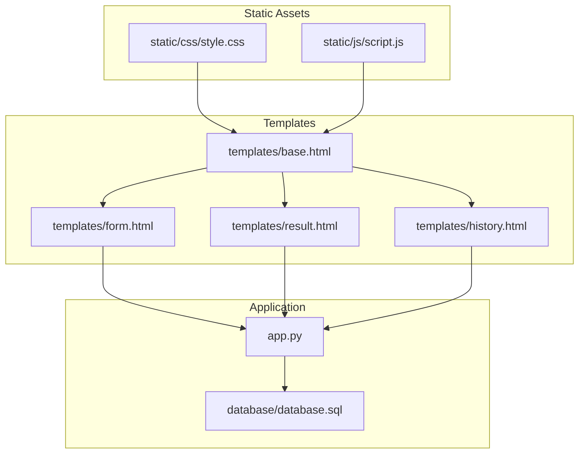
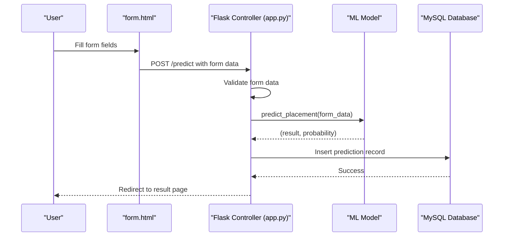
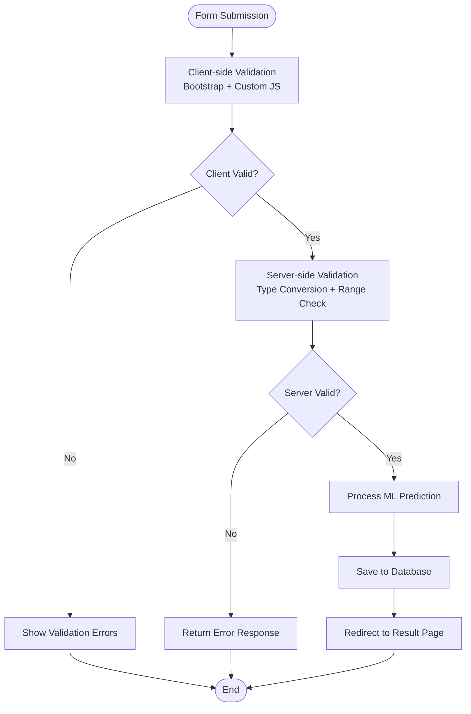
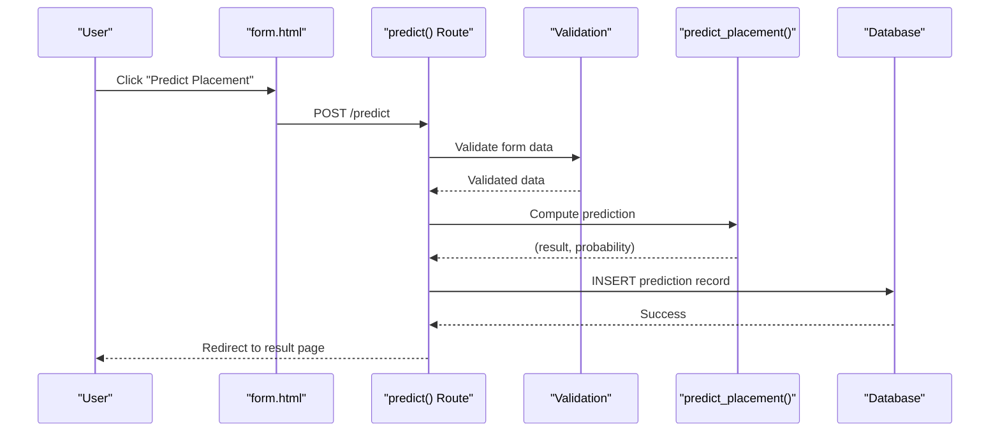
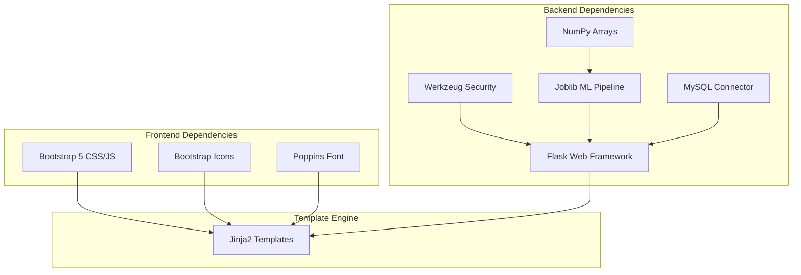

# Prediction Form Interface

<cite>
**Referenced Files in This Document**
- [app.py](file://app.py)
- [form.html](file://templates/form.html)
- [base.html](file://templates/base.html)
- [script.js](file://static/js/script.js)
- [style.css](file://static/css/style.css)
- [database.sql](file://database/database.sql)
- [result.html](file://templates/result.html)
- [history.html](file://templates/history.html)
</cite>

## Table of Contents
1. [Introduction](#introduction)
2. [Project Structure](#project-structure)
3. [Core Components](#core-components)
4. [Architecture Overview](#architecture-overview)
5. [Detailed Component Analysis](#detailed-component-analysis)
6. [Dependency Analysis](#dependency-analysis)
7. [Performance Considerations](#performance-considerations)
8. [Troubleshooting Guide](#troubleshooting-guide)
9. [Conclusion](#conclusion)

## Introduction
This document provides comprehensive technical documentation for the prediction form interface component used to collect student placement prediction inputs. It covers all form fields, validation processes, submission workflow, skills input format, styling with Bootstrap, and responsive design considerations. The form integrates with a machine learning model to predict placement outcomes and persists results to a database.

## Project Structure
The prediction form interface is built using a Flask web application with Jinja2 templating and Bootstrap 5 for styling. The form is rendered by a dedicated template and processed through Flask routes.

**Diagram sources**
- [form.html](file://templates/form.html)
- [base.html](file://templates/base.html)
- [result.html](file://templates/result.html)
- [history.html](file://templates/history.html)
- [style.css](file://static/css/style.css)
- [script.js](file://static/js/script.js)
- [app.py](file://app.py)
- [database.sql](file://database/database.sql)

**Section sources**
- [form.html](file://templates/form.html)
- [base.html](file://templates/base.html)
- [app.py](file://app.py)
- [style.css](file://static/css/style.css)
- [script.js](file://static/js/script.js)
- [database.sql](file://database/database.sql)

## Core Components
The prediction form interface consists of:
- Personal information fields: gender selection
- Academic performance inputs: SSC percentage, HSC percentage, Degree percentage, MBA percentage
- Educational background: specialization selection
- Work experience toggle: Yes/No
- Professional skills input: comma-separated skills list
- Validation: client-side and server-side checks
- Submission workflow: form-to-backend processing and result rendering

Key implementation locations:
- Form definition and layout: [form.html](file://templates/form.html)
- Backend route and processing: [app.py](file://app.py)
- Styling and responsive design: [style.css](file://static/css/style.css)
- Client-side validation and UX enhancements: [script.js](file://static/js/script.js)
- Base template and navigation: [base.html](file://templates/base.html)

**Section sources**
- [form.html](file://templates/form.html)
- [app.py](file://app.py)
- [style.css](file://static/css/style.css)
- [script.js](file://static/js/script.js)
- [base.html](file://templates/base.html)

## Architecture Overview
The prediction form follows a standard MVC pattern with Flask serving as the controller, Jinja2 templates as views, and MySQL as persistence. The form submission triggers a prediction pipeline that processes inputs, invokes the ML model, and stores results.

**Diagram sources**
- [form.html](file://templates/form.html)
- [app.py](file://app.py)

## Detailed Component Analysis

### Form Fields and Inputs
The prediction form collects the following inputs grouped into logical sections:

- Personal Information
  - Gender: Dropdown with options "Male" and "Female"
  - Work Experience: Dropdown with options "Yes" and "No"
  - Specialization: Dropdown with options "Marketing & HR" and "Marketing & Finance"

- Academic Scores
  - SSC percentage: Number input with min 0, max 100, step 0.01
  - HSC percentage: Number input with min 0, max 100, step 0.01
  - Degree percentage: Number input with min 0, max 100, step 0.01
  - MBA percentage: Number input with min 0, max 100, step 0.01

- Professional Skills
  - Skills: Textarea for comma-separated skills list

All inputs are marked as required to ensure complete data collection.

**Section sources**
- [form.html](file://templates/form.html)

### Form Validation Process
The form implements both client-side and server-side validation:

- Client-side validation (JavaScript)
  - Bootstrap form validation: Built-in HTML5 validation attributes trigger Bootstrap styling
  - Real-time percentage validation: Custom validation ensures values are within 0-100 range
  - Additional percentage range check: Prevents submission if any score is outside bounds

- Server-side validation (Python)
  - Type conversion: Numeric fields are converted to floats for processing
  - Range checking: Values validated against 0-100 bounds
  - Required field validation: All fields are required before processing
  - Error handling: Exceptions during prediction return "Error" result

**Diagram sources**
- [script.js](file://static/js/script.js)
- [app.py](file://app.py)

**Section sources**
- [script.js](file://static/js/script.js)
- [app.py](file://app.py)

### Form Submission Workflow
The submission process follows these steps:

1. User submits the form from `/predict` route
2. Flask extracts form data into a dictionary
3. Validation occurs (client-side then server-side)
4. Prediction is computed using the ML model
5. Result and probability are stored in the database
6. User is redirected to the result page with prediction details

**Diagram sources**
- [form.html](file://templates/form.html)
- [app.py](file://app.py)

**Section sources**
- [app.py](file://app.py)
- [form.html](file://templates/form.html)

### Skills Input Format and Parsing Logic
Skills are collected as a comma-separated string and processed as follows:

- Input format: Comma-separated values (e.g., "Python,Java,SQL,Communication")
- Parsing logic: Split by comma, strip whitespace, filter empty entries
- Count calculation: Number of non-empty skills determines the feature count
- Storage: Original comma-separated string is saved to the database

This approach allows flexible input while maintaining consistent processing for the ML model.

**Section sources**
- [app.py](file://app.py)
- [form.html](file://templates/form.html)

### Database Schema and Persistence
Predictions are persisted to the `predictions` table with the following structure:

- Identity: Auto-increment integer primary key
- User association: Foreign key to users table
- Academic scores: Decimal fields with precision 5, scale 2
- Demographics: Gender (M/F), Work experience (Yes/No)
- Education: Specialization (Mkt&HR/Mkt&Fin)
- Skills: Text field storing comma-separated values
- Results: Classification result and probability percentage
- Timestamps: Creation timestamp for audit trails

**Section sources**
- [database.sql](file://database/database.sql)
- [app.py](file://app.py)

### Styling with Bootstrap Classes and Responsive Design
The form utilizes Bootstrap 5 extensively for styling and responsiveness:

- Grid system: Two-column layout for personal info and academic scores
- Form controls: Bootstrap form-select and form-control classes
- Validation feedback: Bootstrap validation states (valid/invalid)
- Responsive breakpoints: Mobile-first design with media queries
- Custom styling: Gradient backgrounds, shadows, and animations
- Icons: Bootstrap Icons for visual enhancement

Responsive considerations include:
- Mobile sidebar toggle for navigation
- Flexible grid layouts adapting to screen sizes
- Touch-friendly input sizing and spacing
- Collapsible sections for smaller screens

**Section sources**
- [style.css](file://static/css/style.css)
- [script.js](file://static/js/script.js)
- [base.html](file://templates/base.html)

### Example Valid Form Submissions
Valid submissions must include:
- All required fields filled
- Academic percentages between 0 and 100
- Properly formatted skills list (comma-separated)
- Consistent data types for numeric fields

Example input combinations:
- Academic scores: 85.50, 78.25, 72.00, 68.50
- Personal info: Male, No work experience, Marketing & HR specialization
- Skills: Python,Java,SQL,Communication,Leadership

### Error Handling Scenarios
Common error scenarios and handling:
- Invalid percentage values: Client-side prevents submission; server validates ranges
- Missing required fields: Bootstrap validation prevents submission
- Model loading failures: Graceful fallback with error messaging
- Database connectivity issues: Flask error handlers manage exceptions
- Authentication: Redirects to login for unauthorized access

**Section sources**
- [app.py](file://app.py)
- [script.js](file://static/js/script.js)

## Dependency Analysis
The prediction form interface has the following key dependencies:

**Diagram sources**
- [app.py](file://app.py)
- [base.html](file://templates/base.html)
- [style.css](file://static/css/style.css)
- [script.js](file://static/js/script.js)

**Section sources**
- [app.py](file://app.py)
- [base.html](file://templates/base.html)

## Performance Considerations
- Client-side validation reduces unnecessary server requests
- Efficient Bootstrap styling minimizes CSS overhead
- Optimized JavaScript event handling prevents memory leaks
- Database indexing on foreign keys improves query performance
- Model caching avoids repeated loading costs

## Troubleshooting Guide
Common issues and resolutions:
- Form not submitting: Check browser console for JavaScript errors
- Validation not working: Verify Bootstrap CSS/JS assets are loaded
- Model errors: Ensure model.pkl exists and is accessible
- Database connection: Confirm MySQL credentials and table existence
- Navigation issues: Verify session management and route protection

**Section sources**
- [app.py](file://app.py)
- [script.js](file://static/js/script.js)
- [base.html](file://templates/base.html)

## Conclusion
The prediction form interface provides a robust, user-friendly mechanism for collecting placement prediction inputs. Its combination of client-side validation, server-side processing, and Bootstrap styling delivers a responsive, accessible experience. The integration with the ML model and database ensures comprehensive functionality from data collection to result presentation.