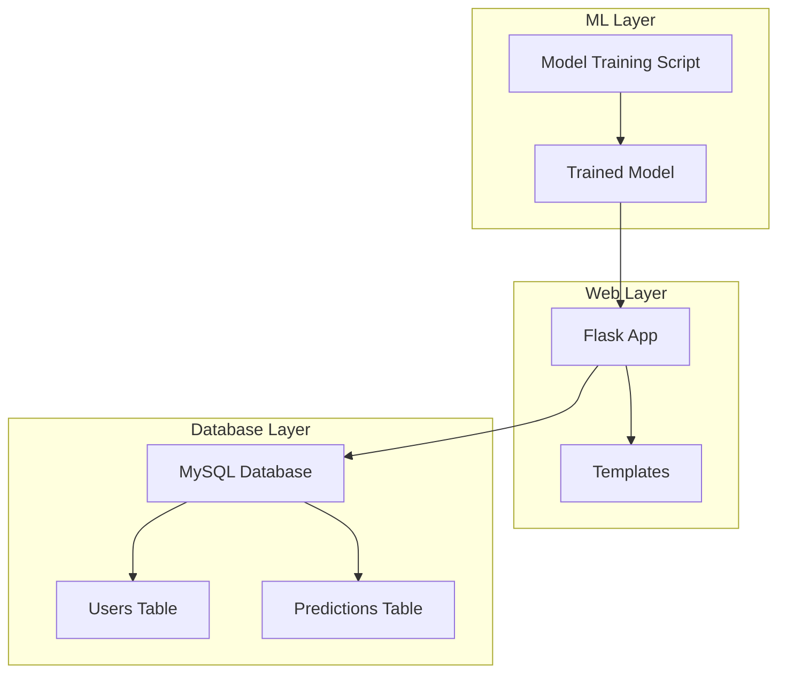
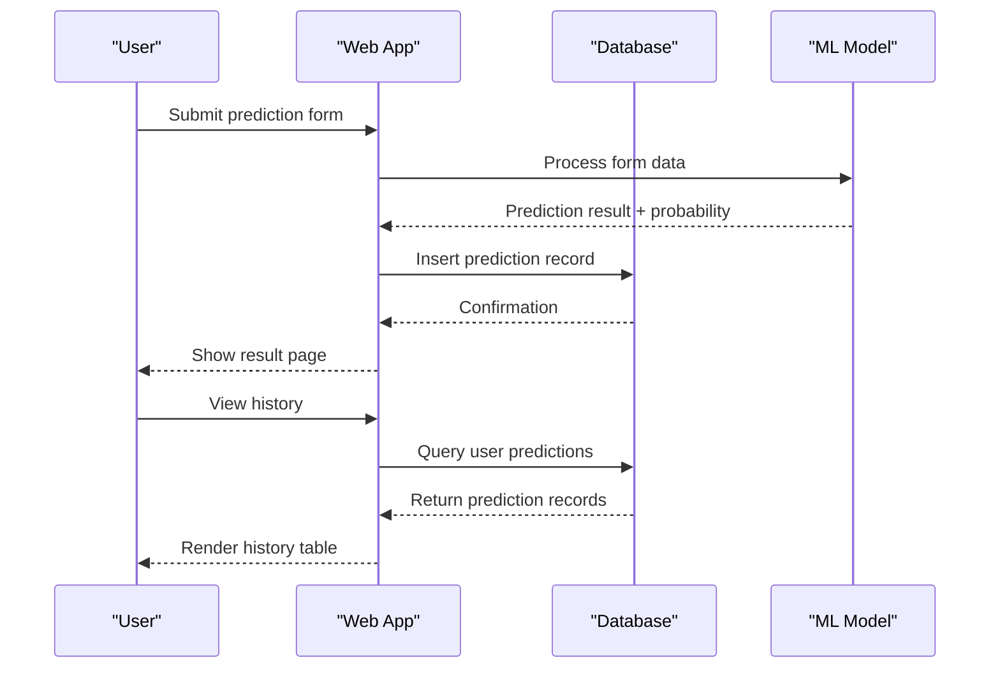
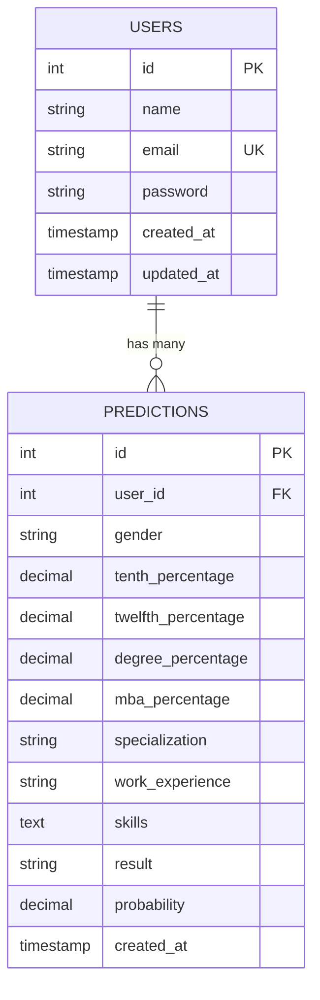
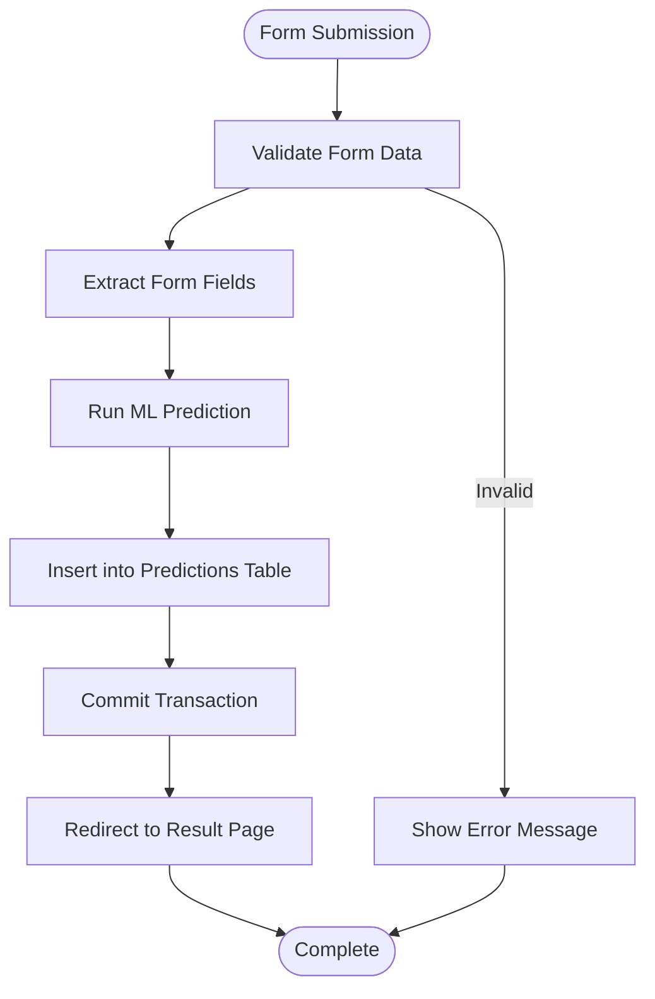
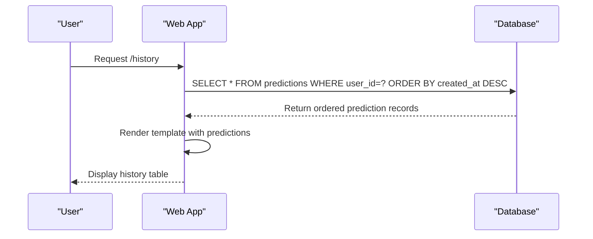
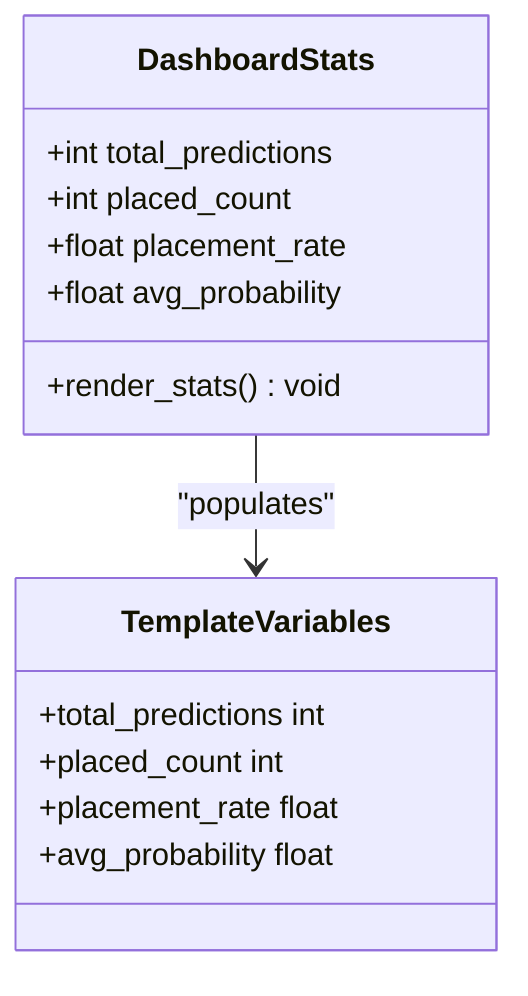
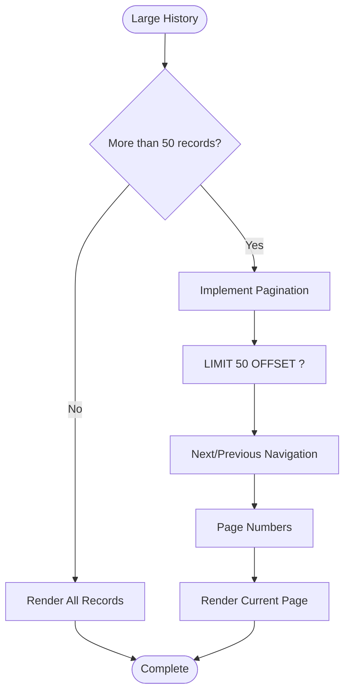
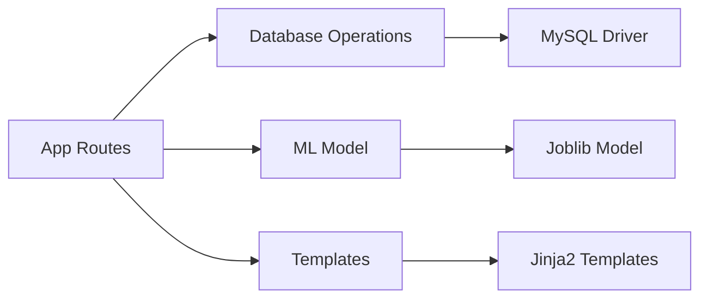

# Prediction History Tracking

<cite>
**Referenced Files in This Document**
- [database.sql](file://database/database.sql)
- [app.py](file://app.py)
- [history.html](file://templates/history.html)
- [dashboard.html](file://templates/dashboard.html)
- [form.html](file://templates/form.html)
- [result.html](file://templates/result.html)
- [requirements.txt](file://requirements.txt)
- [train_model.py](file://train_model.py)
</cite>

## Table of Contents
1. [Introduction](#introduction)
2. [Project Structure](#project-structure)
3. [Core Components](#core-components)
4. [Architecture Overview](#architecture-overview)
5. [Detailed Component Analysis](#detailed-component-analysis)
6. [Dependency Analysis](#dependency-analysis)
7. [Performance Considerations](#performance-considerations)
8. [Troubleshooting Guide](#troubleshooting-guide)
9. [Conclusion](#conclusion)

## Introduction
This document provides comprehensive documentation for the prediction history tracking system in the Student Placement Prediction Portal. The system captures user academic scores, personal attributes, and prediction outcomes, storing them in a relational database and presenting analytics through a web interface. It covers the database schema, insertion process, history retrieval logic, analytics calculations, dashboard statistics display, and pagination considerations for large prediction histories.

## Project Structure
The project follows a Flask web application architecture with a MySQL database backend. Key components include:
- Database schema definition for users and predictions
- Flask application routes handling prediction creation, storage, retrieval, and analytics
- Jinja2 templates for rendering prediction history and dashboard statistics
- Machine learning model training script for generating predictions



**Diagram sources**
- [app.py:125-394](file://app.py#L125-L394)
- [database.sql:9-35](file://database/database.sql#L9-L35)
- [train_model.py:109-196](file://train_model.py#L109-L196)

**Section sources**
- [app.py:125-394](file://app.py#L125-L394)
- [database.sql:9-35](file://database/database.sql#L9-L35)
- [requirements.txt:1-27](file://requirements.txt#L1-L27)

## Core Components
The prediction history tracking system comprises three core components:
- Database schema with users and predictions tables
- Flask application routes for prediction lifecycle
- Template rendering for history and analytics display

Key implementation patterns:
- User authentication and session management
- Machine learning prediction pipeline
- Database CRUD operations for prediction records
- Analytics computation and dashboard rendering

**Section sources**
- [database.sql:9-35](file://database/database.sql#L9-L35)
- [app.py:125-394](file://app.py#L125-L394)
- [history.html:12-122](file://templates/history.html#L12-L122)
- [dashboard.html:14-59](file://templates/dashboard.html#L14-L59)

## Architecture Overview
The system architecture integrates web routing, database persistence, and machine learning inference:



**Diagram sources**
- [app.py:238-293](file://app.py#L238-L293)
- [app.py:337-354](file://app.py#L337-L354)
- [database.sql:19-35](file://database/database.sql#L19-L35)

## Detailed Component Analysis

### Database Schema
The database schema consists of two primary tables with referential integrity:



**Diagram sources**
- [database.sql:9-35](file://database/database.sql#L9-L35)

Key schema characteristics:
- Users table stores authentication and profile information
- Predictions table maintains user-specific prediction history
- Foreign key constraint ensures referential integrity
- Timestamps track creation and modification times

**Section sources**
- [database.sql:9-35](file://database/database.sql#L9-L35)

### Prediction Insertion Process
The insertion process captures form data and stores it in the predictions table:



**Diagram sources**
- [app.py:238-293](file://app.py#L238-L293)
- [database.sql:19-35](file://database/database.sql#L19-L35)

Implementation details:
- Form data extraction includes gender, academic scores, specialization, work experience, and skills
- ML model processes encoded features to produce prediction result and probability
- Database insertion uses prepared statements with user_id foreign key
- Session-based user identification ensures data privacy

**Section sources**
- [app.py:245-293](file://app.py#L245-L293)
- [form.html:12-135](file://templates/form.html#L12-L135)

### History Retrieval Logic
History retrieval implements user-specific filtering and chronological ordering:



**Diagram sources**
- [app.py:337-354](file://app.py#L337-L354)
- [history.html:337-354](file://app.py#L337-L354)

Key features:
- User-specific filtering prevents cross-user data access
- Descending chronological order prioritizes recent predictions
- Template-level analytics compute totals and averages
- Empty state handling for new users

**Section sources**
- [app.py:337-354](file://app.py#L337-L354)
- [history.html:12-122](file://templates/history.html#L12-L122)

### Analytics Calculations
The system performs analytics at both database and template levels:

```mermaid
flowchart TD
subgraph "Database Analytics"
A1[COUNT(*)] --> A2[Total Predictions]
A3[SUM(CASE WHEN result='Placed' THEN 1 ELSE 0 END)] --> A4[Placed Count]
A5[AVG(probability)] --> A6[Average Probability]
end
subgraph "Template Analytics"
B1[Length of predictions] --> B2[Total Predictions]
B3[Filter by result='Placed'] --> B4[Placed Count]
B5[Sum probabilities / Count] --> B6[Average Probability]
end
A2 --> C[Dashboard Display]
A4 --> C
A6 --> C
B2 --> C
B4 --> C
B6 --> C
```

**Diagram sources**
- [app.py:143-167](file://app.py#L143-L167)
- [history.html:13-44](file://templates/history.html#L13-L44)
- [dashboard.html:14-59](file://templates/dashboard.html#L14-L59)

Analytics computations:
- Total predictions: COUNT(*) from predictions table
- Placement counts: Conditional aggregation for result='Placed'
- Average probability: AVG(probability) from predictions table
- Placement rate: (placed_count / total_predictions) * 100

**Section sources**
- [app.py:143-167](file://app.py#L143-L167)
- [history.html:13-44](file://templates/history.html#L13-L44)
- [dashboard.html:14-59](file://templates/dashboard.html#L14-L59)

### Dashboard Statistics Display
The dashboard presents user prediction metrics through four key statistics:



**Diagram sources**
- [app.py:133-167](file://app.py#L133-L167)
- [dashboard.html:14-59](file://templates/dashboard.html#L14-L59)

Display characteristics:
- Total predictions card with calculator icon
- Placed predictions card with check-circle icon
- Placement rate card with graph-up icon
- Average probability card with percent icon

**Section sources**
- [app.py:133-167](file://app.py#L133-L167)
- [dashboard.html:14-59](file://templates/dashboard.html#L14-L59)

### Pagination Considerations
For large prediction histories, consider implementing pagination:



Recommended pagination implementation:
- Use LIMIT and OFFSET clauses for efficient querying
- Implement page navigation with Next/Previous buttons
- Add page number indicators for large datasets
- Consider server-side sorting with created_at DESC

**Section sources**
- [app.py:337-354](file://app.py#L337-L354)

## Dependency Analysis
The system exhibits clear separation of concerns with minimal coupling:



**Diagram sources**
- [app.py:125-394](file://app.py#L125-L394)
- [requirements.txt:4-27](file://requirements.txt#L4-L27)

Key dependencies:
- Flask framework for web routing and templating
- MySQL driver for database connectivity
- Scikit-learn for machine learning inference
- Joblib for model serialization

**Section sources**
- [requirements.txt:4-27](file://requirements.txt#L4-L27)
- [app.py:125-394](file://app.py#L125-L394)

## Performance Considerations
Performance optimization recommendations for the prediction history tracking system:

- Database indexing: Add indexes on user_id and created_at columns for faster queries
- Query optimization: Use LIMIT clauses for paginated results
- Model caching: Load ML model once during application startup
- Connection pooling: Implement persistent database connections
- Template optimization: Minimize complex Jinja2 filters for large datasets
- Caching strategy: Cache frequently accessed user statistics

## Troubleshooting Guide
Common issues and solutions for the prediction history tracking system:

**Database Connection Issues**
- Verify MySQL service is running and credentials are correct
- Check foreign key constraint violations for user_id references
- Ensure database schema is properly initialized

**Prediction Storage Failures**
- Validate form data types and ranges before insertion
- Check for NULL values in required fields
- Monitor transaction commit failures

**Analytics Calculation Errors**
- Handle division by zero for empty prediction histories
- Validate probability values are within expected ranges
- Check for NULL values in analytics queries

**Template Rendering Problems**
- Verify session variables are properly set
- Check template variable availability in context
- Validate date formatting for timestamp fields

**Section sources**
- [app.py:363-373](file://app.py#L363-L373)
- [app.py:42-58](file://app.py#L42-L58)

## Conclusion
The prediction history tracking system provides a robust foundation for capturing and analyzing student placement predictions. Its modular architecture supports scalability through pagination, maintains data integrity via foreign key constraints, and delivers meaningful analytics through both database and template-level computations. The system demonstrates clean separation of concerns while maintaining performance through careful query design and template optimization.

Future enhancements could include advanced analytics, export capabilities, and real-time prediction updates to further improve the user experience and analytical insights.