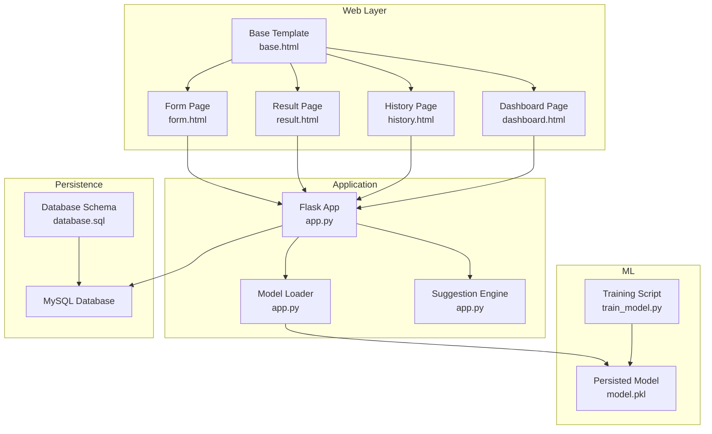
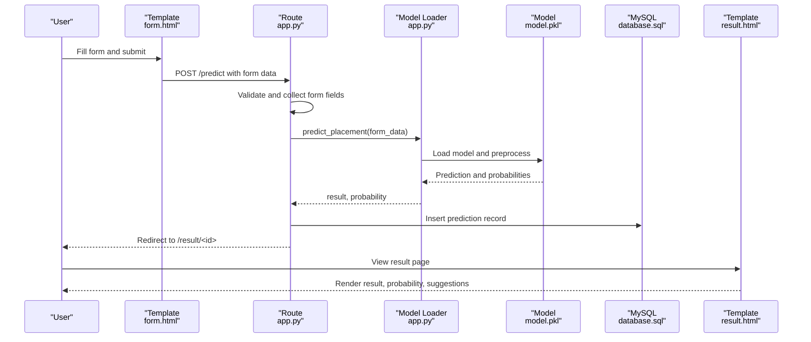
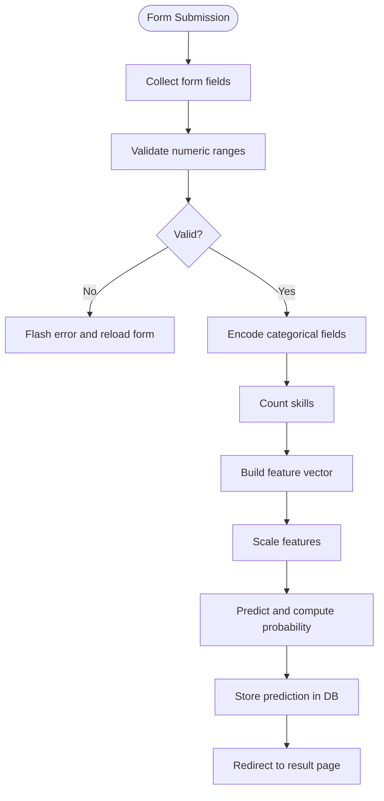
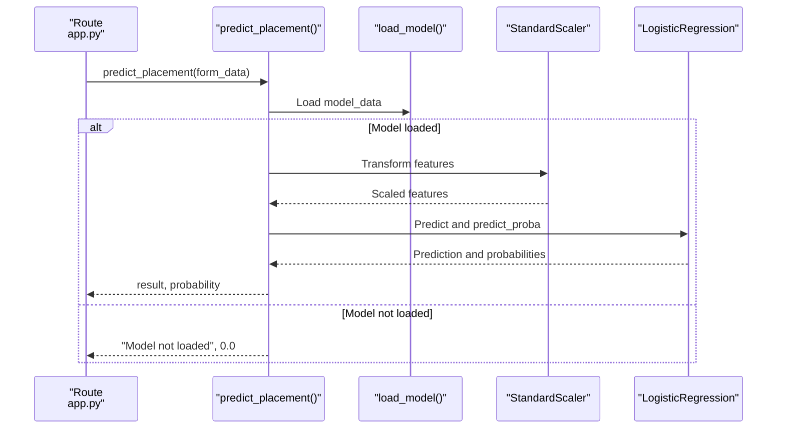
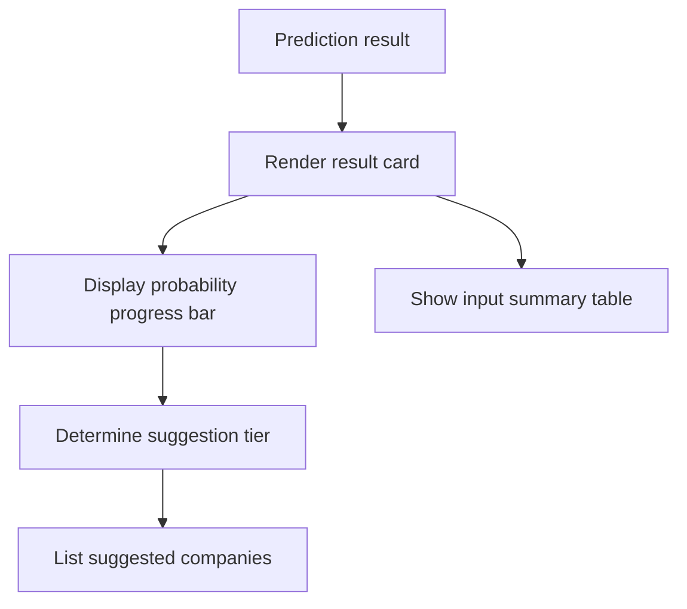
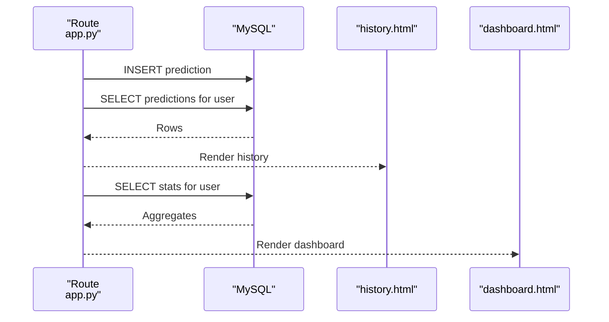
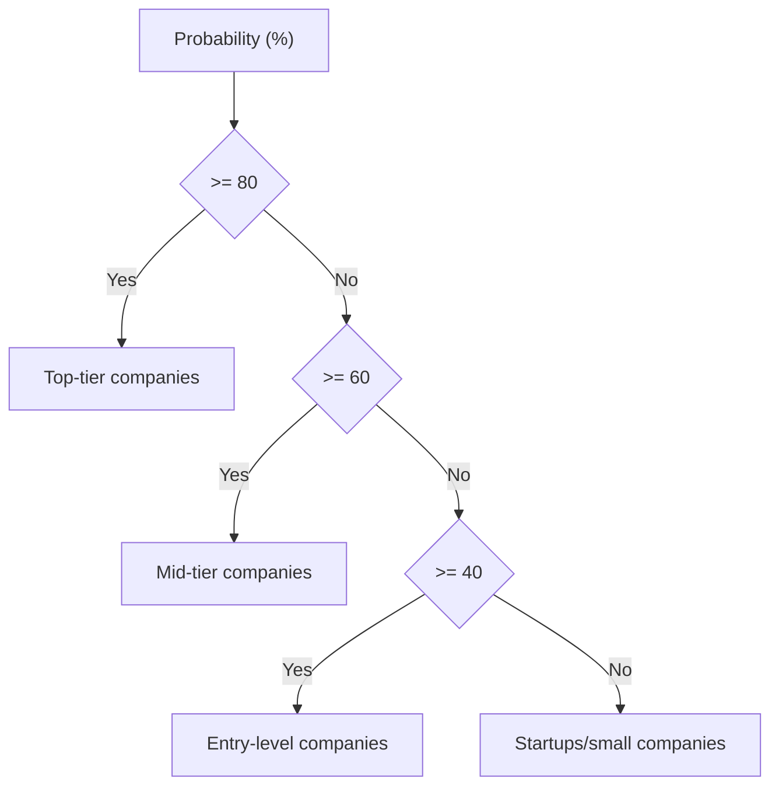
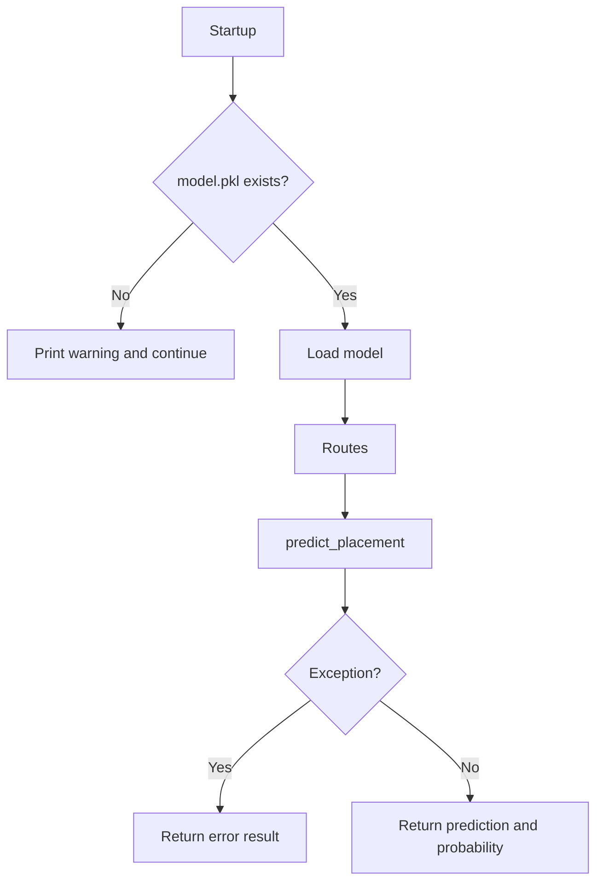
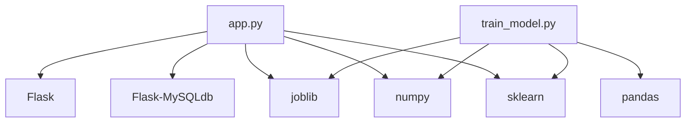
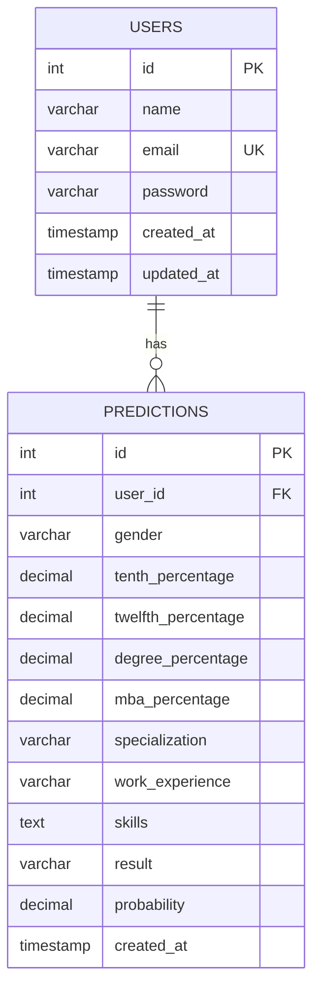

# Prediction System

<cite>
**Referenced Files in This Document**
- [app.py](file://app.py)
- [train_model.py](file://train_model.py)
- [database.sql](file://database/database.sql)
- [form.html](file://templates/form.html)
- [result.html](file://templates/result.html)
- [history.html](file://templates/history.html)
- [dashboard.html](file://templates/dashboard.html)
- [base.html](file://templates/base.html)
- [requirements.txt](file://requirements.txt)
</cite>

## Table of Contents
1. [Introduction](#introduction)
2. [Project Structure](#project-structure)
3. [Core Components](#core-components)
4. [Architecture Overview](#architecture-overview)
5. [Detailed Component Analysis](#detailed-component-analysis)
6. [Dependency Analysis](#dependency-analysis)
7. [Performance Considerations](#performance-considerations)
8. [Troubleshooting Guide](#troubleshooting-guide)
9. [Conclusion](#conclusion)
10. [Appendices](#appendices)

## Introduction
This document describes the placement prediction system built with Flask and scikit-learn. It covers the prediction form interface, validation and data collection, machine learning model integration, result interpretation, prediction history tracking, suggestion engine, error handling, and user feedback mechanisms. The system predicts whether a student is likely to be placed based on academic scores, personal attributes, and professional skills.

## Project Structure
The system consists of:
- A Flask web application that serves pages and routes.
- HTML templates for the form, result, history, dashboard, and base layout.
- A training script that builds and persists a logistic regression model.
- A MySQL database schema for storing users and prediction history.

**Diagram sources**
- [app.py:126-394](file://app.py#L126-L394)
- [form.html:1-227](file://templates/form.html#L1-L227)
- [result.html:1-312](file://templates/result.html#L1-L312)
- [history.html:1-306](file://templates/history.html#L1-L306)
- [dashboard.html:1-154](file://templates/dashboard.html#L1-L154)
- [train_model.py:109-196](file://train_model.py#L109-L196)
- [database.sql:1-40](file://database/database.sql#L1-L40)

**Section sources**
- [app.py:126-394](file://app.py#L126-L394)
- [requirements.txt:1-27](file://requirements.txt#L1-L27)

## Core Components
- Prediction form interface with fields for academic performance, personal information, and professional skills.
- Validation pipeline for form inputs and model prediction.
- Machine learning model integration using a persisted logistic regression model.
- Result rendering with probability visualization and company suggestions.
- Prediction history tracking stored in MySQL with per-user statistics.
- Suggestion engine that recommends companies based on probability thresholds.
- Error handling for model loading, prediction failures, and invalid inputs.

**Section sources**
- [app.py:60-123](file://app.py#L60-L123)
- [app.py:238-354](file://app.py#L238-L354)
- [form.html:12-136](file://templates/form.html#L12-L136)
- [result.html:13-140](file://templates/result.html#L13-L140)
- [history.html:47-121](file://templates/history.html#L47-L121)
- [database.sql:19-35](file://database/database.sql#L19-L35)

## Architecture Overview
The system follows a layered architecture:
- Presentation layer: Jinja2 templates and Flask routes.
- Business logic: Prediction pipeline, suggestion engine, and database operations.
- Data layer: MySQL persistence for users and predictions.
- ML layer: Persisted model loaded at startup and used for inference.

**Diagram sources**
- [app.py:238-317](file://app.py#L238-L317)
- [form.html:12-136](file://templates/form.html#L12-L136)
- [result.html:13-140](file://templates/result.html#L13-L140)
- [database.sql:19-35](file://database/database.sql#L19-L35)

## Detailed Component Analysis

### Prediction Form Interface
The form collects:
- Academic performance: SSC, HSC, Degree, MBA percentages.
- Personal information: Gender, work experience, specialization.
- Professional skills: Comma-separated skills.

Validation:
- Frontend validation ensures percentage values are within 0–100.
- Backend validation occurs during prediction processing.

**Diagram sources**
- [form.html:12-136](file://templates/form.html#L12-L136)
- [app.py:245-291](file://app.py#L245-L291)

**Section sources**
- [form.html:12-136](file://templates/form.html#L12-L136)
- [app.py:245-291](file://app.py#L245-L291)

### Prediction Algorithm and Model Integration
- Model loading: On startup, the application attempts to load the persisted model.
- Feature extraction and preprocessing:
  - Encode gender, specialization, and work experience.
  - Convert percentages to floats.
  - Count skills from comma-separated input.
  - Scale features using the fitted scaler.
- Prediction:
  - Predict class and class probabilities.
  - Interpret probability of “Placed” as percentage.
- Error handling:
  - If model is not found, return an error result.
  - If prediction fails, return an error result.

**Diagram sources**
- [app.py:28-108](file://app.py#L28-L108)
- [train_model.py:138-151](file://train_model.py#L138-L151)

**Section sources**
- [app.py:28-108](file://app.py#L28-L108)
- [train_model.py:109-196](file://train_model.py#L109-L196)

### Result Interpretation and Display
- Result: “Placed” or “Not Placed”.
- Probability: Percentage chance of placement.
- Visualization: Progress bar with color-coded thresholds.
- Company suggestions: Based on probability thresholds.
- Input summary: Displays all collected inputs for transparency.

**Diagram sources**
- [result.html:13-140](file://templates/result.html#L13-L140)
- [app.py:110-123](file://app.py#L110-L123)

**Section sources**
- [result.html:13-140](file://templates/result.html#L13-L140)
- [app.py:110-123](file://app.py#L110-L123)

### Prediction History Tracking
- Storage: Each prediction is inserted into the predictions table with user association.
- Retrieval: History lists all predictions for the current user, sorted by creation time.
- Statistics: Dashboard aggregates counts, placement rate, and average probability.

**Diagram sources**
- [app.py:266-291](file://app.py#L266-L291)
- [app.py:344-354](file://app.py#L344-L354)
- [app.py:144-167](file://app.py#L144-L167)
- [database.sql:19-35](file://database/database.sql#L19-L35)

**Section sources**
- [app.py:266-291](file://app.py#L266-L291)
- [app.py:344-354](file://app.py#L344-L354)
- [app.py:144-167](file://app.py#L144-L167)
- [history.html:47-121](file://templates/history.html#L47-L121)
- [dashboard.html:14-59](file://templates/dashboard.html#L14-L59)

### Suggestion Engine
- Threshold-based company recommendations:
  - High probability: Top-tier companies.
  - Medium probability: Mid-tier companies.
  - Low probability: Entry-level and startup options.

**Diagram sources**
- [app.py:110-123](file://app.py#L110-L123)

**Section sources**
- [app.py:110-123](file://app.py#L110-L123)

### Error Handling
- Model loading failure: Warning printed and model not loaded.
- Prediction failure: Error result returned and user notified.
- Input validation: Frontend prevents invalid percentages; backend handles conversion and exceptions.
- Route protection: Non-authenticated users are redirected to login.

**Diagram sources**
- [app.py:28-108](file://app.py#L28-L108)
- [app.py:384-390](file://app.py#L384-L390)

**Section sources**
- [app.py:363-372](file://app.py#L363-L372)
- [app.py:28-108](file://app.py#L28-L108)

### User Feedback Mechanisms
- Flash messages for actions and errors.
- Visual indicators in results and history (progress bars, badges, icons).
- Navigation and quick actions for seamless user experience.

**Section sources**
- [base.html:86-99](file://templates/base.html#L86-L99)
- [result.html:13-140](file://templates/result.html#L13-L140)
- [history.html:47-121](file://templates/history.html#L47-L121)
- [dashboard.html:61-111](file://templates/dashboard.html#L61-L111)

## Dependency Analysis
External libraries and their roles:
- Flask: Web framework and routing.
- Flask-MySQLdb: MySQL connectivity.
- scikit-learn: Training and inference.
- numpy/pandas: Numerical processing.
- joblib: Model serialization.
- Werkzeug: Password hashing and utilities.

**Diagram sources**
- [requirements.txt:4-27](file://requirements.txt#L4-L27)
- [app.py:6-12](file://app.py#L6-L12)
- [train_model.py:7-15](file://train_model.py#L7-L15)

**Section sources**
- [requirements.txt:1-27](file://requirements.txt#L1-L27)

## Performance Considerations
- Model loading: Load once at startup to avoid repeated I/O.
- Feature scaling: Use the fitted scaler to ensure consistent preprocessing.
- Database queries: Use indexed foreign keys and limit result sets for history.
- Rendering: Templates are lightweight; keep model inference fast.

[No sources needed since this section provides general guidance]

## Troubleshooting Guide
Common issues and resolutions:
- Model not found: Ensure the training script has generated model.pkl and the application can locate it.
- Database connection errors: Verify MySQL credentials and that the database schema is applied.
- Prediction errors: Confirm form inputs are valid and model is loaded.
- Redirect loops: Ensure sessions are established and user is authenticated.

**Section sources**
- [app.py:384-390](file://app.py#L384-L390)
- [database.sql:1-40](file://database/database.sql#L1-L40)

## Conclusion
The placement prediction system integrates a logistic regression model with a Flask web interface to provide personalized placement insights. It validates inputs, performs robust preprocessing, renders interpretable results, and maintains a persistent history. The suggestion engine enhances usability by recommending suitable companies. Proper error handling and user feedback mechanisms ensure a smooth user experience.

[No sources needed since this section summarizes without analyzing specific files]

## Appendices

### Database Schema
- Users table: Stores user credentials and timestamps.
- Predictions table: Stores per-user prediction records with all inputs and outcomes.

**Diagram sources**
- [database.sql:9-17](file://database/database.sql#L9-L17)
- [database.sql:19-35](file://database/database.sql#L19-L35)

### Example Prediction Workflow
- User fills the form with academic scores, personal details, and skills.
- The system validates inputs and encodes categorical variables.
- Features are scaled and passed to the model for prediction.
- The result page displays placement outcome, probability, and suggested companies.
- The prediction is stored in the database for future reference.

**Section sources**
- [form.html:12-136](file://templates/form.html#L12-L136)
- [app.py:245-291](file://app.py#L245-L291)
- [result.html:13-140](file://templates/result.html#L13-L140)
- [history.html:47-121](file://templates/history.html#L47-L121)