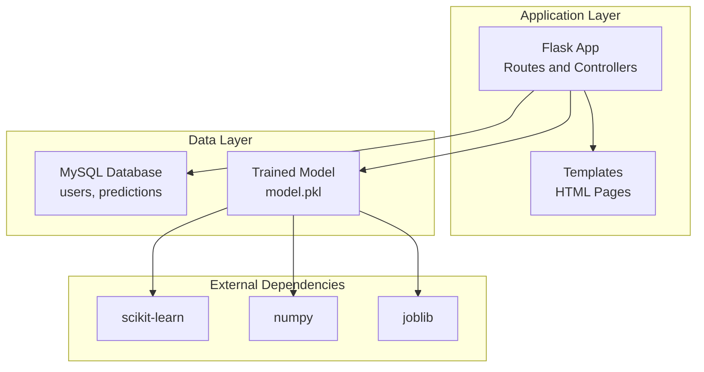
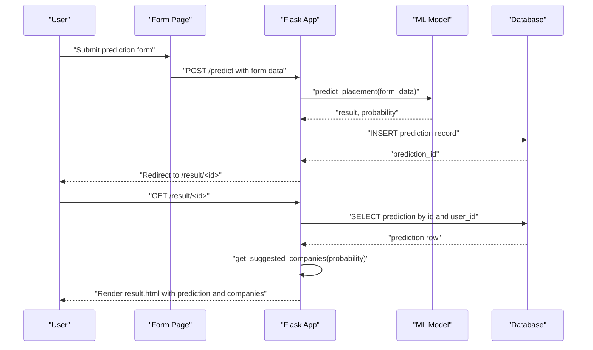
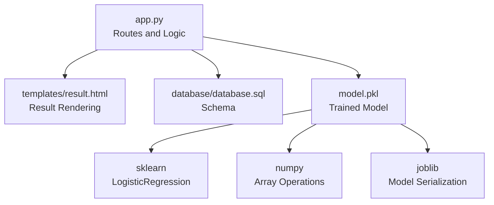

# Result Interpretation and Display

<cite>
**Referenced Files in This Document**
- [app.py](file://app.py)
- [templates/result.html](file://templates/result.html)
- [templates/history.html](file://templates/history.html)
- [templates/form.html](file://templates/form.html)
- [database/database.sql](file://database/database.sql)
- [train_model.py](file://train_model.py)
- [requirements.txt](file://requirements.txt)
</cite>

## Table of Contents
1. [Introduction](#introduction)
2. [Project Structure](#project-structure)
3. [Core Components](#core-components)
4. [Architecture Overview](#architecture-overview)
5. [Detailed Component Analysis](#detailed-component-analysis)
6. [Dependency Analysis](#dependency-analysis)
7. [Performance Considerations](#performance-considerations)
8. [Troubleshooting Guide](#troubleshooting-guide)
9. [Conclusion](#conclusion)

## Introduction
This document explains the result interpretation and display system for the Student Placement Prediction Portal. It covers how prediction outcomes are converted to human-readable strings, how placement probabilities are calculated and displayed as percentages, how company suggestions are generated based on probability thresholds, and how results are rendered and persisted. It also documents the database query used to retrieve individual prediction results by ID and provides examples of different outcomes and corresponding company suggestions.

## Project Structure
The system is organized around a Flask application with HTML templates for rendering pages, a MySQL database for persistence, and a machine learning model for predictions.

**Diagram sources**
- [app.py:126-394](file://app.py#L126-L394)
- [database/database.sql:9-35](file://database/database.sql#L9-L35)
- [train_model.py:109-196](file://train_model.py#L109-L196)

**Section sources**
- [app.py:126-394](file://app.py#L126-L394)
- [database/database.sql:9-35](file://database/database.sql#L9-L35)
- [requirements.txt:1-27](file://requirements.txt#L1-L27)

## Core Components
- Prediction pipeline: Converts form inputs into scaled features, runs inference, and returns a human-readable result and probability.
- Company suggestion engine: Provides company recommendations based on probability thresholds.
- Result rendering: Displays the prediction outcome, probability visualization, and suggested companies.
- Persistence and retrieval: Stores predictions in the database and retrieves them by ID for display.
- Threshold-based recommendations:
  - 80%+: Premium tech and service companies
  - 60%–79%: Mid-tier IT firms
  - 40%–59%: Entry-level IT companies
  - Below 40%: Startups and small IT companies

**Section sources**
- [app.py:60-123](file://app.py#L60-L123)
- [templates/result.html:13-80](file://templates/result.html#L13-L80)
- [database/database.sql:19-35](file://database/database.sql#L19-L35)

## Architecture Overview
The result interpretation and display system integrates the following flows:
- Prediction route accepts form data, runs inference, persists the result, and redirects to the result page.
- Result page renders the prediction outcome, probability bar, and company suggestions.
- History page lists previous predictions with summary statistics and links to individual results.

**Diagram sources**
- [app.py:238-293](file://app.py#L238-L293)
- [app.py:294-317](file://app.py#L294-L317)
- [templates/result.html:13-80](file://templates/result.html#L13-L80)

## Detailed Component Analysis

### Prediction Outcome Interpretation
- Human-readable result: The model predicts a class; the system maps it to "Placed" or "Not Placed".
- Probability calculation: The model returns class probabilities; the system extracts the probability of the "Placed" class and converts it to a percentage.
- Rounding: The percentage is rounded to two decimal places for display.

Key implementation references:
- Prediction and probability extraction: [app.py:60-108](file://app.py#L60-L108)
- Result mapping: [app.py:102](file://app.py#L102)
- Probability rounding: [app.py:104](file://app.py#L104)

**Section sources**
- [app.py:60-108](file://app.py#L60-L108)

### Probability Display Format
- The result page displays a progress bar whose width equals the probability percentage.
- The progress bar color varies by threshold:
  - 70%+ (green)
  - 40%–69% (yellow)
  - Below 40% (red)
- A contextual message is shown based on the probability range.

Key implementation references:
- Progress bar rendering: [templates/result.html:35-58](file://templates/result.html#L35-L58)

**Section sources**
- [templates/result.html:35-58](file://templates/result.html#L35-L58)

### Company Suggestion Engine
- Threshold-based recommendations:
  - 80%+: TCS, Infosys, Wipro, Google, Microsoft, Amazon
  - 60%–79%: TCS, Infosys, Wipro, Cognizant, Accenture
  - 40%–59%: TCS, Wipro, Cognizant
  - Below 40%: Wipro, Startups, Small IT Companies
- The function returns a list of company names based on the numeric probability.

Key implementation references:
- Suggestion logic: [app.py:110-123](file://app.py#L110-L123)

**Section sources**
- [app.py:110-123](file://app.py#L110-L123)

### Result Page Rendering
The result page renders:
- Main result card with icon, status text ("Placed" or "Not Placed"), and contextual subtitle.
- Placement probability section with progress bar and emoji-based message.
- Suggested companies grid with company badges.
- Input summary table showing all submitted features.

Key implementation references:
- Result card and probability section: [templates/result.html:13-58](file://templates/result.html#L13-L58)
- Company suggestions grid: [templates/result.html:63-79](file://templates/result.html#L63-L79)
- Input summary table: [templates/result.html:82-127](file://templates/result.html#L82-L127)

**Section sources**
- [templates/result.html:13-127](file://templates/result.html#L13-L127)

### Database Query for Retrieving Individual Prediction Results
- The result route queries the predictions table by ID and ensures the record belongs to the current user.
- The query filters by both id and user_id to prevent unauthorized access.

Key implementation references:
- Query and filtering: [app.py:294-317](file://app.py#L294-L317)

**Section sources**
- [app.py:294-317](file://app.py#L294-L317)

### Persistence and Retrieval Mechanisms
- Persistence:
  - On successful prediction, the system inserts a new record into the predictions table with user_id, form fields, result, and probability.
  - The last inserted ID is captured and used to redirect to the result page.
- Retrieval:
  - The result page fetches a single prediction by ID and user_id.
  - The history page lists all predictions for the current user, ordered by creation date.

Key implementation references:
- Insertion and redirect: [app.py:265-290](file://app.py#L265-L290)
- Single record retrieval: [app.py:294-317](file://app.py#L294-L317)
- History listing: [app.py:337-354](file://app.py#L337-L354)

**Section sources**
- [app.py:265-290](file://app.py#L265-L290)
- [app.py:294-317](file://app.py#L294-L317)
- [app.py:337-354](file://app.py#L337-L354)

### Example Scenarios and Company Suggestions
Below are representative scenarios with outcomes and corresponding company suggestions:

- Scenario A: Probability 90%
  - Result: "Placed"
  - Companies: TCS, Infosys, Wipro, Google, Microsoft, Amazon
- Scenario B: Probability 70%
  - Result: "Placed"
  - Companies: TCS, Infosys, Wipro, Google, Microsoft, Amazon
- Scenario C: Probability 65%
  - Result: "Placed"
  - Companies: TCS, Infosys, Wipro, Cognizant, Accenture
- Scenario D: Probability 50%
  - Result: "Placed"
  - Companies: TCS, Infosys, Wipro, Cognizant, Accenture
- Scenario E: Probability 45%
  - Result: "Placed"
  - Companies: TCS, Wipro, Cognizant
- Scenario F: Probability 30%
  - Result: "Not Placed"
  - Companies: Wipro, Startups, Small IT Companies

These examples illustrate how the threshold-based suggestion engine maps numeric probabilities to company lists.

**Section sources**
- [app.py:110-123](file://app.py#L110-L123)

## Dependency Analysis
The result interpretation and display system depends on:
- Flask routes and template rendering for UI presentation.
- MySQL database for storing user and prediction data.
- scikit-learn model for inference and probability estimation.
- joblib for loading the serialized model.

**Diagram sources**
- [app.py:126-394](file://app.py#L126-L394)
- [database/database.sql:9-35](file://database/database.sql#L9-L35)
- [train_model.py:109-196](file://train_model.py#L109-L196)
- [requirements.txt:13-27](file://requirements.txt#L13-L27)

**Section sources**
- [app.py:126-394](file://app.py#L126-L394)
- [database/database.sql:9-35](file://database/database.sql#L9-L35)
- [requirements.txt:13-27](file://requirements.txt#L13-L27)

## Performance Considerations
- Model loading: The model is loaded once at application startup to avoid repeated I/O overhead.
- Prediction computation: Feature scaling and inference are lightweight; ensure the model file is present to avoid runtime errors.
- Database queries: Queries are simple and indexed by primary key and foreign key; ensure proper indexing for scalability.
- Template rendering: The result page performs minimal computations; most logic resides in the backend.

[No sources needed since this section provides general guidance]

## Troubleshooting Guide
Common issues and resolutions:
- Model not loaded:
  - Symptom: Prediction returns "Model not loaded".
  - Cause: model.pkl is missing.
  - Resolution: Run the training script to generate model.pkl.
- Prediction errors:
  - Symptom: Flash message indicates an error during prediction.
  - Cause: Invalid form inputs or model loading failure.
  - Resolution: Validate inputs and ensure the model is available.
- Unauthorized access to results:
  - Symptom: Access denied when viewing a result.
  - Cause: Attempting to access another user's prediction.
  - Resolution: Ensure the result route filters by user_id.
- Missing database schema:
  - Symptom: Database errors when inserting or querying predictions.
  - Cause: Missing tables.
  - Resolution: Execute the database schema SQL to create tables.

**Section sources**
- [app.py:28-39](file://app.py#L28-L39)
- [app.py:106-108](file://app.py#L106-L108)
- [app.py:301-317](file://app.py#L301-L317)
- [database/database.sql:9-35](file://database/database.sql#L9-L35)

## Conclusion
The result interpretation and display system provides a clear, user-friendly interface for presenting placement predictions. It transforms raw model outputs into actionable insights by:
- Converting class predictions to "Placed" or "Not Placed".
- Presenting placement probability as a percentage with visual indicators.
- Offering tailored company suggestions based on probability thresholds.
- Persisting predictions and enabling easy retrieval and review through dedicated pages.

This design balances simplicity for users with robust backend logic for reliability and scalability.