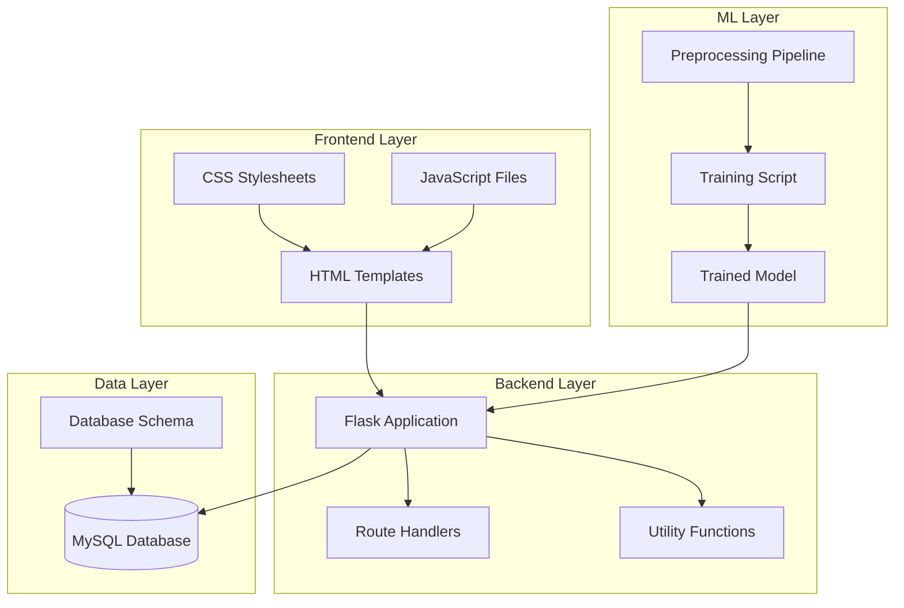
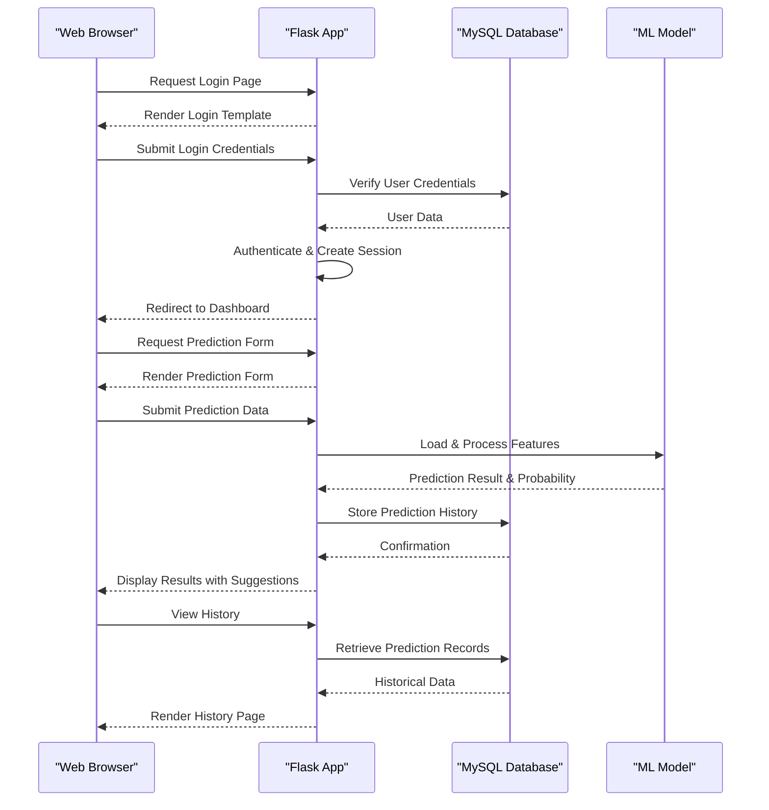
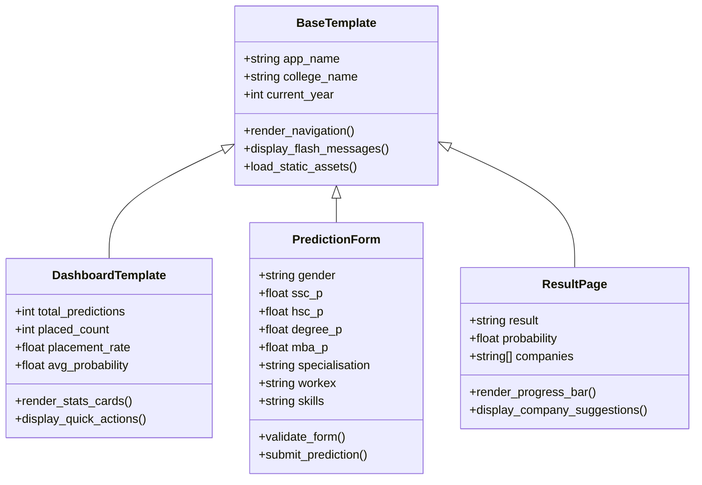
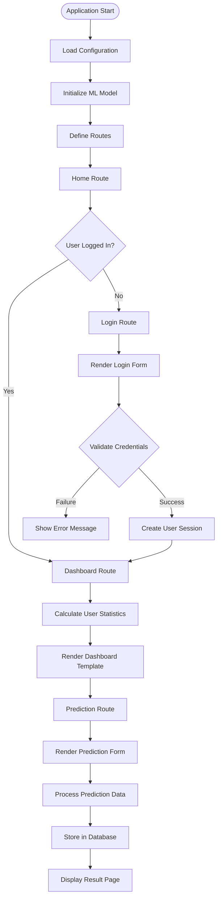
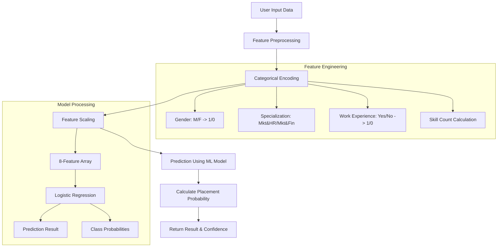
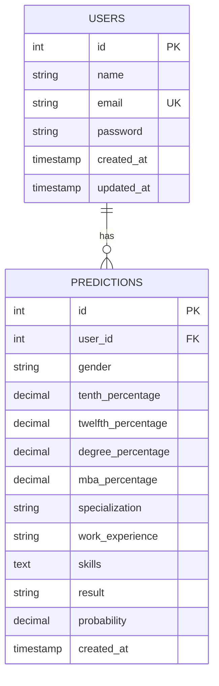
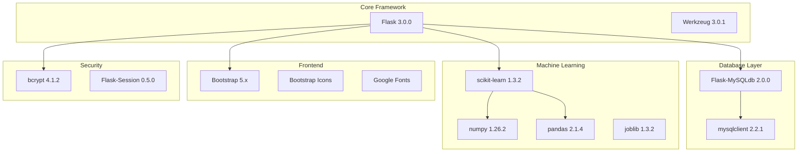

# Project Overview

<cite>
**Referenced Files in This Document**
- [app.py](file://app.py)
- [requirements.txt](file://requirements.txt)
- [train_model.py](file://train_model.py)
- [database.sql](file://database/database.sql)
- [base.html](file://templates/base.html)
- [dashboard.html](file://templates/dashboard.html)
- [form.html](file://templates/form.html)
- [result.html](file://templates/result.html)
- [style.css](file://static/css/style.css)
- [script.js](file://static/js/script.js)
</cite>

## Table of Contents
1. [Introduction](#introduction)
2. [Project Structure](#project-structure)
3. [Core Components](#core-components)
4. [Architecture Overview](#architecture-overview)
5. [Detailed Component Analysis](#detailed-component-analysis)
6. [Dependency Analysis](#dependency-analysis)
7. [Performance Considerations](#performance-considerations)
8. [Troubleshooting Guide](#troubleshooting-guide)
9. [Conclusion](#conclusion)

## Introduction
The Student Placement Prediction Portal is a full-stack web application designed to help computer science students predict their placement outcomes using machine learning. The platform provides a comprehensive solution for students and placement cell faculty to understand placement probabilities, track prediction history, and receive personalized suggestions for suitable companies.

The application combines modern web technologies with machine learning capabilities to deliver an intuitive user experience while maintaining robust backend functionality. It serves as both an educational tool for students to assess their placement prospects and a practical resource for placement cell staff to guide career counseling efforts.

## Project Structure
The project follows a clean separation of concerns with distinct layers for frontend presentation, backend logic, and machine learning components.

**Diagram sources**
- [app.py:126-394](file://app.py#L126-L394)
- [train_model.py:109-196](file://train_model.py#L109-L196)
- [database.sql:1-40](file://database/database.sql#L1-L40)

The application is organized into several key directories:
- `templates/`: Jinja2 HTML templates with Bootstrap styling
- `static/`: CSS and JavaScript assets for frontend presentation
- `database/`: SQL schema for database initialization
- Root level: Core application logic and ML model training

**Section sources**
- [app.py:1-50](file://app.py#L1-L50)
- [requirements.txt:1-27](file://requirements.txt#L1-L27)

## Core Components
The application consists of four primary components that work together to deliver the placement prediction service:

### Authentication System
The authentication system provides secure user registration and login functionality with password hashing and session management. It ensures that prediction history and personal data remain private to individual users.

### Prediction Engine
The prediction engine utilizes a trained machine learning model to analyze user input and provide placement probability estimates. The system processes academic scores, work experience, skills, and specialization to generate accurate predictions.

### Analytics Dashboard
The analytics dashboard presents users with comprehensive statistics about their prediction history, including total predictions, placement rates, and average probabilities. This feature helps users track their progress over time.

### History Tracking
The history tracking system maintains a complete record of all predictions made by users, allowing them to review past assessments and monitor trends in their placement likelihood.

**Section sources**
- [app.py:169-236](file://app.py#L169-L236)
- [app.py:238-354](file://app.py#L238-L354)
- [app.py:133-167](file://app.py#L133-L167)
- [app.py:337-354](file://app.py#L337-L354)

## Architecture Overview
The application follows a layered architecture pattern that separates concerns between presentation, business logic, data access, and machine learning components.

**Diagram sources**
- [app.py:169-354](file://app.py#L169-L354)
- [train_model.py:109-196](file://train_model.py#L109-L196)

The architecture ensures loose coupling between components while maintaining efficient data flow. The Flask application acts as the central coordinator, managing user sessions, routing requests, and orchestrating interactions between the database and machine learning components.

**Section sources**
- [app.py:28-40](file://app.py#L28-L40)
- [app.py:60-108](file://app.py#L60-L108)

## Detailed Component Analysis

### Frontend Template System
The frontend utilizes a comprehensive template inheritance system built with Jinja2 and Bootstrap 5. The base template provides a responsive layout with navigation, flash messaging, and consistent styling across all pages.

**Diagram sources**
- [base.html:1-128](file://templates/base.html#L1-L128)
- [dashboard.html:1-154](file://templates/dashboard.html#L1-L154)
- [form.html:1-227](file://templates/form.html#L1-L227)
- [result.html:1-312](file://templates/result.html#L1-L312)

The template system provides a consistent user experience with responsive design principles. Each template extends the base layout while adding specific functionality for its purpose.

**Section sources**
- [base.html:20-128](file://templates/base.html#L20-L128)
- [dashboard.html:14-151](file://templates/dashboard.html#L14-L151)
- [form.html:12-136](file://templates/form.html#L12-L136)
- [result.html:12-140](file://templates/result.html#L12-L140)

### Backend Route Management
The Flask application manages all user interactions through a well-structured routing system that handles authentication, prediction workflows, and data management.

**Diagram sources**
- [app.py:126-394](file://app.py#L126-L394)

The routing system ensures proper user flow and maintains session state throughout the application lifecycle.

**Section sources**
- [app.py:126-394](file://app.py#L126-L394)

### Machine Learning Integration
The application integrates a trained machine learning model that processes user input to predict placement outcomes. The model uses logistic regression with feature engineering and preprocessing.

**Diagram sources**
- [train_model.py:109-196](file://train_model.py#L109-L196)
- [app.py:60-108](file://app.py#L60-L108)

The ML pipeline includes comprehensive preprocessing, feature engineering, and model evaluation to ensure accurate predictions.

**Section sources**
- [train_model.py:17-55](file://train_model.py#L17-L55)
- [train_model.py:57-107](file://train_model.py#L57-L107)
- [app.py:60-123](file://app.py#L60-L123)

### Database Design
The application uses a relational database design with normalized tables to efficiently store user information and prediction history.

**Diagram sources**
- [database.sql:9-35](file://database/database.sql#L9-L35)

The database schema supports efficient querying of user data and prediction history while maintaining referential integrity.

**Section sources**
- [database.sql:9-35](file://database/database.sql#L9-L35)

## Dependency Analysis
The application relies on a carefully selected set of dependencies that balance functionality with simplicity.

**Diagram sources**
- [requirements.txt:4-27](file://requirements.txt#L4-L27)

The dependency tree reflects a focused approach to technology selection, prioritizing stability and ease of deployment over extensive feature sets.

**Section sources**
- [requirements.txt:4-27](file://requirements.txt#L4-L27)

## Performance Considerations
The application is designed with several performance optimizations to ensure responsive user experiences:

### Model Loading Strategy
The machine learning model is loaded once during application startup and reused for all prediction requests, minimizing computational overhead and memory usage.

### Database Connection Management
The application uses efficient connection pooling and prepared statements to optimize database interactions and reduce latency.

### Frontend Optimization
Static assets are served with minimal processing overhead, and the Bootstrap framework provides responsive design without excessive JavaScript dependencies.

### Caching Considerations
While the current implementation focuses on simplicity, potential caching strategies could include prediction result caching for frequently accessed user profiles and model artifact caching for improved startup times.

## Troubleshooting Guide
Common issues and their solutions:

### Model Loading Issues
**Problem**: Application fails to load the ML model on startup
**Solution**: Ensure `model.pkl` exists in the project root directory and was generated by running the training script

### Database Connection Problems
**Problem**: Users cannot register or login due to database errors
**Solution**: Verify MySQL server is running, credentials are correct, and the database schema has been initialized

### Authentication Failures
**Problem**: Password validation errors or session issues
**Solution**: Check password hashing implementation and ensure session configuration is properly set

### Prediction Errors
**Problem**: Prediction requests fail or return error responses
**Solution**: Validate input data format, ensure all required fields are present, and check model compatibility

**Section sources**
- [app.py:384-390](file://app.py#L384-L390)
- [app.py:363-372](file://app.py#L363-L372)

## Conclusion
The Student Placement Prediction Portal represents a comprehensive solution for educational institutions seeking to enhance student placement support. By combining modern web development practices with machine learning capabilities, the application provides valuable insights into placement outcomes while maintaining excellent user experience and system reliability.

The project's modular architecture ensures maintainability and scalability, while the clean separation of concerns facilitates future enhancements. The application serves as both an educational tool for students and a practical resource for placement cell faculty, contributing to improved career counseling and student success outcomes.

Key strengths of the implementation include:
- Clean, maintainable code structure with clear separation of concerns
- Comprehensive user authentication and session management
- Robust machine learning integration with proper preprocessing
- Responsive frontend design with Bootstrap framework
- Efficient database design with proper indexing and relationships
- Extensive error handling and user feedback mechanisms

The application provides significant value to educational institutions by offering data-driven insights into student placement outcomes, enabling more informed career guidance and improved institutional planning for placement activities.