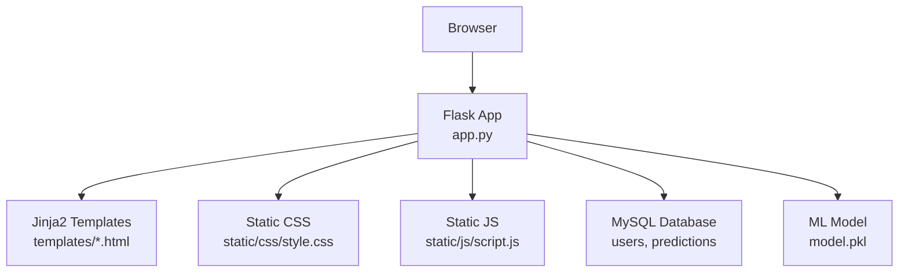
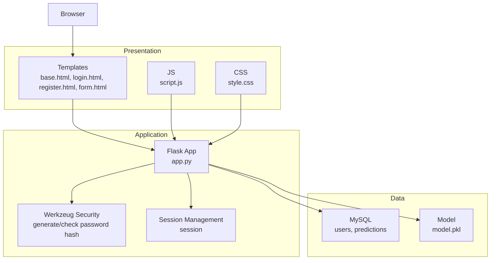
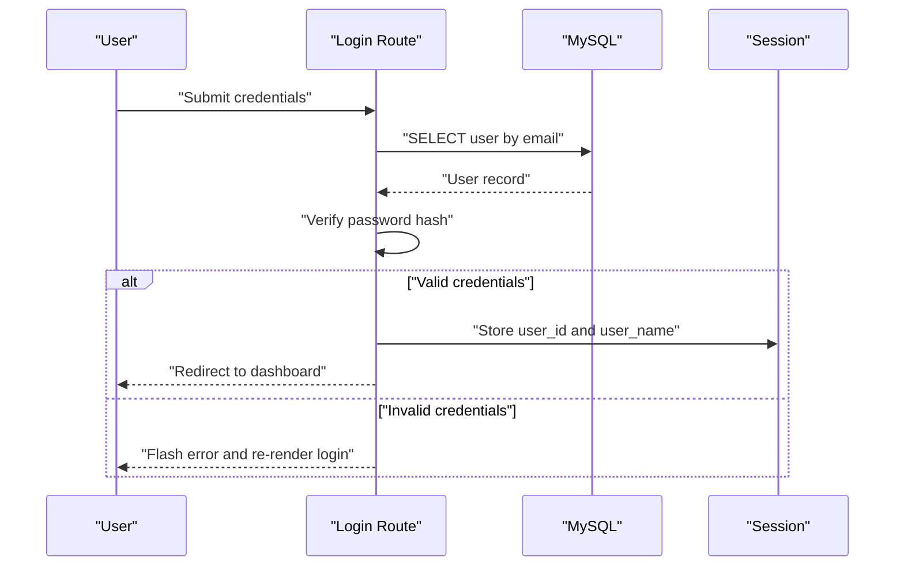
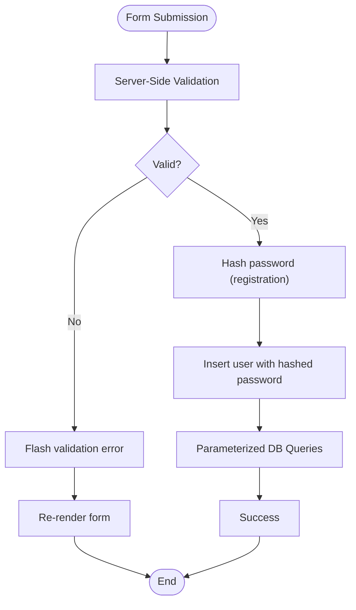
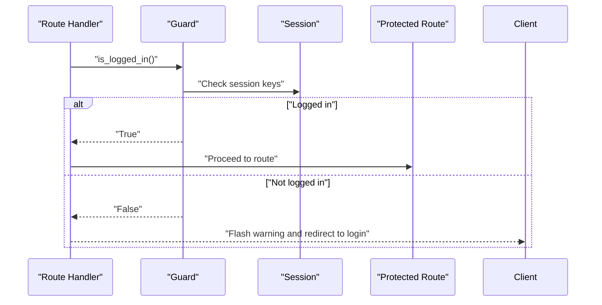
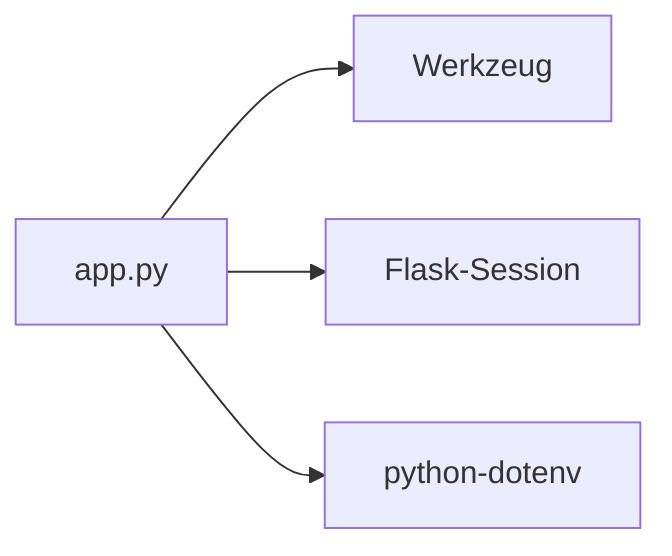

# Security Considerations

<cite>
**Referenced Files in This Document**
- [app.py](file://app.py)
- [requirements.txt](file://requirements.txt)
- [database.sql](file://database/database.sql)
- [base.html](file://templates/base.html)
- [login.html](file://templates/login.html)
- [register.html](file://templates/register.html)
- [form.html](file://templates/form.html)
- [style.css](file://static/css/style.css)
- [script.js](file://static/js/script.js)
- [train_model.py](file://train_model.py)
</cite>

## Table of Contents
1. [Introduction](#introduction)
2. [Project Structure](#project-structure)
3. [Core Components](#core-components)
4. [Architecture Overview](#architecture-overview)
5. [Detailed Component Analysis](#detailed-component-analysis)
6. [Dependency Analysis](#dependency-analysis)
7. [Performance Considerations](#performance-considerations)
8. [Troubleshooting Guide](#troubleshooting-guide)
9. [Conclusion](#conclusion)
10. [Appendices](#appendices)

## Introduction
This document provides comprehensive security documentation for the Student Placement Prediction Portal Flask application. It focuses on authentication security (password hashing with Werkzeug, session management), input validation and sanitization practices, session-based authentication, secure cookie configuration, data protection (encrypted password storage and sensitive data handling), error handling security (generic error messages and logging practices), CORS and content security considerations, production best practices (environment variable management and secret key rotation), vulnerability prevention strategies, security audit guidelines, and data privacy considerations aligned with GDPR.

## Project Structure
The application follows a typical Flask MVC-like structure with:
- A central application module orchestrating routes, sessions, and database interactions
- Templates for rendering pages with minimal inline logic
- Static assets for styling and client-side interactions
- A training script for machine learning model creation
- A database schema for storing users and prediction history

**Diagram sources**
- [app.py:126-394](file://app.py#L126-L394)
- [database.sql:9-35](file://database/database.sql#L9-L35)
- [train_model.py:175-190](file://train_model.py#L175-L190)

**Section sources**
- [app.py:126-394](file://app.py#L126-L394)
- [database.sql:9-35](file://database/database.sql#L9-L35)
- [train_model.py:175-190](file://train_model.py#L175-L190)

## Core Components
- Authentication and Authorization
  - Password hashing with Werkzeug
  - Session-based authentication using Flask session
  - Route guards checking session presence
- Input Validation and Sanitization
  - Server-side validation for registration and prediction forms
  - Parameterized queries to prevent SQL injection
- Secure Cookie Configuration
  - Secret key configuration for session signing
  - Recommendations for secure cookie flags
- Data Protection
  - Encrypted password storage using Werkzeug
  - Sensitive data handling in templates and routes
- Error Handling
  - Generic error handlers for 404 and 500
  - Logging practices for production
- Frontend Security
  - Minimal inline scripts and event handlers
  - Client-side validation for UX, not security

**Section sources**
- [app.py:18-26](file://app.py#L18-L26)
- [app.py:46-58](file://app.py#L46-L58)
- [app.py:169-192](file://app.py#L169-L192)
- [app.py:194-236](file://app.py#L194-L236)
- [app.py:238-292](file://app.py#L238-L292)
- [app.py:363-372](file://app.py#L363-L372)
- [login.html:16-54](file://templates/login.html#L16-L54)
- [register.html:16-86](file://templates/register.html#L16-L86)
- [form.html:12-135](file://templates/form.html#L12-L135)

## Architecture Overview
The application uses a layered architecture:
- Presentation Layer: Jinja2 templates and static assets
- Application Layer: Flask routes and helpers
- Data Access Layer: MySQL connector and parameterized queries
- Machine Learning Layer: Scikit-learn model loaded at runtime

**Diagram sources**
- [app.py:6-26](file://app.py#L6-L26)
- [app.py:8](file://app.py#L8)
- [app.py:42-44](file://app.py#L42-L44)
- [database.sql:9-35](file://database/database.sql#L9-L35)
- [train_model.py:29-36](file://train_model.py#L29-L36)

## Detailed Component Analysis

### Authentication Security
- Password Hashing with Werkzeug
  - Registration hashes passwords before insertion
  - Login compares provided password against stored hash
- Session Management
  - Session keys include user identity and name
  - Route guards check session presence
  - Logout clears session
- CSRF Protection
  - No explicit CSRF tokens are implemented in forms
  - Consider adding CSRF protection middleware or tokens for production

**Diagram sources**
- [app.py:169-192](file://app.py#L169-L192)
- [app.py:46-58](file://app.py#L46-L58)

**Section sources**
- [app.py:184-188](file://app.py#L184-L188)
- [app.py:224-231](file://app.py#L224-L231)
- [app.py:356-361](file://app.py#L356-L361)

### Input Validation and Sanitization
- Server-Side Validation
  - Registration validates password length and match
  - Prediction form extracts numeric values and encodes categorical features
- SQL Injection Prevention
  - Uses parameterized queries with placeholders
- XSS Prevention
  - Templates render user-provided values safely
  - No inline JavaScript executes untrusted data

**Diagram sources**
- [app.py:206-213](file://app.py#L206-L213)
- [app.py:245-256](file://app.py#L245-L256)
- [app.py:180-182](file://app.py#L180-L182)
- [app.py:226-229](file://app.py#L226-L229)

**Section sources**
- [app.py:206-213](file://app.py#L206-L213)
- [app.py:245-256](file://app.py#L245-L256)
- [app.py:180-182](file://app.py#L180-L182)
- [app.py:226-229](file://app.py#L226-L229)

### Session-Based Authentication System
- Session Keys
  - Stores user identity and name in session
- Route Guards
  - Checks session presence before accessing protected pages
- Logout
  - Clears session and flashes a message

**Diagram sources**
- [app.py:46-48](file://app.py#L46-L48)
- [app.py:133-139](file://app.py#L133-L139)
- [app.py:356-361](file://app.py#L356-L361)

**Section sources**
- [app.py:46-48](file://app.py#L46-L48)
- [app.py:133-139](file://app.py#L133-L139)
- [app.py:356-361](file://app.py#L356-L361)

### Secure Cookie Configuration
- Secret Key
  - Configured in application configuration
  - Used to sign session cookies
- Recommendations
  - Use a strong, randomly generated secret key
  - Rotate secret keys periodically
  - Configure secure cookie flags in production deployments

**Section sources**
- [app.py:18](file://app.py#L18)

### Data Protection Measures
- Encrypted Password Storage
  - Passwords are hashed using Werkzeug before storage
- Sensitive Data Handling
  - User data is fetched and rendered in templates
  - Prediction history is associated with user ID

**Section sources**
- [app.py:224-231](file://app.py#L224-L231)
- [database.sql:10-17](file://database/database.sql#L10-L17)
- [app.py:301-308](file://app.py#L301-L308)

### Error Handling Security
- Generic Error Handlers
  - Renders generic messages for 404 and 500 errors
- Logging Practices
  - Print statements for prediction errors
  - Recommendation: Use structured logging in production

**Section sources**
- [app.py:363-372](file://app.py#L363-L372)
- [app.py:106-108](file://app.py#L106-L108)

### CORS Policy Configuration
- Current Implementation
  - No explicit CORS configuration is present
- Recommendations
  - Define allowed origins, methods, and headers
  - Enable CORS only for trusted domains

**Section sources**
- [app.py:126-394](file://app.py#L126-L394)

### Content Security Policies
- Current Implementation
  - Templates load external resources via CDN
- Recommendations
  - Implement CSP headers to restrict resource loading
  - Use subresource integrity for CDN resources

**Section sources**
- [base.html:8-15](file://templates/base.html#L8-L15)

## Dependency Analysis
Security-related dependencies and their roles:
- Werkzeug: Provides password hashing utilities
- Flask-Session: Session management support
- python-dotenv: Environment variable management

**Diagram sources**
- [requirements.txt:21-27](file://requirements.txt#L21-L27)
- [app.py:8](file://app.py#L8)

**Section sources**
- [requirements.txt:21-27](file://requirements.txt#L21-L27)
- [app.py:8](file://app.py#L8)

## Performance Considerations
- Database Query Optimization
  - Use prepared statements and indexes on frequently queried columns
- Session Storage
  - Consider server-side session storage for scalability
- Model Loading
  - Load model once during application initialization

**Section sources**
- [app.py:28-39](file://app.py#L28-L39)
- [app.py:42-44](file://app.py#L42-L44)

## Troubleshooting Guide
- Common Issues
  - Model not found: Ensure model.pkl exists or run training script
  - Database connectivity: Verify MySQL configuration
  - Session issues: Check secret key and cookie settings
- Logging
  - Use structured logging for production environments
  - Capture exceptions and sanitize logs to avoid leaking sensitive data

**Section sources**
- [app.py:34-36](file://app.py#L34-L36)
- [train_model.py:175-190](file://train_model.py#L175-L190)

## Conclusion
The application implements essential security controls such as password hashing with Werkzeug, session-based authentication, and parameterized database queries. However, production readiness requires additional measures: CSRF protection, secure cookie configuration, CORS and CSP policies, environment variable management, secret key rotation, and robust logging. Implementing these recommendations will significantly improve the application’s security posture.

## Appendices

### Security Best Practices for Production Deployment
- Environment Variable Management
  - Store secrets in environment variables
  - Use python-dotenv for local development
- Secret Key Rotation
  - Rotate SECRET_KEY periodically
  - Support key rotation without breaking existing sessions
- Secure Cookie Flags
  - Set secure, httponly, and sameSite attributes
- CORS and CSP
  - Define strict CORS policies
  - Implement CSP headers
- Logging and Monitoring
  - Use structured logging
  - Monitor for suspicious activities

**Section sources**
- [requirements.txt:25-27](file://requirements.txt#L25-L27)
- [app.py:18](file://app.py#L18)

### Vulnerability Prevention Strategies
- SQL Injection
  - Continue using parameterized queries
- XSS
  - Escape output in templates
  - Implement CSP
- CSRF
  - Add CSRF tokens or middleware
- Insecure Direct Object References
  - Enforce ownership checks (already present via user_id)

**Section sources**
- [app.py:144-151](file://app.py#L144-L151)
- [app.py:301-308](file://app.py#L301-L308)

### Security Audit Guidelines and Penetration Testing Recommendations
- Static Analysis
  - Review code for hardcoded secrets and unsafe practices
- Dynamic Analysis
  - Automated scanning for OWASP Top 10 vulnerabilities
- Manual Penetration Testing
  - Test authentication, authorization, and input validation
- Compliance
  - Align with GDPR requirements for data protection

**Section sources**
- [database.sql:10-17](file://database/database.sql#L10-L17)

### Data Privacy Considerations and GDPR Compliance
- Data Minimization
  - Collect only necessary personal data
- Consent and Transparency
  - Provide clear privacy notices
- Data Subject Rights
  - Implement mechanisms for data access and deletion
- Data Security
  - Encrypt at rest and in transit
  - Regular security assessments

**Section sources**
- [database.sql:10-17](file://database/database.sql#L10-L17)