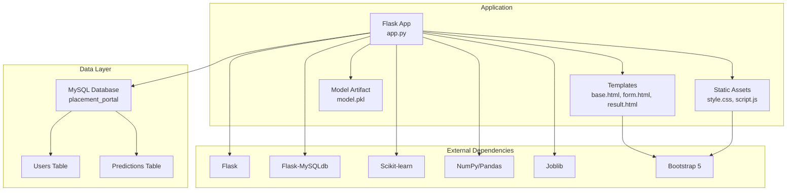
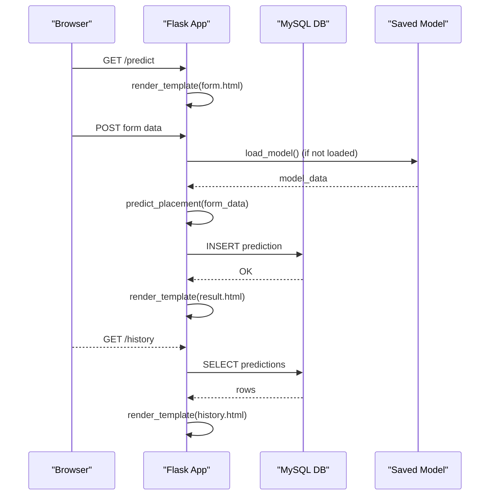
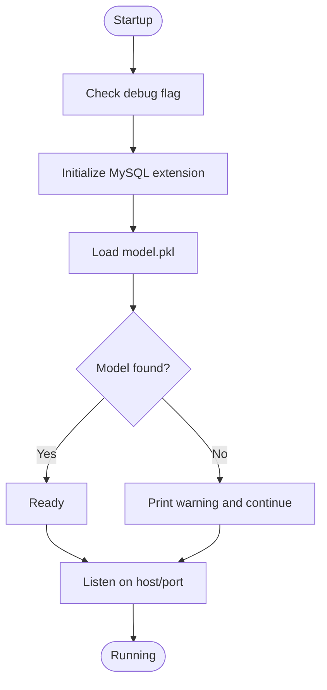
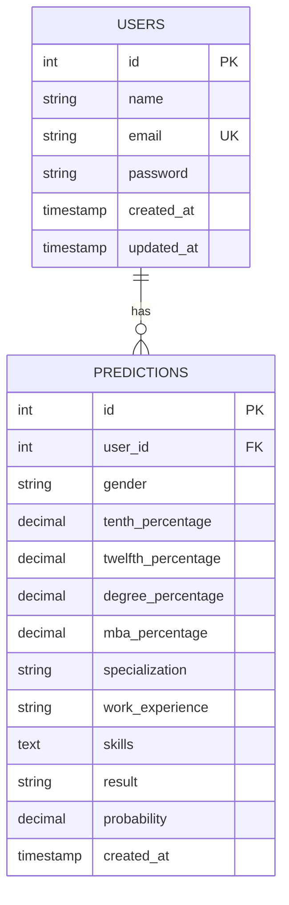
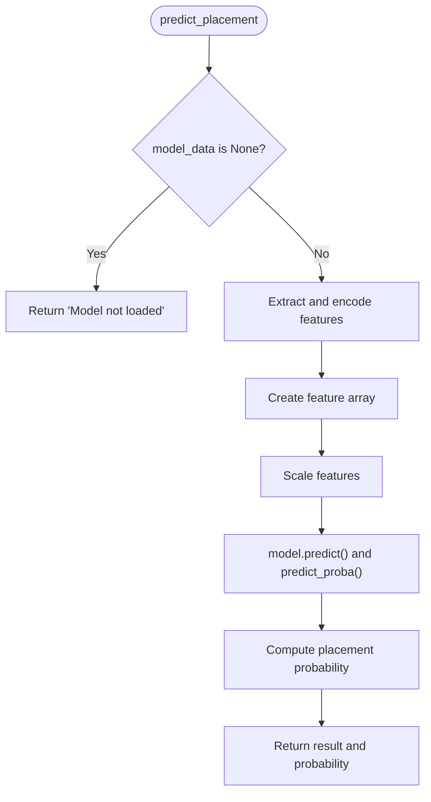
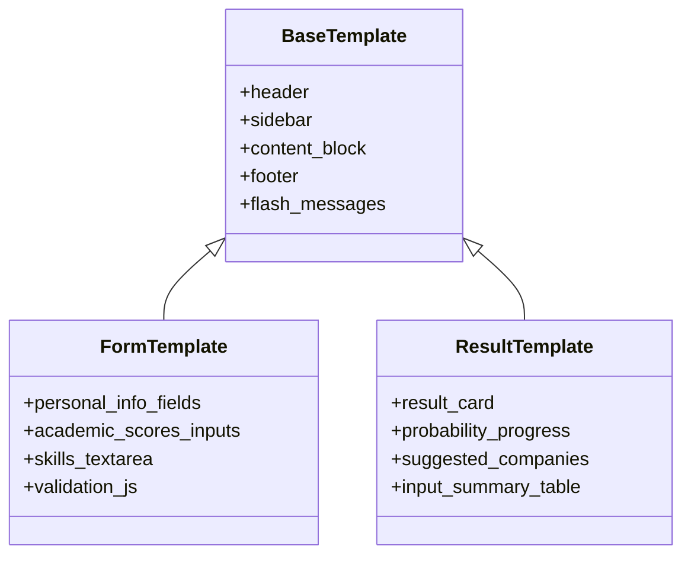
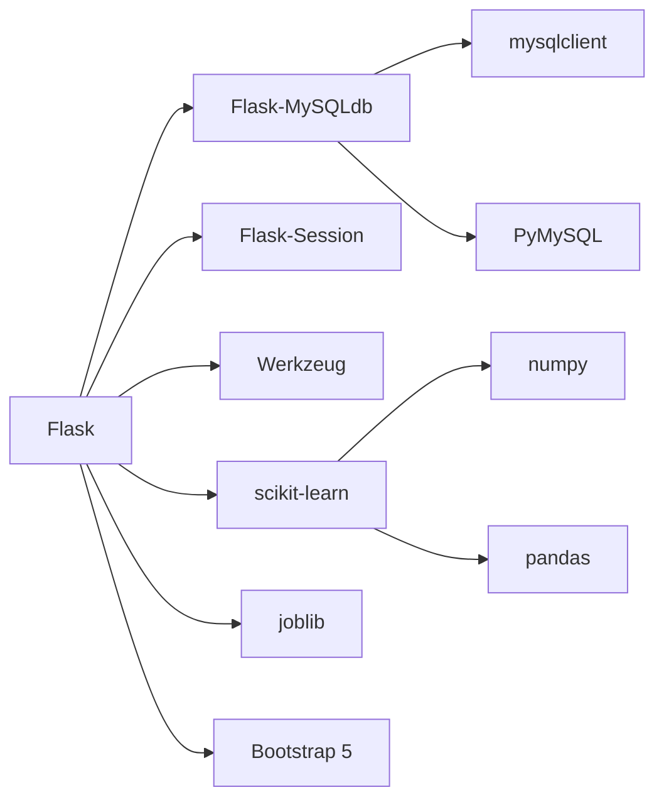

# Troubleshooting

<cite>
**Referenced Files in This Document**
- [app.py](file://app.py)
- [requirements.txt](file://requirements.txt)
- [train_model.py](file://train_model.py)
- [database.sql](file://database/database.sql)
- [base.html](file://templates/base.html)
- [form.html](file://templates/form.html)
- [result.html](file://templates/result.html)
- [style.css](file://static/css/style.css)
- [script.js](file://static/js/script.js)
</cite>

## Table of Contents
1. [Introduction](#introduction)
2. [Project Structure](#project-structure)
3. [Core Components](#core-components)
4. [Architecture Overview](#architecture-overview)
5. [Detailed Component Analysis](#detailed-component-analysis)
6. [Dependency Analysis](#dependency-analysis)
7. [Performance Considerations](#performance-considerations)
8. [Troubleshooting Guide](#troubleshooting-guide)
9. [Conclusion](#conclusion)
10. [Appendices](#appendices)

## Introduction
This document provides comprehensive troubleshooting guidance for the Student Placement Prediction Portal. It covers installation issues (dependencies, MySQL connectivity, missing model files), runtime issues (Flask startup failures, database connectivity, ML model loading), user interface problems (template rendering, form validation, JavaScript errors), performance issues (slow predictions, query timeouts, memory usage), debugging techniques (Flask debug mode, MySQL query analysis, Python tracebacks), log locations and analysis, system resource monitoring, browser/mobile compatibility, and escalation procedures.

## Project Structure
The application is a Flask-based web portal with:
- Backend: Flask application with MySQL integration and scikit-learn model persistence
- Frontend: Jinja2 templates with Bootstrap 5 and custom CSS/JS
- Data: SQL schema for users and predictions
- ML: Saved model artifact persisted via joblib

**Diagram sources**
- [app.py:1-394](file://app.py#L1-L394)
- [base.html:1-128](file://templates/base.html#L1-L128)
- [form.html:1-227](file://templates/form.html#L1-L227)
- [result.html:1-312](file://templates/result.html#L1-L312)
- [style.css:1-492](file://static/css/style.css#L1-L492)
- [script.js:1-281](file://static/js/script.js#L1-L281)
- [database.sql:1-40](file://database/database.sql#L1-L40)

**Section sources**
- [app.py:1-394](file://app.py#L1-L394)
- [requirements.txt:1-27](file://requirements.txt#L1-L27)
- [database.sql:1-40](file://database/database.sql#L1-L40)

## Core Components
- Flask application with configuration for MySQL and secret key
- Database initialization and CRUD routes for users and predictions
- ML model loading and prediction pipeline
- Jinja2 templates with Bootstrap 5 and custom styling
- Client-side JavaScript for UI interactions and form validation

Key implementation references:
- Flask configuration and MySQL initialization
- Model loading and prediction logic
- Template rendering and navigation
- Frontend assets and responsive design

**Section sources**
- [app.py:15-26](file://app.py#L15-L26)
- [app.py:28-39](file://app.py#L28-L39)
- [app.py:60-109](file://app.py#L60-L109)
- [base.html:1-128](file://templates/base.html#L1-L128)
- [style.css:1-492](file://static/css/style.css#L1-L492)
- [script.js:1-281](file://static/js/script.js#L1-L281)

## Architecture Overview
High-level flow:
- Client requests pages rendered by Flask routes
- Templates extend a base layout and include Bootstrap and custom assets
- Routes interact with MySQL for user/prediction data
- Prediction route loads a saved model and performs inference
- Results are stored in the database and displayed via templates

**Diagram sources**
- [app.py:238-292](file://app.py#L238-L292)
- [app.py:266-287](file://app.py#L266-L287)
- [app.py:337-354](file://app.py#L337-L354)
- [form.html:1-227](file://templates/form.html#L1-L227)
- [result.html:1-312](file://templates/result.html#L1-L312)

## Detailed Component Analysis

### Flask Application Startup and Configuration
Common startup issues:
- Debug mode disabled by default
- Host/port binding
- Secret key and MySQL credentials
- Model loading on startup

**Diagram sources**
- [app.py:384-393](file://app.py#L384-L393)

**Section sources**
- [app.py:18-26](file://app.py#L18-L26)
- [app.py:384-393](file://app.py#L384-L393)

### Database Connectivity and Schema
Issues commonly involve:
- Incorrect host/user/password
- Database does not exist
- Missing tables
- Foreign key constraints

**Diagram sources**
- [database.sql:9-35](file://database/database.sql#L9-L35)

**Section sources**
- [database.sql:1-40](file://database/database.sql#L1-L40)
- [app.py:42-44](file://app.py#L42-L44)

### ML Model Loading and Prediction Pipeline
Issues include:
- Missing model.pkl
- Incompatible model artifacts
- Feature mismatch during prediction

**Diagram sources**
- [app.py:60-109](file://app.py#L60-L109)

**Section sources**
- [app.py:28-39](file://app.py#L28-L39)
- [app.py:60-109](file://app.py#L60-L109)
- [train_model.py:175-190](file://train_model.py#L175-L190)

### Frontend Templates and Forms
Issues include:
- Missing assets (CSS/JS)
- Template rendering errors
- Form validation mismatches
- Mobile responsiveness

**Diagram sources**
- [base.html:1-128](file://templates/base.html#L1-L128)
- [form.html:1-227](file://templates/form.html#L1-L227)
- [result.html:1-312](file://templates/result.html#L1-L312)

**Section sources**
- [base.html:1-128](file://templates/base.html#L1-L128)
- [form.html:1-227](file://templates/form.html#L1-L227)
- [result.html:1-312](file://templates/result.html#L1-L312)
- [style.css:1-492](file://static/css/style.css#L1-L492)
- [script.js:1-281](file://static/js/script.js#L1-L281)

## Dependency Analysis
External dependencies and their roles:
- Flask: Web framework
- Flask-MySQLdb: MySQL driver
- Scikit-learn, NumPy, Pandas: ML preprocessing and modeling
- Joblib: Model persistence
- Bootstrap 5: UI framework
- Werkzeug: Security utilities

Potential conflicts:
- Multiple MySQL clients installed
- Version mismatches between Flask and extensions
- Incompatible NumPy/SciPy versions

**Diagram sources**
- [requirements.txt:4-26](file://requirements.txt#L4-L26)

**Section sources**
- [requirements.txt:1-27](file://requirements.txt#L1-L27)

## Performance Considerations
- Model loading cost: The model is loaded on startup; subsequent predictions reuse the loaded model
- Database queries: Queries are lightweight; ensure indexes on foreign keys and timestamps
- Memory usage: Large datasets or frequent model reloads increase memory footprint
- Recommendations:
  - Use a production WSGI server (e.g., gunicorn/uwsgi) with process/thread pools
  - Enable model caching and avoid repeated disk reads
  - Optimize database queries with EXPLAIN and add indexes as needed
  - Monitor CPU/memory under load and scale horizontally

[No sources needed since this section provides general guidance]

## Troubleshooting Guide

### Installation Problems

- Symptom: Cannot import MySQL driver or Flask fails to start
  - Cause: Missing or conflicting MySQL client libraries
  - Solution: Install compatible versions as per requirements; avoid installing both mysqlclient and PyMySQL simultaneously unless intended
  - References:
    - [requirements.txt:9-11](file://requirements.txt#L9-L11)
    - [app.py:6-8](file://app.py#L6-L8)

- Symptom: Missing model.pkl prevents startup
  - Cause: Model not generated yet
  - Solution: Run the training script to generate model.pkl
  - References:
    - [app.py:28-39](file://app.py#L28-L39)
    - [train_model.py:175-190](file://train_model.py#L175-L190)

- Symptom: Dependency conflicts or incompatible versions
  - Cause: Mixed package versions
  - Solution: Use a virtual environment and install requirements exactly as listed
  - References:
    - [requirements.txt:1-27](file://requirements.txt#L1-L27)

**Section sources**
- [requirements.txt:1-27](file://requirements.txt#L1-L27)
- [app.py:6-8](file://app.py#L6-L8)
- [app.py:28-39](file://app.py#L28-L39)
- [train_model.py:175-190](file://train_model.py#L175-L190)

### MySQL Connection Errors

- Symptom: Database connection fails at startup or during routes
  - Causes:
    - Wrong host/user/password
    - Database does not exist
    - Missing tables
  - Solutions:
    - Verify MySQL credentials in configuration
    - Create the database and tables using the provided SQL script
  - References:
    - [app.py:18-23](file://app.py#L18-L23)
    - [database.sql:4-7](file://database/database.sql#L4-L7)
    - [database.sql:9-35](file://database/database.sql#L9-L35)

- Symptom: Foreign key constraint errors on inserts
  - Cause: Non-existent user_id
  - Solution: Ensure user exists before inserting predictions
  - References:
    - [app.py:266-287](file://app.py#L266-L287)
    - [database.sql:33-34](file://database/database.sql#L33-L34)

**Section sources**
- [app.py:18-23](file://app.py#L18-L23)
- [database.sql:4-7](file://database/database.sql#L4-L7)
- [database.sql:9-35](file://database/database.sql#L9-L35)
- [app.py:266-287](file://app.py#L266-L287)

### Flask Application Startup Failures

- Symptom: Application does not start or crashes immediately
  - Causes:
    - Missing SECRET_KEY or incorrect configuration
    - Model loading failure
    - Port already in use
  - Solutions:
    - Ensure SECRET_KEY is set
    - Verify model.pkl exists
    - Change host/port if needed
  - References:
    - [app.py:18-23](file://app.py#L18-L23)
    - [app.py:384-393](file://app.py#L384-L393)

- Symptom: Debug mode not enabling errors
  - Cause: Production server not started with debug=True
  - Solution: Use the development server or configure a WSGI server with debug enabled
  - References:
    - [app.py:392-393](file://app.py#L392-L393)

**Section sources**
- [app.py:18-23](file://app.py#L18-L23)
- [app.py:384-393](file://app.py#L384-L393)
- [app.py:392-393](file://app.py#L392-L393)

### ML Model Loading Errors

- Symptom: “Model not loaded” response
  - Cause: model.pkl not found
  - Solution: Run training script to generate model.pkl
  - References:
    - [app.py:28-39](file://app.py#L28-L39)
    - [train_model.py:175-190](file://train_model.py#L175-L190)

- Symptom: Prediction errors at runtime
  - Causes:
    - Unexpected form data types
    - Missing or invalid form fields
  - Solutions:
    - Validate form inputs on submission
    - Ensure all required fields are present
  - References:
    - [app.py:245-264](file://app.py#L245-L264)
    - [form.html:12-135](file://templates/form.html#L12-L135)

**Section sources**
- [app.py:28-39](file://app.py#L28-L39)
- [train_model.py:175-190](file://train_model.py#L175-L190)
- [app.py:245-264](file://app.py#L245-L264)
- [form.html:12-135](file://templates/form.html#L12-L135)

### User Interface Problems

- Symptom: Template rendering errors
  - Causes:
    - Missing template blocks
    - Incorrect asset URLs
  - Solutions:
    - Ensure templates extend base.html and define required blocks
    - Verify static asset URLs
  - References:
    - [base.html:1-128](file://templates/base.html#L1-L128)
    - [form.html:1-227](file://templates/form.html#L1-L227)
    - [result.html:1-312](file://templates/result.html#L1-L312)

- Symptom: Form validation failures
  - Causes:
    - Client-side validation not triggered
    - Missing required attributes
  - Solutions:
    - Ensure forms have required attributes
    - Confirm JavaScript initializes properly
  - References:
    - [form.html:12-135](file://templates/form.html#L12-L135)
    - [script.js:105-125](file://static/js/script.js#L105-L125)

- Symptom: JavaScript console errors
  - Causes:
    - Bootstrap not loaded
    - Missing DOM elements
  - Solutions:
    - Ensure Bootstrap CSS/JS are included
    - Verify DOMContentLoaded event fires
  - References:
    - [base.html:10-16](file://templates/base.html#L10-L16)
    - [base.html:120-123](file://templates/base.html#L120-L123)
    - [script.js:6-29](file://static/js/script.js#L6-L29)

- Symptom: Mobile responsiveness issues
  - Causes:
    - Sidebar not toggling on small screens
    - CSS media queries not applied
  - Solutions:
    - Test on device/emulator
    - Confirm media query breakpoints and sidebar toggle logic
  - References:
    - [style.css:412-456](file://static/css/style.css#L412-L456)
    - [script.js:61-100](file://static/js/script.js#L61-L100)

**Section sources**
- [base.html:1-128](file://templates/base.html#L1-L128)
- [form.html:12-135](file://templates/form.html#L12-L135)
- [result.html:1-312](file://templates/result.html#L1-L312)
- [style.css:412-456](file://static/css/style.css#L412-L456)
- [script.js:6-29](file://static/js/script.js#L6-L29)
- [script.js:61-100](file://static/js/script.js#L61-L100)
- [script.js:105-125](file://static/js/script.js#L105-L125)

### Performance Issues

- Symptom: Slow predictions
  - Causes:
    - Heavy preprocessing or model evaluation
  - Solutions:
    - Profile prediction path
    - Consider model optimization or quantization
  - References:
    - [app.py:60-109](file://app.py#L60-L109)

- Symptom: Database query timeouts
  - Causes:
    - Unindexed foreign keys or large result sets
  - Solutions:
    - Add indexes on user_id and created_at
    - Limit result sets and paginate
  - References:
    - [database.sql:33-34](file://database/database.sql#L33-L34)
    - [app.py:144-154](file://app.py#L144-L154)

- Symptom: High memory usage
  - Causes:
    - Large model or frequent reloads
  - Solutions:
    - Persist model in memory
    - Use a production WSGI server with process limits
  - References:
    - [app.py:28-39](file://app.py#L28-L39)

**Section sources**
- [app.py:60-109](file://app.py#L60-L109)
- [database.sql:33-34](file://database/database.sql#L33-L34)
- [app.py:144-154](file://app.py#L144-L154)
- [app.py:28-39](file://app.py#L28-L39)

### Debugging Techniques

- Flask Debug Mode
  - Enable debug=True in development
  - Use Flask’s built-in reloader and debugger
  - References:
    - [app.py:392-393](file://app.py#L392-L393)

- MySQL Query Analysis
  - Log queries in routes
  - Use EXPLAIN to analyze slow queries
  - References:
    - [app.py:144-154](file://app.py#L144-L154)
    - [app.py:266-287](file://app.py#L266-L287)

- Python Traceback Examination
  - Wrap critical sections in try/except
  - Log exceptions with context
  - References:
    - [app.py:106-108](file://app.py#L106-L108)

**Section sources**
- [app.py:392-393](file://app.py#L392-L393)
- [app.py:144-154](file://app.py#L144-L154)
- [app.py:266-287](file://app.py#L266-L287)
- [app.py:106-108](file://app.py#L106-L108)

### Log File Locations and Analysis

- Application logs
  - Output printed to console/stdout by default
  - For production, configure logging to files or stdout
  - References:
    - [app.py:388-390](file://app.py#L388-L390)

- Database logs
  - Enable MySQL general query log for analysis
  - Use slow query log for performance tuning
  - References:
    - [database.sql:1-40](file://database/database.sql#L1-L40)

- Frontend logs
  - Open browser developer tools Console tab
  - Check for asset 404s and JS errors
  - References:
    - [base.html:10-16](file://templates/base.html#L10-L16)
    - [script.js:6-29](file://static/js/script.js#L6-L29)

**Section sources**
- [app.py:388-390](file://app.py#L388-L390)
- [database.sql:1-40](file://database/database.sql#L1-L40)
- [base.html:10-16](file://templates/base.html#L10-L16)
- [script.js:6-29](file://static/js/script.js#L6-L29)

### System Resource Monitoring and Optimization

- CPU and memory
  - Use OS-level tools (top/htop, Task Manager)
  - Monitor under realistic load
- Database
  - Indexes on foreign keys and timestamps
  - Connection pooling
- Model
  - Persist in memory
  - Consider quantization or pruning
- References:
  - [app.py:28-39](file://app.py#L28-L39)
  - [database.sql:33-34](file://database/database.sql#L33-L34)

**Section sources**
- [app.py:28-39](file://app.py#L28-L39)
- [database.sql:33-34](file://database/database.sql#L33-L34)

### Browser Compatibility and Mobile Responsiveness

- Compatibility
  - Bootstrap 5 is widely supported
  - Ensure polyfills if targeting older browsers
- Mobile
  - Sidebar toggle works on small screens
  - Media queries adjust layout
  - References:
    - [style.css:412-456](file://static/css/style.css#L412-L456)
    - [script.js:61-100](file://static/js/script.js#L61-L100)

**Section sources**
- [style.css:412-456](file://static/css/style.css#L412-L456)
- [script.js:61-100](file://static/js/script.js#L61-L100)

### Escalation Procedures and Support

- Initial steps
  - Reproduce with debug mode enabled
  - Capture tracebacks and logs
  - Verify environment matches requirements
- Escalation
  - Provide environment details (Python version, OS, MySQL version)
  - Attach sanitized logs and minimal reproducible steps
- Support contact
  - Internal team: [Support Team Name]
  - Email: [support@example.com]

[No sources needed since this section provides general guidance]

## Conclusion
This guide consolidates common issues and solutions across installation, runtime, UI, performance, and debugging for the Student Placement Prediction Portal. By following the outlined steps—verifying dependencies, configuring MySQL, ensuring model availability, validating templates and forms, and applying performance best practices—you can resolve most issues efficiently. For persistent problems, escalate with detailed logs and environment information.

## Appendices

### Quick Checklist
- Dependencies installed per requirements
- MySQL configured and database/schema created
- model.pkl present
- Flask debug enabled for local development
- Frontend assets loading without 404s
- Mobile layout verified

[No sources needed since this section provides general guidance]