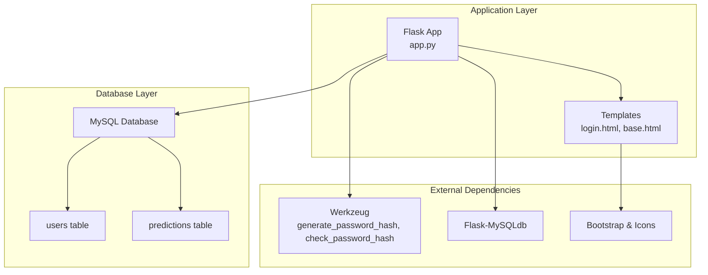
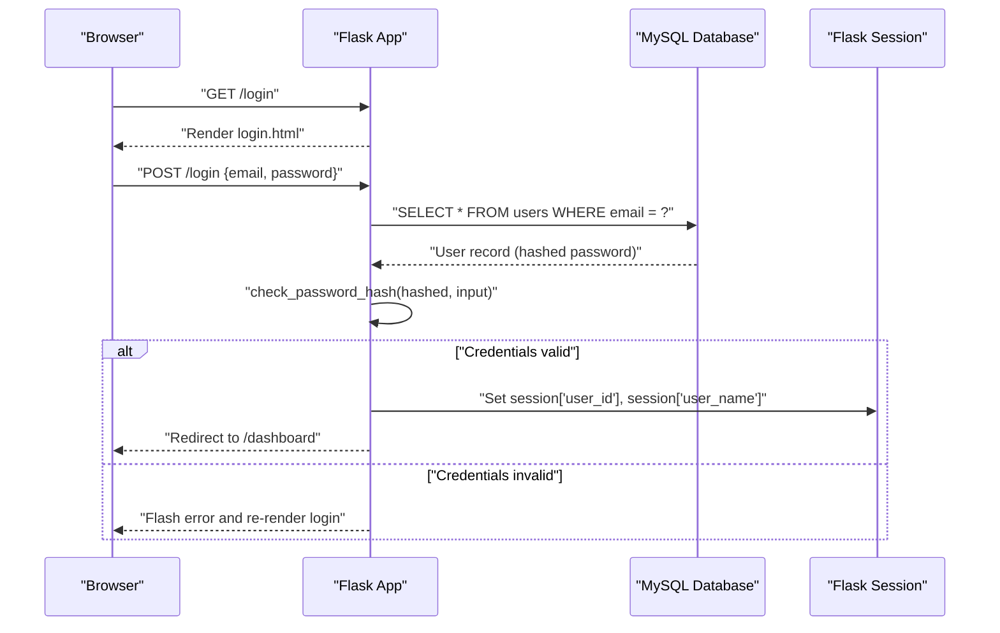
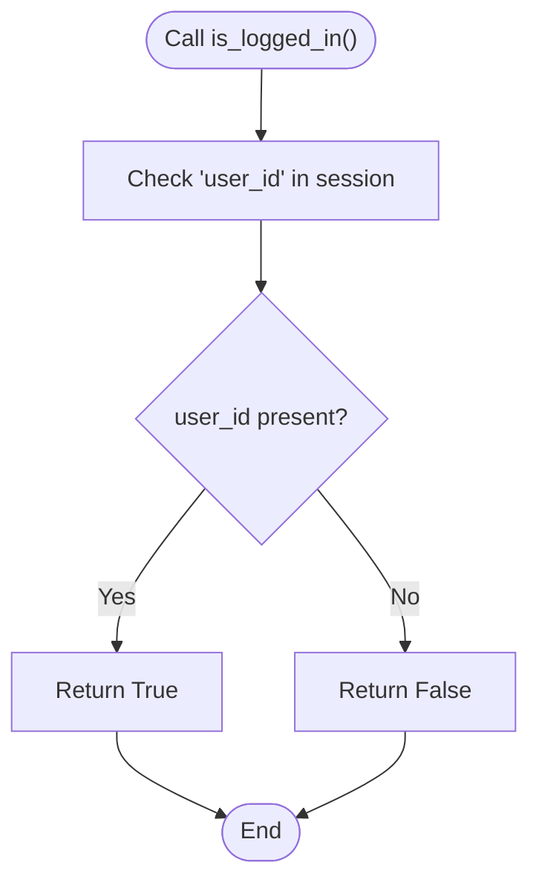
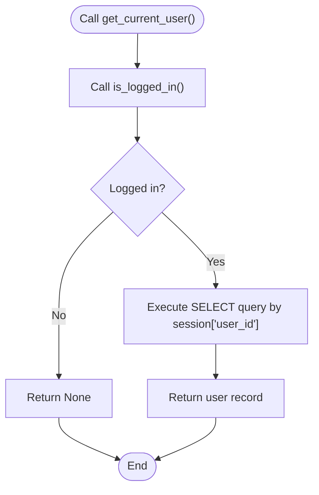
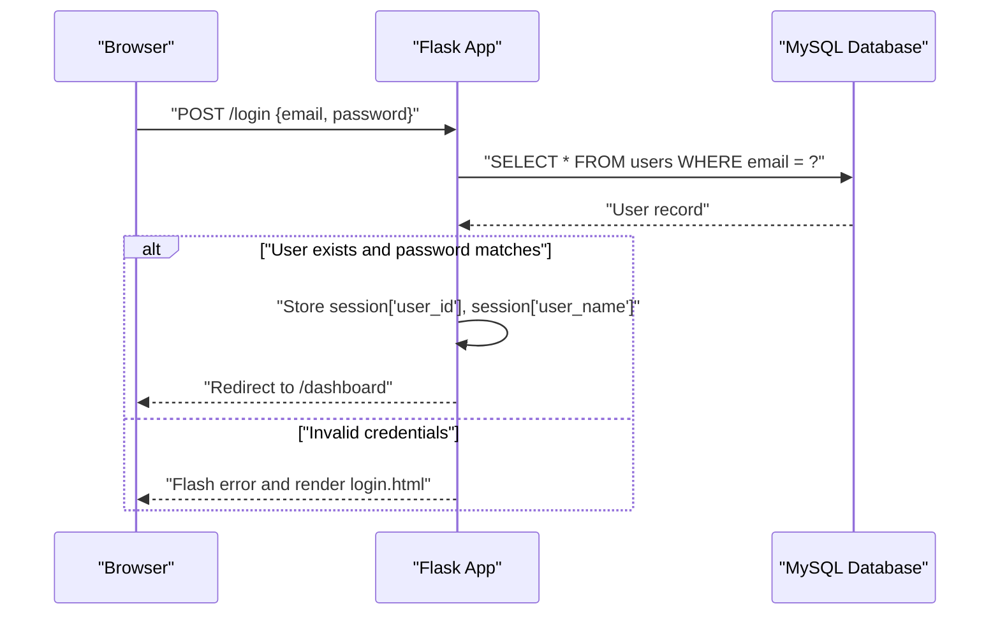
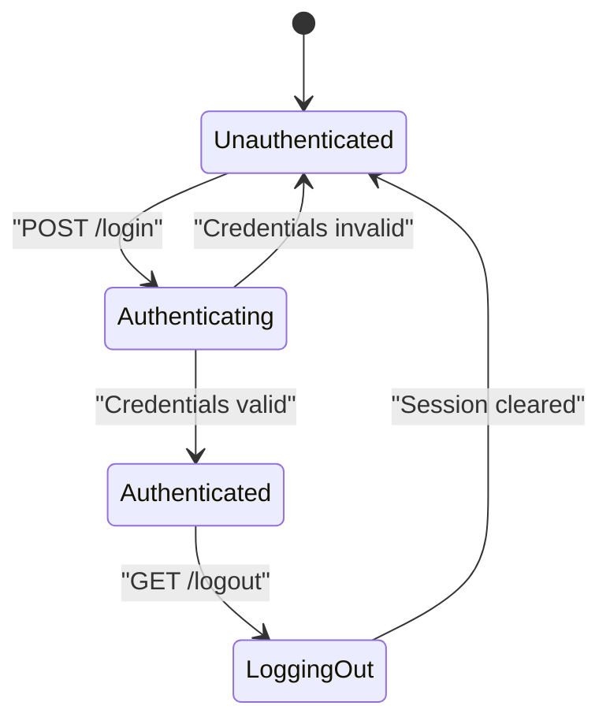
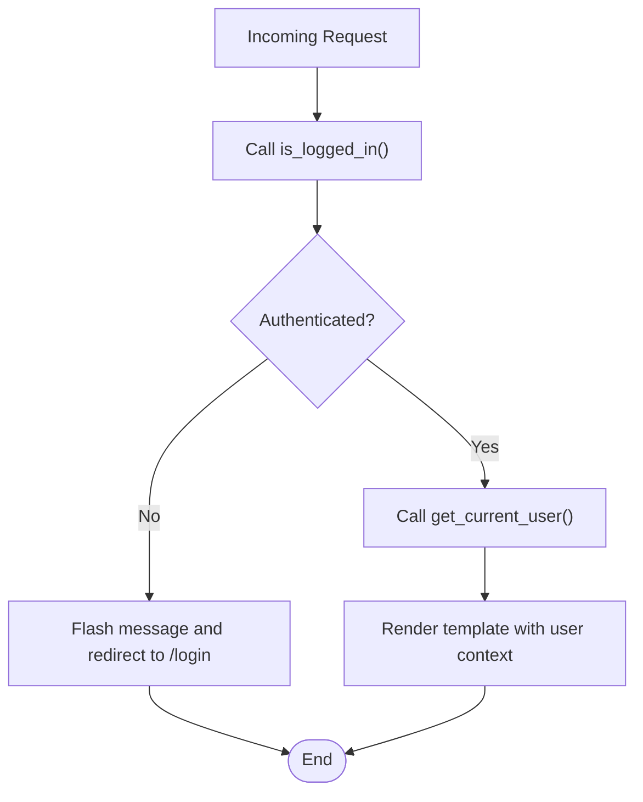
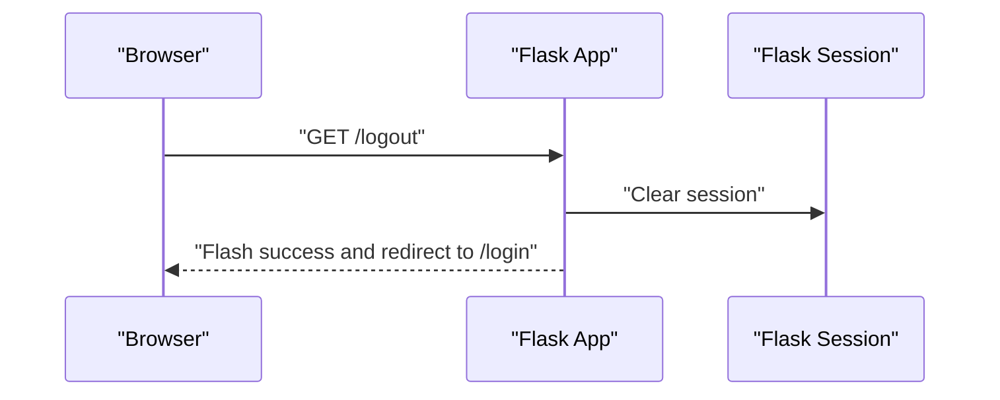
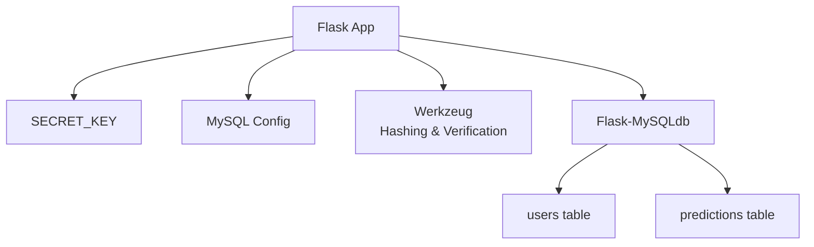

# Authentication System

<cite>
**Referenced Files in This Document**
- [app.py](file://app.py)
- [requirements.txt](file://requirements.txt)
- [database.sql](file://database/database.sql)
- [login.html](file://templates/login.html)
- [base.html](file://templates/base.html)
- [train_model.py](file://train_model.py)
</cite>

## Table of Contents
1. [Introduction](#introduction)
2. [Project Structure](#project-structure)
3. [Core Components](#core-components)
4. [Architecture Overview](#architecture-overview)
5. [Detailed Component Analysis](#detailed-component-analysis)
6. [Dependency Analysis](#dependency-analysis)
7. [Performance Considerations](#performance-considerations)
8. [Security Considerations](#security-considerations)
9. [Troubleshooting Guide](#troubleshooting-guide)
10. [Conclusion](#conclusion)

## Introduction
This document provides comprehensive documentation for the authentication system of the Student Placement Prediction Portal. It covers the login workflow, session management, secure credential verification, authentication middleware, session lifecycle, route protection, and logout functionality. It also highlights security considerations such as password hashing, session security, and CSRF protection, along with practical examples of protected routes and user context injection.

## Project Structure
The authentication system is implemented within a Flask application with a MySQL backend and Jinja2 templates. Key components include:
- Flask application with configuration for secret key and database connectivity
- Session-based authentication using Flask sessions
- Secure password handling using Werkzeug utilities
- Database schema for storing users and prediction history
- HTML templates for login and shared layout with navigation and flash messaging

**Diagram sources**
- [app.py:15-26](file://app.py#L15-L26)
- [database.sql:9-35](file://database/database.sql#L9-L35)
- [requirements.txt:5-11](file://requirements.txt#L5-L11)

**Section sources**
- [app.py:15-26](file://app.py#L15-L26)
- [database.sql:9-35](file://database/database.sql#L9-L35)
- [requirements.txt:5-27](file://requirements.txt#L5-L27)

## Core Components
This section outlines the core authentication components and their roles:
- Session-based authentication middleware:
  - is_logged_in(): checks if a user is logged in by verifying the presence of user_id in the session
  - get_current_user(): retrieves the current user’s data from the database using the session’s user_id
- Login route:
  - Processes form submission, validates credentials against the database, and creates a session upon successful authentication
- Logout route:
  - Clears the session and redirects to the login page
- Template integration:
  - Login page renders a form with email and password fields
  - Base template displays navigation and user info when logged in

Key implementation references:
- Middleware functions: [is_logged_in():46-48](file://app.py#L46-L48), [get_current_user():50-58](file://app.py#L50-L58)
- Login route: [login():169-192](file://app.py#L169-L192)
- Logout route: [logout():356-361](file://app.py#L356-L361)
- Login template: [login.html:16-54](file://templates/login.html#L16-L54)
- Navigation and user info: [base.html:31-35](file://templates/base.html#L31-L35)

**Section sources**
- [app.py:46-58](file://app.py#L46-L58)
- [app.py:169-192](file://app.py#L169-L192)
- [app.py:356-361](file://app.py#L356-L361)
- [templates/login.html:16-54](file://templates/login.html#L16-L54)
- [templates/base.html:31-35](file://templates/base.html#L31-L35)

## Architecture Overview
The authentication architecture follows a session-based approach:
- On login, the application verifies credentials against the database using hashed passwords
- Upon successful verification, the application stores user_id and user_name in the session
- Subsequent requests rely on session presence to protect routes
- Logout clears the session to terminate the authenticated state

**Diagram sources**
- [app.py:169-192](file://app.py#L169-L192)
- [database.sql:10-17](file://database/database.sql#L10-L17)
- [templates/login.html:16-54](file://templates/login.html#L16-L54)

## Detailed Component Analysis

### Authentication Middleware
The middleware functions provide lightweight, reusable logic for authentication state and user context:
- is_logged_in():
  - Purpose: Determine if a user is currently authenticated
  - Implementation: Checks for the presence of user_id in the session
  - Complexity: O(1)
- get_current_user():
  - Purpose: Retrieve the current user’s data from the database
  - Implementation: Executes a database query using session['user_id'] and returns the fetched record
  - Complexity: O(1) for query execution plus database overhead

**Diagram sources**
- [app.py:46-48](file://app.py#L46-L48)

**Diagram sources**
- [app.py:50-58](file://app.py#L50-L58)

**Section sources**
- [app.py:46-58](file://app.py#L46-L58)

### Login Route Implementation
The login route handles both GET and POST requests:
- GET: Renders the login page if the user is not authenticated
- POST: Processes form data, queries the database for the user by email, verifies the password using secure hash comparison, and upon success:
  - Stores user_id and user_name in the session
  - Redirects to the dashboard
- Error handling:
  - Displays a flash message for invalid credentials
  - Re-renders the login page

**Diagram sources**
- [app.py:169-192](file://app.py#L169-L192)
- [database.sql:10-17](file://database/database.sql#L10-L17)
- [templates/login.html:16-54](file://templates/login.html#L16-L54)

**Section sources**
- [app.py:169-192](file://app.py#L169-L192)
- [database.sql:10-17](file://database/database.sql#L10-L17)
- [templates/login.html:16-54](file://templates/login.html#L16-L54)

### Session Management
Session-based authentication is implemented as follows:
- Session creation:
  - On successful login, session['user_id'] and session['user_name'] are set
- Session validation:
  - is_logged_in() checks for session presence to protect routes
  - get_current_user() uses session['user_id'] to fetch user data
- Session cleanup:
  - logout() clears the session to log out the user

**Diagram sources**
- [app.py:46-58](file://app.py#L46-L58)
- [app.py:169-192](file://app.py#L169-L192)
- [app.py:356-361](file://app.py#L356-L361)

**Section sources**
- [app.py:46-58](file://app.py#L46-L58)
- [app.py:169-192](file://app.py#L169-L192)
- [app.py:356-361](file://app.py#L356-L361)

### Protected Routes and User Context Injection
Protected routes enforce authentication using is_logged_in():
- Dashboard, Predict, Result, Profile, History routes check is_logged_in() and redirect to login if unauthenticated
- get_current_user() is used to populate user context for rendering templates

Template integration:
- base.html conditionally renders navigation and user info when session['user_id'] is present

**Diagram sources**
- [app.py:133-167](file://app.py#L133-L167)
- [app.py:238-292](file://app.py#L238-L292)
- [app.py:319-335](file://app.py#L319-L335)
- [app.py:337-354](file://app.py#L337-L354)
- [templates/base.html:31-35](file://templates/base.html#L31-L35)

**Section sources**
- [app.py:133-167](file://app.py#L133-L167)
- [app.py:238-292](file://app.py#L238-L292)
- [app.py:319-335](file://app.py#L319-L335)
- [app.py:337-354](file://app.py#L337-L354)
- [templates/base.html:31-35](file://templates/base.html#L31-L35)

### Logout Functionality
The logout route clears the session and redirects to the login page:
- session.clear() removes all session keys
- A success flash message is displayed
- Redirect to login page

**Diagram sources**
- [app.py:356-361](file://app.py#L356-L361)

**Section sources**
- [app.py:356-361](file://app.py#L356-L361)

## Dependency Analysis
The authentication system relies on external libraries and database schema:
- Flask configuration:
  - SECRET_KEY for session signing
  - MySQL connection parameters
- External dependencies:
  - Werkzeug for password hashing and verification
  - Flask-MySQLdb for database connectivity
- Database schema:
  - users table with unique email and hashed password
  - predictions table linked to users via foreign key

**Diagram sources**
- [app.py:18-26](file://app.py#L18-L26)
- [requirements.txt:5-11](file://requirements.txt#L5-L11)
- [database.sql:9-35](file://database/database.sql#L9-L35)

**Section sources**
- [app.py:18-26](file://app.py#L18-L26)
- [requirements.txt:5-27](file://requirements.txt#L5-L27)
- [database.sql:9-35](file://database/database.sql#L9-L35)

## Performance Considerations
- Session lookup is O(1) and efficient for route protection
- Database queries for user lookup and statistics are straightforward and indexed by primary key and foreign key
- Consider adding database indexing on email for faster login lookups
- Minimize session size by storing only essential identifiers (already implemented)
- Use HTTPS in production to prevent session hijacking and credential interception

## Security Considerations
- Password hashing:
  - Passwords are stored as hashes using secure hashing utilities
  - Credential verification uses secure hash comparison
- Session security:
  - SECRET_KEY is configured for session signing
  - Consider enabling HTTPS, setting secure cookie flags, and configuring session timeout policies
- CSRF protection:
  - The application does not implement CSRF tokens
  - Recommendation: Add CSRF protection using Flask-WTF or similar
- Input validation:
  - Basic validation occurs in the login route (e.g., checking password match)
  - Consider adding stricter input sanitization and rate limiting for login attempts
- Database security:
  - Prepared statements are used for all database queries
  - Unique constraint on email prevents duplicates

Practical recommendations:
- Enable HTTPS and configure secure cookies
- Implement CSRF tokens for forms
- Add rate limiting for login attempts
- Rotate SECRET_KEY regularly
- Use environment variables for sensitive configuration

**Section sources**
- [app.py:18-26](file://app.py#L18-L26)
- [app.py:175-191](file://app.py#L175-L191)
- [database.sql:10-17](file://database/database.sql#L10-L17)

## Troubleshooting Guide
Common issues and resolutions:
- Login fails with invalid credentials:
  - Verify email exists in the database and password matches the stored hash
  - Check for typos in form field names and ensure POST data is received
- Session not persisting:
  - Confirm SECRET_KEY is set and consistent across deployments
  - Ensure cookies are enabled in the browser
- Protected route redirects to login:
  - Verify is_logged_in() logic and session presence
  - Check that get_current_user() executes successfully when needed
- Database connection errors:
  - Validate MySQL host, user, password, and database name
  - Ensure the database schema is created and tables exist

**Section sources**
- [app.py:46-58](file://app.py#L46-L58)
- [app.py:169-192](file://app.py#L169-L192)
- [database.sql:9-35](file://database/database.sql#L9-L35)

## Conclusion
The authentication system employs a clean, session-based approach with secure password handling and straightforward middleware for route protection. It provides a solid foundation for user authentication and can be enhanced with CSRF protection, HTTPS enforcement, and rate limiting to meet production security standards. The modular design allows easy extension for additional features such as user roles, two-factor authentication, or OAuth integrations.