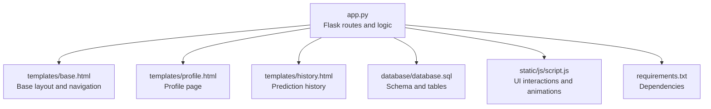
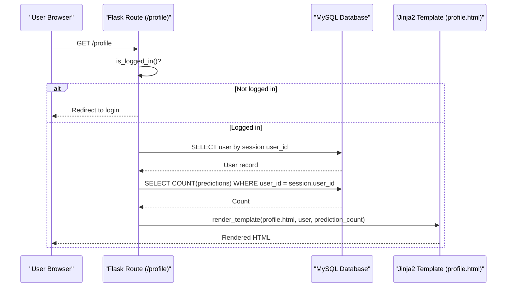
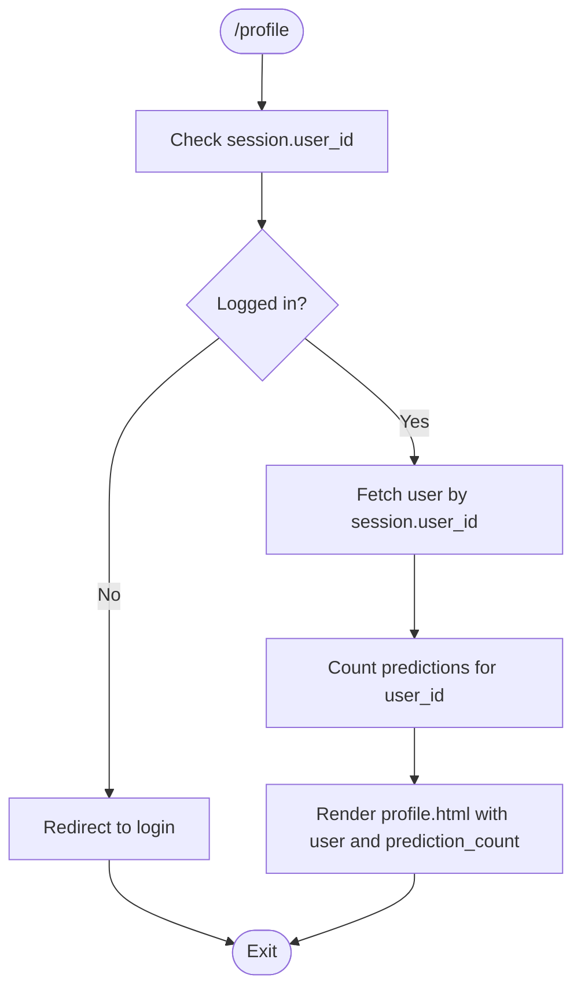
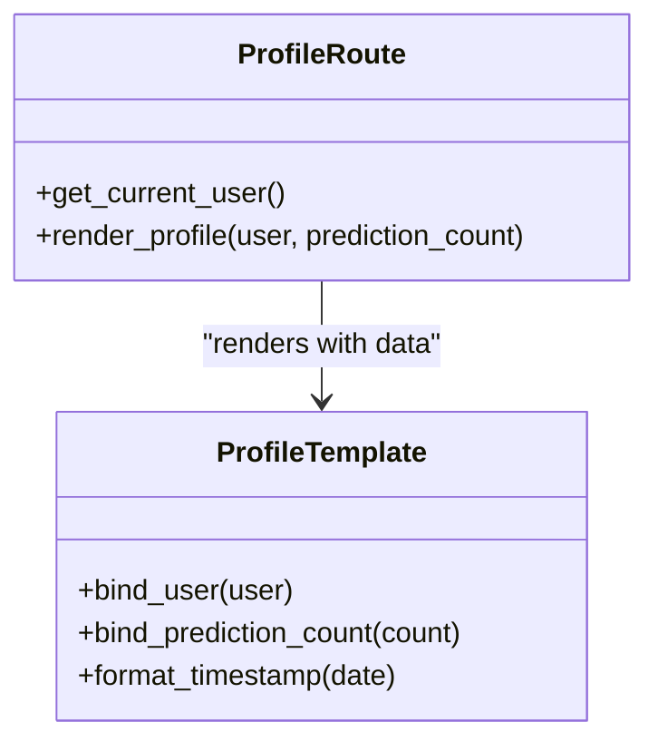
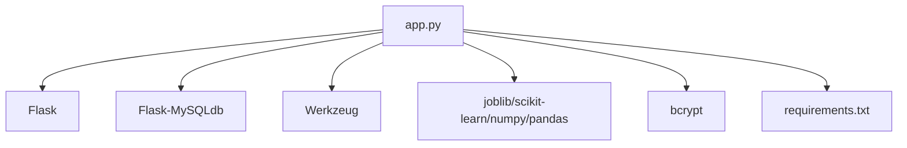
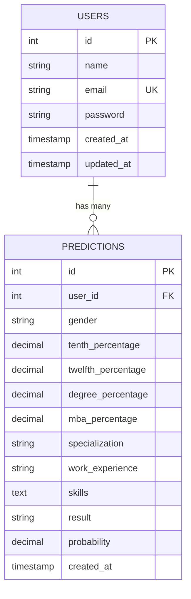

# Profile Management

<cite>
**Referenced Files in This Document**
- [app.py](file://app.py)
- [database.sql](file://database/database.sql)
- [profile.html](file://templates/profile.html)
- [base.html](file://templates/base.html)
- [history.html](file://templates/history.html)
- [script.js](file://static/js/script.js)
- [requirements.txt](file://requirements.txt)
</cite>

## Table of Contents
1. [Introduction](#introduction)
2. [Project Structure](#project-structure)
3. [Core Components](#core-components)
4. [Architecture Overview](#architecture-overview)
5. [Detailed Component Analysis](#detailed-component-analysis)
6. [Dependency Analysis](#dependency-analysis)
7. [Performance Considerations](#performance-considerations)
8. [Troubleshooting Guide](#troubleshooting-guide)
9. [Conclusion](#conclusion)
10. [Appendices](#appendices)

## Introduction
This document explains the user profile management system for the Student Placement Prediction Portal. It covers the profile page functionality, including user data retrieval, prediction statistics display, and account information presentation. It documents the profile route implementation with user context injection and prediction count aggregation, details the data queries for retrieving user details and calculating prediction statistics, and describes the profile template rendering with dynamic data binding and statistical calculations. It also outlines examples of profile data display and user information updates, integrates analytics dashboard views showing user prediction history and performance metrics, and addresses profile data privacy and access control ensuring users can only view their own information.

## Project Structure
The application follows a classic Flask MVC-like structure with Python backend routes, Jinja2 templates, and static assets:
- Backend: Flask application with routes, helpers, and context processors
- Templates: Jinja2 HTML templates for pages including profile, history, and base layout
- Database: MySQL schema for users and predictions
- Static assets: CSS and JavaScript for UI interactions and animations

**Diagram sources**
- [app.py](file://app.py)
- [base.html](file://templates/base.html)
- [profile.html](file://templates/profile.html)
- [history.html](file://templates/history.html)
- [database.sql](file://database/database.sql)
- [script.js](file://static/js/script.js)
- [requirements.txt](file://requirements.txt)

**Section sources**
- [app.py](file://app.py)
- [base.html](file://templates/base.html)
- [profile.html](file://templates/profile.html)
- [history.html](file://templates/history.html)
- [database.sql](file://database/database.sql)
- [script.js](file://static/js/script.js)
- [requirements.txt](file://requirements.txt)

## Core Components
- Profile route: Implements user authentication checks, retrieves current user, and aggregates prediction counts for display.
- Template rendering: Uses Jinja2 to bind user data and prediction counts to the profile page.
- Database schema: Defines users and predictions tables with foreign key relationships.
- Context processor: Injects global variables into templates for branding and metadata.
- Navigation: Sidebar and header integrate profile access across pages.

Key responsibilities:
- Enforce access control so users can only view their own profile and history.
- Retrieve and present user account information and prediction statistics.
- Provide quick actions to navigate to prediction and history pages.

**Section sources**
- [app.py](file://app.py)
- [profile.html](file://templates/profile.html)
- [database.sql](file://database/database.sql)
- [base.html](file://templates/base.html)

## Architecture Overview
The profile management system is composed of:
- Route layer: Authentication checks and data retrieval
- Template layer: Rendering profile and history pages with dynamic data
- Database layer: Relational storage of user and prediction records
- Asset layer: JavaScript for UI enhancements and animations

**Diagram sources**
- [app.py](file://app.py)
- [profile.html](file://templates/profile.html)

**Section sources**
- [app.py](file://app.py)
- [profile.html](file://templates/profile.html)

## Detailed Component Analysis

### Profile Route Implementation
The profile route enforces authentication, retrieves the current user, and calculates the total number of predictions for that user. It then renders the profile template with the user object and prediction count.

Processing logic:
- Authentication check: Ensures a user session exists; otherwise redirects to login.
- User retrieval: Queries the users table using the session user identifier.
- Prediction count aggregation: Counts rows in the predictions table for the current user.
- Template rendering: Passes user and prediction_count to the profile template.

**Diagram sources**
- [app.py](file://app.py)

**Section sources**
- [app.py](file://app.py)

### Data Queries and Statistics
The profile route executes a straightforward count query to determine the total number of predictions associated with the current user. The history page performs richer aggregations:
- Total predictions
- Count of placed predictions
- Count of not placed predictions
- Average probability across predictions

These aggregations are computed using SQL aggregate functions and Jinja2 filters in the template.

**Section sources**
- [app.py](file://app.py)
- [history.html](file://templates/history.html)

### Profile Template Rendering
The profile template extends the base layout and binds:
- User name and email
- Prediction count
- Account creation and last update timestamps
- Quick action links to prediction and history

Dynamic data binding:
- User fields are rendered using Jinja2 expressions.
- Timestamps are formatted using the built-in strftime filter.
- The prediction count is injected by the route and displayed prominently.

**Diagram sources**
- [app.py](file://app.py)
- [profile.html](file://templates/profile.html)

**Section sources**
- [profile.html](file://templates/profile.html)
- [base.html](file://templates/base.html)

### Analytics Dashboard Integration
The dashboard page demonstrates how prediction statistics are calculated and presented:
- Aggregates total predictions, placed count, and average probability for the current user.
- Computes placement rate as a percentage.
- Renders statistics alongside user data.

This mirrors the profile page’s approach to displaying user-centric analytics.

**Section sources**
- [app.py](file://app.py)

### Access Control and Privacy
Access control is enforced at the route level:
- All protected routes check for a valid session before proceeding.
- The profile route redirects unauthenticated users to the login page.
- Queries filter data by the session user identifier to prevent unauthorized access.

Privacy implications:
- Only the authenticated user’s data is retrieved and displayed.
- History and result pages enforce per-user filtering to ensure data isolation.

**Section sources**
- [app.py](file://app.py)

### Examples of Profile Data Display and Updates
Profile data display:
- User name and email are shown in the profile card and account information section.
- Prediction count is prominently displayed as a stat item.
- Account creation and last updated timestamps are formatted for readability.

User information updates:
- The current implementation focuses on read-only profile display. If future updates are introduced, they should:
  - Validate input against existing constraints (e.g., unique email).
  - Use secure password hashing for password changes.
  - Maintain audit trails for sensitive updates.

[No sources needed since this section provides general guidance]

### User Prediction History and Performance Metrics
The history page presents:
- A summary of total predictions, placed, not placed, and average probability.
- A responsive table of historical predictions with academic scores, work experience, result, and probability.
- Links to view individual prediction results.

These views complement the profile page by offering a comprehensive analytics dashboard for the user.

**Section sources**
- [history.html](file://templates/history.html)
- [app.py](file://app.py)

## Dependency Analysis
External dependencies include Flask, Flask-MySQLdb, scikit-learn, NumPy, pandas, joblib, Werkzeug, and bcrypt. These enable:
- Web framework and database connectivity
- Machine learning model loading and inference
- Password hashing and security utilities
- Data processing and serialization

**Diagram sources**
- [app.py](file://app.py)
- [requirements.txt](file://requirements.txt)

**Section sources**
- [requirements.txt](file://requirements.txt)
- [app.py](file://app.py)

## Performance Considerations
- Database queries: The profile route executes a lightweight count query filtered by user_id. This is efficient and scales with the number of predictions per user.
- Template rendering: Jinja2 rendering overhead is minimal for small datasets typical of user profiles.
- Model loading: The ML model is loaded once at application startup to avoid repeated I/O during prediction requests.
- Frontend animations: JavaScript animations and smooth scrolling are opt-in and do not impact core functionality.

[No sources needed since this section provides general guidance]

## Troubleshooting Guide
Common issues and resolutions:
- Login required: If accessing profile without logging in, the route redirects to the login page. Ensure the session cookie is present.
- Missing model: If the ML model file is not found, prediction-related features will display warnings. Place model.pkl in the project root or adjust the loader accordingly.
- Database connectivity: Verify MySQL credentials and database name in the Flask configuration. Ensure the database schema is initialized using the provided SQL file.
- Template rendering errors: Confirm that the user object and prediction_count are passed to the template and that the template references exist.

**Section sources**
- [app.py](file://app.py)
- [database.sql](file://database/database.sql)

## Conclusion
The profile management system provides a secure, user-centric interface for viewing personal account information and prediction statistics. It enforces strict access control, leverages efficient database queries, and integrates seamlessly with the broader analytics dashboard. The modular design allows for easy extension, such as adding user update capabilities while maintaining privacy and performance.

## Appendices

### Database Schema Overview
The schema defines two primary tables:
- users: Stores user identifiers, credentials, and timestamps
- predictions: Stores prediction records linked to users via foreign keys

**Diagram sources**
- [database.sql](file://database/database.sql)

**Section sources**
- [database.sql](file://database/database.sql)