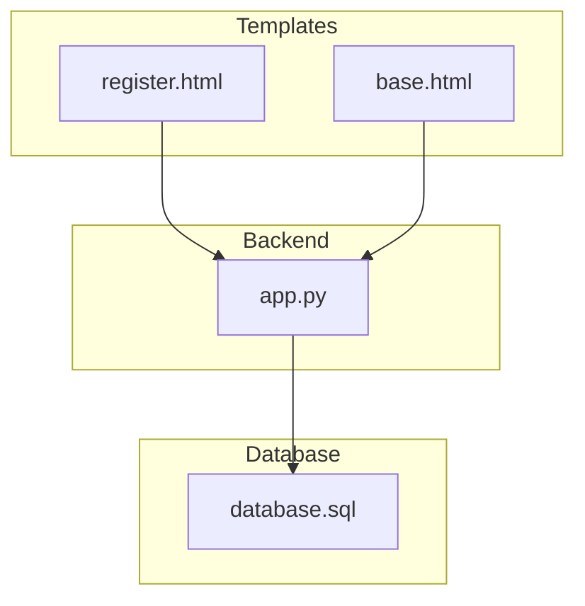
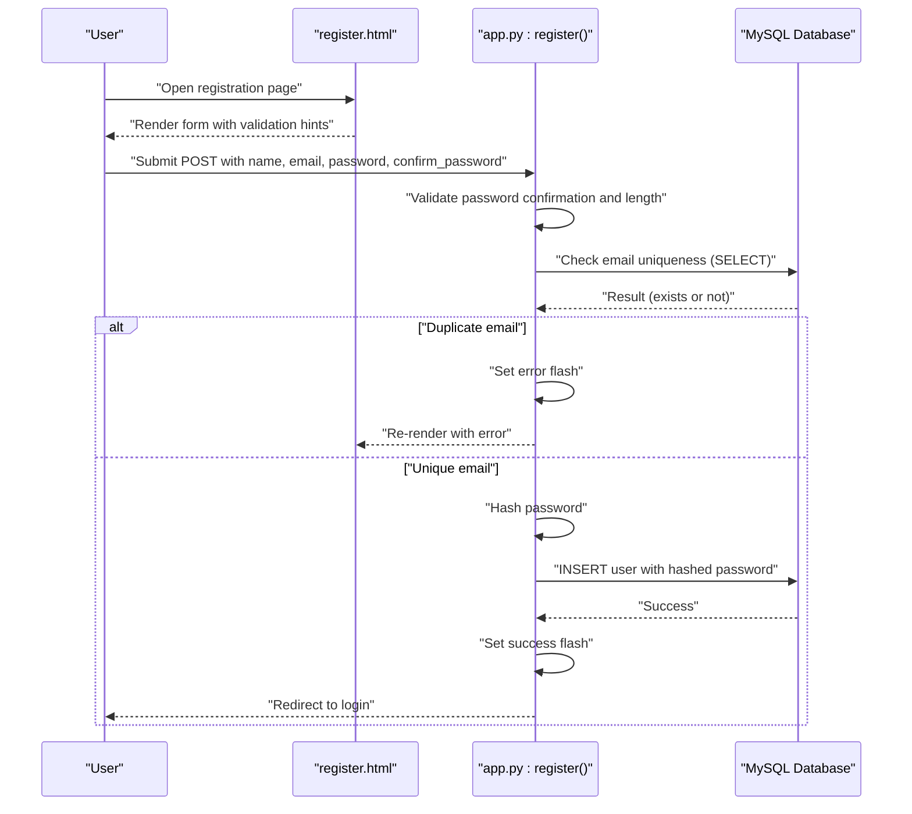
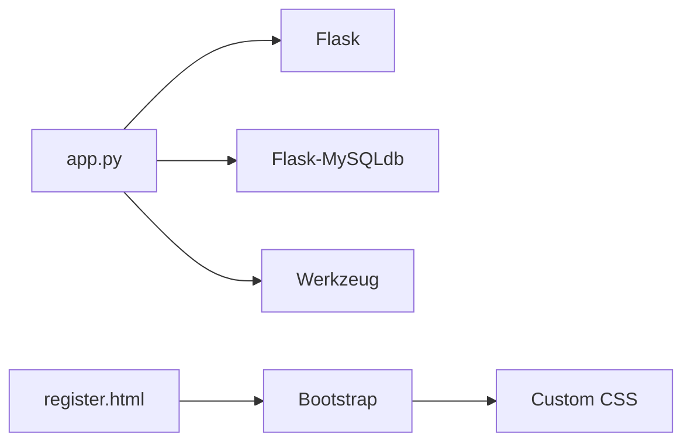

# Registration Process

<cite>
**Referenced Files in This Document**
- [app.py](file://app.py)
- [register.html](file://templates/register.html)
- [base.html](file://templates/base.html)
- [database.sql](file://database/database.sql)
- [requirements.txt](file://requirements.txt)
</cite>

## Table of Contents
1. [Introduction](#introduction)
2. [Project Structure](#project-structure)
3. [Core Components](#core-components)
4. [Architecture Overview](#architecture-overview)
5. [Detailed Component Analysis](#detailed-component-analysis)
6. [Dependency Analysis](#dependency-analysis)
7. [Performance Considerations](#performance-considerations)
8. [Troubleshooting Guide](#troubleshooting-guide)
9. [Conclusion](#conclusion)

## Introduction
This document explains the user registration process in the Student Placement Prediction Portal. It covers the complete workflow from form submission to database persistence, including validation rules, password hashing, duplicate email checks, error handling, and security measures. It also documents how the registration success flow redirects users to the login page and how validation messages are rendered in the UI.

## Project Structure
The registration feature spans a few key files:
- Backend route and logic: [app.py](file://app.py)
- Registration form template: [register.html](file://templates/register.html)
- Base template for flash messages and layout: [base.html](file://templates/base.html)
- Database schema (including users table): [database.sql](file://database/database.sql)
- Dependencies and security libraries: [requirements.txt](file://requirements.txt)

**Diagram sources**
- [app.py:194-236](file://app.py#L194-L236)
- [register.html:16-86](file://templates/register.html#L16-L86)
- [base.html:86-99](file://templates/base.html#L86-L99)
- [database.sql:9-17](file://database/database.sql#L9-L17)

**Section sources**
- [app.py:194-236](file://app.py#L194-L236)
- [register.html:16-86](file://templates/register.html#L16-L86)
- [base.html:86-99](file://templates/base.html#L86-L99)
- [database.sql:9-17](file://database/database.sql#L9-L17)

## Core Components
- Registration route handler: Implements GET/POST logic, form field extraction, validation, duplicate email check, password hashing, and database insertion.
- Registration form template: Provides HTML form fields for name, email, password, and password confirmation, along with client-side validation and UI feedback.
- Base template: Renders flash messages globally, enabling validation and success feedback to be shown to users.
- Database schema: Defines the users table with a unique constraint on email and storage for hashed passwords.

Key responsibilities:
- Validate password confirmation and minimum length.
- Prevent duplicate registrations by checking email uniqueness.
- Hash passwords securely using Werkzeug’s secure hashing.
- Persist user data safely using parameterized queries to prevent SQL injection.
- Provide user feedback via flash messages and redirect to login upon success.

**Section sources**
- [app.py:194-236](file://app.py#L194-L236)
- [register.html:16-86](file://templates/register.html#L16-L86)
- [base.html:86-99](file://templates/base.html#L86-L99)
- [database.sql:9-17](file://database/database.sql#L9-L17)

## Architecture Overview
The registration flow is a classic request-response cycle:
- Client submits the registration form to the backend.
- Backend validates inputs, checks for duplicate emails, hashes the password, and inserts the record.
- On success, a success flash message is set and the user is redirected to the login page.
- On failure, error flash messages are set and the same registration page is re-rendered.

**Diagram sources**
- [app.py:194-236](file://app.py#L194-L236)
- [register.html:16-86](file://templates/register.html#L16-L86)
- [database.sql:9-17](file://database/database.sql#L9-L17)

## Detailed Component Analysis

### Registration Route Implementation
The registration route handles both GET and POST requests:
- GET: Renders the registration form.
- POST: Extracts form fields, performs validation, checks email uniqueness, hashes the password, inserts into the database, sets a success flash message, and redirects to the login page.

Validation logic:
- Password confirmation equality check.
- Minimum password length requirement.
- Duplicate email detection via a database query.

Security measures:
- Password hashing using Werkzeug’s secure hashing.
- Parameterized queries to prevent SQL injection.
- Session guard prevents access if already logged in.

Success flow:
- On successful insertion, a success flash message is set and the user is redirected to the login page.

Error handling:
- On validation failures or duplicate email, error flash messages are set and the registration page is re-rendered.

Examples of behavior:
- Form rendering with validation messages and success feedback is handled by the base template’s flash rendering block.
- The registration page itself includes client-side validation for password matching.

**Section sources**
- [app.py:194-236](file://app.py#L194-L236)
- [register.html:16-86](file://templates/register.html#L16-L86)
- [base.html:86-99](file://templates/base.html#L86-L99)

### Form Rendering and Validation Messages
The registration template defines:
- Inputs for name, email, password, and confirm password.
- Client-side validation for password matching.
- UI elements for toggling password visibility.
- A submit button to trigger the POST request.

Flash messages:
- The base template renders flash messages globally, so validation errors and success messages appear automatically after form submission.

Success feedback:
- After successful registration, a success flash message is shown and the user is redirected to the login page.

**Section sources**
- [register.html:16-86](file://templates/register.html#L16-L86)
- [base.html:86-99](file://templates/base.html#L86-L99)

### Database Schema and Constraints
The users table enforces:
- Unique constraint on email to prevent duplicates.
- Storage for name, email, and hashed password.
- Timestamps for creation and updates.

This schema underpins the duplicate email check performed during registration.

**Section sources**
- [database.sql:9-17](file://database/database.sql#L9-L17)

### Security Considerations
- Input sanitization and validation:
  - Server-side validation ensures password confirmation and minimum length.
  - HTML attributes and client-side JavaScript provide additional UX-level checks.
- Password hashing:
  - Passwords are hashed using Werkzeug’s secure hashing before storage.
- SQL injection prevention:
  - Parameterized queries are used for all database operations, including the duplicate email check and user insertion.
- Session management:
  - A session guard prevents access to registration if the user is already logged in.

**Section sources**
- [app.py:194-236](file://app.py#L194-L236)
- [requirements.txt:21-24](file://requirements.txt#L21-L24)

## Dependency Analysis
The registration feature depends on:
- Flask for routing and templating.
- Flask-MySQLdb for database connectivity.
- Werkzeug for password hashing.
- Bootstrap and custom styles for UI.

**Diagram sources**
- [app.py:6-26](file://app.py#L6-L26)
- [requirements.txt:4-24](file://requirements.txt#L4-L24)
- [register.html:8-15](file://templates/register.html#L8-L15)

**Section sources**
- [app.py:6-26](file://app.py#L6-L26)
- [requirements.txt:4-24](file://requirements.txt#L4-L24)

## Performance Considerations
- Database queries:
  - The duplicate email check uses a simple SELECT with a unique column; ensure the email column is indexed (it is via the UNIQUE constraint).
- Password hashing:
  - Using Werkzeug’s hashing is efficient and secure; consider adjusting parameters if needed for production environments.
- Template rendering:
  - Minimal overhead; ensure static assets are served efficiently.

## Troubleshooting Guide
Common issues and resolutions:
- Duplicate email error:
  - Cause: Email already exists in the database.
  - Resolution: Prompt the user to use another email or log in instead.
- Password mismatch:
  - Cause: Password and confirm password do not match.
  - Resolution: Ensure both fields match; client-side validation helps catch this early.
- Short password:
  - Cause: Password shorter than the minimum length.
  - Resolution: Enforce a minimum length and inform the user.
- Database connection errors:
  - Cause: Incorrect database credentials or service downtime.
  - Resolution: Verify configuration and database availability.
- Flash messages not appearing:
  - Cause: Missing flash rendering in the base template.
  - Resolution: Ensure the base template includes the flash rendering block.

**Section sources**
- [app.py:194-236](file://app.py#L194-L236)
- [base.html:86-99](file://templates/base.html#L86-L99)

## Conclusion
The registration process is designed to be secure, user-friendly, and robust. It enforces strong validation rules, prevents duplicate registrations, hashes passwords securely, and uses parameterized queries to mitigate SQL injection risks. Flash messages provide clear feedback, and the success flow seamlessly redirects users to the login page.