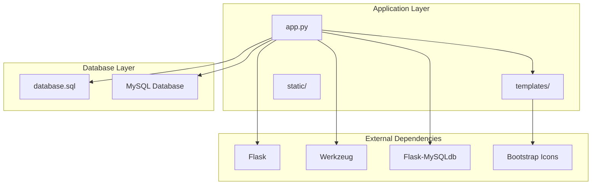
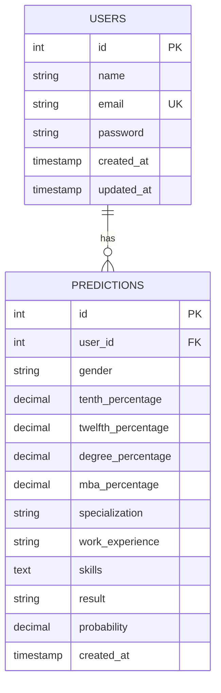
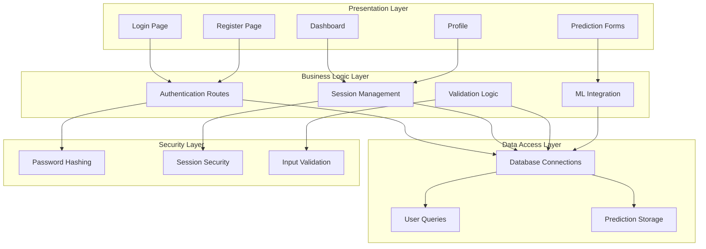
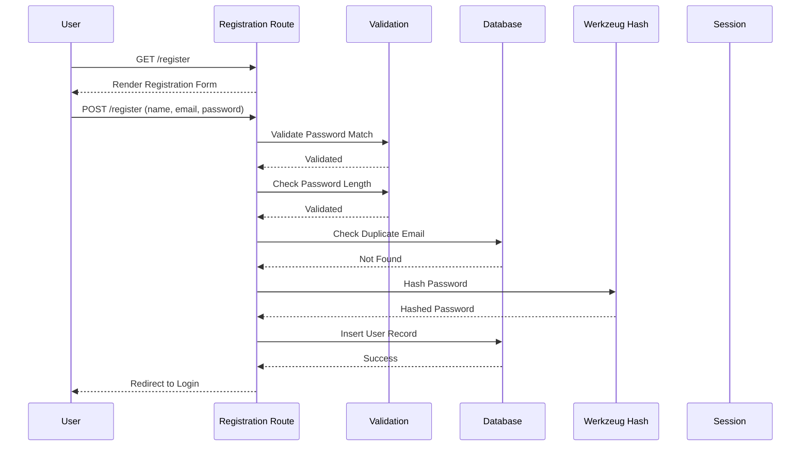
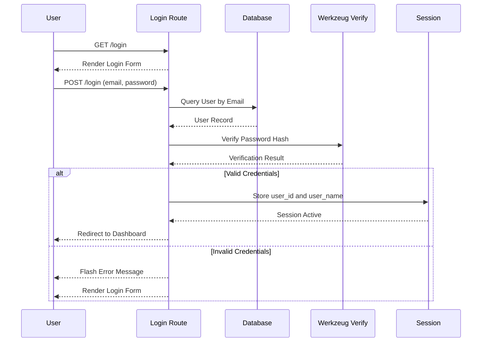
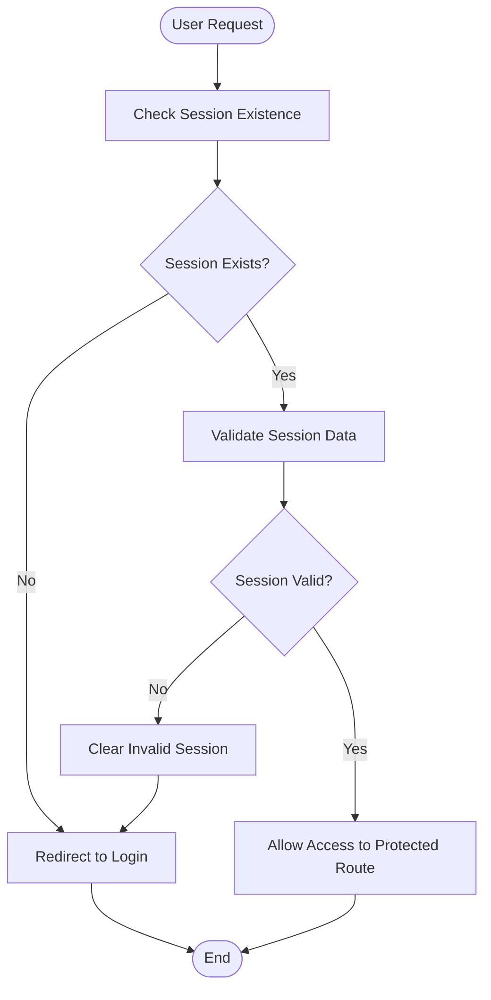
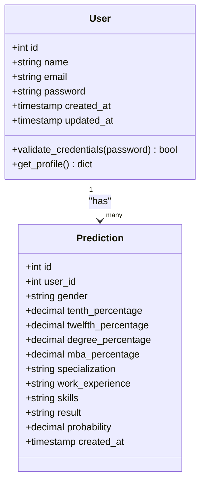
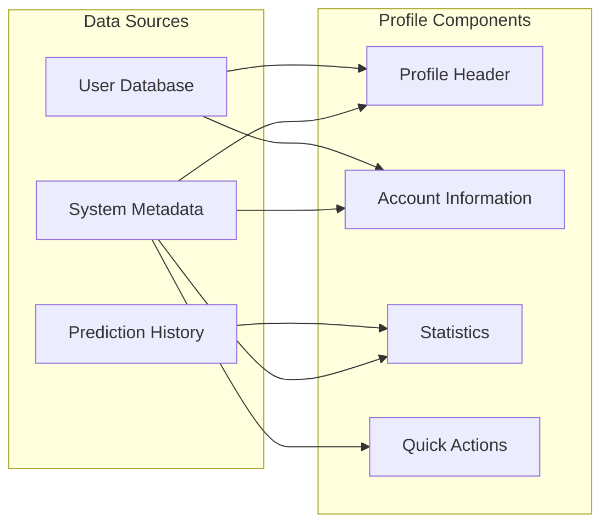
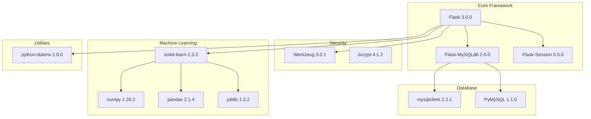

# User Management System

<cite>
**Referenced Files in This Document**
- [app.py](file://app.py)
- [database.sql](file://database/database.sql)
- [requirements.txt](file://requirements.txt)
- [login.html](file://templates/login.html)
- [register.html](file://templates/register.html)
- [profile.html](file://templates/profile.html)
- [dashboard.html](file://templates/dashboard.html)
- [form.html](file://templates/form.html)
- [history.html](file://templates/history.html)
- [result.html](file://templates/result.html)
- [train_model.py](file://train_model.py)
</cite>

## Table of Contents
1. [Introduction](#introduction)
2. [Project Structure](#project-structure)
3. [Core Components](#core-components)
4. [Architecture Overview](#architecture-overview)
5. [Detailed Component Analysis](#detailed-component-analysis)
6. [Dependency Analysis](#dependency-analysis)
7. [Performance Considerations](#performance-considerations)
8. [Troubleshooting Guide](#troubleshooting-guide)
9. [Conclusion](#conclusion)

## Introduction
This document provides comprehensive documentation for the user management system within the Student Placement Prediction Portal. It covers authentication workflows, user data models, session management, security measures, and profile management features. The system uses Flask for the backend, MySQL for persistence, Werkzeug for secure password hashing, and Bootstrap Icons for the frontend UI.

## Project Structure
The project follows a typical Flask application layout with separate directories for templates, static assets, and database schema. The main application logic resides in a single module with route handlers for authentication, prediction, and profile management.

**Diagram sources**
- [app.py:1-394](file://app.py#L1-L394)
- [database.sql:1-40](file://database/database.sql#L1-L40)

**Section sources**
- [app.py:1-394](file://app.py#L1-L394)
- [database.sql:1-40](file://database/database.sql#L1-L40)

## Core Components
The user management system consists of several core components that handle authentication, session management, and user data operations.

### Authentication Components
- **Session Management**: Flask sessions store user authentication state
- **Password Security**: Werkzeug secure password hashing and verification
- **Database Operations**: MySQL connections for user CRUD operations
- **Form Validation**: Frontend and backend validation for registration and login

### User Data Model
The system defines a structured user data model with essential fields for authentication and profile management.

**Diagram sources**
- [database.sql:9-35](file://database/database.sql#L9-L35)

**Section sources**
- [database.sql:9-35](file://database/database.sql#L9-L35)
- [app.py:42-58](file://app.py#L42-L58)

## Architecture Overview
The system implements a layered architecture with clear separation between presentation, business logic, and data persistence layers.

**Diagram sources**
- [app.py:169-236](file://app.py#L169-L236)
- [app.py:320-361](file://app.py#L320-L361)

## Detailed Component Analysis

### Authentication Workflow
The authentication system implements a secure session-based approach with comprehensive validation and error handling.

**Diagram sources**
- [app.py:194-236](file://app.py#L194-L236)
- [register.html:16-86](file://templates/register.html#L16-L86)

#### Registration Process
The registration process includes multiple validation steps and secure password handling:

1. **Form Submission**: Collects user credentials from the registration form
2. **Password Validation**: Ensures passwords match and meet minimum length requirements
3. **Duplicate Prevention**: Checks for existing email addresses in the database
4. **Secure Storage**: Uses Werkzeug to hash passwords before storage
5. **Session Initiation**: Automatically logs in new users upon successful registration

#### Login Process
The login system provides secure credential verification and session establishment:

**Diagram sources**
- [app.py:169-192](file://app.py#L169-L192)
- [login.html:16-54](file://templates/login.html#L16-L54)

**Section sources**
- [app.py:169-236](file://app.py#L169-L236)
- [login.html:16-54](file://templates/login.html#L16-L54)
- [register.html:16-86](file://templates/register.html#L16-L86)

### Session Management
The system uses Flask sessions to maintain user authentication state across requests.

**Diagram sources**
- [app.py:46-58](file://app.py#L46-L58)

#### Session Security Features
- **Session Keys**: Stores `user_id` and `user_name` for user identification
- **Automatic Cleanup**: Clears session data on logout
- **Route Protection**: Validates session presence for protected routes

**Section sources**
- [app.py:46-58](file://app.py#L46-L58)
- [app.py:356-361](file://app.py#L356-L361)

### User Data Model and Storage
The user data model is designed for efficient authentication and profile management.

#### Database Schema
The system maintains two primary tables: users and predictions, with proper foreign key relationships and constraints.

**Diagram sources**
- [database.sql:9-35](file://database/database.sql#L9-L35)

#### Field Specifications
- **Name**: VARCHAR(100), required, user's full name
- **Email**: VARCHAR(100), unique constraint, used for authentication
- **Password**: VARCHAR(255), stores hashed passwords
- **Timestamps**: Automatic creation and update tracking

**Section sources**
- [database.sql:9-17](file://database/database.sql#L9-L17)

### Profile Management
The profile system provides comprehensive user information display and basic account management capabilities.

**Diagram sources**
- [profile.html:12-98](file://templates/profile.html#L12-L98)

#### Profile Features
- **Personal Information**: Displays user name, email, and account creation date
- **Activity Statistics**: Shows total prediction count and engagement metrics
- **Quick Navigation**: Provides shortcuts to prediction and history pages
- **Responsive Design**: Mobile-friendly layout with Bootstrap components

**Section sources**
- [profile.html:12-98](file://templates/profile.html#L12-L98)
- [app.py:319-335](file://app.py#L319-L335)

### Security Implementation
The system implements multiple layers of security to protect user data and prevent unauthorized access.

#### Password Security
- **Hashing Algorithm**: Uses Werkzeug's secure password hashing
- **Salt Generation**: Automatic salt generation for each password
- **Verification Process**: Secure comparison without plaintext exposure

#### Input Validation
- **Frontend Validation**: HTML5 form validation with required attributes
- **Backend Validation**: Server-side validation for critical security checks
- **Database Constraints**: Unique email constraint prevents duplicates

#### Session Security
- **Secret Key Configuration**: Flask SECRET_KEY for session encryption
- **Session Cleanup**: Proper session clearing on logout
- **Route Protection**: Middleware-like session validation for protected routes

**Section sources**
- [app.py:8](file://app.py#L8)
- [app.py:18](file://app.py#L18)
- [app.py:184](file://app.py#L184)

### Error Handling and Validation
The system provides comprehensive error handling for authentication failures and validation errors.

#### Authentication Errors
- **Invalid Credentials**: Clear error messages for failed login attempts
- **Session Expiration**: Automatic redirection to login for expired sessions
- **Duplicate Registration**: Prevents multiple accounts with same email

#### Validation Messages
- **Password Requirements**: Minimum length enforcement with user feedback
- **Form Completeness**: Required field validation with descriptive messages
- **Data Integrity**: Database constraint violations handled gracefully

**Section sources**
- [app.py:189-191](file://app.py#L189-L191)
- [app.py:207-213](file://app.py#L207-L213)
- [app.py:220-222](file://app.py#L220-L222)

## Dependency Analysis
The system relies on several external libraries that provide core functionality for web development, database connectivity, and security.

**Diagram sources**
- [requirements.txt:4-27](file://requirements.txt#L4-L27)

### Key Dependencies
- **Flask**: Web framework providing routing, templating, and session management
- **Werkzeug**: Security library for password hashing and URL processing
- **Flask-MySQLdb**: MySQL database connector with DictCursor support
- **Scikit-learn**: Machine learning library for placement prediction
- **Joblib**: Efficient serialization for model persistence

**Section sources**
- [requirements.txt:4-27](file://requirements.txt#L4-L27)

## Performance Considerations
The system is designed for moderate traffic and includes several performance optimizations.

### Database Performance
- **Connection Pooling**: Reuses database connections through Flask-MySQLdb
- **Indexing Strategy**: Email field indexed for fast user lookup
- **Query Optimization**: Single query per user lookup operation

### Memory Management
- **Model Loading**: ML model loaded once during application startup
- **Session Storage**: Lightweight session data (user_id, user_name)
- **Static Assets**: Optimized CSS and JavaScript delivery

### Scalability Considerations
- **Horizontal Scaling**: Stateless authentication allows load balancing
- **Database Scaling**: MySQL can be scaled independently
- **Model Persistence**: Efficient model serialization reduces startup time

## Troubleshooting Guide

### Common Authentication Issues
- **Login Failures**: Verify email exists in database and password matches hash
- **Registration Errors**: Check for duplicate emails and password validation
- **Session Problems**: Ensure SECRET_KEY is configured and sessions enabled

### Database Connection Issues
- **MySQL Connectivity**: Verify host, user, password, and database name configuration
- **Schema Initialization**: Run database.sql to create required tables
- **Connection Limits**: Monitor MySQL connection pool usage

### Security Configuration
- **Password Hashing**: Ensure Werkzeug version compatibility
- **Session Security**: Use strong SECRET_KEY in production environments
- **Input Sanitization**: Validate all user inputs against malicious data

**Section sources**
- [app.py:17-26](file://app.py#L17-L26)
- [database.sql:4-17](file://database/database.sql#L4-L17)

## Conclusion
The User Management System provides a robust foundation for secure user authentication and profile management within the Student Placement Prediction Portal. The implementation demonstrates best practices in web security, including secure password storage, session management, and comprehensive input validation. The modular design allows for easy extension and maintenance while maintaining security and performance standards.

Key strengths of the implementation include:
- **Security Focus**: Comprehensive password hashing and session security
- **User Experience**: Intuitive forms with clear validation feedback
- **Scalability**: Modular architecture supporting future enhancements
- **Maintainability**: Clean separation of concerns and documented code structure

The system successfully integrates with the machine learning prediction engine while maintaining strict security boundaries around user authentication and data protection.